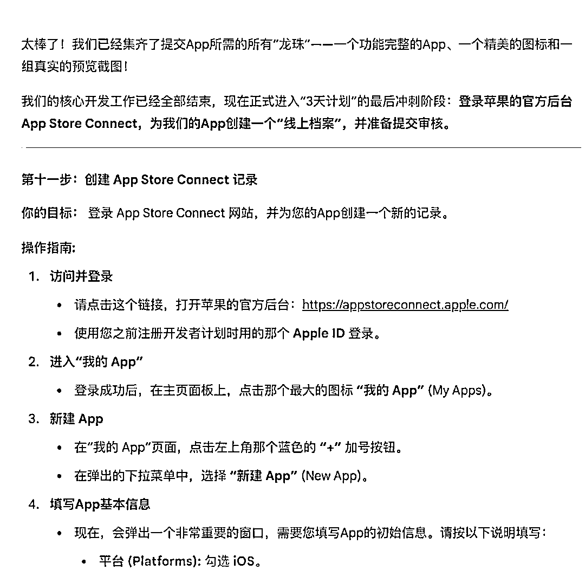
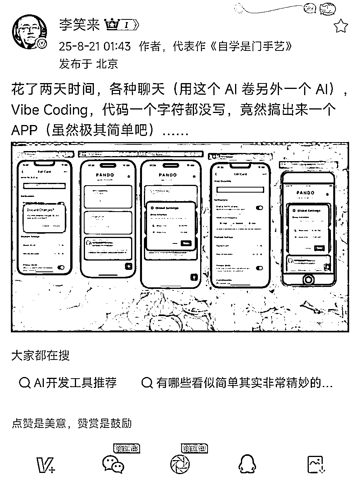
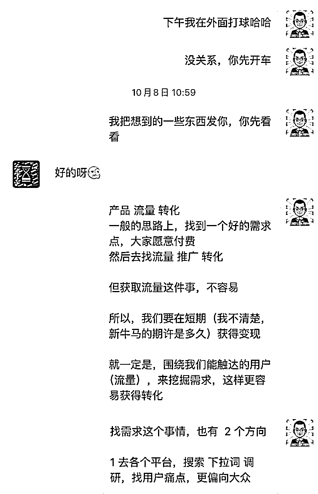
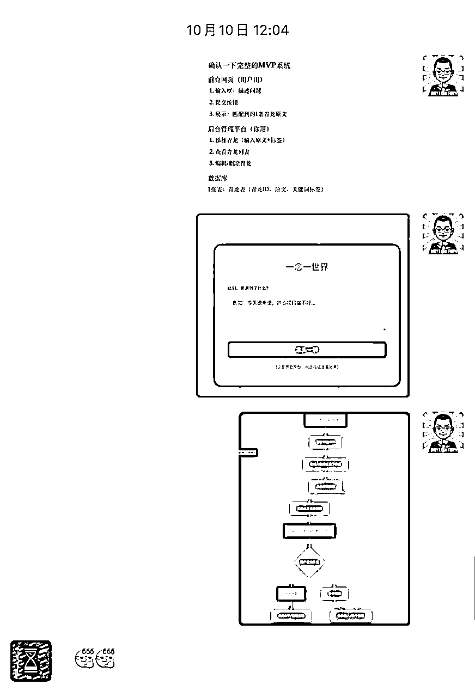
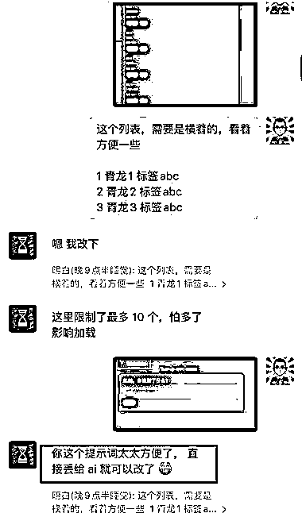
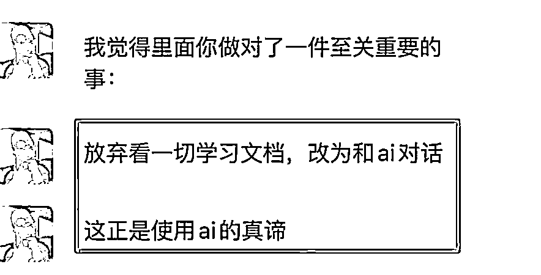
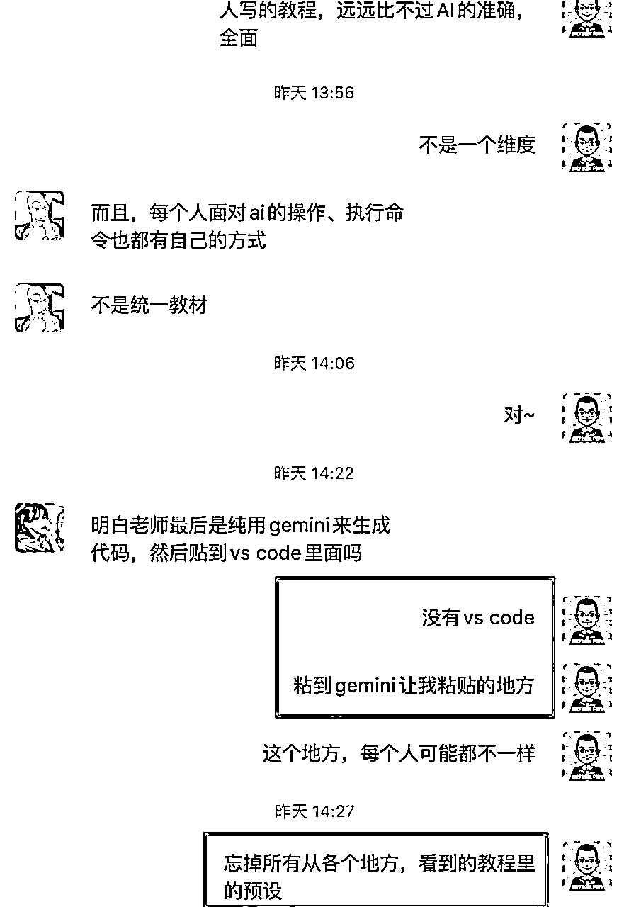
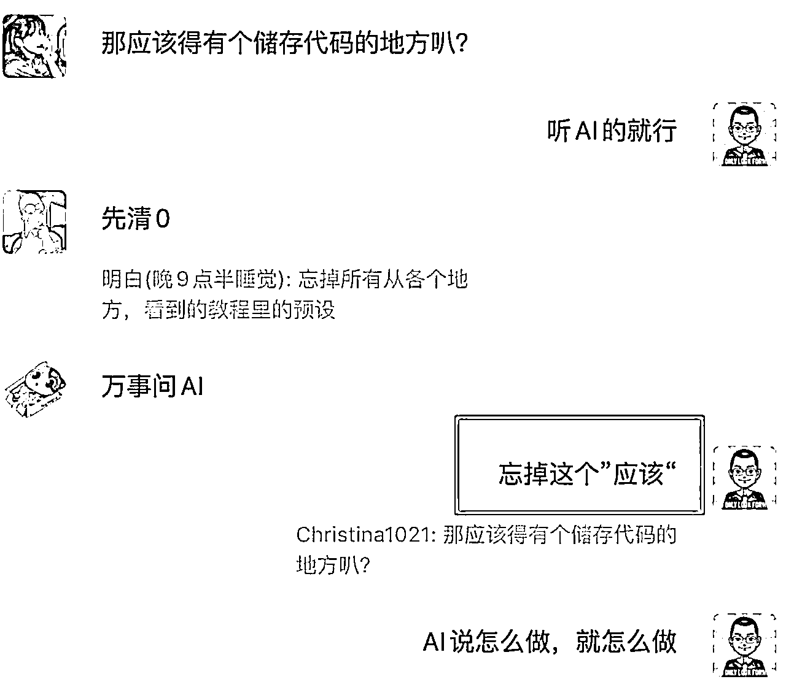

# (精华帖)(88 赞)《用 gemini 4 小时做出 1 个 APP 后，我对 AI 编程从绝望变为自信》

> 原文：[`www.yuque.com/for_lazy/zhoubao/bmqh9d6kh3778or6`](https://www.yuque.com/for_lazy/zhoubao/bmqh9d6kh3778or6)

## (精华帖)(88 赞)《用 gemini 4 小时做出 1 个 APP 后，我对 AI 编程从绝望变为自信》

作者： 明白（晚 9 点半睡觉）

日期：2025-10-22

《用 gemini 4 小时做出 1 个 APP 后，我对 AI 编程从绝望变为自信》 昨天（10 月 16 号），是我 2025 年最魔幻的一天。 然后，
我终于理解，罗振宇说的「愿力 > 业力 > 能力」是什么意思。 直到当晚睡觉前，我都有一种强烈的不真实感。 因为昨天的事情，从客观上表明一件事 ——
我不禁在反思：我这大半年在干什么？哪里出了问题？ 还好，我有了一些答案。 今天就来分享一下。 我相信，看完你在认知上，会对 AI
编程这件事，和之前有非常大的变化。 有很大可能，你还会想要立刻去行动。 本文大纲 ——
点这里阅读体验更好：[`wx034slbm7f.feishu.cn/wiki/L4lqwQKMsieWjIkVrwSc0bVbnDc`](https://wx034slbm7f.feishu.cn/wiki/L4lqwQKMsieWjIkVrwSc0bVbnDc)

* * *

评论区：

bravo : 原来明白是个高人，想必经常与高维连接吧。另外祝贺明白成功开发出 app，可以出去装逼了[愉快]

willow : 明白老师太强了

明白（晚 9 点半睡觉） : 是 AI 太强了哈哈

明白（晚 9 点半睡觉） : 倒是经常做梦啊

七天@生财有术 : 明白老师还是太强了

明白（晚 9 点半睡觉） : 谢谢七天老师~

搞钱萌新 : 醍醐灌顶