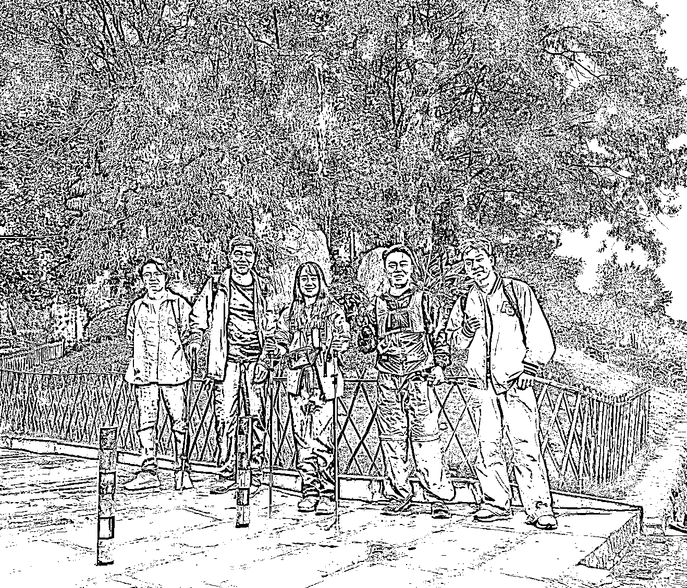

# (43 赞)我也没想到电视剧般的情节竟然发生在了我身上！

> 原文：[`www.yuque.com/for_lazy/zhoubao/efuq6wflqcub2b39`](https://www.yuque.com/for_lazy/zhoubao/efuq6wflqcub2b39)

## (43 赞)我也没想到电视剧般的情节竟然发生在了我身上！

作者： 戴智慧

日期：2025-10-20

我也没想到电视剧般的情节竟然发生在了我身上！ 昨天白天和生财的圈友哥哥姐姐们一起徒步，认识了一个老大哥
大哥和我说，他现在 50 多岁从原来年薪五十多万的国企辞职是为了照顾以及陪伴自己 22 岁的儿子成长
因为大哥的儿子从小就患有轻度的自闭症，所以他现在想亲自带着他儿子去适应这个社会
这段时间大哥鼓励他尝试了地推，尝试做了骑手，大哥跟他儿子说：你大胆去做，有任何困难找爸
甚至大哥现在加入生财做各种尝试都是为了找到适合他儿子以后可以安身立命的项目
当我听到老大哥的这段故事我真的特别感动，也很感慨怎么家庭和家庭之间是这么的截然相反
以至于晚上突然面临家庭的变故，22 岁的我必须承担起家庭责任时感到莫名的心酸和无奈
因为我从小就在没有爱的家庭环境当中长大，父母从小争吵不断，从小就一直和我说家里穷 让我从小就很自卑内向胆小，高考考上飞行员之后，到了大学我想靠自己变好变优秀
我一个人做了非常多的努力，有过很多压力大的时候，做了很多挑战自己的事情 才让自己慢慢变得从容自信，慢慢变成自己理想中的样子
好不容易自己边上学边做副业有了一些存款，突然面临家庭的变故，我又必须从头开始 说实话不难过是假的，但我也只能是积极得看待这次家庭变故，告诉自己说：
“我有一个健康的身体，这是我父母给我的，所以我很幸运 我有一个很好的主业，我只需要主业认真学习和努力，我以后肯定不缺财富
再加上这几年的副业积累，有了一些人脉资源和项目经验以及各种技能 所以我以后就算主业可能因为啥原因发展不好了，我也可以靠副业让自己慢慢积累财富
所以我还是很幸运的，这次难关我也肯定能过，而且以后只会越来越好。” 因为没有人给我兜底，我自己才是我最大的底气，所以我必须时刻保持成长思维 生财朋友圈

* * *

评论区：

劳模姐|零碳园区 : 加油💪

瑶玲 : 加油，命运给了你低谷，勇敢走过去了，未来剩下的都是高走了

亦仁 : 你已经很棒了，加油。

戴智慧 : [加油][加油][加油]谢谢老大

戴智慧 : [加油][加油][加油]

戴智慧 : [加油][加油]

呆文刀 : 加油[强]

冬丽传奇 : 加油，不过工作只能说攒钱，远远说不上积攒财富，财富是爆发性才能积累下来的