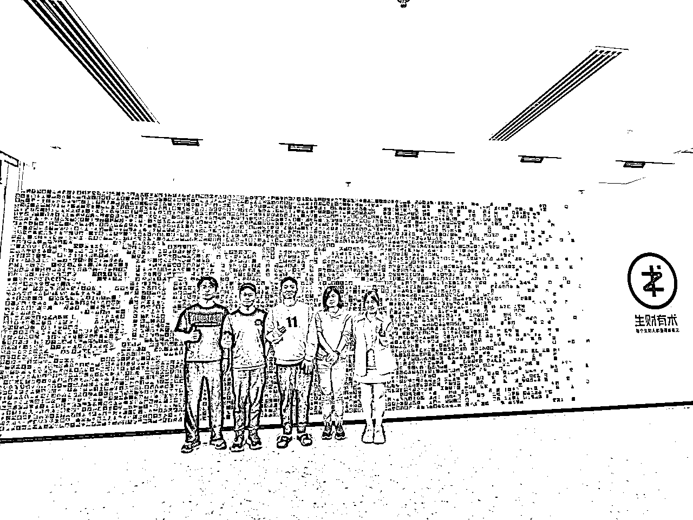
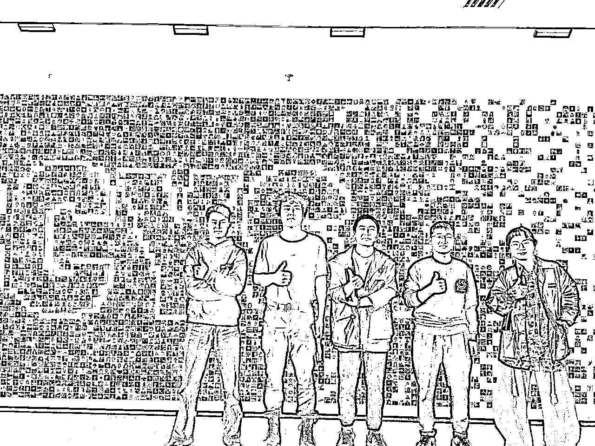
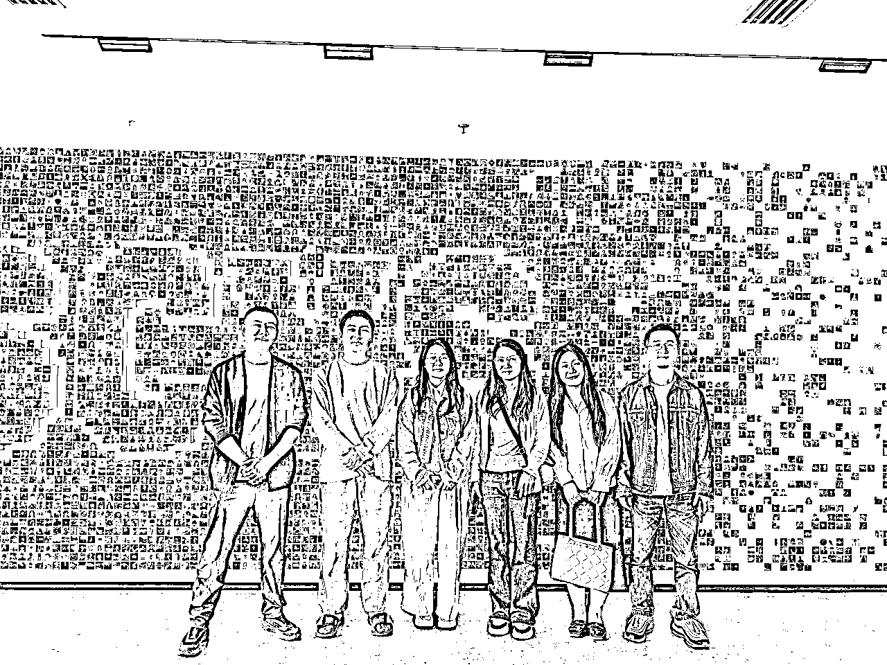
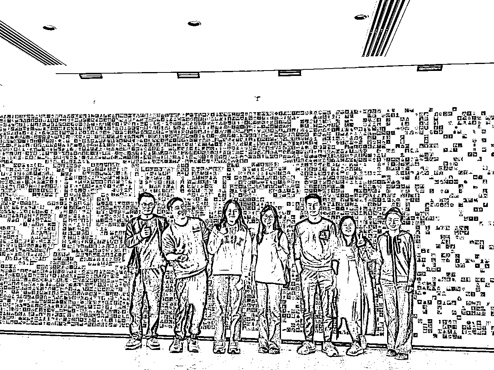
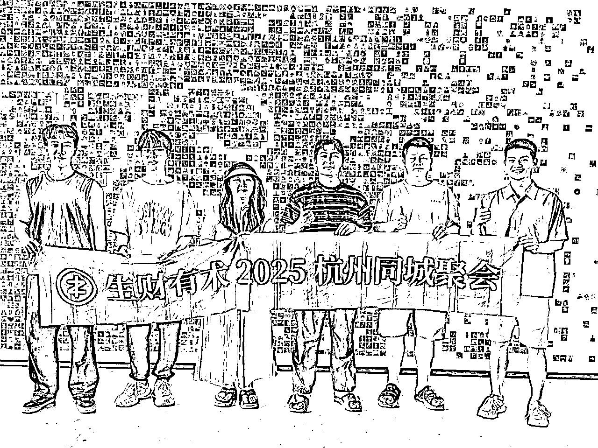
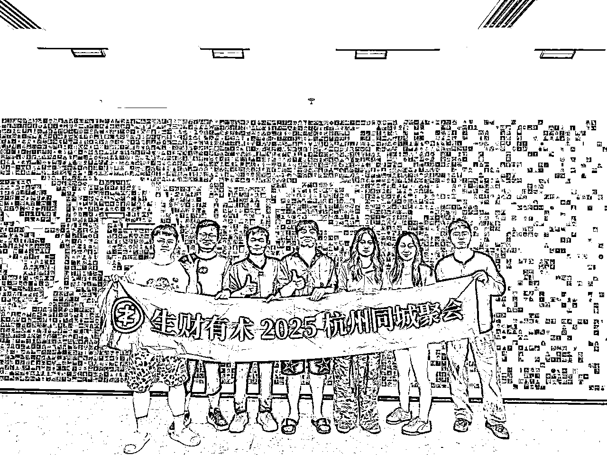
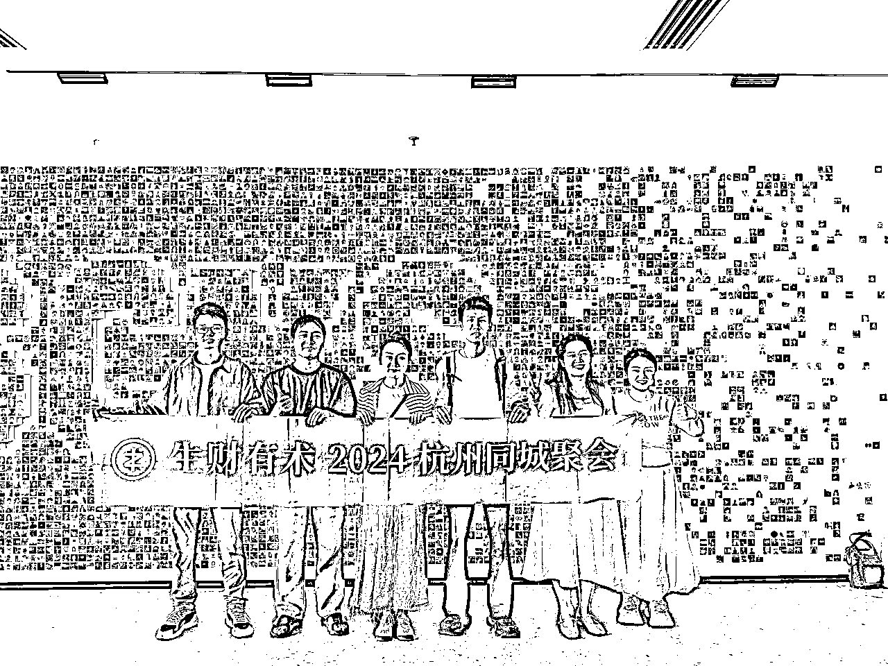

# (精华帖)(88 赞)半年 31 场组局，我在生财最高效的成长“算法”

> 原文：[`www.yuque.com/for_lazy/zhoubao/fqm8nsglwmedqng1`](https://www.yuque.com/for_lazy/zhoubao/fqm8nsglwmedqng1)

## (精华帖)(88 赞)半年 31 场组局，我在生财最高效的成长“算法”

作者： 易芝 AI|RPA 版

日期：2025-10-16

半年 31 场组局，我在生财最高效的成长“算法” 关于我： 2025 全国组局场数第一，但 i 人一枚 小红书获客操盘手
我通过 31 局线下聚会链接了上百位圈友，更重要的是，我发现‘组局’这件事，意外地成了我个人成长和项目突破的超级杠杆。 1/ 和同路人一起交流，卡点解决速度拉满
2/ 收获强大的人脉网络，获得意想不到的机会 3/ 最高效的方式获得一手商业样本 作为一个 i 人，能拿下
2025 年生财组局第一名，不是我有多厉害，而是这个场域需要你的出现。
今天，我不聊组局的具体流程，而是想真诚地分享我的故事，希望能鼓励还在犹豫的你，也迈出组局这关键的第一步，通过链接实现个人与项目的飞跃。
全篇 8000+字，欢迎前往飞书阅读：[`unpke5o6so.feishu.cn/wiki/ZhYiw5vCxiN1sSknnfyczHP2n3b`](https://unpke5o6so.feishu.cn/wiki/ZhYiw5vCxiN1sSknnfyczHP2n3b)

* * *

评论区：

鱼丸|亦仁助理 : 半年 31 场组局，不仅在个人成长还是项目提升都是收获满满～恭喜你在生财找到属于你的最高效成长“算法”。
原来当组局官就是去创造一个“场域”，让“对的人”相遇，而不一定要是那个最厉害的人。这么一想，心理压力确实减轻不少呢～如果你也萌生了组局的想法，不妨立即发起聚会吧：[`scys.com/t/BOA7NKpe`](https://scys.com/t/BOA7NKpe)

杨 1 : 小伙子 不错👍

易芝 AI|RPA 版 : 没错，感谢鱼丸大人[呲牙]

执行力持续力 : 啊？你居然是 i 人

执行力持续力 : 太牛了！我超级社恐不敢组局，我看完了你写的，我有点蠢蠢欲动了

高盛 : 搞起

易芝 AI|RPA 版 : 搞起

阿懂 : Infj 呀