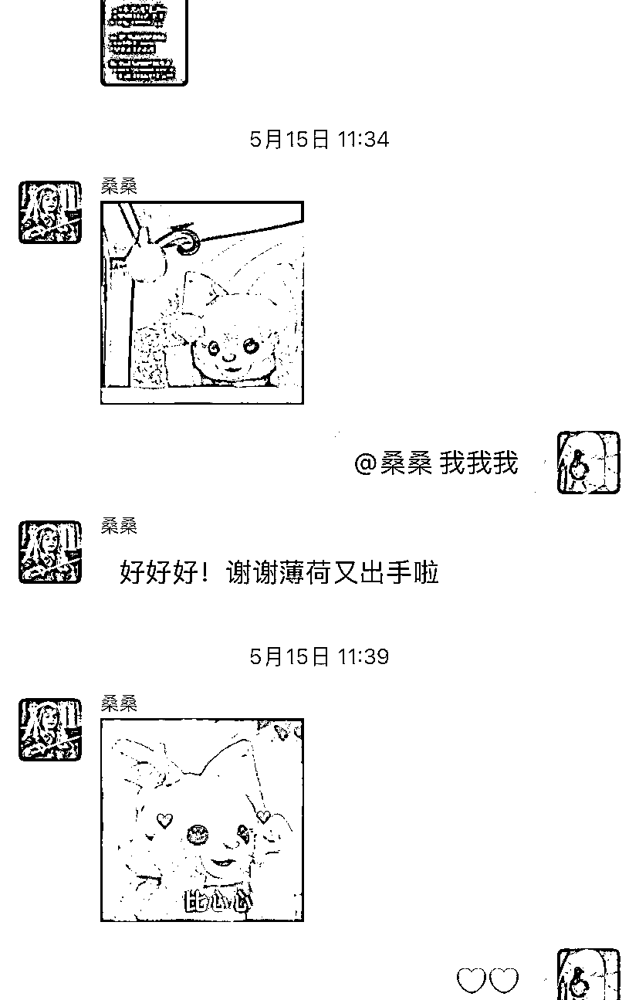
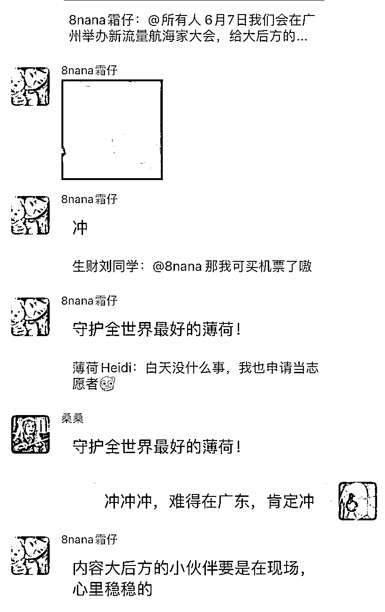
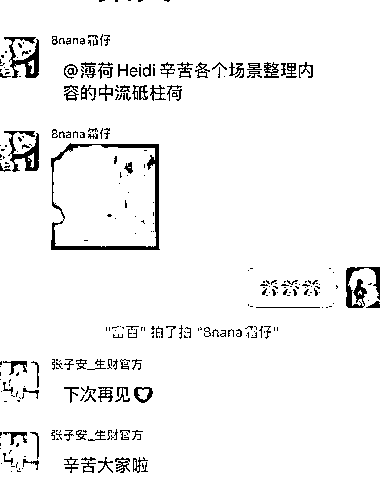
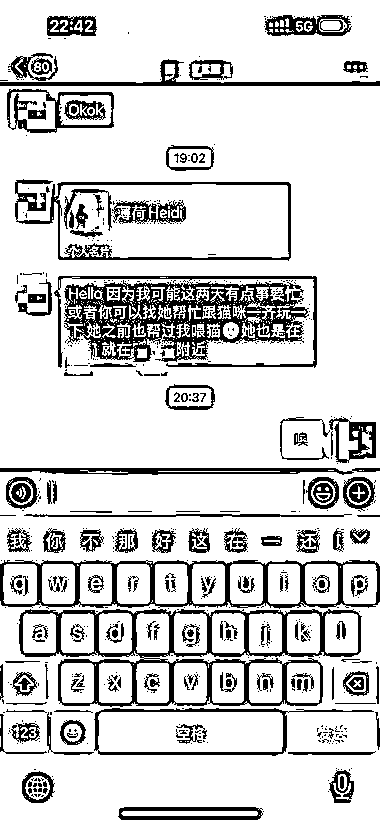
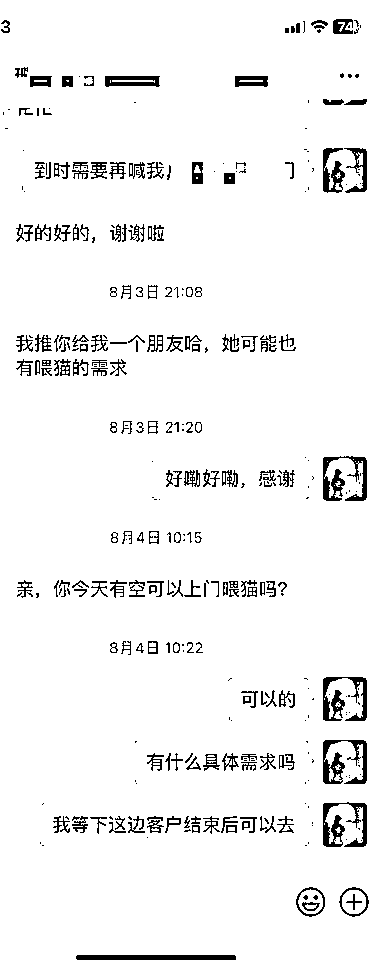

# (精华帖)(110 赞)靠谱是会复利的：我用 4 个动作，从接零散小单到被主动推荐

> 原文：[`www.yuque.com/for_lazy/zhoubao/avmrkki06f8zk2dm`](https://www.yuque.com/for_lazy/zhoubao/avmrkki06f8zk2dm)

## (精华帖)(110 赞)靠谱是会复利的：我用 4 个动作，从接零散小单到被主动推荐

作者： 薄荷 Heidi

日期：2025-10-23

是不是也有这样的困扰？ 明明事情做得不错，客户却不再找你； 努力想证明自己靠谱，别人却总是半信半疑； 看着别人被主动推荐、主动续约，自己却还在到处找机会…
我也曾经历过这种痛苦。 直到我发现， 我从上门喂猫、整理生财逐字稿开始实践，用下面这套"靠谱系统"： 上门喂猫半年，收到 整理内容 20+篇，从；
做志愿者时， —— 不是嘴上说说，而是用行动证明 —— 这不是鸡汤，是真正的商业逻辑 —— 让客户忍不住说"哇"的艺术 —— 从志愿者到被需要的人
这套方法帮我从"可替代的人"，变成了"被需要的人"。 如果你想让： 客户主动续约，而不是你去找客户； 合作方主动推荐你，而不是你到处毛遂自荐；
"靠谱"成为你的标签，而不是你的自我安慰； 因为靠谱这件事： 不是天生的，是可以训练的； 不是玄学，是有方法的； 不是鸡汤，是有回报的； 愿我们都能成为：
评论区可以写写愿意跟哪个靠谱的谁长期合作什么 @ 出来， 飞书链接： [`lqhefhcsx54.feishu.cn/docx/XdfsdJhDrooulMxmKwucohZXnUe?from=from_copylink`](https://lqhefhcsx54.feishu.cn/docx/XdfsdJhDrooulMxmKwucohZXnUe?from=from_copylink)

* * *

评论区：

等一场月亮 : 看完之后真的很佩服薄荷，感觉要做到你这种程度真的不是一件容易的事，虽然自己做不到你这种程度，但是看完之后，我觉得相比之前做的事还可以多做一些，很受启发，向你学习[呲牙][呲牙]

水蜜桃🍑 : 感谢分享

Elser : 感谢分享！有启发

早茶月光 : 好用心呀、

刘同学 : 长沙喂猫吗

鲸鱼 : 太厉害了！向你学习[抱拳]

包酱 : 这篇文章很好，相比哪些动辄赚几百上千万大佬的文，这篇简直是普通人的成事指南

伊人 : 看了这篇文章之后，发现我自己身上还有很多做的不足之处，还需要不断完善进步！非常有用的文章[害羞][害羞]感谢分享

西红柿汤圆 : 好棒