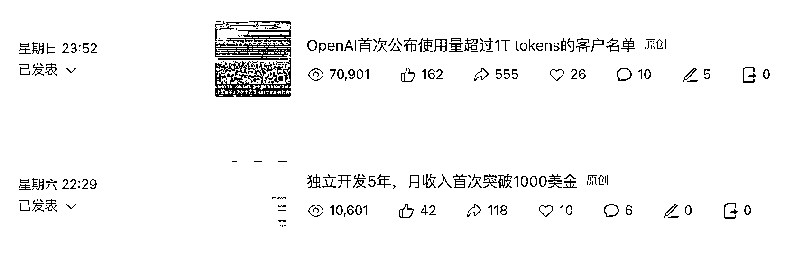
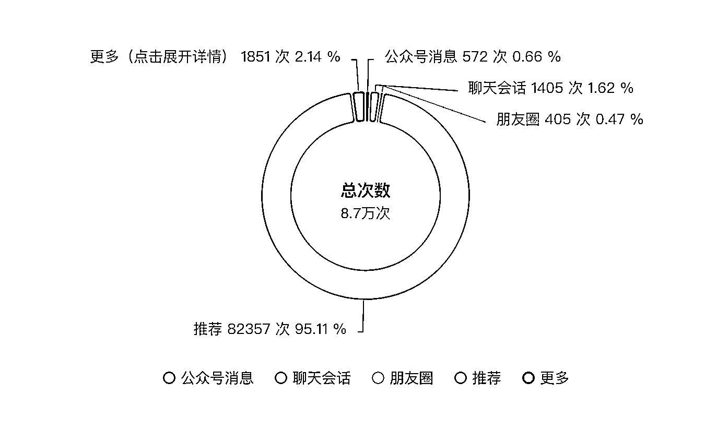
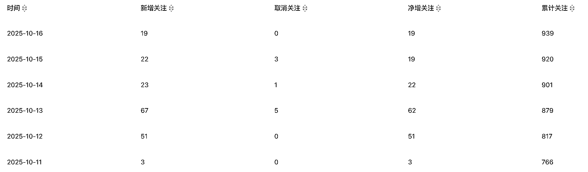
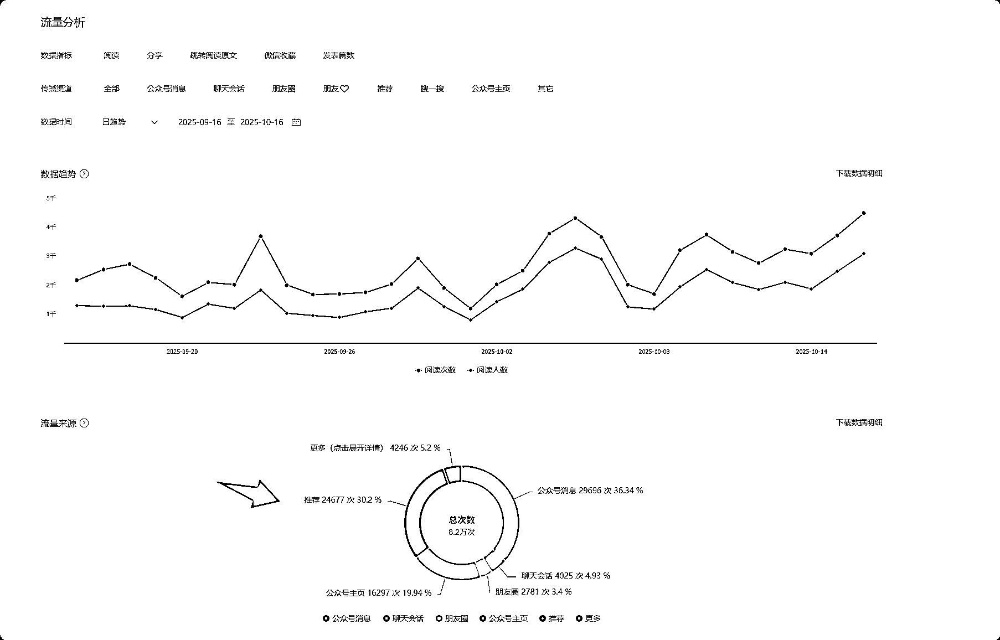
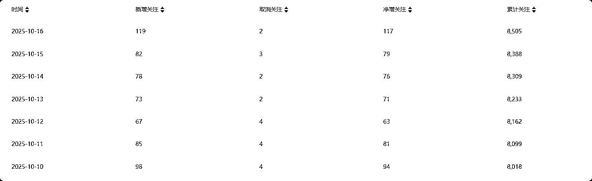

# (48 赞)真话往往刺痛人心，公众号垂直号应该怎么做？这篇绝对是邪修真经

> 原文：[`www.yuque.com/for_lazy/zhoubao/wbpw99cnw0uo4rup`](https://www.yuque.com/for_lazy/zhoubao/wbpw99cnw0uo4rup)

## (48 赞)真话往往刺痛人心，公众号垂直号应该怎么做？这篇绝对是邪修真经

作者： 静水流深

日期：2025-10-17

我在写这篇文章之前，把这篇发给了亦仁：[`wx.zsxq.com/group/1824528822/topic/1521248158224512`](https://wx.zsxq.com/group/1824528822/topic/1521248158224512)

我说我可能要提点意见给生财有术，刚好亦仁不是说被骂少了么，我应该是生财圈友里最敢说话的人。

战绩：航海家被清退，公众号垂直号训练营第一个被强制退款。

不得不表扬的是，生财的退款速度真心快速，包括航海家被清退，龙珠也返还，等于白送了生财会员一年。

这里说下公众号垂直号真正应该怎么做，其实公众号今年开始类似头条那样的推荐机制，我早就发现了，包括跟生财的大师兄涛哥见面聊过很多次，他提示了我很多地方，而且我都听进去了，至少两个月前我的号不如他，因为他两万多粉，我今年 6 月 4000 粉，好的话这个月到一万粉，下个月肯定包到。

我的粉恐怖之处大家可以翻阅我之前在生财的好事发布，我的变现效率应该是头部级别。

就先说下普遍的细分赛道爆文吧：

这个号是我团队的小兄弟在我指导下干出来的，执行力最低标准是每天最少一篇，但是这个里面数据有很大问题，我来慢慢跟大家说：

这个是他的涨粉情况。

我再给一个我自己的大号图各位看看：

大家看出来什么情况没有？

先教大家一个概念，什么叫流量，如果是做商业垂直内容，加到你微信里的好友，才是流量。涛哥的名言，到口袋里的钱，以及加到微信里的好友，才是真的，其他都是虚假繁荣。

还是贴个数据，因为起始粉丝是 4000，到目前 8500，变现情况是这样的：

好了，该吐槽下生财有术的公众号垂直号训练营的问题了。

我被强制清退是因为我的理念与生财有术训练营的理念不一样，理由是我引粉。

不知道有篇吴彦祖演的杀手的电影大家看过没，有一段情节是，别人问他是不是他杀的，他说肯定不是我杀的，我杀人是要钱的，而且收费很贵的。

这段充分诠释了一样的情节，加我微信当然也是要钱的，我私人微信是群里禁止加我的，很多朋友都知道的。

当然，与生财有术的理念不符，我当时怕一些人公众号不会变现，我说了，如果不会变现可以卖流量给我，我收流量，就变成了理念不符了。

过了几天，刚好亦仁说巴不得有人骂他，我跟亦仁关系很好，不存在骂他的说法。生财有术走到今天，亦仁的包容心起到决定性的作用。

我也是做社群的，我一直明白一个道理，有能力的人，永远是跟野马一样，是管不服的，而听话的那群，永远是能力一般，可能执行力还行的一群人。

在去年甚至更早一些时候，生财社群是一个上升的趋势，也是一个现象级的产品。但是从今年开始，很多事情就有了一些微妙的变化。

最先开始，是说社群里赚到钱的大佬，都不来了；然后就是亦仁限制社群引流相关细则后，一群边分享边引流的人也不来了；再就是线下经常跟生财一些城市大佬喝酒，提及了一个重要的事情，就是生财山头文化严重。

这些都是摊子大了之后的共性，我也不知道亦仁知道不知道这些事情，至少我觉得山头文化这个事情，亦仁应该知道得不多。

反正至少我是不允许我的社群里有山头文化的，这个是我们党走出来的正确的路，本身一个有足够高度的领导，一个人说了算，比什么都管用，这也是事实给出来的经验。

所以，生财的很多问题，还是出现在管理上面，我说得更直白一些，每个教练，每个志愿者，都想利用生财这个大平台，做成自己的小 IP，成长后单飞，这个话说得很扎心，就是事实，因为教练组我可是呆过的，包括一些城市群，这种现象更不胜枚举。

这个就是典型的资源流失，以前没有多少竞争对手，现在不一样了，这是生财最大的一个隐患。

闲话也就这里打住，不管我被踢出航海家也好，还是训练营提前毕业也好，我真没任何损失，要知道航海家群里，我应该是发红包最多的那个，而且我真心并没多少我需要打开眼界的地方。

同时，这里也表个态，我跟生财很多大佬关系极好，所有的事情都是为生财好，我不存在什么我要回报不回报的事情，只是去年涛哥跟我说，优秀的年轻人，以后是优质的资产，这句话我听进去了，所以我之后也会多分享一些，同时把我以前烂尾的坑回头都填上。

好，**公众号商业垂直号，既然提及了商业，那么只要不以变现为目的的行为就是耍流氓** ，现在开始传授邪修心法了。

1，精准流量与泛流量永远是互拆的，如果你文章爆了，一定是标题覆盖面广，但是未必有商业价值；你要确定两个赚钱模式二选一：自己的产品变现，或者靠广点通的程序化广告变现。如果是后者，安心一条心做好流量即可，但是你要明白的是，你跟公众号商业垂直号是没多大关系的。

2，一定要开文章内广告，这个我在训练营里已经说过，因为腾讯需要你帮它赚钱，所以你放广告他会更愿意给你推荐，这个规律是我一直用产品变现，很不喜欢放别人的广告，影响用户体验，最后发现不能这样，既然借助了腾讯的平台，就得让对方有利益。

3，号是有 DNA 的，有的号随便写，随便爆，有的号怎么写都不爆，这种情况就是一开始准备几个号，哪个号的 DNA 好，就重点把这个号做大号，其他的做矩阵。

4，先想明白你要用什么产品变现，再去想你要写什么内容，你写东西是为了赚钱，不是为了自嗨。产品里虚拟产品比实物产品容易变现一百倍，如果实物产品不如公众号里选带货，也简单一百倍。

5，变现最简单的测试是卖标题，一篇付费文章，看多少人会去买单，路径最短，调整到价格 X 购买人数最大值，你则找到了你的产品的最优定价。会卖付费文章了，可以选择卖专栏，也可以选择小报童类似产品，星球别卖，纯重运营产品，除非我这种，社群是一个基石产品，营收靠课程的可以运营社群。

6，非要去卖社群的，教各位一个最简单的邪修，找亦仁或者鱼丸谈，推广生财有术给多少提成，要到体验卡做归因，派发这些利润又好又不烦。我就是这样教涛哥的小伙伴如何快速回本生财有术年费的。

7，如果自己想借助生财有术这个大平台，通过公众号垂直商业号来起步的，也简单，生财有术的航海，选择自己最擅长的，好好学，能够当志愿者当志愿者，能够有机会当教练当教练，一个航海搞精通了，围绕航海的主题就是你公众号的主题，变现逻辑就是利用你学到的航海知识开自己的社群或者星球，下沉去吸引生财有术触达不到的小白
用户，最后变现逻辑参考第 6 点，扩大也简单，航海那么多，一个做出来样本，其他的复制即可。还有，星球交付体验稀烂，拉会员微信群，这样又好转化升单，又全在自己私域里面。

8，公众号干货写得越多，越难转化付费。因为人性都是贱的，你写得越多，越吸引白嫖的。

9，公众号是写给别人看的，不是写给自己看的，赛道，行业确定了，核心关键词找出来，在微信的搜一搜里去搜，点文章，点最热排序，阅读高到低，把别人的标题直接复制，文章自己写，一般很容易爆。

10，一个粉丝有一个粉丝的变现逻辑，100 个粉丝有 100 个粉丝的变现逻辑，不是先有流量才有变现，当你变现玩好了之后，所有的流量都是为你服务，因为你的利润足够去洗完同行业友商的粉。

最后，还有各种引私域的骚操作，我会在我之前的烂尾连载里填坑填进去，期待大家关注。这篇文章如果有帮助，请顺带点个赞，手留余香。

* * *

评论区：

烽火 : 这个邪修不错 继续第二季

劳模姐|零碳园区 : 这样的 DNA 太迷人

嗯 : 有收获

休谟 : 看前面以为会很犀利，结果是人情世故

静水流深 : 亦仁又不是坏人，一些不好的地方点到为止即可，较真又不是最好的处理方式。

云天猫猫 : 哈哈，大佬的一些内容确实给我很大启发[呲牙]

易焘 : 感谢惰总的分享！现在生财圈友人数众多，亦仁和生财团队也是在找一个平衡点，以包容各行各业各有特点的圈友并相互提供价值。期待惰总也和生财之间有一个更好的平衡点[抱拳]

古月古 : [强]