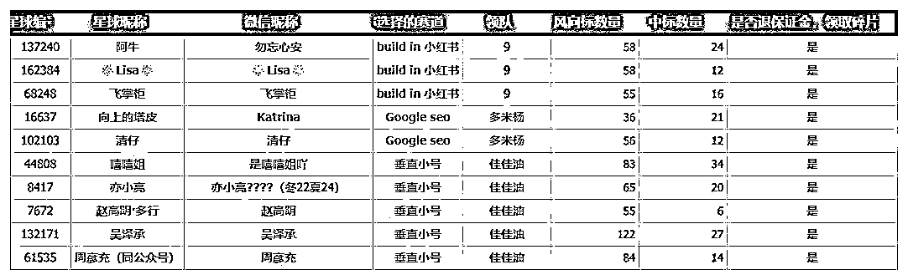
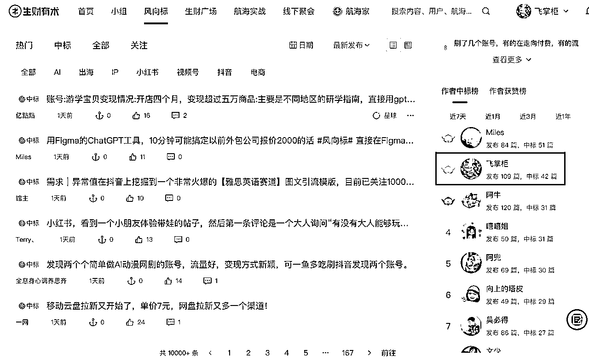
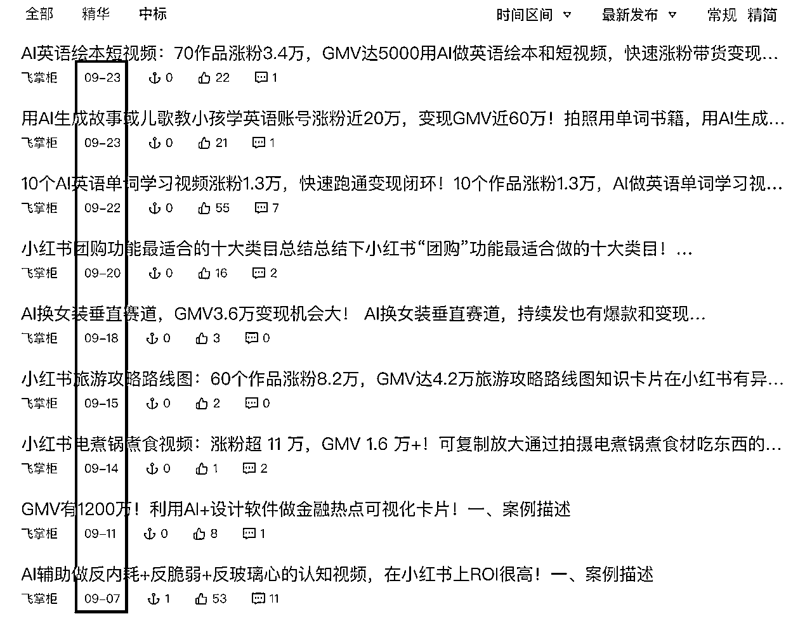
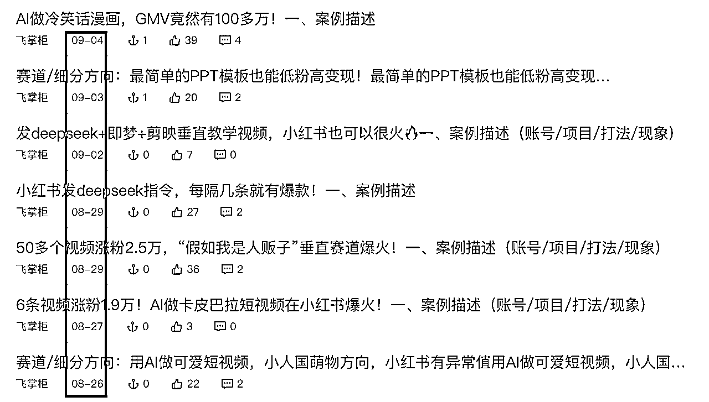

# (精华帖)(61 赞)如何挖掘小红书面风向标签？18 条中标锦囊送给你

> 原文：[`www.yuque.com/for_lazy/zhoubao/cbao2r59qvggmziv`](https://www.yuque.com/for_lazy/zhoubao/cbao2r59qvggmziv)

## (精华帖)(61 赞)如何挖掘小红书面风向标签？18 条中标锦囊送给你

作者： 飞掌柜

日期：2025-10-14

见字如面，大家好，我是龙珠圈友飞掌柜，AI 大模型专家，长期深耕 AI 赛道，我非常喜欢研究风向标，近期参加了生财的【build in 小红书-
超级标研究院】活动，真的感触超级深刻！
首先感谢生财平台发起的这个活动，要是没有这次活动，我估计一周才能写出 3-5 条风向标，但是短短 10 天的时间，我一共产出了 55 条风向标，中标 16 条。而且大家一致反馈，挖掘风向标、写作风向标、中标风向标的效率大幅提升！
给大家上一张图感受下，图片上所有人要么是风向标数量超过 50 条，要么是中标 20 条，全部都退了保证金，并且领取了碎片，可谓是收获满满！
其次感谢领队 9（少波）和同行的战友们！领队每天群内和私信的督促，对于我完成任务起到了莫大的帮助，还有我们组非常积极的几位伙伴，比如 Lisa、勿忘心安等，大家写完风向标不仅群内分享，还相互交流经验，非常有助于共同成长！可以说我的中标之路，战友们给了非常大的鼓舞！
最后要感谢鱼丸李李和运营愣楞，他们问我能不能分享下寻找风向标+写作风向标的经验，约稿的那一刻，我太开心了，原本还在犹豫要不要写一篇复盘贴，在他们的鼓励下才有了本文，郑重感谢！
有时候，真就是这样，没有人推你一把的时候，你犹犹豫豫，当有人鼓励和助推，你义无反顾往前冲就行了！ 核心内容速览： 锦囊 1：摆正心态，写风向标没有任何门槛
锦囊 2：融入优质圈子，参加高能活动 锦囊 3：做了才可能有结果，不做永远没结果 锦囊 4：通过搜索关键词找到风向标 锦囊 5：关注官方活动和热门挑战赛
锦囊 6：账号变现路径越多，越容易中标 锦囊 7：利用“每天拆解”账号找对标 锦囊 8：自己实操过的风向标更容易中标
锦囊 9：关注有潜力的账号，现在不中将来有可能中 锦囊 10：利用好标签机制，提升中标概率 锦囊 11：数据表现越好，越是中标的体质
锦囊 12：查看评论区和私信情况，来挖掘风向标 锦囊 13：“加我领资料”的套路依然有爆款产出 锦囊 14：“低粉高变现”等异常值爆款更容易中标
锦囊 15：教育经典赛道结合 Al 有机会 锦囊 16：不要瞧不起任何小项目，打开格局 锦囊 17：了解小红书的流量规则，更好挖掘风向标
锦囊 18：想要风向标多中标，大佬们的方法得用起来 1、风向标平台很多，重点是掌握方法，并且要聚焦 2、客户的注意力在哪，你的生意就在哪，钱就在哪
3、小红书每一种变现方式的背后，都是一套体系 4、人生发财靠机会，东方不亮西方亮 5、风向标很容易过时，持续实战才能更快成长
详细拆解请移步飞书：[`kqubish8iq0.feishu.cn/wiki/QieXwIyMKibaEDkV9HTcohYNnZe?from=from_copylink`](https://kqubish8iq0.feishu.cn/wiki/QieXwIyMKibaEDkV9HTcohYNnZe?from=from_copylink)

* * *

评论区：

小宋 : 好厉害，干货满满

飞掌柜 : 哈哈哈，有启发就好

礼新 : 感谢分享

文少 : 掌柜牛逼

飞掌柜 : 感谢，希望对文少则有价值，哈哈哈