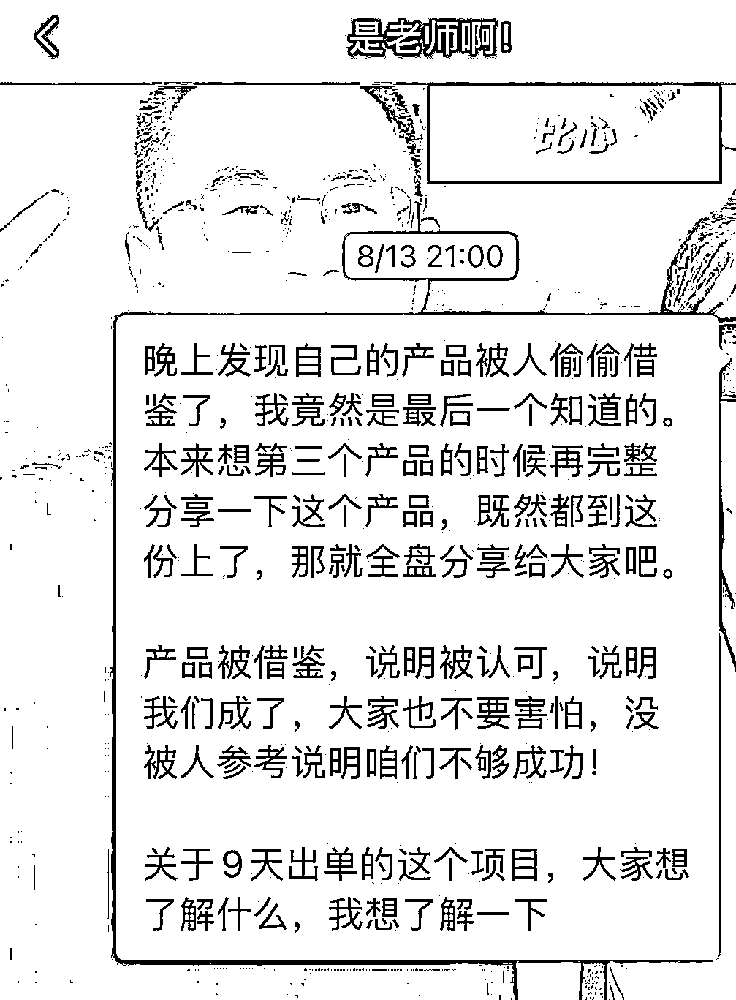
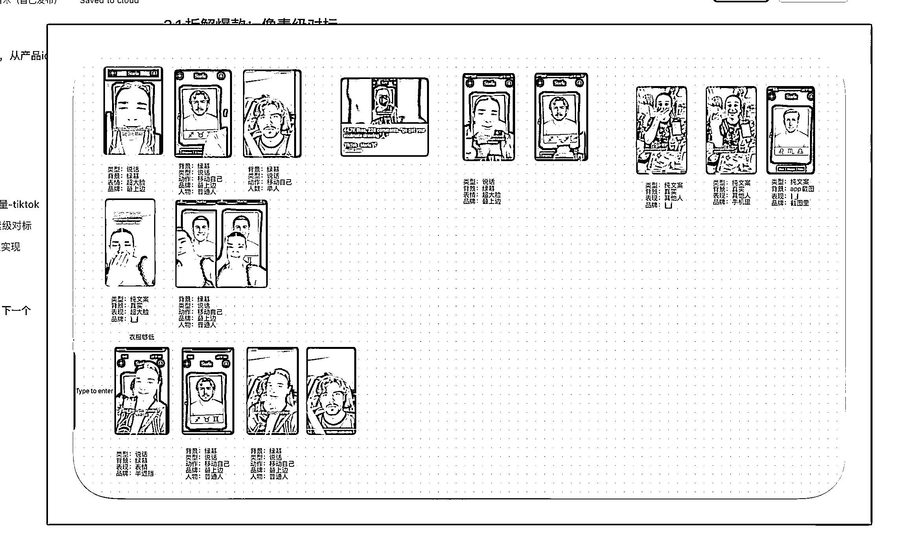
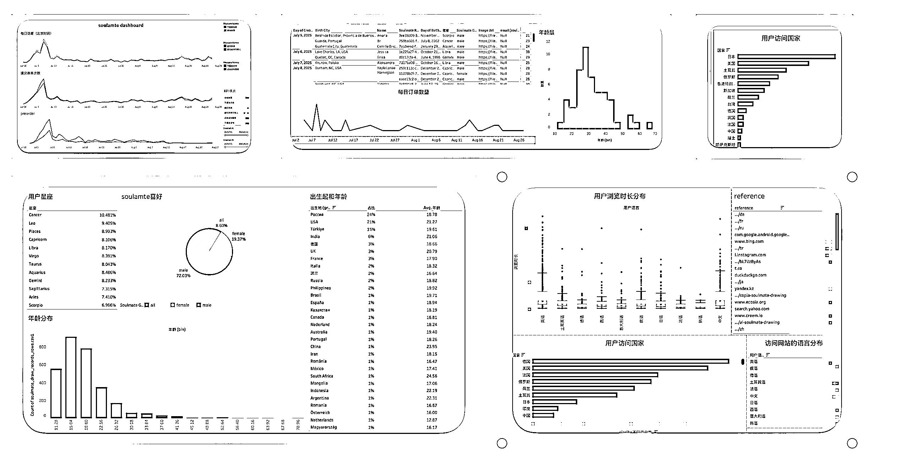

# (精华帖)(51 赞)被抄袭以后，我直播分享了第二个产品的全流程

> 原文：[`www.yuque.com/for_lazy/zhoubao/otgv0yg1ms7345qd`](https://www.yuque.com/for_lazy/zhoubao/otgv0yg1ms7345qd)

## (精华帖)(51 赞)被抄袭以后，我直播分享了第二个产品的全流程

作者： Cheer 林悦己

日期：2025-10-23

深海圈直播，116 天提速到 9 天出单，拆解第二个产品的全流程！ 具体请移步飞书 1. Idea：了解产品 2. 快速上站 3. 回到“源头”搞流量-
tiktok 4. 看数据 用户反馈 5.产品迭代升级 or 下一个 920 的现场，我概括性的讲了一点点方法论，这篇实实在在从开头到结束的每一点都记录了。
为什么之前不发现在发？ 因为当晚直播完，其实有点冲动了！这分享出去，意味着，我基本真的就不做这个品了，而且分享的内容，真的太干了，有一点点私心。
920 以后我就开始专心做海外流量了，拿到了一点小的结果，起步很不错，这个内容就给更多的“师弟师妹”看吧。在老师开课之前，希望这篇内容给大家一点点信心，也希望能帮助到大家！[`ewtk6agpo4c.feishu.cn/docx/Taymd2ioSoemsdxC80ocxhtKnfe`](https://ewtk6agpo4c.feishu.cn/docx/Taymd2ioSoemsdxC80ocxhtKnfe)

* * *

评论区：

Cheer 林悦己 : 哦哦，是 2 个月了！[破涕为笑] 时间真快啊

六六 : 火速赶来学习

书虫 : 对需求的洞察 upupup 啊！

DHJ : 成长神速林悦己！ 向悦己学习 ～～

踮脚 : 域名 .app 那个是我做的，但诚实的讲，我做的时候真不知道你也做，后来看帖子才知道的，最初 soulmate drawing
这个需求信息我是从白鲸出海公众号那边看到，然后搜有没有人做，当时找了十几个对标，最后整合一下就上了。当然说抄，我必须承认有抄的成分了，挨打要立正，承认错误，1
毕竟人家 app 是正主，我搞个 web 我确实是在蹭人家的热度，2 然后人家的图片风格我确实是模仿了，试着复刻它 app 里展示的类型，3
然后前面的填基本信息，姓名，城市啥的，当时我一搜，同类型十几个全是这种，想着快速上线的话，可不是得和那些一样嘛，总不能想着说搞一个创新点出来才上，4
然后功能部分有个性格分析这部分确实，如果你是原创的话，那真的是从你那抄的，因为觉得真的不错。当然我也不是说找补啥的，也是承认错误，我现在也在尽量避免这种纯模仿的，但老实说，像一些新词啥的，这里面又如何去定性
抄袭，模仿和李逵李鬼呢。好吧，我也不知道你是不是在说我，如果你觉得有被冒犯，我向你道个歉。

感恩学习相信-小陶 : 谢谢学姐的分享！[抱拳][抱拳][抱拳]

新页 : 人家根本不是在说你

Cheer 林悦己 : 哈哈哈哈，感谢帮我说出来