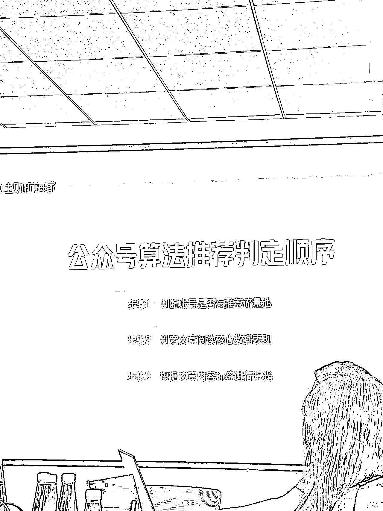
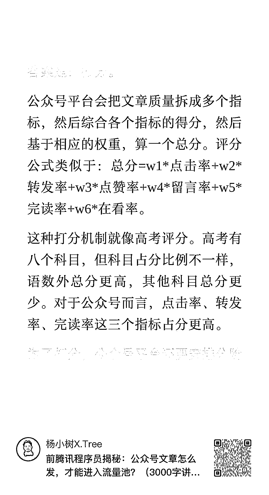
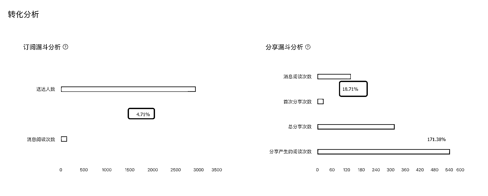
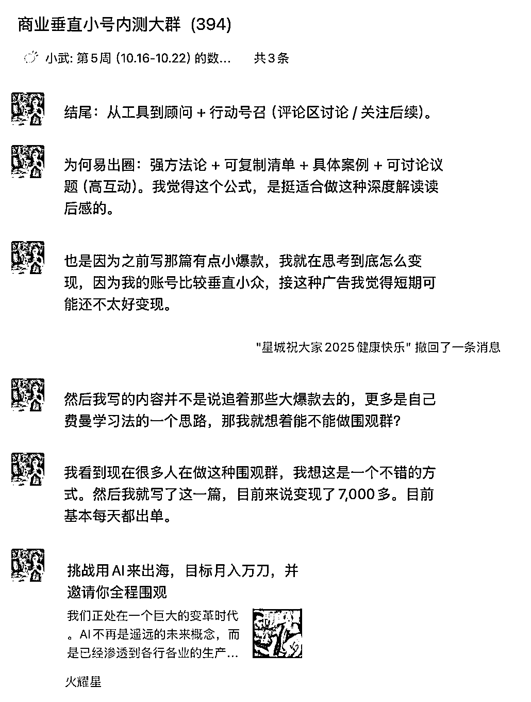

# (40 赞)带着 374 人勇闯（商业垂直小号）35 天后，我的 10 点观察和思考

> 原文：[`www.yuque.com/for_lazy/zhoubao/ot407wqh8510ucdd`](https://www.yuque.com/for_lazy/zhoubao/ot407wqh8510ucdd)

## (40 赞)带着 374 人勇闯（商业垂直小号）35 天后，我的 10 点观察和思考

作者： 七天@生财有术

日期：2025-10-23

上一篇【商业垂直小号】内测群阶段性汇报发出后：，提到进一步跟大家分享下在群内跟近 400 圈友沟通后的洞察和心得，今天也一次性分享给咱们圈友：
以往的推流逻辑是：发布后 1–2 周无流量，就意味着“宣判死亡”；但现在的推流周期明显延长，。公众号流量模型正从「订阅逻辑」向「算法逻辑」转变：
过去：订阅列表 ＞ 朋友圈转发 ＞ 看一看 现在：社交推荐（朋友♡） ＞ 机器推荐（看一看 / 搜一搜） ＞ 订阅
这意味着——系统不再只看订阅量，而是看内容质量与互动信号。 在这个过程中我自己也尝试起号，有一篇跑到了 1.3 万的阅读量，结合前腾讯程序员
的公众号给的结论，推流逻辑的评分公式类似于：
其中我们在群内推测验证：粉丝完读率为第一个流量池门槛，预计至少在 4%，能跑出第一道流量池。转发率和完读率是第二道流量池。
大家可以优先关注这三个指标：粉丝完读率，转发率和完读率。 在程奕人老师的线下课上，也提到： 步骤一：判断账号是否还在流量池 步骤二：判断文章阅读核心表现
步骤三：根据文章内容标签进行曝光
6 月份在北京做 AI 传术师见面会时，波波老师就提到：目前文字信息的方式，是为了更高效的拿到用户标签，对比之前的长文形式，判断更精准。万兴老板也提到他们的小小包麻麻账号单独发文字信息也能冲到 10w+。
可见腾讯的用户和兴趣标签随着小绿书和文字信息的兴起越来越精准了。
小树老师文中也提到：匹配就是将合适的内容匹配给感兴趣的人，推荐系统的匹配准确度越高，用户就越喜欢看公众号文章，在公众号停留时间越久，进而能实现的商业价值越大。
亦仁在超级标中强调过，商业垂直小号的关键词是：账号定位上别太宽泛，尽可能细分一点，相比于赚钱，出海赚钱就更好，相比于出海赚钱，ai 出海赚钱会更好，不要担心细分后没流量，，就像那些新号的内容找到我一样。”
即便是写 to b 销售或者是 YouTube，AI 流量增长拆解，也能推送给精准的用户，获得更多爆款。 比如我们内测群在写 tob 销售的@小吴姐 和 ，@轻舟
和@萧炎 的 Youtube，@兔子 写 AI 修图， 写 AI 流量增长拆解的都出了爆款。 这背后是公众号算法的内容标签更精准了。文字的语义匹配能力变强，让。
同时，反复写同一主题，也在不断强化算法识别和读者信任。 和小红书、抖音相比，公众号是目前唯一兼具的平台。它更像新时代的「个人官网」：
内容真诚、表达真实，就能在长尾阶段持续带来流量与转化。 垂直让算法识别你，人感让用户记住你。账号不是工具，而是你这个人的延伸。
为什么是公众号？因为微信沉淀了大多数人的关系和注意力。
，写内容的用户画像足够清晰，比如写短视频如何拍，不如写外贸工厂短视频如何拍，写副业如何做，不如写 AI 出海的副业如何做。
追求广度，只会越来越内卷，追求深度，持续在一个赛道深耕，你就有机会成为 TOB 销售专家，n8n 工作流营销专家，高客单产品打造专家。
垂直小号垂直的是内容+人设。
要全方位围绕垂直内容和垂直 IP 这两方面去打造。垂直内容能够为你带来很多垂直用户，垂直 IP 能够给你加强人设，进一步巩固粉丝找你合作。
千万不能不垂直，今天发娱乐明天发成长后天发卖货等行为。 另一个方面是如果不植入个人 IP，导致文章泛泛而谈，跟你缺乏联系，
要有活人感，你的个人存在感要在内容中显现，让受众知道这是你的经验、你的观察、你的判断。
比如选择一个副业博主还是一个拆解 AI 流量博主，一定是后面的粉丝价值更高。
你的收入与你选择的赛道和人群强相关。从第一天就要开始不断考虑要写给什么样的人看，他们会在什么场景下为什么需求付费。
流量与产品可以分为四个维度：别人的流量、我的流量、别人的产品、我的产品。
所以做商业垂直小号的第一步，最好是把我的流量做起来，其次可以带自己的产品如养成系陪伴群，副业风向标群，也可以带别人的产品，比如不少内测圈友带生财的体验卡。
在产品侧又可以拆分成：标准化产品和服务类产品。 标准化产品边际成本足够低，可以用来规模化扩大影响力，增加覆盖面。服务类产品能够赚取利润。 8. 一个是找对标爆款，且一定是要找对标账号的对标爆款，如果这个内容是爆款，但是 IP 的人设跟你差别很大，可参考性就很一般。一个是挖掘需求，用微信指数来看一下你关注的关键词近期搜索量如何。
分享圈友林途的一段话，我想提醒大家，爆款是重复的。 很多做得好的垂直号，比如文案类的小号，几个月就能突破 50 万粉丝，完全可以作为养老项目来做。
还有一些搞钱类的赛道，比如肥猫说财、朱芒果、反向的猫这些高净值人群的号，一个号的价值极大。
朱芒果这个号从 7、8 月份开始基本篇篇 10W+，内容和框架比较简单，都是爆款素材重新做。 决定账号流量上限与生命周期的，是内容配比，这也是在程奕人课上提到的。
推荐的内容配比包含： 发话题观点类文章 围绕那些与业务不直接相关，但你的目标受众会感兴趣的话题进行输出 围绕与业务直接相关的用户，需求痛点
用户故事/品牌故事/产品介绍/活动宣发 最后，我们沉淀了近 30 位爆款圈友的案例拆解，我用 AI 帮大家总结提炼 50 个要点： 1.垂直 + 人感 =
爆款的底层逻辑。账号不是工具号，是有人设、有温度的垂直专家号。 2.真实的成长线比“完美的设定”更能吸粉。小白成长 > 专家说教。
3.人设要从“我是谁”转向“我能帮谁解决什么问题”。很多人做人设都在写‘我是谁’。但用户不关心你是谁，只关心你能帮他解决什么问题。
4.账号内容要聚焦一个具体人群：让 TA 一眼认出你是写给他看的。内容定位的本质，就是让用户在两秒内判断我是不是目标读者。
5.持续输出一类价值，远比“多领域写一点”更能让系统识别你是谁。
6.一个账号最打动人的，不是你完美的设定，而是你成长的过程。用户喜欢看‘普通人变厉害’的过程。所以两类都可以做，一类是小白成长，新人养成系，一类是专家分享。
7.所有的“质量问题”本质都是“数量问题”——爆款是选题堆出来的。 8.爆款选题=【痛点词】+【高热词】+【新场景】，用搜索数据去验证热度。
9.不确定写什么时，往用户情绪靠永远有热点，比如“用户关心的钱和结果”。 10.“选题对标法”永不过时：关注同赛道爆款→模仿框架→局部创新。
11.热点延伸比追热点更容易爆，尤其是“续集”思维。 12.“亏钱比赚钱”更能引发共鸣；“翻车复盘”比“成功经验”更易传播。
13.一次只打一个点，不要想讲太多。选题越聚焦越容易击穿。 14.如果热点还在，就写续集。读者想看“后续”，不是重复。
15.用 AI、公众号、抖音搜索栏去验证：有热度、有讨论、有延展空间。 16.标题要“给人一个不得不点的理由”——身份+结果+悬念。 17. 结构公式：→【身份钩子】+【数字成果】+【实操承诺】 18.数据是最硬的说服力，用数字放大痛点或结果。 19.反常识标题永远有效：否定句＞肯定句。
20.加入时间感词汇（今天、一天、4 个月）提升真实感。 21.括号副标题要写“具体承诺”，如“附 SOP”、“附工具清单”。
22.“续集”“爆更”“完整版”等字样有天然吸引力。 23.用【！】【？】【｜】等分隔增加节奏感。
24.有时候最好的标题就是照搬 10w+标题，不改一个字。但是框架要变成自己的。
25.标题中出现“AI、赚钱、教程、实录、故事、复盘”是当前最稳固的关键词池。 26.爆款结构三段式通用模板： 是什么（现象）→ 为什么（原因）→
怎么样（解决） 27.开头三句话决定生死，要么抛结果、要么抛冲突。 28.每 300 字要有一个信息峰值：金句、案例、数据。
29.用户没耐心读完深文，必须让首屏内容“即得感”强。 30 真诚比技巧更稀缺，真诚的复盘最容易出圈。 31 好文=故事×方法×情绪：三个维度都在线。
32 最好的爆款是“别人觉得自己能照着做的文章”。 33 用标题的逻辑去写结构：承诺什么→兑现什么。 34 结尾是传播起点：留疑问、留钩子、留入口。
35.千万不要怕短，600 字爆过 2 万阅读的例子比比皆是。callback 下，这个是完读率的提高点。 36.统一风格的封面是信任资产，让粉丝一眼认出你。
37.“真人实拍图”+“场景感”> 任何设计感强的配图。 38.数据截图、结果图、后台图，比 P 图更有吸引力。
39.封面+标题=识别组合：封面传情绪，标题传利益。 40.如果你是专家型 IP，封面必须有人感（地点+行为+情绪一句话）。
41 评论区是算法权重很高的互动场，必须经营。 42.留钩子要“简单+有回报”，比如“扣 666”、“回复咒语”。 43.互动语要真诚，不要命令式。
44.统一口径的引流语=可复制模板（私信我、留言区、领取资料）。 45.用 A/B 互动引导（如果亏 100 万，你会选 A 还是选 B）提升参与率。
46.用续集或系列文制造复访行为，让用户期待下一篇。 47.“首日爆光 + 长尾增长”是公众号推荐系统的关键组合。 48. 每周至少复盘一次后台数据，找到“异常值”就是找到了爆点。 49.内容的真实反馈就是选题指南，爆款=持续复盘出来的。
50 别忘了——点赞只是虚荣指标，。callback 涛哥说的他们有钱，我们有人，私域才是长期价值。
今晚分享再次收到好消息：圈友的内容变现 7000+，只要信任感建立，并且持续推送给你的目标用户，价值带来的收益是确定性的。
如果有其中任意一条对你有启发，欢迎在评论区告诉我。[`t.zsxq.com/xxOS0`](https://t.zsxq.com/xxOS0)

* * *

评论区：

小辣椒 : 我有一篇几百浏览的，一个月后突然推流上万，还有一篇一万多，两个月后突然又推变 10 万了

七天@生财有术 : 哇塞，欢迎分享给大家，发一篇生财好事呀。

秋水 : 这是公众号在学习小红书[微笑]

刘智行 : 正在努力吸收七天老师的智慧中，知识进进进～[太阳][太阳]哈哈。