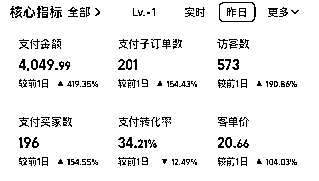
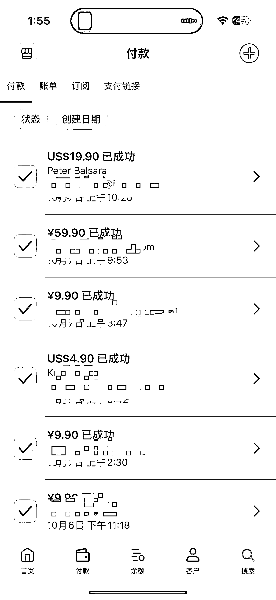

# (40 赞)抓住 Soxx 热点，卖邀请码国庆 3 天赚了 7000+

> 原文：[`www.yuque.com/for_lazy/zhoubao/pdp1azrdixxwy54x`](https://www.yuque.com/for_lazy/zhoubao/pdp1azrdixxwy54x)

## (40 赞)抓住 Soxx 热点，卖邀请码国庆 3 天赚了 7000+

作者： 小李哥

日期：2025-10-11

刘小排老师的供需理论，通过国庆期间 sora 热点有了深刻体会，分享我如何做到**3 天利润 7000+** ，以及如何把一个**邀请码卖到 20 刀** 。

供需关系，**需求大于供给小** ，轻轻努力，钱追着你来（消息一个接着一个来，邀请码还有吗？有的。秒下单）。 **供给大于需求** ，不断内卷，赚个辛苦钱。

**热点** 就是明显供需不对等的事情。在需求开始提升，供给还没上来，第一个时间知道，抓紧一切速度上线，提高价格利润最大化。

**飞书链接：**[`rd78y95zlu.feishu.cn/wiki/D2Hpwqj7OiU2xoklFdOcS447nOV?from=from_copylink`](https://rd78y95zlu.feishu.cn/wiki/D2Hpwqj7OiU2xoklFdOcS447nOV?from=from_copylink)

**  **

**  **

## **一、通过热点，3 天利润 7000+：**

1、**信息获取** ：多刷 x，信息速度比国内快。我看到信息后，搜索淘宝，还没有人卖 sora 邀请码。

2、**执行** ：

商品主图 app 介绍截图、改店铺名称、上架商品、破 0 补单。几分钟内完成。

3、**价格修改**

晚上邀请码少，提高价格。白天邀请码多，适当降低价格。

开始价格 9.9 元，后面涨到 49.9 元，还是继续出单，单子少了些，利润没差多少。

**起飞时** 调整价格，流量越大，价格越要提高。1）利润最大化。2）不涨价接待不过来。

价格起来后，服务一个客户赚的钱，比服务 5 个客户赚的钱多时，真的爽。

**看同行** ：再忙也要看同行

4、**做好客服工作** 。欢迎语、快捷回复等基础工作

5、**闲鱼买邀请码** ，熟练的加微信提供

**结果：**

sora 的淘宝排名第二，第一也是圈友。应该我比他上线早一点点，没到第一原因，也不知道为啥，玄学。第一第二利润差不少。

看了数据，我的支付转化率、浏览访客转化率吗，都比他高 10%。

他访客比我多三倍，客单价高一半，下单人数多一半左右，利润翻 x 倍。

这次热点到处是圈友，供应商、玩流量的、海内外，**生财圈友真的牛** 。

#### **复盘**

**1）供不应求** ，**敢于提价** 。

**2）执行力** ：当时在高速上想提价，后来想等一等晚上再说。等一等少赚钱。

**3）时间精力成本（释放精力，不要把自己陷入进去。）**

**有点反常识** ，**总觉得忙一些赚钱。其实不忙也赚钱。**

不忙心理感觉有点失落，觉得好像这次流量来了，自己要做些什么，不能一直闲着。

当时：我如果提高价格，订单少利润只少一点点，但你的时间精力有了，可以上更多链接，做其他优化。

举个例子：比如你闲鱼卖 3 元一个码，忙的飞起。可能半天收入不如我卖一单 20 美刀的订单。

**4）细节打磨**

我和我老婆一起做，没有团队客服。

前一天晚上只睡了 2 小时。

第二天老婆担心我身体，偷偷把声音提示关了，然后一晚上有十来个退款。

第三天我把提示语优化，退款率瞬间少了好多

”店家在休息熬夜一晚，看到后第一时间回复给码

谢谢大哥大姐

国庆快乐“

每个新事物是相似的流程：小范围宣传、起飞、下架商品、对抗平台继续上架、更严格处罚、还有新玩家不断上架（后面有几个玩的挺猛，几千单的出）

## 二、店铺被下架处罚后，转战海外。一个邀请码如何卖到 20 美刀？

**MVP 非常重要，热词上站速度快。（MVP 两大敌人：产品经理和强迫症）**

**1）3 小时上线网站，** 核心功能：首页展示邀请码、支付、发邀请码。（其实留个邮箱，更简单不用发码逻辑）

如果你搞三天才上线，流量早结束了。

**2）在 x、reddit 开始推广，等待出单**

海外用户真的爽：19.9 刀一个邀请码。如果你卖 10 元，等于卖 14 单。闲鱼卖 3 元，等于 50 单，等于他忙活一下午。

**3）这次也是报名深海 Ai 产品后，海外用户的集中出单**

之前 nano-banana 出了几单，主要是小红书引流国内用户。客单价 10 元。

我也做了 sora 去水印工具，欢迎大家体验（[www.tkcamp.cn](http://www.tkcamp.cn)）

## **

**

## **三、热词信息获取速度、执行变现速度、高客单价，有时间精力去想其他问题。**

信息获取：

nano-banana：当天抢注 nano-banana.cn 域名**，和.ai 差不多一起注册** （那时候没好好看文档，结果注册了个.cn）

sora 邀请码：也是**最早上线** 的一批。

## **四、关于 AI 产品方面**

1、针对信息（快速获取 X 上关于 AI 的信息）**我做 MVP 版本的网站** ，功能在优化，感兴趣可以当我**内测付费用户。**

产品介绍：针对 x 上 Ai 产品领域的大小 V，范围涵盖他们关注的人。每天更新一次他们的内容，列表方式高效查看，并且由 Ai 总结，并生成语音，可以路上听。

2、继续优化 sora2 产品，完善去水印功能（[www.tkcamp.cn](http://www.tkcamp.cn)）

* * *

评论区：

礼新 : 热点思维[呲牙]，赚快钱

小宋 : 值得三连，这才是真的综合能力，产品能力+流量➕运营能力。 都要处于平均水平，缺一环都很难搞到钱。

风益 : 飞书链接点不了

郭佩东 : 思维加行动力！厉害