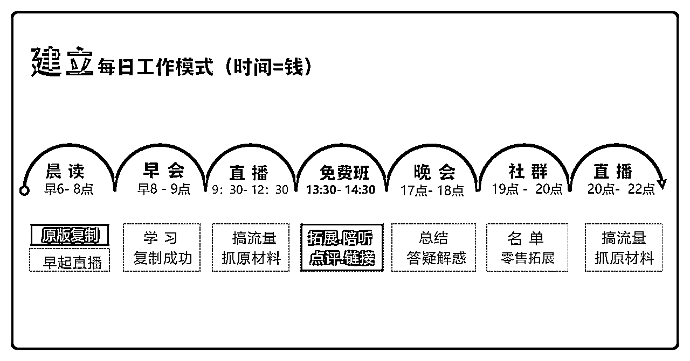
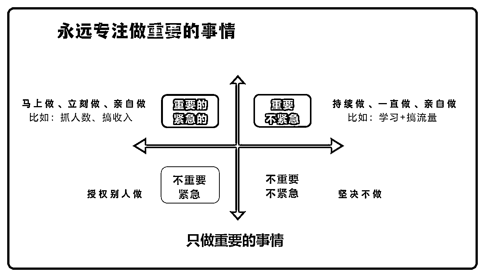

# (34 赞)一套“不发工资”的系统，年创 2 亿业绩、带出 1000 名主播

> 原文：[`www.yuque.com/for_lazy/zhoubao/rkwfqqatxxxxslgm`](https://www.yuque.com/for_lazy/zhoubao/rkwfqqatxxxxslgm)

## (34 赞)一套“不发工资”的系统，年创 2 亿业绩、带出 1000 名主播

作者： Ai 权哥（传奇）

日期：2025-10-11

上一篇万字长文《从 0 到 97 家店，再到挥手作别：一个产品经理的千万级连锁实战复盘》结尾留的坑这次来填了！
先说结果——我用一套的团队系统，在大健康赛道，且该系统至今仍在运转。 这不是运气，而是一套可被拆解、被训练、可规模复制的。
本文是我的亲历复盘：不讲空话，只给可落地的方法与框架，。
请移步到飞书：[`ymcncqsd4u.feishu.cn/docx/CKxYdafJRo6TZIxn7WgcarHHnxd`](https://ymcncqsd4u.feishu.cn/docx/CKxYdafJRo6TZIxn7WgcarHHnxd)

* * *

评论区：

melisa : 权哥又出干货了[强]

礼新 : 这个真的牛

艾小白 : 我也做大健康赛道，看您的图片，前期是不是做的打粉项目？现在做私域后端，模式应该挺重，怎么做的呢？

外卖运营团长 : 怎么链接你呀，我也在武汉

Ai 权哥（传奇） : 可以通过鱼丸链接[握手]