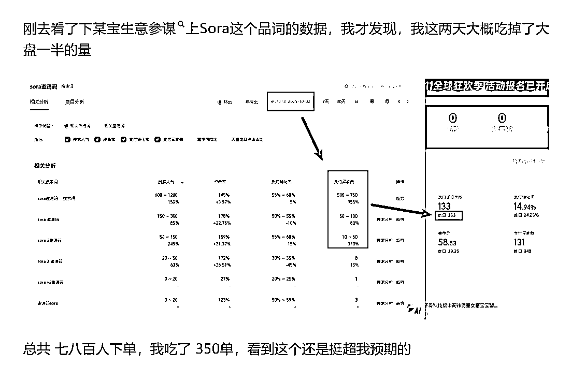

# (32 赞)很多人不想上班，只是没找到适合自己的路径。

> 原文：[`www.yuque.com/for_lazy/zhoubao/dvqdm1q6yleyrgdt`](https://www.yuque.com/for_lazy/zhoubao/dvqdm1q6yleyrgdt)

## (32 赞)很多人不想上班，只是没找到适合自己的路径。

作者： 沧海大表哥

日期：2025-10-22

**很多人不想上班，只是没找到适合自己的路径。**

**  **

我是沧海大表哥，最近参加了个线下会，和一群同样对 “上班” 这件事有困惑的朋友聊了聊，我从职场开始做副业到自由职业再到创业，已经三年。

这次见面本想看看大家的卡点是否和我接触的用户一致，没想到聊得越深，越觉得有必要把这些 “反常识” 的经验整理出来 。

毕竟 “不想上班” 从来都不是逃避，而是你要找到一条能落地、能长久的路径。

### **你现在处于哪个阶段？**

**  **

职场待业、尝试自由职业，还是已经踩在要创业的门槛上了？

当天生财线下组局这三种状态的小伙伴都有，我自己的路径：职场做副业拿到结果→转型自由职业→轻资产创业

但这三年里，我见过最多的不是成功转型，而是反复试错却始终在原地打转的人。

有人看到小红书火就跟风做小红书，没几个月后发现各种问题，比如觉得自己不擅长，或是说觉得是赛道拥挤，放弃了。

有人沉迷各种技术， AI 绘画、N8N 这类技术，新鲜感过了就频繁换项目。

还有人一上来就想做 IP、做产品，忙活机构也连第一块钱都没赚到。

如果你也有了不想上班的念头，先别急着辞职或跟风，沧海今天分享的底层逻辑，不能保证你成功但是一定能帮你少走一些弯路。

### **不想上班的第一步：**

**  **

#### **先先想 “你做什么”，而是要先想 “能不能长期做”**

这 3 年我被问过最多的问题是：“沧海，现在做什么能快速离开职场？”

但三年下来，我觉得最难的从来不是 “找项目/副业”，而是判断这件事能不能陪你走很久。

**很多人一开始的思路可能就错了：**

看到别人做小红书变现，就跟着注册账号。

听说 AI 账号能赚钱，就一头扎进去。

甚至有人觉得一开始就 “做一个产品能赚一辈子”，花三个月打磨产品，可最后连流量在哪都不知道。

结果呢？几个月后赛道天花板见顶，或者自己先耗不下去（心态蹦了/没多少钱了），只能换方向力求早点赚钱续命 ， 这不是试错，而是重复做
0-1，每次都是全新的开始，之前的积累全白费了。

如果一定要给不想上班的人一个建议，那就是：

**先找一件 “哪怕外部环境变了，它也不会消失”的事，或者哪怕做过多个赛道，也要让它们能互相赋能** 。

比如你做职场求职陪跑，既帮人改简历，又做面试辅导，这两个事的人群、交付体系是相通的，改简历的客户可能会复购面试辅导，面试辅导的客户也会推荐朋友来改简历 。

这样的积累才是有效的，而不是今天做 AI 绘画，明天做母婴带货，看似忙忙碌碌，回头看一直在原地。

肯定，也有人说：“我就喜欢做新鲜的事，对重复的事很厌烦，控制不住自己，很享受 0-1 的刺激，怎么办？”

这没问题，要知道不是所有人都适合做 1-10 的放大。

我见过很多人，他们有的能当天或几天时间就能快速跑通一个小项目，赚几千块/上万，但让他去招人、做流程规划写 SOP 就头疼。

也有人沉迷新技术，N8N、AI 编程 agent 工作流等总是换着玩，永远追着红利跑。

如果你是这类人其实不用逼自己去做特别垂直，你可能也做不到，反而是难为自己，因为对你来说垂直反而是煎熬。

你的方向反而适合往资源整合方向走，你总喜欢接触不同行业、不同信息，那咱就把这些信息串联起来，比如帮做 AI
的人对接需要技术的商家，帮做副业的人牵线流量渠道。

在你没有体系之前，比如我之前参加过 20 多期不同商业项目，我记得很清楚，我没有一次完成打卡，当然也没拿过退费。

但每次都能拆出项目的底层逻辑：这个项目怎么设计的？报名的人都是什么人群？他们为什么愿意付费？这些观察后来帮我解决了很多用户的卡点 。

原来兴趣广泛从来都”不是缺点，关键是要把喜欢新鲜和长期沉淀结合起来，而不是被新鲜感牵着走。

### **第二步：0-1 阶段别搞复杂**

### **

**

### **先做迈一步就能赚钱的事**

如果你现在还在职场，想先做副业先试试水，没有专业老师带你的话，千万别自己一上来就学别人搞什么
“闭环”又是做产品、又是定定位、还要搞流量，做销售，这对新手来说太难了，大概率会消耗掉你所有热情，最后什么都不想干。

**那 0-1 阶段的核心是什么？**

**快速拿到正反馈，就做倒卖倒卖**

**  **

什么事能让你 迈一步就赚钱？

答案是：利差（ 信息差、资源差、平台差等）。千万别觉得倒买倒卖 不正经，是捞偏门。这恰恰对新手来说，能快速赚到第一笔钱，比什么都重要。

我第一次靠副业赚钱，就是靠 “资源差”。

2021 年当时我还在职场当设计经理，带过一个下属，他辞职后靠做抖音特效道具赚钱，500 块一个，针对中老年人的 “丑萌” 风格特别吃香。

我一看就懂了：这东西不用原创，找素材拼一拼就行，于是我花一周跑通流程，然后在 QQ 群、APP 上找兼职，把流程免费教给他们，我负责对接平台、发工资 ——
那段时间最忙的时候，不是做业务，而是给兼职发每天工资（有收益当天结算）。

我现在创业主业是带不想上班的小伙伴，从 0-1 起步自己的个人事业，用大家自己的技能/爱好/优势，去做一个自己的产品，系统地带大家跑一次商业闭环（定位/产品/销售/获客/运营）。

再比如我现在睡后收入是做的 “卖 AI 账号”和资源变现，就是典型的倒买倒卖，信息差和资源生意。少的一旦只赚几块钱，几个月时间被动也卖了 7 千多单了。

比如咱就拿 AI 账号举例：只要用 AI
的人，都需要各种 AI 账号，不管是镜像账号还是官方账号，我把这些资源整合起来，有人买就发链接，不懂的就甩教程，不用做交付，不用搞售后，相当于 “被动收入”。

这种很难？相信在 AI 时代背景下， 哪里去找到几百个 哪怕上万个玩 Ai 的人 应该很简单。任何平台和渠道都可以做到。

我一个月靠这个能赚 1-2 万，4 月的时候 gpt40 出来的时候
单月最高 5W 收入，再加上其他两个设计被动小项目（解决设计需求和业务对接，只有他们产生业绩我每个月分钱），这样一个月被动月收入稳稳的 3-5W ，
有了这笔钱，是不是也才有心思去探索更长期的方向。

不过，很多人看不起小钱，觉得 “要做就做能赚大钱的事”，整个大活，憋个大招，但你想过吗？

新人一开始就去做个人商业定位、产品、内容、销售、运营、来回打磨，搞流量需要学平台规则、做内容，转化需要练话术 —— 这至少是
“五步”，新手要走完这五步才能赚到钱，难度太高了。多少新人能别说赚到钱，能走完的又有多少呢？

反而赚“利差的钱”，先学会倒买倒卖，尤其是在生财，到处是机会和信息资源，不需要你有产品，不需要你会引流，发个朋友圈、对接个资源就能变现，哪怕一次赚几十，也能让你看到
“自己能赚钱”，这种即时正反馈才是坚持下去的动力。

就像国庆放假那几天 sora
爆火，大家都在弄邀请码，虽然邀请码是免费的，看到一个群里，有人就靠它，在淘宝一个卖 50 元，卖了几百单，这就是倒买倒卖，用信息差，认知差赚钱。

你自己都会觉得咸鱼才 3-5 元，怎么他淘宝敢卖 50 元一个？

跟你有多少能力会多少技能有关系？

并没有， 只是他知道这个信息，知道这样可以赚钱，了解人性就够了。

还有个误区要提醒新人伙伴：别觉得 “存半年钱就能辞职做自由职业”。

我见过太多人，存了几万块，辞职后觉得时间都是自己的了，一下子自由了，想熬夜熬夜 想几点起几点起，几个月后开始焦虑，半年后钱花完了，又灰溜溜找工作是常态。

真正的辞职准备，不是存够半年生活费，而是存够 “1-2 年的生活费 + 能赚钱的小项目”—— 有了被动收入兜底，你才不会慌，才不会在内耗中浪费时间。

### **选赛道不是选风口，是选能打赢的对手**

当你靠小生意/倒买倒卖稳定了收入或有了一些积蓄，你自然胆子就自然更大，会想往更长期的方向走时，就会遇到 “选赛道” 的问题。

很多人会问我：“现在什么赛道火？AI、跨境、私域，我该选哪个？”

**选赛道不是选风口，而是选你能打赢的对手** 。

你要先想清楚：这个赛道里的天花板是谁？他们干了多久？资源、人脉、经验比你强多少？如果你杀进去，凭什么能赚到钱？后面如果相遇，你有什么优势？

比如我当初决定做 “帮助职场人转型自由职业”，起步做个人事业行动，不是因为这个赛道火，而是因为我自己就是这么走过来的。

3 年前我坚信，有越来越多的人会离开职场 —— 我懂职场人的焦虑，懂自由职业的卡点，懂创业初期的坑，这些 “经历” 就是我的优势。

每年有 1 千多万人离开职场，如果我当时跟风做 “医美”，哪怕赛道再火，我不懂行业规则，不懂用户需求，大概率也早滚回职场上班了。

选赛道还有个小技巧：**别垂直于行业，要垂直于人群** 。

我很认同现在只有 2 类人能赚到钱，一类是头部 IP，一类是极度垂直的人群。

**做核心赛道的核心人群的核心需求**

**  **

行业在变，比如去年火的 “数字人直播”，我认识的一个大佬今年就转行了。

但是人群的需求不会变，比如设计师永远有 “想做副业”“不想上班” 的需求，职场人永远有 “提升收入”“转型自由职业” 的需求。

我之前把朋友圈分成 “设计师” 和 “非设计师” 两个标签，同样的文案发两次，结果 80% 的付费用户都是设计师。

后来我拆他们的需求：做 AI 账号、学 AI 绘画、找副业方向、辞职创业 —— 这些需求覆盖了他们从 “职场” 到 “创业” 的全链路。

于是我针对设计师做上下游延伸：带他们做 AI 绘画 ，带他们做副业，再到陪他们转型自由职业 —— 这样一来，用户复购率特别高，很多用户在我这里付费过 5-8
次，甚至跟着我做高客单项目。

反观那些垂直于 “项目或行业” 的人，比如只做 “AI 绘画教学”，一旦 AI 绘画的热度降了/技术迭代，用户就会跑，因为他们是跟着 “项目” 走，不是跟着
“人” 走。

而垂直于人群，用户跟着你走，哪怕你后面换项目，只要能解决他们的新需求，他们依然会信任你。

### **定位不是定死的，而是动态调整**

线下聊到长期发展，很多人会卡在两个点：

一是：定位太死，不敢变，

二是：对标只抄项目，没抄到根。

先说说定位，很多人觉得 “定位一旦定了，就不能改”，其实不是。

定位是 “动态的”，核心是你做这件事不累、不排斥。

我一开始的定位是 “教大家做 AI 相关项目”，后来发现很多用户学完 AI 技能就走了 —— 他们跟着 “技能” 走，不是跟着我走。

于是我调整定位，改成 “帮职场人解决转型问题”，从 AI 账号到副业规划，再到创业陪跑，只要是他们转型中遇到的问题，我都帮着解决。

慢慢的，用户开始跟着我走，复购率越来越高。

### **对标不是抄项目，而是抄人**

再说说对标，很多人找对标，只看 “对方做什么项目”，比如对方做小红书引流，就跟着做。对方卖 199 的课，你也就也卖 199。

但这样的对标，永远只能跟在别人后面。

真正的对标，是 “抄人”—— 找一个和你很像，又已经多次拿到结果的人，抄他的思维方式、他的路径、他怎么做决策等。

我之前想做 “高客单陪跑”，就对标了一个一年赚 1000 万的同行。

我没直接抄他的课程，而是付费给他 1.8W，还花了三个月追他的动态：看他的公众号早期文章，分析他的标题逻辑，听他的直播，拆他的话术逐字稿。

花钱是最快的办法，让你可以看到真相，我看他的交付流程。

最后发现，他早期卖 599 的课，后来涨到 999，不是因为贪心，而是因为投流成本涨了，599 会亏钱，而 999 能打平成本，后面靠高客单赚钱 ——
这个定价逻辑，比抄他的课程内容有用多了。

更重要的是，找和你像的人对标。

比如你性格内向，就别对标那种靠直播爆火的人。你刚毕业，就别对标那种有 10 年职场经验的人。

我现在有一个做广告公司的学员，她线下生意开始下滑，想转线上，我让她对标了一个 “同样做广告出身、性格内向但擅长做内容” 的同行
——她照着我说的方法，拆解对方，把她把自己的经验做成课，几个月就卖了 108
万业绩，这几把就是利润。目前她已经出了 4 门课，有问题就来问题，最近又卖了上百份。

**为什么抄人比抄项目更靠谱？**

因为项目有红利一定会过时，比如去年的数字人直播，今年就不火了。但人的做事逻辑”不会变，比如怎么找用户、怎么设计产品、怎么解决问题 ——
这些底层能力，能帮你应对任何变化。

### **不想上班，不是不上班，而是选对上班的方式**

有人问我：“什么是长期的事业？能做 20 年、30 年的那种。”

我的答案是：“这件事，哪怕你老了，回想起来也会觉得‘值得’，而且你做的时候不排斥、不痛苦。”

比如做外贸的朋友担心 AI 冲击、跨境内卷，问我 “外贸能不能做一辈子”。

别想太宏观环境，先想你喜不喜欢做外贸。如果你不讨厌和客户打交道，不排斥对接资源，那就先做着。1:7 的汇率差存在，只要你能在里面找到自己的差异化 ——
比如擅长服务小 B 客户，或者能帮客户解决供应链问题，就有赚不完的钱。

还有刚毕业的小伙伴，想把 “营养健康” 当副业，纠结 “要不要专注”。

我告诉他：“先别想喜欢，先想目前阶段。你刚工作两个月，没存款，没经验，不如先做轻量级的尝试 ——
比如在朋友圈分享营养知识，帮身边人做简单的饮食规划，先赚第一块钱。等你稳定了，再考虑要不要深化。”

很多人把不想上班当成不工作，其实不是。

我们不想的是 “被打卡束缚、被 KPI 绑架、做不喜欢的事”

我们想要的，是 “能掌控时间、能赚自己认可的钱、做有积累的事”。

不想上班的路径，从来不是一步到位，而是 “先迈小步，再迈大步”。

先靠 “利差” 赚到第一笔钱，再靠 “对标” 找到方向，最后靠 “积累” 做成长期事业。

慢慢来，不着急，让自己更靠谱，有积累，更长久。

希望你能找到属于自己的不上班路径，既能养活自己，又能活得开心。

我是沧海大表哥，职场 10 年设计经理，裸辞创业第 3 年。

累计付费用户 7200+，帮助 10000 个同频的小伙伴开启个人事业，**如果你正在遭遇困扰，欢迎找来聊聊或评论。**

* * *

评论区：

练多就菜 : 同为设计师，听了很有感慨

沧海大表哥 : 哇，难得生财看到设计

练多就菜 : 可以链接一下嘛

沧海大表哥 : 当然可以，找鱼丸

橘皮乌龙 : 很有收获，自己已经经历了一次从公司跳出自由职业半年后又回到公司的路径了

沧海大表哥 : 感谢关注