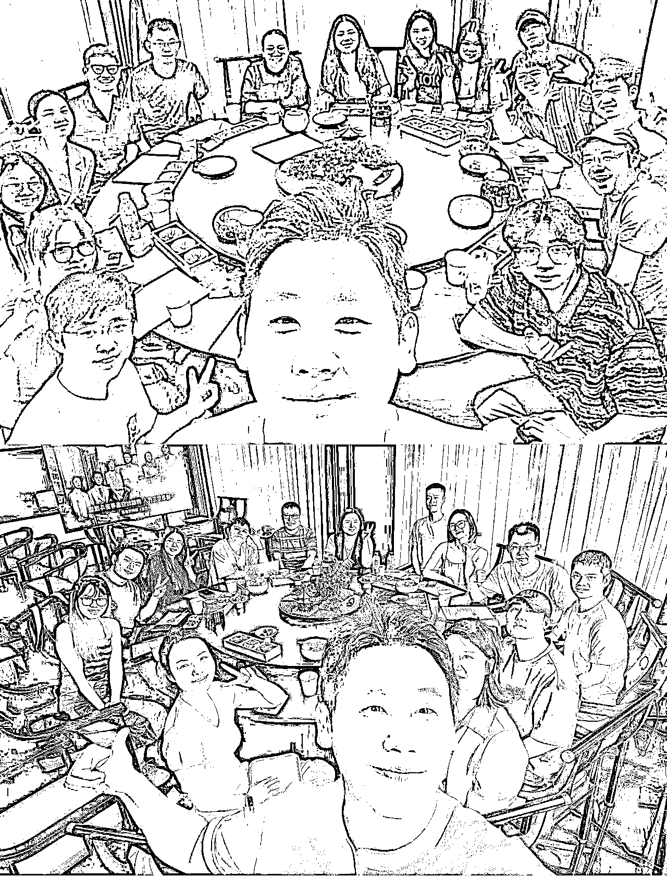
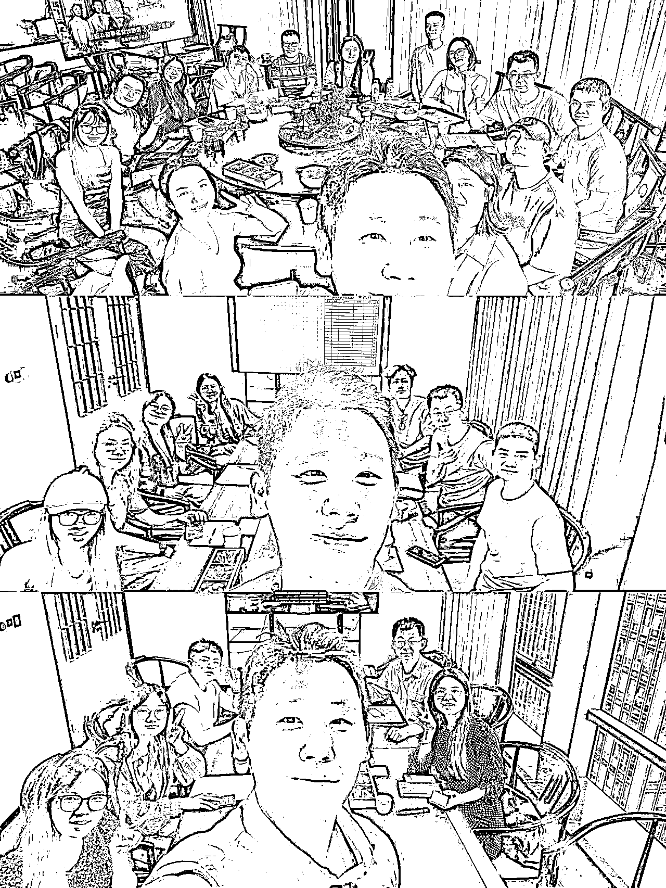
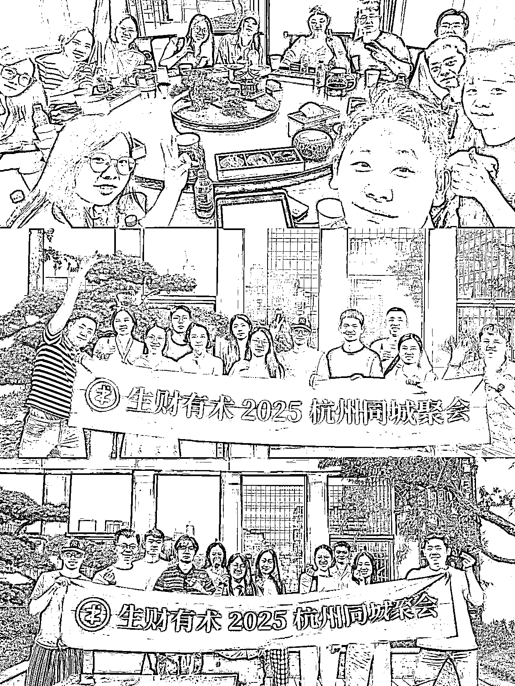
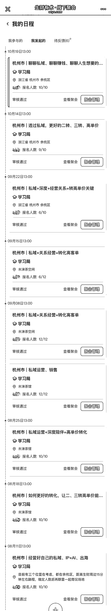
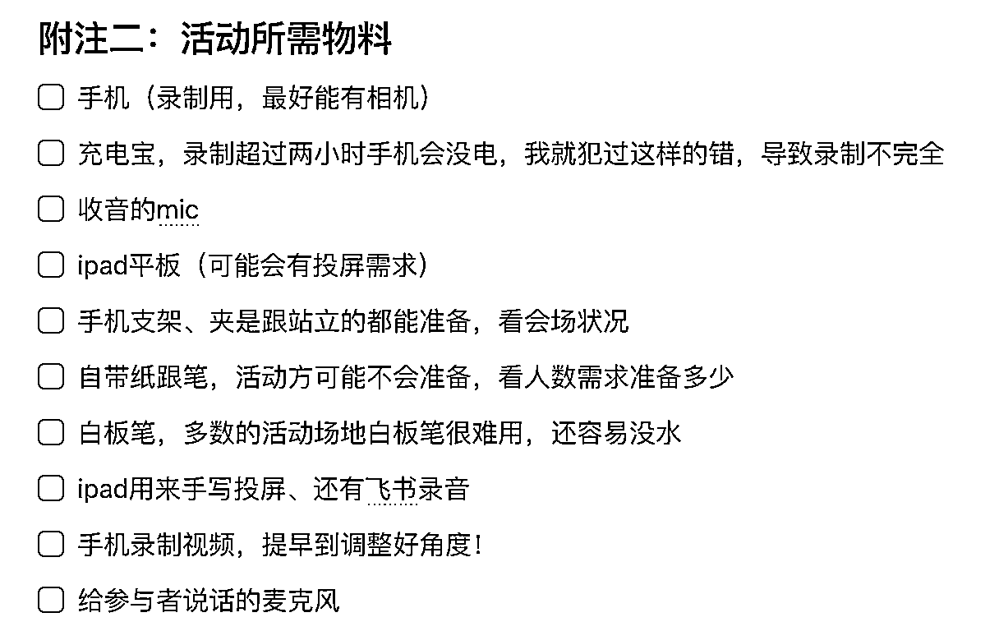

# (精华帖)(34 赞)小型线下活动怎么组：从主题选择到活动控场、细节的全流程

> 原文：[`www.yuque.com/for_lazy/zhoubao/gm8ehgfbomb6z4re`](https://www.yuque.com/for_lazy/zhoubao/gm8ehgfbomb6z4re)

## (精华帖)(34 赞)小型线下活动怎么组：从主题选择到活动控场、细节的全流程

作者： 根源

日期：2025-10-24

圈友们好，我是根源。
这两年，生财也有了专属的组局版块，让圈友线下链接变得更简单、便利，也让我们能因为这个版块，彼此的感情还有交流都更多元丰富，特别荣幸自己是一位生财圈友，每年都可以在这样的环境中，享受到更新之后的好多好多环境红利。
从 2018 年到现在，当时为了透过线下认识更多的新朋友，参加了近百场活动，从一两人的小组局、到千人以上的大场 ; 也从参加别人的活动、到自己有能力当主办人。
从今年的 8 月开始，我也给自己设定了每周的组局目标，一周最少组一场线下活动，到这周已经组了 9 场，每一场的效果都还不错，报名的人数几乎场场都满。
如果你也想办一场属于自己组局的活动，这篇文章是我对于的一些分享，希望看完后能对你有些启发。 以下为飞书好读版： [`oee5lr7gsk.feishu.cn/wiki/UWAVwU9K2izhMKkpo3HcxGNonIh?from=from_copylink`](https://oee5lr7gsk.feishu.cn/wiki/UWAVwU9K2izhMKkpo3HcxGNonIh?from=from_copylink)

* * *

评论区：

暂无评论