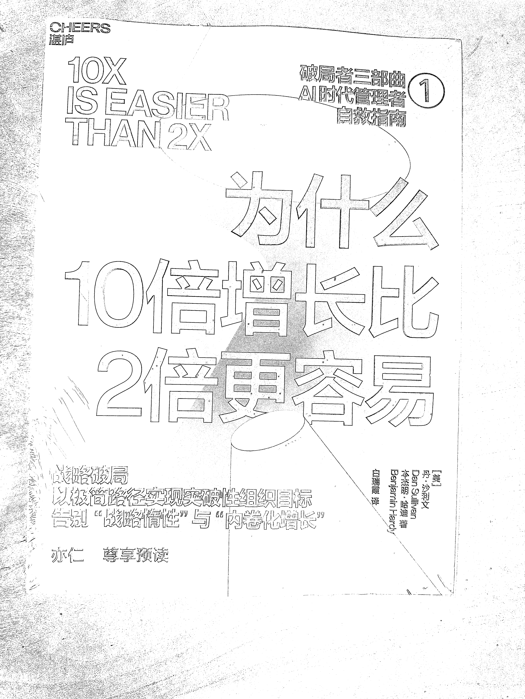
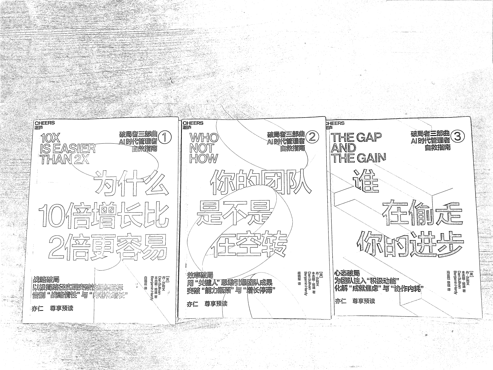

# (189 赞)10x is easier than 2x 中文版终于要上市了，等正式上市后，想组织大家一起共读下

> 原文：[`www.yuque.com/for_lazy/zhoubao/wl0277nymq3kq4gh`](https://www.yuque.com/for_lazy/zhoubao/wl0277nymq3kq4gh)

## (189 赞)10x is easier than 2x 中文版终于要上市了，等正式上市后，想组织大家一起共读下

作者： 亦仁

日期：2025-10-18

10x is easier than 2x 中文版终于要上市了，等正式上市后，想组织大家一起共读下。

* * *

评论区：

草莓冰淇淋 : 期待共读

清木宁 : 期待共读！

L!N/林林/小林 : 原来和台版不是同一个译者，还是白老师一个人翻译的。从目前能查到的资料来看，白老师的译本在读者中
总体反响偏正面：读者觉得译文通顺、能理解、译者专业背景也为其加分。
不过，也缺乏大量细节性、专门针对译文优缺点的评论（比如用词准确性、文化传达、译者音/译风差异等）——即没有大量“这个译本某处译得不佳”“某句翻得特别好”的深入讨论。

文西 : 期待😊

鹿晓晓 : 期待一起共读

龙咖 : 是的，台版才是最好的，容易理解，这个版本明显阉割版，而且逻辑不通顺，推上有人已经预览过，觉得不行

亦仁 : 有能力的直接看英文版，或者用 ai 翻译一个版本。 我个人觉得翻译没那么重要，不是关键重点。

L!N/林林/小林 : 台版甚至可以在博客来、readmoo 看到电子版[捂脸]