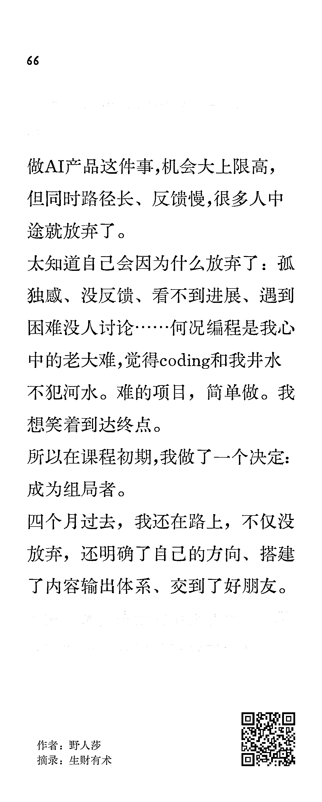

# (34 赞)成长最快的人，往往是那个主动组局的人

> 原文：[`www.yuque.com/for_lazy/zhoubao/ny8r2w12nzfaoiw2`](https://www.yuque.com/for_lazy/zhoubao/ny8r2w12nzfaoiw2)

## (34 赞)成长最快的人，往往是那个主动组局的人

作者： 木木@生财有术

日期：2025-10-11

大家好，我是子安，目前负责线下聚会的运营。
国庆假期看到各地圈友组织了五六十场聚会，大家的热情真高！在这些活动中，我发现一个现象：成长最快的人，往往是那个主动组局的人。 正如
在组局后分享的：“我很清楚，做 AI 产品路径长、反馈慢，一个人很难坚持。所以我决定成为组局者，为自己创造一个能坚持下去的环境。”
为了让大家不虚此行，组局者需要主动思考和学习，不知不觉就成了全场最投入、收获最大的那个人。 而且有一个奇妙的变化：
听到这里，你是不是也有些心动，又有点犹豫？我们完全理解，从“想做”到“去做”，中间往往隔着一些担忧：比如担心自己没经验、怕搞砸、怕冷场。
这些我们都懂，所以我们准备了一个「聚会答疑群」，希望能帮你解决所有顾虑，轻松组织你的第一次聚会。 来到群里，我们会： 1/给你提供更多的组局主题参考和灵感
2/帮你找场地，解答你遇到的所有组局卡点 3/帮你宣导聚会海报，引导更多人报名
如果你在 10 月 15 日前成功组织聚会，还有机会参与会员日获得术值、瓜分龙珠。详情可见： 别再只做参与者了，我们群里见！ [`scys.com/articleDetail/xq_topic/8854548512822252`](https://scys.com/articleDetail/xq_topic/8854548512822252)[`scys.com/meeting`](https://scys.com/meeting)[`t.zsxq.com/dqZUE`](https://t.zsxq.com/dqZUE)

* * *

评论区：

北 : 莎莎的组局超级棒～

bravo : 生财真的是面面俱到，我刚进生财一个多月，期待我的项目能尽快跑通 MVP，然后接着组局

野人莎 : 嘿嘿 明儿继续！

野人莎 : 谢谢子安的推荐！ 说是组局，其实也是喊大家来一起陪我学习。 做项目、学习新事物注定不是轻松的事儿，广结善缘，有一帮朋友共同成长会走得更远。 也推荐给大家！