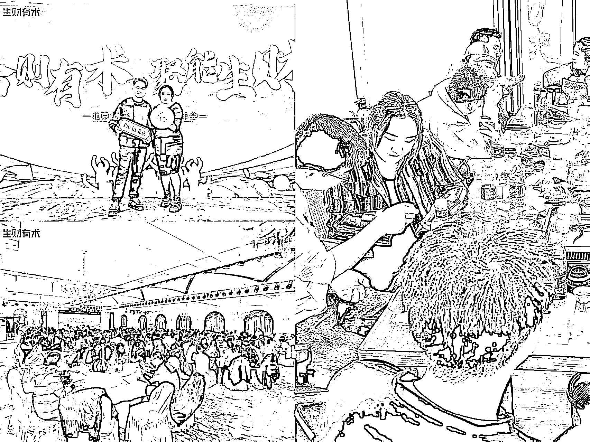

# (52 赞)从上班转型自由职业需满足的五大情况，助你少踩坑少焦虑

> 原文：[`www.yuque.com/for_lazy/zhoubao/detdgfynp5ifdhb3`](https://www.yuque.com/for_lazy/zhoubao/detdgfynp5ifdhb3)

## (52 赞)从上班转型自由职业需满足的五大情况，助你少踩坑少焦虑

作者： 荷包蛋糕哦哦

日期：2025-10-18

圈友们好，我是荷包蛋糕。00 后，目前写作第六年，自由职业第三年，正在搭建属于自己的“人生躺赢系统”。
你是否也曾在忙碌的工作中，偷偷幻想过自由职业的生活？不再受限于朝九晚六的打卡，不再担心老板的眼色，享受自由安排的时间和无尽的可能性。
可是一想到辞职，心里又会泛起一阵阵的焦虑——“我真的能成功吗？”
三年前，我也在这个犹豫不决的漩涡中挣扎，加入生财后，我顺利从上班到自由职业实现了收入的十倍增长。
这篇文章，我为各位宝子分析从上班转型自由职业需要满足的五大情况： 1/ 从攒下第一笔经济缓冲 2/ 找准可被市场验证的技能 3/ 让探索成为成长驱动 4/
如何在波动中稳住内心 5/ 逼自己持续立即落地执行 希望能帮那些同样犹豫的圈友，找到更清晰的方向，少踩坑、少焦虑，用更稳的姿态开启属于自己的自由人生。 [`lv9qj6hfr4z.feishu.cn/wiki/HCeKwrKjHijbUzkVmFpc6rNrnPc?from=from_copylink`](https://lv9qj6hfr4z.feishu.cn/wiki/HCeKwrKjHijbUzkVmFpc6rNrnPc?from=from_copylink)

* * *

评论区：

吴泽承 : 荷包蛋老师优秀[强][强][强]

泽泽｜李泽楠 : 优秀

小宋 : 太优秀了，00 后

荷包蛋糕哦哦 : 感谢宝子的投喂❤️

L!N/林林/小林 : 哈哈哈 周末被截掉了吗

刘智行 : 向荷包蛋老师学习。

荷包蛋糕哦哦 : 好滴宝 加油哦

刘飞 : 很有感觉[强]