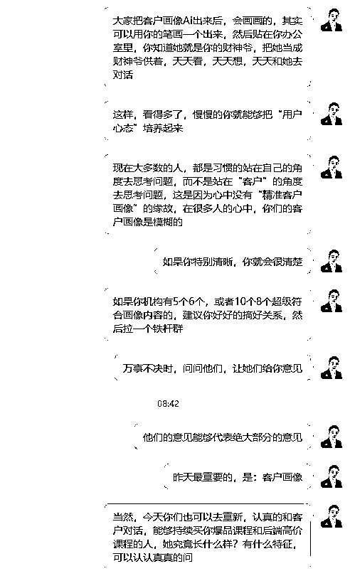
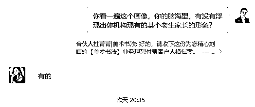
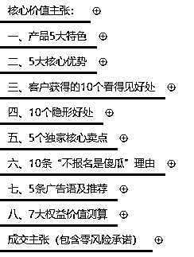
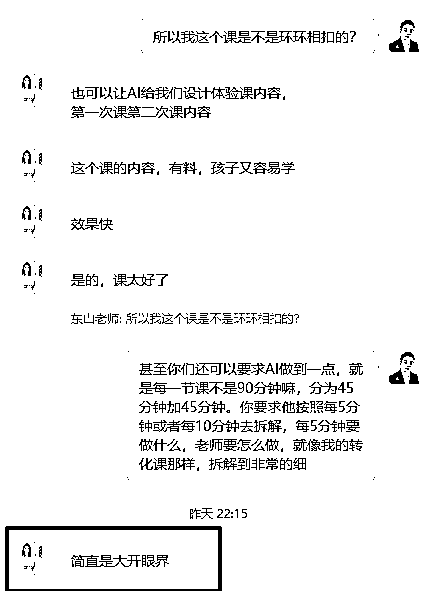

# (精华帖)(195 赞)一人公司想年赚百万，把 5 个 1 挂墙上

> 原文：[`www.yuque.com/for_lazy/zhoubao/imyhpbqpmw5bdtbx`](https://www.yuque.com/for_lazy/zhoubao/imyhpbqpmw5bdtbx)

## (精华帖)(195 赞)一人公司想年赚百万，把 5 个 1 挂墙上

作者： 东山老师

日期：2025-09-28

今天这篇文章，你如果一年已经赚了一千几百万甚至过亿的了，你可以划走了，这不是给你看的；毕竟这篇文章挺长的，有 16000 字左右，看完要花点时间呢。你一年赚那么多钱，你的时间宝贵，浪费在这里不值得。

但如果你想跟我一样：夫妻俩一年赚个一百几十万就心满意足了，那你真的好好看看。

此外，我还希望跟你要对齐一个点：

**我说的一人公司是：那种就靠 1-2 个人，最多带 1-2 个小助理就把事情给做了的小公司。**

不是那种背后有三五十人甚至上百人，然后把“一人公司”当成产品卖的公司。

那种公司，你非说是一人公司，在我当下的认知里，你是说不服我的，我也不想跟你辩，你说的都对。

**01**

**我转型一人公司背后的故事**

* * *

在讲故事之前，先说说我现在每天/每周的工作状态吧，你就知道一人公司是多么的无趣和平淡了。

我基本上每天 8 点钟左右自然醒来，有时早一点，有时会睡到 9 点左右。所以，我一直都发自内心的佩服那些能够五六点就起床干活的老板，我去！我是真的做不到。

正常情况下，我吃完早餐大概 8 点 45 分左右到办公室。（从我家客厅走路到我办公室的茶桌坐下，我对过时间：4 分 50 秒）。

到了办公室后，我一般就是洗茶杯和烧水泡茶，我老婆则是喂鱼和浇花。泡好茶后，我们大概的聊一下今天的工作，到 9 点半前后就开始各自做事。

12 点，老人家在家做好饭后会在群里喊我们回家吃饭，12 点半左右吃完午饭，我就回房间刷一下短视频或者看看微信读书。基本上我每天保持看 1 个小时左右的微信读书，就是靠这个午休前和晚上睡觉前的时间去完成的。

到了 13：15 分左右，莫名其妙就会困的不行，手机一扔准时睡午觉，睡到 1 点 50 分钟自然醒来，有时候也会睡到 2 点半左右，然后起床就来办公室。

下午 2 点左右，来到办公室先泡茶喝，和老婆聊聊天，大概两点半左右开始工作；

4 点钟前后，老人家会去学校接孩子来到办公室，然后她就做作业，我们做自己的事情。

这个时间，我们也会跟孩子进行各种互动，开心的话还会买一些下午茶一起吃。

一般来说，我每周会有 3 次匹克球活动，周二，周五的三点到六点，我都放下工作去打球，孩子也一般都会在这个时间上围棋课。

下午六点，老人家做好饭后我们回去吃晚饭，吃饱饭后休息一下，基本上晚上七点左右，我和老婆以及孩子会一起去练习一个小时的匹克球大约到 8 点。

8 点后，大家想干嘛就干嘛，很多时候我会到办公室喝茶聊天看书或者约球友去打匹克球，我老婆会和她妈妈一起追电视剧，她俩是个电视剧迷来的。

当然，有时候碰上要做交付，我们就会利用晚上八点到十点这个时间做交付。我老婆偶尔也会用这个时间做直播。

晚上 10 点半左右，我一般都看一会书，她刷她的短视频，然后 11 点半左右准时休息。

到了周末，我们一般都是周六，天气好就全家爬山或者逛一个公园。周日上午基本上是去打匹克球，下午或者一起看电影，顺便到处去找好吃的。

最近 2 年来，我们基本上每周都是这样过来的。我们没有朋友，没有闺蜜，没有出差，没有聚会....生活半径基本上就是方圆 1 公里，每天两点一线，日子过的非常的单调，甚至有点.....无聊。

总的来说，我都是比较散漫和偏懒惰的人，散漫和懒惰的代价就是：

**  **

**我们没办法像生财那些大咖一样，一样年赚个一亿几千万甚至 10 亿 8 亿，我们只能仰望和羡慕！**

但我也明白：自古很多事情都难两全，所以这 2 年我们也接受了我们是没有赚到大钱的命了。因此，很多朋友劝我做这个项目做那个项目，我基本上都是拒绝的：我没那个命！

**当然，我们也不是一开始就这样的：**

我 2003 年开始创业，在 2022 年以前 20 年的创业生涯里，我一直都是有团队的，我多的时候也有 300 来个人，少的时候也有小 20 个人。

我们彻底坚决转型为一人公司的模式主要来自于 2022 年 5 月初：我和我老婆一起在安徽合肥被隔离了 7 天。

那 7 天的时间硬生生的给我们忙碌的工作按下了暂停键，也改变了我们的人生轨迹。在那 7 天里，我们关起门来聊了很多，也反思了很多，对于未来，我们也做了很多探讨。

这些年来，我们忙忙碌碌，一直承受着巨大的压力，每天担惊受怕的带着 10 多个招生教练东奔西跑去给机构做招生。钱是赚了一点，但牺牲的也确实很多：

**1：小孩给老人家带，基本上被宠坏了。**

孩子那会才 5 岁多，做事特别磨叽，脾气还大得很，一言不合就满地打滚发癫。可以说好习惯一个没有，坏习惯一大堆，看着我们直挠头！

**2：老人家总是抱怨和数落我们各种不是。**

她们说我们不要家了，把孩子扔给她们，到处去快活。

她们还经常骂我老婆，其实就是骂我，因为她们说我老婆眼瞎了。

在那种情况下，我们除了多给点钱，还要陪着笑脸。

**3：我们自己身体也吃不消。**

由于我们常年东奔西跑，居无定所，一日三餐吃的不准时还很杂，那时我经常胃痛，半夜离经常在酒店痛的死去活来的烙饼，白天就经常困的要命，我一度怀疑是不是得了重病，要挂掉了。

**4：最头疼的是我们夫妻俩感情还非常不好。**

我们有段时间经常见面就吵架，分开又冷战，甚至她还挥舞了九阴白骨爪，吓得我落荒而逃....

到 2022 年，这种情况到了必须要改变的地步，再不改变，后果非常严重。

在那 7 天的深刻讨论，我们彻底明白了：生而为人，是需要背负责任的，尤其是对家庭的责任和对自己的责任。

**1：家庭的责任**

成年人，总是要对家庭负起责任的，尤其是作为男人，不能只是给钱就完事了。

我们需要照顾好照顾老人家，让她们安心，让家庭和睦；

我们需要维护好夫妻关系，只有夫妻关系好，这日子过的才有幸福感；

我们需要持续陪伴孩子成长，孩子不陪伴她会长大，但不见得会成长，孩子在童年时期是无论如何都离不开父母的深入陪伴的，**父母赚多少钱都弥补不了对孩子教育的失败** ；

**2：我们更需要对于自己负责**

我们 70 后这一代是非常具有牺牲精神的，我可以为了家庭有更好的未来去牺牲自己的健康，拼命工作，搞钱，搞钱，搞钱，没完没了的搞钱，搞越来越多的钱。

但我老婆是 90 后，她的认知和我完全不一样，她觉得人来这世间这么一次，当然要对自己好一点。所以她想要的更多......

她想要更丰富的人生体验，要去旅行，要有一些爱好，要吃好吃的，看好看的，玩好玩的....

还要有更好的学习成长，要不断的看书，要持续的去上课，要去拜访大咖，要去接触和实践更多的技能，例如 Ai.....

还要有更好的身体，更多的精力，要运动，要放松，要享受......

我以前总吐槽她：你既要又要还要更要也要，想的真美，菩萨也记不住你这么多的愿望呀。

但现在，我真心觉得她说得对，凭什么不能既要又要还要更要也要呢？

其实，我们以前也知道做人要尽责任，但就是做不到呀，因为尽责任需要满足 2 点：

**1：钱**

这是基本的，这年头，没命可以，没钱真的万万不能呀！

所以我以前拼命的赚钱，一年赚 100 万没有安全感，就想要 300 万，500 万，1000 万.....

创业这个游戏真的会莫名其妙的就追逐上瘾的，真的，不管一年赚多少钱都觉得不够，没个尽头的，至死方休！

我以前总觉得：创业的终点，如果不克制，解决要么哦豁，要么成为老赖。

但赚钱要越多越好这种想法，我现在想通了，我现在觉得一年 50-100 万足够了，省着点花，根本花不完。

我们现在没车贷，没房贷，孩子读公立小学，办公室一个月的成本还不到 4000 块，给 5000 块老人家做伙食费，他们怎么都花不完。

所以，我们真实的生活成本，其实真不高，只是我想要的太多了而已。

**2：需要有足够的时间**

不管是对家庭尽责任还是对自己尽责，都需要有大量的时间才能做到的，否则只能想想而已了。

尤其是对孩子的陪伴和坚持运动和学习成长。好孩子都是花时间陪出来的，好身体也是花时间锻炼出来的。

钱，没了还可以努力去赚，但时间就那么多，赚 10 个亿，老天爷也不可能让你一天有 25 个小时，除非你的表坏了。

所以，为了让我们有更多的时间去对家庭和对自己尽责任，我们在 2022 年 5 月初隔离完毕回到广州后，我们解散了团队，开始践行了一人公司的模式。（当时，我们也不知道这就是所谓的一人公司）

当时，所有人都笑我傻，好端端赚着钱的生意说不干就不干了？闹着玩呢？

尤其当我们长达几个月没有一毛钱收入时，我们也一度怀疑我们自己是不是太傻了点？

到今天，我们践行一人公司 3 年半了，这期间，我踩了无数的弯路，来回折腾了无数次，才慢慢的跑通了一人公司的经营模式。

可以这么说，现在基本上就靠夫妻俩一年赚点小钱，过个小日子问题不大了。

**更重要的收获是：**

1：经过 3 年多的陪伴，孩子变得很乖巧懂事自律了，自驱力很强，基本上不用怎么管。

2：我身体也好了很多，前几天。我连续打 5 个小时的匹克球不觉得很累。

3：更让我开心的是：我和老婆通过不断的磨合和沟通，感情越来越好了，甚至有点找回了当初谈恋爱的感觉。

可以说，近 2 年是我们幸福感最强的时候，虽然，钱确实比以前赚的少了！

以上是我主动选择一人公司背后的故事，不知道对你是否有启发？

如果说你觉得有启发，那再问你一个问题：**你知道对于一人公司来说，最稀缺的资源是什么吗？**

每次我问很多老板，回答什么的都有，说最稀缺的是钱的答案最多。

其实，一人公司最稀缺的资源真的不是钱，而是：**极其有限的时间和注意力。**

如果你真的在践行一人公司的话，你会发现：你扣除为家庭和自己尽责任的时间后，留给自己用来创业的时间是很少的。

这个操蛋的世界，太 TM 的碎片化了，每天的信息扑面而来，很容易让一个创业者迷失。因为，我们并没有那么强的自律性。

别看，我们每天一天忙到晚，看着好努力的样子，其实，在没有人监督的情况下，我们通常不由自主的东搞搞西搞搞，这里看看哪里聊聊，一天下来，真正用来做事的时间少的可怜。

因此，对于真正的一人公司来说，最珍贵的资源就是极度有限的时间和注意力。

**钱花了还能再赚，但时间和注意力一旦被浪费，就永远回不来了。**

在这么有限的时间和注意力下，一人公司如何年赚百万甚至更多，还能留出时间来过日子呢？

我从 2022 年 5 月份践行一人公司至今 3 年半的时间，踩了无数的坑，总结了一人公司年赚百万的 5 个一。

如果你能够坚定不移的践行这 5 个“一”，甚至做成亚克力板钉在墙上，时刻的提醒自己。

你就能把分散的注意力收回来，牢牢锁在最有价值的事情上。你才能实现一人公司年赚百万的小梦想。

**02**

**第 1 个一：定一个超高价，并坚决执行，宁死不降价**

**  **

我评估过 20 多种创业模式，在一个人可支配时间很少的前提下还想赚多点钱，想来想去只有一条路：做超高价超高利润的生意。

什么才算是超高价呢？

我觉得对于一人公司来说：**2-5 万元** 是比较恰当的定价。

低于 2 万，想赚 100 万，服务的人数要增多，忙不过来！

高于 5 万，服务人数虽然少了，但交付的内容和难度就要增大，也不太划算。

我用小学三年级的数学公式演算过：如果我定 2-5 万元的客单价，要年赚百万，大体上服务 30-60 个客户就可以实现了。

我算出答案后发现：这.....？好像也不太难，马上就松了一口气。

为什么？

因为我对于流量就没有那么大的焦虑感了，甚至如果人群足够聚焦和精准的话，我想，搞不好就一千几百个私域客户都可以转化出这几十个客户出来，对吧？

所以，有一段时间，我任性的可以，把私域里近 8000 个客户，删删删删，删到剩下 2000 个左右。

前几天因为西贝贾老板和罗永浩的事件，华与华的华杉也挨了骂。

在这里，我们不讨论华板道歉的对与错的问题，从经营的角度来说，我觉得华板是超级聪明的。

他的客单价是 600 万/年，还要年年续费.....

这么高的价格，一年就算服务 50 个客户，一年就是 3 个亿的收入了，而且他们还不到 200 人，这人效妥妥的！

他为什么要定这么高的价格呢？

除了高价格更赚钱外，其实高价格可以筛选到更容易成功的客户，产生更多的正反馈的案例。

你想呀，一年能轻松的支付 600 万的老板都是什么人？

起码一年营收得 10 亿 8 亿吧？

能做到这个收入的公司本身就做的不错了，也有一点知名度了，重要的是预算也足够。

这时华板再给他们弄一些超级符号和洗脑歌曲，客户再投入大量的预算反复投放，一个非常漂亮的案例就出来了。

我们一人公司做不到一个客户收 600 万，但是收个 2-5 万块，我觉得还是可以的。

但我发现很多一人公司就喜欢定个几百块，甚至一两千块的价格，想着价格低点，成交就容易点，就可以多卖一些，试图用这个策略实现年赚百万。

我觉得特别难，一人公司最大的思维误区，就是迷恋“薄利多销”。

你只有一个人，只有那么一丁点的可支配时间，所以：**基本上薄利是可以的，但是多销，真的很难了** 。

你真的以为，定个低价就好卖吗？

不见得。

低价和高价，客户的决策流程基本是一样的，甚至低价的客户更加难决策，因为对低价感兴趣的客户，基本上没什么钱。

更重要的是：低价的客户支付完毕后，对于服务的要求是一点都不会低的，而且他们的要求更奇葩，更爱各种瞎闹，烦死你！

所以，如果你真的想做一人公司，只能践行超高价的策略。

超高价不仅能让你更赚钱，更能帮你自动筛选掉那些事多、预算少、消耗你注意力的“垃圾客户”，吸引来的都是那些尊重你专业、且能带来高回报的优质客户。

**高价让你自由，低价让你崩溃。**

所以，我在看很多一人公司能否年赚百万时，我只看一点：她有没有能力去成交和做好一个 2-5 万元产品的交付。

真正的一人公司就是通过一年服务 30-60 个客户，实现年赚百万的。

#### 这个常识因为太简单了，真正执行的人并不多。

#### 因为大多数人，总是喜欢“复杂一点”的，觉得复杂一点的，才更靠谱！

**03**

**第 2 个一：聚焦一个非常精准的人群**

**  **

经常有老板跟我说：我也想定 2-5 万块的客单价呀，但问题是：客户不买单呀，怎么办？

**我们只是敲定一个高客单价还不够的，还必须要聚焦于一个配得上这个价格的精准人群。**

只有聚焦一类精准的人群，我们才能更深入的研究他们切身的痛点和需求，才能打磨出独一无二的产品和价值，也就更容易让产品匹配我们的超高价，这才是我配！

否则，如果是产品不好，还要收高价，客户就会喊：我呸！呸，呸，呸了！

所以，人群和高价，其实是相互相成的。

我们要想清楚，我们最想服务的人群是谁呢？如何去筛选和匹配对的人群呢？

这里有一个窍门：**透过交付的本质去筛选匹配的人群。**

**  **

什么叫交付的本质？

举个例子，我们之前的产品一直就是给少儿艺术培训机构提供招生服务。

这个招生服务的交付本质就是：**同城获客** ，具体说来就是用私域裂变发售的流程给所有的同城门店批量销售前端引流品。

基于这个认知，我其实可以服务全中国所有需要前端引流品的实体门店，美业，大健康呀，口腔医院，健身房呀等等前端需要低价引流品再升单的门店老板，我都可以服务，但是我不能这么做。

通过透视交付的本质，你可以有更多的选择，然后在众多的选择里，你选一个你能够搞得定的，你喜欢的，你有擅长的技能去打磨成产品的等等就可以了。

所以，我基于种种判断，我就选了少儿培训机构老板这个垂直的人群，为这一棵小树，放弃了整个森林。

为了支持你更好的选择到好的人群，我给你 2 个标准：

**1：有钱**

**  **

有钱是必须的，我一直都反复的跟我的客户说：我们要赚有钱人的零花钱，而不是穷人家的生活费。

穷人家，他们原本生活已经很艰难了，你要虎口夺食，这是不道德的。

2-5 万元对于真正的有钱人来说就是零花钱，就像大部分人平时花个三五百块一样毫无支付的压力。

我一般要求我的客户一年起码要赚 30 万以上，如果刚起步甚至还亏钱的客户，我一般都是不要的。

同样是 2-5 万元，如果一个人要东凑西凑，甚至借网贷，刷信用卡才能报名，这也太难了，这样的钱，她支付的压力山大，我们收的更是压力山大呀。

这 2 年，我被那些刚起步甚至一直亏钱的穷客户搞怕了，他们有时候提出的问题，真的让人匪夷所思的。

你如果真的想做一人公司的话，尽可能选有钱一点的客户群体去做吧，**我们不是菩萨，普度不了众生** ！

**2：人群越垂直越好**

**  **

因为一人公司一年仅仅需要 30-60 个客户，最多也不过 100 个客户就实现目标了。

在中国，再细分的行当都能找到 100 个客户，所以，我们可以做的越垂直越好。

例如我现在做的是：“少儿培训机构老板”这个人群。

这个人群，向上就是实体门店老板嘛，我们有些同行就是服务所有的实体门店老板的，而我只选择了少儿培训机构深耕；

就算是少儿培训机构，我们聚焦于少儿**艺术** 培训机构，也就是全国那些教孩子学画画，学口才，学舞蹈的培训机构，其他的少儿体育类，少儿科学类做的也比较少；至于 K12 类，补习班类则基本碰都不碰。

我们现在只服务机构现有学员 300 人以上的一二三线城市的单校区单科目的机构老板，我的目标是支持他们用一年的时间突破 500 人，赚到 100 万。

那些刚起步的，100 来个学员上下的，还亏本的，我们基本是婉拒的！

这些年，我真的见过很多人的第一步就错了，总想着我的产品和服务谁都能用，所以总想着不断的扩宽人群。

扩人群的背后往往是**恐惧** ——怕用户太少，活不下来。

但真相是：你越是想服务所有人，就越谁也服务不好，到最后谁都不满意！

因为不同人群的需求、痛点、支付能力完全不同。你企图用一款产品满足所有人，只会做出一个“四不像”的产品，痛点不精准就不够痛！

而且，你在做销售时，你的营销文案和话术就像对着一群人喊话，谁也打动不了。要让营销文案有效果，正确的做法就像给你的情人写情书！

**所以人群越细分，内容越有力。**

越细分，我就越懂他们，我就能说出他们的“行话”，戳中他们最具体的痛处。

我说的话，越对他们的胃口，我的获客成本急剧下降，信任度直线飙升。

我瞬间就从“又一个卖课的”变成了“这个领域的专家”，我就能够进一步的匹配我的超高价定位。

所以，你不妨拿张纸出来，写下这句话：“**我专门帮助【某某地区】【某某行业】【遇到某某问题】的人，解决他们【某个具体】的难题。** ”
写不出来，就别进行下一步。

写出来后，你就需要**把你的一切的力量都对准他进行策划** ：产品设计、内容输出、营销文案、服务体验……甚至你的朋友圈发文，都想象她在看。

我在刚结束的 21 天**【Ai 一人公司创富营】**
的第二阶段的第一天，我就是用 Ai 协助学员去做客户画像，然后再根据客户画像的需求、痛点等去找鱼塘，造诱饵，设鱼钩.....

以前，我们去做精准人群画像定位，大多数都是凭自己的想象或者想当然，甚至会把当下和自己关系很好的人当成精准的客户画像，这都是错误的做法。

现在有了 Ai，有了它背后的大数据，只要能够提供足够清晰的信息和它对话，其实它真的把你的客户画像去做出来的。

如果你正打算开始或优化你的一人公司，不妨现在就拿出纸笔去思考：**我的精准客户，到底是谁？** （写下他的一切细节：年龄、职业、痛点、梦想）

**人群选择，永远都是一人公司创业的第一决策！**

人群选错了，后面的一切都错了！

**04**

**第 3 个 1：围绕精准人群的一个巨大的痛点和需求**

**去打磨一个会员产品**

我们通过深度分析：明确我们想要年赚百万，必须要走高客单的路线，同时也为这个高客单匹配了我们想要服务的精准人群。

当我们聚焦于一个非常垂直的人群后，你会发现她有很多很多的需求和痛点。

例如我们定位的少儿培训机构老板这个人群，她就有：获客的需求，团队管理的需求，课程体系的需求，做大做强赚大钱的需求，心力提升的需求.....

她有那么多的需求，我就要搞清楚，我能彻底支持他们搞定那一个需求呢？然后这个需求又可以让她很轻松的交 2-5 万元呢？

在这一点上，我是持续的迭代的：

1：2022 年，我们刚转型那会只是解决他们招生获客的需求，我们有一套打磨近 100 遍的线上裂变 SOP，基本上只要按照去做，都会有效果。

2：2023 年底，我们逐渐发现：很多客户招不到更多的新生，或者获客难得要死，跟他们的团队，自己的认知，生意模式等都有很大的关系，我们就提出了支持他们开一家年赚百万的小而美机构的主张。

我就跟风做了一个 10 年制的【小而美校长合伙人】，定价 14900 元，招募了半年多，大概招了 50 多个人后，就发现不对劲，就停止招募了，创业 23 年来，我做过很多蠢事，但最让我后悔和懊恼的，就是跟风做了这个 10 年制的产品。

这 50 多个人里，经过 2 年多的浸泡和咨询陪跑等，也有 10 来个客户老板从差点要倒闭到去年就年赚百万了。也有 20%左右的成材率，虽然离我我预期相差很远，但也是证明了我们的方法是有效的。

3：2024 年底到现在，Ai 彻底流行，我就寻思着用 Ai 去支持更多的客户实现单校区单科目年赚百万。

今年我大概花了 6 个月的时间，重新打磨了一个新的产品：Ai 百万机构计划。

用 Ai 把前面那个后悔的要死的合伙人产品改为年费制的，更加容易落地的产品，收费比那个还要贵一倍。

我把我这个经历说出来，希望你明白：**我们永远垂直的是人群，但人群的需求是随着时势的变化而变化的，我们也要与时俱进，没有一劳永逸的事情。**

再讲一个我踩过的巨坑：我践行一人公司这 3 年半的时间里，最大的误区和踩过的最大的坑，就是“菩萨心肠，妄想改变客户的命运”。

这个坑，让我一度特别的内耗，压抑和亏钱，甚至想放弃这个人群。

刚开始时，我们其实很简单的，就是从“帮”她们招生转型为“教”她们做招生活动；授之以鱼不如授之以渔嘛！

但做着做着，就变味了：原本只是做招生的，结果到最后变成了“支持他们搞定私域流量，搞定批量招生，搞定批量转化，还搞定信任培育”。

每一个节点我又都打磨了线下课和线上课，还写了书，又开训练营，还要带陪跑…

在 2023 年，甚至带批量招生陪跑后，还教大家如何解决日拱一卒的招生，去教大家地推，做自媒体，发朋友圈，拍短视频，做社群裂变，做直播招生，写公众号.....

一个一人公司生生搞出了一个大公司的产品矩阵出来，我不但没有改变他们的命运，差点把我自己的命都革了：产品多了，物料就要多，物料多了，宣传就要多。有时候一天发 6 条朋友圈，你都不知道今天要卖那个产品....

一个客户过来，我直接抛给她一个产品矩阵，那种感觉就像去到沙县小吃店一样，一抬头：我艹，密密麻麻的一大堆.....稍微有点选择困难症的，都头皮发麻了！

这样把我们的精力搞极度分散，每个产品都做得不精，交付累到崩溃，还不是特别赚钱。

后来，我们统计，90%的客户其实还是希望搞定批量招生，他们才懒得学那些虽然有用，但很头疼的问题。

我们才又回到最初的原点：只帮他们搞定获客的问题，其他的都不搞了，整个人的状态才好起来。

你的超高价产品，凭什么卖这么贵？

**凭的就是你解决了对方一个“不解决就浑身难受”的真问题。**

很多产品之所以卖不动超高价，是因为它解决的是一种“**锦上添花** ”的需求，是可选项。

而真正的高价产品，是“**雪中送炭** ”，是刚需，是马上有正反馈，是直接给，而不是让她慢慢学！

所以，我们要把客户最大的痛点和需求像锥子一样把它描述出来。比如：

不是“让你身材更好”，而是“帮你产后 6 个月，精准减掉腰腹赘肉，穿回产前的裤子”。

不是“提升你的品牌形象”，而是“帮你下个季度在小红书渠道，带来 500 个精准客户咨询”。

不是“支持你打造 IP”，而是“用 AI 支持一人公司做公域获客，私域成交，每年赚 100 万”

每个客户群体都有各种各样的需求和痛点，只有最迫切的需求和最痛的痛点，他们才会爽快的交钱，这个是很重要的点。

讲完了痛点，下面我讲讲对于一个好产品的标准或者是建议吧，我想分享 4 个我心目中的好产品的标准：

**第 1 个标准：高价值**

我一般都会估算：我至少能给客户提供**10 倍的价值，才定 1 倍** 的价格，也就是我收费 2 万的话，我起码担保能够给他们提供 20 万的价值，我做零风险承诺，都以这个为标杆的。

我现在对客户数量的需求没那么大，在成交客户上还是有点作的：我不会刻意的去逼单，甚至是你爱来不来，更甚至是你要来我还要审核才行，因为我被一些垃圾客户搞怕了。

这么作，还要挑选客户，更多的就是靠价值吸引，所以我一直以来，都特别重视价值感的描述。有 2 个点：

1）我提供的产品本身的价值就很大，我任何的产品都有零风险承诺，我对我的产品有底气。

2）我会进行全方位的价值包装，这个才是我和其他人最大的区别点。

所谓的价值包装，基本上就是：**产品的特色，优势，好处（看得见的好处+看不见的隐形好处），独一无二的卖点，10 条以上的购买理由，成交主张，排他主张，品牌主张，价值主张，广告语** 等，要形成一套环环相扣的物料。

我每次打磨我自己的产品或者协助客户打磨他们的产品时，都会花很多很多的时间在这一块。

**第 2 个标准：能够批量交付**

好的产品最好是能够批量交付的，如果需要一对一交付，或者咨询什么的，最多也就是一个客户一次就好了，否则，我们做不了 2 年这个一人公司就要哦豁了！

一人公司虽然看起来一年只服务 30-60 个客户，但毕竟是一人公司呀，一个一个客户的做咨询+陪跑式服务，那你的时间都要被消耗在这里了。

如果命不好，再碰上几个傻逼客户，天天问东问西，问完又内耗半天不行动的，最后还来骂你的甚至还去投诉你的，碰到 3-5 个这种垃圾客户，你想死的心都有了。

所以，一对一不是不行，那就要收费 50 万一个，这样一年收 2-3 个就可以了，那随便你问。

如果是定价 2-5 万，必须是批量交付的，否则是很难持续性发展的。

**第 3 个标准：要能够续费，且续费率要高的**

一人公司打磨的产品必须要有续费率的，续费率尽量高一点。

有些生意天然就没什么续费的，例如：志愿填报，房产中介，出国留学等，基本上都是一次性生意居多，这种就需要死磕转介绍；

我个人是不太喜欢做一次性交易的，这样就意味着我每年、每个月都要持续不断的开发新客户，没有新客户进来就断粮了，那样的生意，我觉得太累了。

但这个产品如果能够续费就不一样了，我们第一年开发了 60 个客户，第二年有 60%以上的续费率，那第二年我们其实只需要开发 30 多个新客户就可以了，你会发现完全没有压力。

而且随着 IP 的持续打造，内容持续的铺垫，每年客户数量的持续增加，我到了第三年，第四年就会越来越轻松。

只要一个产品有高续费率和比较好的转介绍率，基本上，我们不需要为流量和成交去烦恼，只要做好交付就可以了。

这样的生意做起来，才会轻松很多。

**第 4 个标准：产品要有生命力，续费年限要长**

我希望客户不仅是续费一次，最好是和我们一起持续不断的走下去。

所以，我们要盯紧客户的长需求，对于我们的客户来说，获客和赚钱，就是长需求。

其实对于生财有术也是一样，搞钱就是长需求，所以生财成立 9 年来，超过 5 年续费的人都有很多，亦仁才会在拉新和升单上做的那么的佛系。

如果，我们只是做培训就很难，同样一套课程他来一次，第二次就算是免费复训也不想来了。

我给我的客户最大的贡献，就是教他们去改课程体系和服务体系，支持他们把客户的续费周期从平均的 2.5 年增加到了 5 年左右。

我为什么会后悔那个 10 年制的合伙人产品，因为这个产品基本上杜绝了续费和续费年限，纯纯的是个累死人的活。一次收费，未来 10 年就是纯纯的靠责任心去做交付，太挑战人性了。

如果你打磨的产品能够做到以上 4 点，就算你是一个人去运营，要赚到 100 万也不会太难。

但你要同时做到以上 4 个点，要注意 2 点：

**1：要有事业思维，而非项目思维**

一人公司再小也要有基本的长期主义，就是围绕一个事情，把这个事情持续迭代，持续做到最好。

而不是今天追这个风口，明天追那个风口，今天做这个超级标，明天做那个超级标的思维。

就算要追风口和热度，也请基本上围绕着一个精准的人群去做。

**2：尽量做会员制的模式，而不是产品的模式**

会员制的模式会更有粘性，能够同时把好几个权益打包在内，能够有持续性续费的需求。

而且会员制可以持续的做下去，只需要持续不断的迭代权益就可以了。

一人公司的模式，其实对于流量没有太多的渴求，反而因为是超高客单价，更需要的是信任度和低难度的成交闭环。

**所以，如果我们聚焦一类人群，做好一个核心产品，解决一个核心问题，然后把把它打透、做出口碑，并设定高价，** 就是通过一年服务 30-60 个客户，实现年赚百百万的。

**05**

**第 4 个 1：践行一套最基本的销转闭环**

**  **

我们知道要针对一个极度细分的人群，定一个超高的价格，同时也围绕人群的一个大痛点和需求，做了一个有价值的能够持续续费的产品....下一步干什么呢？

下一步就是：把这个产品卖出去，尽快招到那该死的 30-60 个客户，对吧？

毕竟，**说一千道一万，没有客户是零蛋** ，对吧？

那怎么做到呢？

我们要打磨一套能循环的，轻运营的销转闭环？

什么叫销转闭环？

**也就是让客户从公域认识你，到关注你，到买你的引流品，到成交你的高价产品的链路。**

说起引流获客，对于很多一人公司来说，我觉得有一个词很毒，听起来超有道理，但实质上毫无道理。

这个词就是**“矩阵”！**

互联网人最爱讲矩阵，账号矩阵，流量矩阵，产品矩阵，Ai 矩阵.....

搞那么多，那是真努力呀，但有效果吗？

基本上没有！

我每次看到一些老板基本上都是：公众号，短视频，直播，朋友圈，社群，小红书，抖音等全部都去做.....

甚至还要每个平台再去弄一百几十个账号做矩阵，做矩阵还不够，还要搞内容工厂，上 Ai 工作流.......

这种看似很轻松的活，我想背后都会有点累。

**很多时候，我们走着走着，就忘记了当初为什么要出发** ，动不动就上 AI，上工作流，搞矩阵，多平台发。常常为了做内容而做内容，为了做爆款而做爆款，而忘记了：我们忙活半天，只是为了要找到属于我们那 30-60 个客户而已。

所以，除非他们不是一人公司，而是养着几十号员工的小团队，有人专门做账号，有人专门承接私域和谈单等等。

如果是一个人的话，千万别想着公众号、视频号、小红书、B 站、抖音全面铺开，每个平台还要做 3-5 个号，甚至更多。然后再弄七八个微信，你管都管不过来……

你拉一个表格看看，你每天要做多少东西了？这样你会被内容创作彻底拖垮，耗尽所有注意力。

我见到身边的很多一人公司，基本上都是只打造一个简单、可重复、几乎能自动运转销转小闭环的。

怎么说？我举几个例子你就明白了：

1：我身边有一些老板，基本上就是每天写公众号文章，然后导流私域，做一个基本的成交，然后慢慢的做升单。

2：我身边有一些老板，基本上就是到处混群，混圈子，聊天，然后加好友，做一些基本的成交，然后慢慢的升单。

3：我身边有一些老板，基本上就是做各种分销，和其他人开发产品，一起卖，然后分钱。

4：我身边有些老板，基本上都是坚持做直播，然后卖低价课，通过交付低价课做做高价成交。

5：我身边有些老板，就只拍短视频，然后引流私域，卖线下课和陪跑。

6：我身边还有一些老板，每年写 1-2 本书，然后做发售，通过发售引流到社群和私域，慢慢的升单。

7：我身边有老板只做好朋友圈和转介绍，把转介绍做到极致......

你看，以上任何一个销转闭环，都有人实现了年赚百万，甚至好几百万，上千万。

但这时候如果有个大聪明说：我要是把 1-7 的方法都做一遍，再加以矩阵化，加上 AI，加上工作流，那不是起飞了？

我告诉你，你把其中的 1-2 个做好就已经非常了不起了，如果 1-7 项都做，起飞不起飞，我真的不知道，但我知道，你一定会被累死。

因为，你不是神仙，你不可能顾得过来的！

当然，你会说：我可以招人去做呀.....抱歉，我们说的不是一码事！

结合当下大部分一人公司的老板或者是门店老板的现状，如果能有一种办法兼顾现在和未来，而且未来会越来越轻松的实现引流和转化的，我个人认为比较妥当的办法就是 3 步骤。

**第一步：用内容把自己变成“专家型 IP”的同时，吸引精准的人群到私域养着。**

为什么要内容开路呢？还是因为人群的原因。

现在的主流客户，他们获取信息的主要渠道就是线上的各种文章，直播，短视频等，用户到哪里，我们就要去到哪里。

我们要频繁的出现在他们的面前，用好的内容打动她，她才会关注到你，信任你，进而咨询你或者直接买一个低价的引流产品。

所以，我们就要以转化高价产品为导向做一个前端的低价引流品，这样就可以直接不做咨询，让客户想链接就直接买低价引流品，不愿意买就算了，这样可以节省大量的时间。

**所以，我们的第二步就是策划一个低价的前端引流品；**

我们做了很多内容，也打造 IP,在客户心目中很有信任度，我们就需要大量的把信任度转化为低价的学员，所以，我们要有一个产品去承接。

低价的训练营，知识星球，社群等都可以做前端引流品，大概就是几块钱到 365 元之间，决策成本不高的。

这个产品有 2 个要点：

**1：策划这个引流品的目的一定是为了转化后面的 2-5 万元的高价产品。**

所以，这个引流品要跟高价产品强关联。

而且，要在交付这个引流品的过程中，创造 2-5 次的让客户主动购买高价品的机会。虽然我们有点作，不逼单，但我们要主动创造机会给客户买！

**2：这个引流品要很有价值感，且能轻松批量交付。**

当然，如果说你很牛逼，不需要有前端，客户一上来要么就直接买 2-5 万元的产品，要么就拉倒。客户愿意的话，那真的挺好。

**第三步：把低价客户变成高价客户**

通过交付低价引流品的过程中，持续不断的成交高价客户。

把低价客户转化高价客户的过程中，尽量采用批量成交的方法，而不是每一个客户都需要一对一的去洽谈成交。

一对一洽谈成交一来要浪费很多时间，二来难免会导致每个客户获得权益不一样，对于后面的维护会很有影响的。

基本上，一人公司的销转闭环就是这 3 个链路，其实第二步和第三步可以合二为一的，因为他们本身也算是一个事情。

我们一般会有日拱一卒的做法和批量发售的做法。

所谓的日拱一卒引流和转化，我现在更多提倡的是：利用直播+短视频+公众号+朋友圈等，实现至少每天招到 5-10 个低价客户，然后集中起来，每个月做 1-2 次交付，然后进行转化的成了。

所谓批量引流和转化的方式，一般就是一年做 1-2 次大事件，用发售的模式，撬动所有力量，一次性的就招募几百个甚至上千个低价会员，然后集中交付进行成交的方式。

基本来说，你想要 1-2 个人一年赚到 100 万，最有效的模式就是死磕：高价产品--Ai 自媒体获客--打磨销转，让转化率去到最高。

按照这个策略去做，甚至做的好的话，一年赚 300 万，500 万，甚至 1000 万也不是什么难事。

例如我的高价产品现在是 29999 元，我采用批量交付的方式，其实交付 50 个和 500 个也没什么两样，那就有了无限的空间了。

我最近就是死劲的打磨直播获客的模式，通过投流循环直播，不断的打磨脚本，一场直播能够招到 50 个左右的低价引流品，然后再集中进行转化，这样的销转闭环就非常简单了。

你想：如果你能锁定精准的人群和一个大痛点大需求，策划一个独一无二的，超高价值的高价产品。

以转化为导向策划，一年做 2-4 次批量发售，每次招到 500-1000 个低价引流客户，按照 5-10%的转化率去做转化。

平时再坚持直播或者拍视频，一天捡那么 5-20 个引流品学员，一个月集中交付一次再成交，一年赚 100 万，难吗？

一点都不难。

我把这一套玩法基本上打通了，下一步我也准备把少儿教培的这个项目丢给我老婆，我协助她就可以。她能彻底独立后，我就可以每天抽出 1-2 个小时来做一人公司的项目，说不定我们夫妻俩一人一个一人公司，更加自由了。

但是，在我们的经验里，在跑销转闭环的期间，最大的挑战不是成交和获客，最大的挑战是“失焦”。

因为，在这个过程中，会不断的有人跟你说“这个赛道/那个平台现在很火，有红利，你不做就亏了！”。

听得多了，人就容易犯糊涂，真听话的话，那才是真的亏了。

所以，如果你真的想做一个轻松一点的一人公司，那必须要有定力，死死守住你这套已经验证有效的系统，除非有颠覆性的变化，否则绝不轻易更换赛道和销转闭环。

**对于真正的一人公司来说，拒绝的能量，往往比吸收的能量更重要，切记切记！**

**  **

**06**

**第 5 个 1：打磨一套标准的交付体系**

**  **

当我们持续的做内容--引流--成交这个销转闭环时，我们当然会获得一定数量的客户，这时，我们更重要的是要打磨一套：标准交付和产品迭代的体系。

我觉得这个交付和产品迭代打磨，真的比引流成交还重要，交付和磨产品也是我做一人公司花时间最多的地方。因为，我一直都觉得：产品和交付是比引流和成交更重要的。

关于交付，一定要打磨一套标准的交付体系，千万千万千万不要陷入一对一的个性化交付，除非是 50 万以上的超超高价。

我们承诺的产品权益是什么就给什么就可以了，偶尔可以再多给一点点也无妨，但真没必要刻意的去给太多：

一来每一次的交付，本质上都是消耗你的时间和精力。

二来，给的太多，他们就想要的更多。不要问我为什么？因为我全都踩过坑。

但就算是基本的标准交付，很多人都做不好的，这些年我买了很多 5 位数的知识产品，交付真的一言难尽，虽然我不会跟他们闹退费，但基本上再也不相信他们了。

真的很多人的终点就是把你忽悠到这一步，然后也不指望你续费和转介绍了，俗称：割韭菜！

为什么我那么在意交付，因为做好交付可以有 4 个好处：

**1：通过交付做案例**

做好交付的过程，就是做案例的过程。

通过持续不断的交付和互动，你会发现会有 20%以上的客户是更具有行动力和资质的。

这是，我们自己可以稍微倾斜一点，支持他们把结果做出来，再通过公开分享的方式，让她们成为我们的案例。

**2：通过案例促成交**

当我们呈现出来的案例越来越多，而且人群都是和准客户们一致，就会有更多的客户主动报名或者咨询，就可以走向正向循环，业务越做越顺。

**3：通过正反馈激活续费**

通过持续性的交付，支持他们拿到 10 倍的收获，他们拿到的正反馈越多就越是愿意续费，而且有越来越多的案例之后，大家的续费意愿会更加强烈，一些人就愿意持续性的续费下去，续 2 年，3 年，5 年以上.

续费和转介绍，是最舒服的获客方式，也是利润最高的生意模式。

**4：通过做交付去做口碑传播**

我们把一个人打磨变成了标准案例，她也配合我们去宣传和分享，那么对于她来要给我们做转介绍就越容易，我们也就取得了转介绍的正循环。

因此，交付体系是真的马虎不得，如果不做好交付，没有持续不断的案例出来，你的一人公司是绝对做不久的。

如果一个生意，需要每年，每个月，每天都不断的去获取新客户，这个生意做的真累，真的手停口停，那还是不要做了，太累了。

**07：**

**一人公司，如何做的更少，还能做的更好**

**  **

我们简单复盘一下，看到这，如果你也想一个人或者夫妻档就实现年赚百万甚至更多，且有更多的时间去照顾家庭，陪伴孩子，养好自己的身体和成长等，需要做到 5 个 1，具体就是：

**1：定一个超高的价格**

* * *

**2：聚焦一个精准的人群**

* * *

**3：围绕客户一个巨大的痛点和需求去打磨一个会员型的产品**

* * *

**4：做好一套销转闭环**

* * *

**5：做好一套标准的交付体系**

这“5 个 1”是一个环环相扣的整体，它不是教你如何“做得更多”，而是教你如何 **“做得更少，但更好”，能够就依靠 1-2 个人赚到 100 万，甚至 300 万，500 万....**

**  **

**我在刚转型那会，我也不知道我的模式是一人公司模式，只是在 2023 年后，这个概念才慢慢的火起来的。**

**  **

**说真的，那几年，要真正靠一个人去赚很多钱，还要很悠闲，** 说真的：总感觉有点白日做梦一样！

**幸好，现在有了 Ai；**

**  **

AI 可以支持我们把一人公司的经营小闭环，也就是：产品打磨---内容流量---成交转化等环节进行全方位的提升。

例如，在我 21 天【Ai 一人公司创富训练营】的第二天，我现场用 Ai 结合学员的项目去打造爆款引流品；

每一步都讲解底层逻辑，提问背后的底层思维，和 Ai 互动的要点等等，每一步都截图去证明，大家一边跟着我一起去用 Ai，下课就有了非常多新颖且有效的引流品主题和交付内容。甚至产品的定价，销转流程，海报设计框架等，Ai 都能安排的明明白白的。

基本上，大家都惊叹：我勒个去，原来还可以这么玩.....

全程用 Ai 去赋能，一个人就能够做好一人公司，招募到 50-100 个客户左右，实现年赚 100 万以上，这不是一个不可能实现的模式，梦想已经照进现实。

如果现在想做一人公司，或者你开一个实体店做个体户，做的特别累还没赚到钱，基本上就 3 个问题：

**1：产品实在太同质化了**

**  **

我们要十分清醒的认识到一点：

**基本上经营所有的困难，都是因为“产品和交付的过于同质化”引起的！**

**  **

因为，只要是同质化的产品和交付，那就是“买方”说了算，你就会面临各种嫌弃，各种不在意，各种对比，各种讲价.....

为了让客户掏钱，你不得不更费劲的去获客，更费劲的去谈单：打折，送礼，送大礼....

最后没了利润，然后一切都没了！

如果你溯源到最后，不就是“产品同质化”引起的吗？

例如我们绝大部分的少儿教培机构，基本上都是千篇一律的 9.9 元 1 次课，1680 元 20 次课这样的 XXXX 元 XX 次课的卖时间思维。

卖时间，就是世间上最大的同质化！

因为，不管你怎么定，家长都会换为为：XXX 元 1 节课！

门店倒卖产品的，其实也差不多，最后就全变成：卖环境，卖装修，卖赠品，卖服务等了....

知识付费，其实当大家一窝蜂的卖 9.9 元录播课，然后通过各种手段去追单，这背后投入的人力和物力的损耗，估计自己比财务还清楚。

**2：流量过泛，或者是不稳定**

**  **

我身边很多打着一人公司名义教人的，或者自己把自己当成一人公司的，好多都是“流量主义者或者机会主义者”。

我不认为他们是在践行一人公司，反而更多的觉得就是做副业，或者是踩着风口做个项目而已。

所以才会陷入“大流量”的玩法，甚至为了追求流量无所不用其极，在标题上一堆的噱头和蹭热点，在文章和内容的头图上搞擦边....

一人公司最大的特点就是：时间少，注意力资源少，甚至资金也少....

注定我们服务不了太多的客户，我们其实要的也不多，大约 1000 个左右的精准铁杆粉丝就差不多了。

如果我们一年能够搞到 1000 个低价付费的客户，然后慢慢转化，基本上就够了。

我践行一人公司这些年来，我很少陷入流量焦虑，甚至反常态：经常删人，经常不太理人，前两年，很多生财的好友加我微信，我都是不通过的。

今年被大佬批评了，才通过了一部分，但通过了也极少交流！因为我知道他们不是我的客户，他们来找我：是消耗我的时间和注意力的。我要保护我的时间和注意力，只服务“对”的客户！

所以，我基本不主动加人，只等人来找我，然后我还要筛选....

这听起来有点作，但你真正践行一人公司的商业模式后，你就知道这里面有他的道理。

**第三：转化费劲，或者过于低价，收不起高价**

**  **

一人公司想实现年赚百万，我觉得有 3 个基本法：

**1：赚有钱人的零花钱，而非穷人家的生活费；**

**  **

我老婆的经验是：如果她一开始就直觉觉得这个人有问题的，那就是有问题的；

所以，只有思维同频，认知大概一致，真的愿意为价值买单且付钱爽快的才是好客户。

千万千万千万不要去收那些别人用来救命的钱，或者别人是要透支花呗，信用卡才弄来的钱，我觉得这是不道德的，而且后患无穷！

**2：尽可能的收高价，最终要能收到 5 位数的高价**

**  **

我认识蛮多的博主和实体门店老板（尤其是教培机构老板），说真心话，我觉得他们的产品和服务都挺不错的，就是收费太低了。

长期在几十块，两三百块的价格里打转转....

这样就算累死了也很赚到钱的，赚不到钱就会心慌慌，心慌慌就会乱来：做好多个项目，和很多人合作（其实就是卖他们的产品赚点提成），最后累死。

**3：需要确保持续的续费和升单**

**  **

这个我认为是无比的重要的，如果你有那么三五十个铁杆客户，无论你卖什么她都报名，而且持续一年，两年，三年，四年，甚至十年八年都续费...你过得比李嘉诚都还舒服！

要做到这 3 点，你就需要用心的布局你的转销体系，很多人说到成交，就理解为：话术，逼单....这也太....那个 ！

我很庆幸能够生活在这个年代，我自己也非常有信心，借助 AI 的赋能，我们夫妻俩在 2026 年，有机会突破我们的收入瓶颈，不仅仅是现在的 100 万，甚至是 10x 增长也不是不可能的，而且还会比以前更轻松。

毕竟，一人公司的**终极追求就是：用更少的工作时间，换取更自由的生活和更高的收入。让自己有更多的时间对家庭尽责任，对自己的人生负责任！**

**  **

**我们一起加油！**

**  **

**  **

* * *

评论区：

小沐 : [呲牙]几年制的合伙人产品就是个深坑，被割的人应该已经非常多了，搅浑了知识付费的市场。 总有很多人想的美好，甚至付费了就等于学会了。
现在不用，总觉得以后会去用。 事实上，根本不存在的。 而这类型产品的主理人，通常也会有个共性，割 8 成的韭菜，交付 2 成的 kol（有两成都算良心的产品了）
而这 2 成 kol 是因为这个产品才牛吗？并不是，是他们本身就牛逼。 这套体系迟早会大规模暴雷，时间早晚的区别。
东山老师有提到有责任心的人会去好好交付，这个责任心我觉得应该是建立在一开始招人的时候。
而不是一开始招摇撞骗，把人骗进来以后，用户发现匹配度不高，不适合自己，然后就消失了。 主理人再冠冕堂皇的撇清责任：是他们自己不主动，而不是我不负责任。

房顺 : 牛🐮

❤高权 Mr❤ : 太干了，谢谢分享

摄影师海盐 : 东山老师出手就是精华，太棒了！！学到了好多一人公司的作产品思维呀。

一介凡人 : 全部都看完了，关于 05 板块的第 4 个 1 的第二步的第 2 点，“这个引流品要很有价值感，且能轻松批量交付”这里，不太明白，望大佬答疑解惑，小弟感激不尽[抱拳][抱拳]

不系之舟 : 全部看完，很有收获，谢谢老师分享

东山老师 : 引流品存在的目的是为了升单，他就需要实现 2 个基本功能： 1：前端能够大量的获客 例如 1 天 300 人，500 人，所以价值感不大，就难实现目标。 2：轻松交付
当你遇到一天能够有 100 人，200 人的引流品找到你的时候，你就知道了。 所以很多人都是批量交付，极少一对一的跟单。因为跟不过来。

一介凡人 : 精辟！明白了🫡感谢东哥！