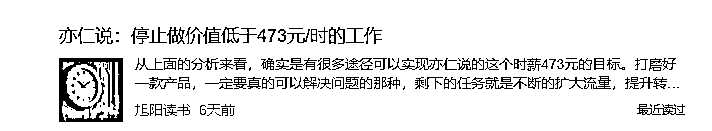

# (90 赞)别再自欺欺人了：一人公司创业，拼的不是努力，是“注意力税”的逃税能力

> 原文：[`www.yuque.com/for_lazy/zhoubao/ei4ux49vpg5q7pe0`](https://www.yuque.com/for_lazy/zhoubao/ei4ux49vpg5q7pe0)

## (90 赞)别再自欺欺人了：一人公司创业，拼的不是努力，是“注意力税”的逃税能力

作者： 东山老师

日期：2025-10-02

**我接触过许多个体创业者，他们之间存在着显著差异：有的一人公司仅凭 1-2 人，年收入便能突破千万大关，而更多的一人公司创业者，他们虽投入了远超上班的时间，收入却仅比打工时略高一点而已。**

为什么收入差距会那么大呢？

### **看似是收入的悬殊，实则是注意力分配的博弈。**

近几年，我对无数的客户和朋友提过醒：真没必要把所有的风口都做一遍，更没有必要把所有的航海都学一遍，甚至不是每个所谓的好机会，你都需要参与的。

因为，对于一人公司的创业者来说：**我们最宝贵的不是钱，也不是时间，而是极其稀缺的注意力** 。

### **01 财务自由后，就真的自由了吗？**

很多人从公司上班到跳出来自己创业，内心都会有一个追逐的目标，就是：我要实现财务自由。

还有财务自由后那句：‘等老子财务自由了，就……’的憧憬画面。

正是这个目标和期待的画面感激励着我们披荆斩棘，熬夜，奔波，为此乐此不疲。

但是，我们是否真正思考过：何为财务自由？

**财务自由意味着个人拥有足够的被动收入来维持其现有生活水平，无需继续工作，从而有更多的时间和精力去追求个人兴趣和享受生活。**

但，财务自由之后呢？

就真的永远自由了吗？

我有个老乡，2010 年前后，恰逢一款名为“无缝壁画”的产品风靡市场，他敏锐地捕捉到这个商机，与兄弟合伙购置机器，夜以继日地印刷这款产品。

三年多下来，他不仅在东莞购置了房产和车辆，还在老家盖起了一栋六层高的楼房。那几年，对这个农村小伙而言，确实赚得盆满钵满。

后来，整个村子的人都争相效仿，越来越多的人涌入这个行业。

随着竞争加剧，这行变得愈发难做。到了 2017 年前后，无缝壁画的价格一落千丈，较之初时跌了十倍。

然后就很多人开始转型水晶框画，集成墙板等。

这兄弟俩并未选择转型，而是在 2018 年卖掉了机器，随后又将东莞的房子变卖，回到了老家，准备投资奇楠和乌龟养殖。

去年春节，我回到老家，看到他们整天与一群留守妇女打牌，或是没日没夜地打游戏，不由得摇头叹息。而所谓的养殖业，也是看到各种不太利好的消息而不敢动手。

许多人实现初步财务自由后，往往会陷入一个新的困境：既有钱又有闲，该如何消磨这些时光呢？

难道要这样浑浑噩噩地虚度一生吗？

他们兄弟俩就是这样，有了点钱便得意忘形，染上了各种恶习：整天打牌，赌注还不小，甚至还……

**其实，拥有这种思维模式的人，若非依靠自身能力赚钱，便难以拥有持续的被动收入来覆盖支出。**

**财富是认知的变现，凭运气挣来的，最终会凭实力亏出去。**

因为他们的思维模式无法支撑真正的自由。

如果有经历过 10 年以上的创业周期，我们观察身边的很多创业者就知道：太多的人赚到几百万和上千万，几年后不但亏光，甚至还背负了一屁股债的。

有时候，很多人真的是就是凭借时代的红利和运气，有那么三五年赚了不少的钱，但他没有把所有的注意力放在这个主业上，导致时代红利消失后，主业开始不赚钱，而之前瞎投资的各种项目也不赚钱，一下子就开始跌落神坛了。

### **02 注意力，是创业最稀缺的资源**

自 2003 年创业以来，我 这些年着实见过一些真正实现“自由”的人，

对大多数人而言，拥有 10 亿资产及数栋收租楼宇，年租金收益超千万，即可视为财务自由。

但对于这些真正“自由”了的人，他们节省下来的时间会用来做什么呢？

我见过好几个这样的大佬：他们会搭建商学院体系，扩大自己的人脉圈子，用钱来投资更多的创业者，每个都占点原始股份……他们会围绕自己的基业，从各个维度持续不断地建立更深的护城河。

我们常说，**对创业者而言，稀缺的不是资金，而是宝贵的时间与注意力。**

其实进一步而言，时间本身并无多少价值，从严格意义上讲，**唯一有价值的只有注意力。**

所以，创业者必须高度聚焦于专注的事业，从而拉开与竞争者的差距，获得超额利润，实现更长久的“自由”。

“自由”后节省的时间，让你能更专注地思考和优化自己的模型与事业，而不是我们普通人理解的天天去旅游，吃了睡，睡了吃！

**如此，我们打造的是一个“自由”的正向循环。**

所以说，对于创业者来说，尤其是一人公司的创业者，我们归根结底，值钱的是：注意力。

将所有注意力集中在主业上，就越容易在竞争中构建起一个正循环。

而那些分散你注意力的琐事，都需要警惕。

我以前在中山小榄，认识一个亿万富翁，每次去他那里，到了饭点都是去他们的“饭堂”吃饭。

说是“饭堂”，实则是本地一家昂贵的私房菜餐厅，这个私房菜餐厅没有固定的菜单，每天吃什么，由主厨当日决定。而且，还死贵死贵的，我们通常就 3-4 个人，费用就要近千元。

但他完全不管这些，每次吃完即走，到了月底，这个餐厅老板集中起来去他公司统一结账。

有一次，他跟我说了一句很有道理的话：“别看我们吃这么贵，其实一点都不贵。”

倒不是因为他有钱，而是相比而言，他在这一点上消耗的时间确实不值。

像亦仁说的这句话，我就觉得很有道理，当你一个小时能够赚到四五百块，你花时间去做那些几十块的事情，就是对你时间和注意力的不尊重。

所以，我这个大哥，他不曾在“吃什么”上浪费一丁点时间，对他而言，而是用一点点钱就解决了高质量、无需操心、节省注意力的一顿饭。

而且这个地方环境非常好，他基本上都是带客人来这里吃饭，80%的生意都是在这里谈成的。

对他而言，**“省心”** 最为重要，因为他的专注力具有更高的价值。

他开一部据说开不坏的丰田塞纳，用是不会卡顿的苹果手机，天天穿一样的灰色 T 恤，他说：“车、手机等物品，稳定胜于一切。”

我跟着他混了 2 年，也学到了很多他的思维。“**注意力，才是创业最重要的资源** ”这句话就是从他那里学到的。

我以前开工厂，开公司，请过很多员工，我发现：大部分员工，不管是基层的操作工也好，还是中高层的主管和经理也罢，他们最大的失误就是，不善于分配自己的注意力。

任由自己有限的时间和注意力如荒野野草般肆意蔓延，一会儿关注哪里下大雨，一会儿操心哪里的房子起火，一会儿又留意哪个明星过生日。

难得有个放假休息的时间，他们基本不会用来看书或钻研提升技能的门道，他们会把难得的休息时间都用来打牌、刷手机、玩游戏、吹牛……他们不仅被各种精神鸦片抢占了极为稀缺的时间，还不断给本就薄弱的意志力增加负担。

当他们的注意力被这些碎片化的即时快感占据，自然就没时间、没精力，也没那份珍贵的注意力去思考能助你跨越阶层的事。

所以，他们一辈子注定只能做天生的牛马！

优秀的创业者和普通牛马最大的区别就是：如何善用时间。

年赚 1000 万，5000 万，甚至几个亿的老板和年赚 20 万-30 万的老板，其实导致大家拉开差距的本质也依然是：

**善用时间，善用注意力。**

### **03 注意力不平等比财富不平等更可怕**

注意力，并不似时间那般，对每个人都一视同仁。

**时间其实对每个人都是公平的，无论贫富，每日皆有二十四小时，** 这是上天对所有人的平等馈赠，不会因你位高权重或富甲一方，便多赐你一时半刻。

人与人之间的差距，常常显现在对时间的运用之上，归根结底，关键在于注意力的合理分配。

注意力，实则是决定一个人生命质量的核心要素。

然而，注意力并非随叫随到，想聚焦便能轻易聚焦的。

**有钱人和普通人即便都活到八十岁，即便时间上是相同的，但二者一生的注意力堪称天差地别。**

有钱人，鲜少将宝贵的时间与注意力浪费在家庭琐事上，他们更倾向于通过购买各类服务，诸如聘请家政等，来优化生活。

他们节省出来的时间和注意力，更多地用来社交和深度阅读，深度思考等。

像我们父母那一辈的普通农民，一生都沉浸在生活的烟火气中，每日为多挣几十元而辛勤劳作，根本无暇也无力去思考如何突破这层‘困境循环’。

所以，穷人家，真的要好几代人才能突破一个圈层，并不是由大家不努力导致的，而是由时间的使用导致的。

我以前也观察过很多我们工厂流水线的操作工，拉长等，他们也是根本就没有意识到要用业余的时间去改变自己。

当他们的注意力被无谓地消耗，无助与痛苦不断累积时，意志力便会迅速跌至谷底，转而寻求即时的慰藉、甜食或任何能立刻获得的快感。

即便他们通过各种加班或努力，每月多赚了几百块工资，也不会用这笔钱去买书，更别提报课了。

甚至我曾集中为他们报了一些课，让他们带薪学习，他们却极不情愿……

他们更愿意用这笔钱去买最新款的手机，甚至去追星。

我去年的助理就是这样，一个刚毕业才 1 年的小女孩，天天拼命花钱追星，各种演唱会都要请假坐飞机去支持……

这并非他们的“劣根性”，而是生活的磨砺已耗尽了他们思考未来的意志。

绝大多数人都在'受罪的一生'中循环：白天累死累活，晚上靠一瓶啤酒和二十集搞笑短剧自我安慰，周而复始。

我有时候看我丈母娘就是这样，小学毕业的她，在广州跟着我们住了好几年了，除了一日三餐外，可以 30 天不下楼，基本上所有的时间都是用来刷那个短剧。

只有一次，我和我老婆半哄着带她去看了《饺子皇后》，她迷茫的眼神似乎绽放过一会儿的光芒。

但也就那么一两天的热乎劲，然后又是无止境地刷视频。

我去年请的一个视频剪辑也差不多是这样的，好端端的一个大学毕业生，每天上班后的一丁点时间，都不愿意去那里学习。

我让她看小红书的精华帖，叫了好几次都不愿意看。

我深知她已难以自拔——她缺乏改变的意愿。

要让她跳出这个泥潭，就意味着她要在承受现有繁重生活的同时，还要抵御内心的渴望，用坚定的意志和集中的注意力开辟出一条新路，从而摆脱当前的困境循环。

对绝大多数人而言，这无疑是一生中巨大的挑战。

### **04 做好一人公司的核心：注意力开源节流**

我曾在无数场合强调过：对于真正的一人公司而言，一天中能全身心投入工作的时间其实非常有限。

任何可能分散你注意力的无用之事，都是你的劲敌。对于一人公司创业者而言，这一点尤为重要。

一人公司的最大优势在于灵活与专注，而所谓的专注，正是没有管理上的心力消耗。但最大的劣势在于资源有限，同时享有自由，无人约束，也无人监管，全凭自觉。

因此，作为一人公司的创业者，如何有效管理和分配注意力，便成为成功的关键所在。

于是，我索性将办公室设在家门口，步行仅需五分钟，如此便能避免通勤所消耗的大量精力。我每天都准时在家享用三餐，若不出门，一年四季都是拖鞋配大裤衩和 T 恤，从不费心于搭配。

甚至，我直接把车都扔回老家了，现在出门就滴滴，或者坐地铁，空出来的时间也是用来看书。因为开车于我而言，每次都极为消耗注意力，尤其在广州，停车之难，简直令人头疼。

现在，我和我老婆大部分时间都用来关注自己的工作和生活，我没朋友，她没闺蜜，我们没有聚会。

利用节省下来的时间，我数年间积累了近 800 万字的工作成果，仅写书一项便达 60 多万字，更制作了 1000 余页 PPT，精心打磨出 4 个系统课程，我成了这个行当当之无愧的专家。

此外，这几年间，我不仅阅读了大量大部头书籍，还成功将孩子培养成了热爱阅读的人。

因此，我们应尽可能将有限的时间和注意力聚焦于工作，将那些日常消耗注意力的事务尽量外包。

这种思维模式对一人公司创业者是至关重要的。

### **05 警惕注意力被绑架**

提及注意力分散，许多人首先想到的是：刷短视频、浏览各类新闻，以及抖音里主播们的扭腰摆臀和“买它买它”的吆喝。

这些其实，都只是浅层的“注意力杀手”。

为什么是“浅层”的？

因为对于创业者而言，这些不过是注意力的短暂转移，只要愿意，我们随时都能将其放下。

对创业者而言，真正的“注意力杀手”，反而是许多大佬一直提倡的“ALL in”。

我有一个今年刚满 60 岁的匹克球球友，他不工作，唯一的事情就是炒股。

他有多少钱，我不知道，但是在几次聊天中，我知道他光在广州就有 4 套房，清远还有 1 套，惠州南昆山还有一套……

上个月股市，据说他几天就赚到了绝大部分人奋斗一生才能赚到的钱。

我没有炒股的爱好，但是有一次我们打完球，一起吃饭时，他跟另一个球友说的话，让我很震撼，他说：再好的机会，也不值得你押上全部身家。对某只股票、某项投资，押上全部筹码 All
in 的人，不过是暴发户，而非真正的‘老钱’。

我仔细观察，确实如此，创业也好，股市也好，若在一个项目上‘打光所有子弹’，做起事来便会莫名其妙地患得患失。

你会将大量注意力倾注于此，吃饭睡觉都牵挂着它，稍有风吹草动便大惊失色，长此以往，动作会走样，心态也会愈发扭曲。

反而像这个球友一样，他长期定投像苹果和腾讯这样的科技股，考虑到它们的增长潜力和历史回报率，你可能会获得比频繁交易股票更高的收益。

例如，腾讯在 2010 年和 2018 年高点买入的回报率分别达到了 20.5 倍和 1.45 倍的绝对收益，而苹果在 2014 年后的股价增长也显示了长期持有科技股的潜在回报。

这就是投资和投机的区别吧。

但为何多数投机者的结局往往不尽如人意？

因为明白道理容易，践行十年却难。

为何你等上十年如此艰难，而有的人却能轻松坚持？

因为你押上的是全部身家，而别人押上的只是部分。

所以，即便你身家上亿，但当你将这一个亿的全部身家投入一个基金或者股票之后，它每周的涨跌都会牵动你的心，哪怕中间出现一次反向波动，你都会担心自己是否遭遇了‘黑天鹅’事件。

恐惧如潮水蔓延，令人寝食难安，决策随之变形，过度关注反使视野蒙尘。

但当你只将身家的十分之一，即一千万，投入到一个经过充分研究的周期后，只需在日历上设个远期提醒。

这千万资金即便长期沉淀也无妨，毕竟只占身家的十分之一。

如此，才能保持理性，最终实现稳健收益。

所以，我们不管干任何事业，都要给自己留有余量。

尤其我们这样的中年人，上有老下有小的，创业一定要给自己和家庭留足让自己“不在乎”的底牌。不为别的，只为让原有的投资、思考和产业动作不变形。手

里的余粮、预备队，并非浪费，而是让你心安的必要保障。

就算是创业，也要时刻为自己保留一个 B 计划。

就像我和我老婆做现在的事情，不管少儿艺术培训老板陪跑这个事情如何，我依然坚持时不时地写一些关于一人公司创业的思考，进入很多的互联网社群，加一些朋友混个面熟……

目前我尚未通过一人公司的分享赚到钱，但也许未来某一天，这个举动会让我有从容转身的资本和底气。

### **06 天赋或者才干，被忽视的成功关键因素**

你知道自己的天赋或者才干吗？

加拿大作家马尔科姆·格拉德威尔在其著作《异类》中提出了著名的“一万小时定律”，该定律指出，任何人只要经过一万小时的刻意练习，都能从普通人变为某一领域的顶级人才。

这一理论得到了包括英国神经学家 Daniel
Levitin 在内的多位专家的支持，他们认为人类脑部确实需要这么长的时间去理解和吸收一种知识或技能，然后才能达到大师级水平。

顶尖的运动员、音乐家、棋手等，需要花一万小时，才能让一项技艺至臻完美。

例如，比尔·盖茨在创建微软公司之前，已经连续练习了 7 年的程序设计，超过了 1 万小时。

他指出，人们眼中的天才之所以卓越非凡，并非因其天资超群，而是因为他们付出了持续不断的努力，一万小时的锤炼是任何人从平凡蜕变为世界级大师的必要条件。

虽然一万小时定律被广泛提及，但**刻意练习的真正价值在于练习的质量和投入的专注度，而非单纯的时间积累。**

对于那些无法累积技能优势、缺乏有效反馈的学习或练习，即便投入两万小时，也往往难以取得显著成效。

例如，即便摊煎饼摊上两万小时，也难以成为御厨；

流水线上的操作工即便在一个工厂工作十年，也往往难有显著进步，甚至可能一不小心就被机器人所取代。

我有个匹克球队友，暑假期间每天坚持自己练习打墙 1-2 个小时，甚至四处找人一起进行单打训练。

他如此努力，就是为了要在单打比赛中战胜我。

我就很不喜欢打墙练习，也不爱到处去打比赛。但是他就是打不赢我，他说见鬼了！

其实，我虽然在匹克球上没有他这种轴劲和痴迷，但是我也有我自己的刻意练习。

我反复观看 Ben 神和王康杰的大部分视频与比赛直播，常将自己代入其中，揣摩他们发球、接发球及跑动的技巧……

我购置了一台发球机进行自主训练，仅发球一项就练习了 1000 次，单反直拉同样练习了 1000 次。

我投入的时间虽不及他多，但每个环节都刻意攻克，因此他在与我单打时，他总是打不赢我。

所以，比“一万小时定律”更有效的是“刻意练习”，它有 3 个重点：

**1****.** **训练之路注定布满荆棘**

训练的过程，其实就是在不断突破舒适圈的过程，是把一个个动作拆解出来进行系统训练的。

**2****.** **你需要一位引路人般的教练**

他能为你规避弯路，提供精准到位的动作指导

暑假期间，我将 Ben 神和王康杰视为线上教练；

同时，我还聘请了广州市匹克球协会的教练，指导我和女儿的训练，我们时常切磋几局，赛后教练还会为我复盘。如今，这位教练与我交手已难分伯仲

3. 通过科学的刻意练习和有效的时间管理，你可以在任何领域达到专家水平，实现从平凡到卓越的飞跃。

倘若你读到这里恍然：'我也要找个教练，然后只管'Just Do It'，就能成功了吗？'

还真未必，就拿我来说吧：我很清楚，就算我不吃不喝，把 Ben 神请来给我当教练兼陪练，我也基本不可能打赢王康杰。

我顶多在我们这个小圈子里有点能耐，出去打比赛，可能连广州市都冲不出去。

所以，在这么内卷的世界里，为什么那么多人最终成功的人却那么少？

其实，不管是打球，还是创业，我们都要尊重“天赋”。

**越是高端局，越看重天赋和才干，不是靠发狠、努力到自残就能行的。**

若你不信，不妨看看 NBA，在 NBA，那些被称作饮水机管理员的球员，通常只能在垃圾时间上场，挥毛巾的替补中的替补，在 CBA 却往往能够成为球队的大腿。

就拿创业来说，有些事我们苦思冥想一个月都搞不明白，甚至压根想不到，但在亦仁等大咖眼里，不过就是一句话的事。

对于某些天赋和才干，你不服都不行。

### **07 成功背后的隐形推手是什么？**

一个人做成一份事业，无论前路有多少磨难和阻碍，只要是他做成了的，必然是因为有着源源不断的能量来源对他进行助力的。

虽然前面有着巨大的消耗，但背后却一定是有根输入能量的电线始终在支持着他。

不知道你有没有这样的体验，当你做成一件很了不起的事情时，你会特别自信，感觉类似的事情都手到擒来。

我仍记得，首次创业成功是在而立之年，赚得千万身家，那时的我自信满满，仿佛世间无物能挡我前行之路。

对于我们 70 后一代，乔丹、科比、艾弗森等 NBA 巨星几乎是我们共同的偶像。

1995 年，我离开我们那个小镇，坐火车到外省求学，在同学们的引领下，我迷上了篮球，也时常追着看乔丹的比赛。

因此，自 1995 年起，我便与篮球结下了不解之缘，至今仍时刻关注着 NBA 的动态。

喜欢科比的人应该都听过关于“凌晨 4 点钟的洛杉矶”的故事：

话说，2000 年前后，科比有一次接受记者采访，记者问他对自己训练的态度是怎样的？

他反问记者：“你知道洛杉矶凌晨四点的样子吗”

记者说：我不知道！

科比说：我天天都看到。

这个段子传出去以后，慢慢地变成了一个非常励志的话，很多人莫名地会生出一种感慨：有这种意志力和对胜利的渴望做什么都能做成世界第一。

随后，许多人便以此为座右铭，激励自己、教育子女，认定目标便坚持不懈，哪怕坐冷板凳十年，也要拼尽全力，相信定能闯出一片天地。

这是真的吗？

**这种单纯强调一不怕苦、二不怕死精神的口号，其实都是毒鸡汤。**

因为它不具备可持续性。

乔丹和科比不会告诉你的是：他们最初爱上篮球并拼尽全力，源于天赋赋予的特权——在赛场上轻而易举地攫取他人难以企及的荣誉感，更因掌控全场观众心跳的成就感而沉醉，这种酣畅淋漓的体验令人欲罢不能。

为了持续获得这种“爽”，他们夜以继日地打磨技术，一次又一次地站到球场上进行枯燥的训练。

每周一场的校园联赛如精密刻度尺，丈量着他们蜕变的轨迹；

成熟的赛事体系不仅为球技精进提供正向反馈，更在心理层面筑起社会认同的堡垒，悄然铺就通往职业赛场的红毯。

踏入 NBA 的殿堂后，球星们在场上的每一滴汗水都转化为商业价值的倍增器。

正如布鲁克林的托马斯用数据表争取顶薪，安芬尼·西蒙斯利用场均 19.5 分的数据在重建废墟上寻找机会，以及库明加在社交媒体上点赞“职场 PUA”视频以向管理层施压，这些都体现了 NBA 球星如何将个人表现转化为商业谈判中的筹码，从而不仅在物质上获得丰厚回报，也在精神层面获得能量回馈。

当胜利的曙光倾泻而下，澎湃的能量回馈如钱塘潮般奔涌，将他推向远离平凡的轨道。

他唯有更奋力地划桨，因为心田早已被成功的甘霖漫溢，沉醉在胜利酿造的蜜酒中无法自拔。

胜利的背后，隐藏着“传奇般的物质与精神双重馈赠”，这种馈赠如同磁石般吸引着他，驱使他一次次品味“成功孕育成功”的甘甜。

正如职业篮球背后的数据魔法所示，大数据分析不仅重塑了比赛的格局，也成为了球员和球队取得胜利的关键。

例如，通过数据分析，球队能够更深入地了解球员的贡献和效能，从而做出明智的决策。

此外，具体的数据分析案例也证明了篮球运动员对球队胜利的贡献，正如某赛季统计显示，当某球员参加比赛时，球队赢球的几率显著提高。

他们的成功，是其巨大努力和强大意志在“过人天赋”和“成熟赛道”共同加持下的产物。

当下，许多人投身于一人公司的浪潮，见他人通过何种渠道引流，便盲目跟风，亦步亦趋。

例如，自己明明不擅长写文章，但听说垂直小号有流量，便吭哧吭哧地写，一写就是半年，阅读量却不过百……

例如，自己明明不喜欢露脸拍口播视频，但无奈只能对着镜头和提词器念稿，辛辛苦苦写脚本、拍摄、剪辑、上传，可绝大部分视频播放量都不过 500。

还有一些人看到大咖一天能卖一两百单，便觉得机会来了，自己也开播……一播就是 30 天，每天坚持几个小时。

结果大部分时候只有寥寥数人在线，甚至只能自言自语。30 天下来，才勉强卖出一两单，还是靠朋友圈好友支持。

前段时间，我们在纪老板的群里聊天，我们说到李一舟，陈晶，程弈人等一天可以搞几百单低价引流学员，然后转高客单，一个小团队一年赚 2000-5000 万，甚至更高。

纪老板说：我也要干直播.....

我说：你受得了把自己当一个机器人和复读机吗？

他说：不行，他更热爱的是出去，天天见不同的人，去组局，去学习，去找更多的项目，去找团队....

所以，直播就不是纪老板能够做的。

这几年，我见过最多的就是这种：只要看到有风口，就一窝蜂的就去做，也不管自己适合不适合。

虽然努力是成功的重要基础，但并非仅凭“拼命，努力，我就不信了”就能保证成功。

正如一些研究和案例分析所示，努力确实增加了成功的概率，但成功还受到环境、机遇等多种因素的影响。

往往，顶尖人才的成功是 99%的汗水加上 1%的灵感，而这 1%的灵感，就像一大锅汤少了那点盐，让成功索然无味。

### **08 选择的智慧：天赋与正反馈循环**

所以，我们要创业，要一人公司就把钱给赚了，除了选赛道，你还需要很多的选择。

例如：选择服务什么样的人群？选择解决他们什么样的痛点？选择怎样的定价？选择怎样的产品交付形式？选择从哪里获得流量？选择如何做销转？

这背后的每一个选择，都会对你的创业产生重大影响。

创业者，真不容易！每天都要面对大大小小的选择，这需要你收集足够的信息，对行业、客户，尤其是对自己有清晰的认知。

所以，当你要选择做一件事以及如何把这个事情做好时，你可以考虑两点：​**​**

* * *

**1****.** **你做这事情，有没有天赋？**

* * *

**什么叫有天赋？**

* * *

**就是你做这个事情，很好上手，瞄一眼就懂了，你可以花一点点的时间和注意力都能够产出比较不错的结果。**

* * *

你做某件事有天赋，就意味着能用最少的精力收获最大的成就感。

我读书时，是学模具设计与制造专业的，在 1995 年，这是一个很香的专业。

但我偏科非常严重，像语文、历史这些科目，就算我请 10 天假，期末考试不复习，随便给我一张试卷，我也能考 80 分、90 分。

但物理、电工、机械绘图以及 CAD 这些，我完全摸不着头脑，差到什么程度呢？

期末考试时，让我翻书去找答案，我翻得手忙脚乱也找不到，最后干脆抄起隔壁同学的模具设计图，他画一横，我跟着描一横；他画一竖，我跟着描一竖。就这么照葫芦画瓢，结果我都还是画错了，我都郁闷死了。

1999 年毕业时，我全靠人情往来和各种小手段，才勉强混到了一张毕业证。

但是我出去找工作时就到处碰壁了：按道理我有这个专业的毕业证，很容易找到工作的，事实上也是如此，我得到了很多大工厂的面试机会，但是但凡要我画个图，我就基本上画不出来。

记得有一个工厂老板，他拧开一个矿泉水瓶盖丢给我说：你用 CAD 图画出来，我就聘用你。

我盯了半天，只能憋屈地说：我不会！

他不置可否地又看了半天我的毕业证，问我：你这毕业证做得那么真？是哪里办的？

我实在找不到工作，无奈之下只能放弃这个耗费了父母含辛茹苦赚来的钱供我读的专业，一度沦落到去电子厂拧螺丝，做流水线工人。

在深圳龙岗的一个电子厂流水线上干了半年后，我在附近电子厂看到招聘业务员的信息，底薪 250 块，还有 2%的提成。我二话不说就去应聘了业务员，从此走上了这条一发不可收拾的路。

进入电子厂做业务员的第一年，我的业绩在 11 个业务员中名列第一，我一个人的订单量比其他 10 个人加起来还要多一倍。

记得在 2003 年前后，深圳布吉与龙华一带的房价，约在每平方米 1800 元至 2500 元之间。

当时，深圳的人均月工资约为 2125 元，年工资则为 25500 元。我的月收入常超 2 万，有时甚至高达五六万，这在当时已属高收入水平。

我在这家工厂工作了两年多，至 2003 年，便辞职自立门户，开办了工厂。

工厂开办后，一切顺遂，颇有“时来天地皆同力”之感，至 2010 年前后，我已将这款极度细分的产品，打造成了国内市场的隐形冠军，国内国外很多大品牌都是我的客户，那几年，我还算赚到了不少的钱。

我那时就知道：跑业务，和人打交道，做生意才是我的天赋所在。

我为什么语文偏科？我为什么跑业务一天见四五个客户都不觉得累？

这事儿本就不费力，故而心生优越，这种优越感能减少意志力的损耗，使人自然而然地专注于当下。

因此，在学校这个环境中，大家进行的是有限博弈，是既定规则下的比拼，这多少有些压抑人性。

而步入社会后，才是真正的无限博弈，越贴合人性，走得便越省力，也越长远。

虽然后来我自己各种折腾，甚至倒霉时赔得血本无归，还欠了一屁股债，但不管遇到什么状况，我从未被打击得爬不起来。

偶尔回想起当年偏科的自己，我莫名就生出一股勇气，去应对所有难题。

这些年，随着年龄增长、见识渐广，我愈发发现，那些走出非凡轨迹的人，既努力又辛苦，还极具天赋。​**​**

* * *

**2****.** **能不能摸索出一条不断正反馈的路？​** ​

“正反馈”“持续的正反馈”才是我们做选择的最好依据。

我在 2015 年，哪一年其实我刚刚经历了一场重大的生意失败，亏了几百万。

但我还是在别人的建议下，花了 2.8 万进入当时一个社群《秦王会》，这个价格其实算是蛮贵的了。

很多人就经常问我：你在《秦王会》到底学到了什么呀？

那时的我，确实有些堕落。

此前一两年，我盲目跟风做电商，亏了不少钱，婚姻也岌岌可危，搞的整个人都士气低落。

后来加入了【秦王会】这个纯互联网组织，天天看到一帮大佬侃侃而谈各种概念。

那种感觉，颇有点现在的我面对生财的 AI——我连豆包和元宝都没用好，却天天听大家聊工作流、N8N、出海、RPA 这些新名词，你问我学到了啥？

**我只能说：我艹，牛逼，太厉害了，简直绝了！**

我当时就是这种感觉：他们说的，我完全听不懂啊！

但有句话，我听懂了，就这一句，我觉得值 2.8 万——王通说的：做得累的，都不对！

2014-15 年间，我疯狂探索出路：学别人用微信群讲课，做微商，搞线下培训，教文案，运营餐饮，甚至去广州一家大型企业培训机构当教练，天天给小工厂老板做员工培训。

用‘病急乱投医’形容我那一年的折腾，再贴切不过——为啥要这么折腾？

因为这些事做起来真费劲，怎么都搞不定——说白了，就是没正反馈！

直到 2016 年 5 月份吧，有一个做美术机构的老板，也不知道她到底听谁介绍的说我很厉害，非要让我帮他们做招生。

他们在佛山南海，反正也不远，就去嘛！

我通过运用社群营销策略，例如在社群、朋友圈进行内容分享和互动，以及群发消息，仅用 2 天半的时间，我们成功招募到了近 200 名学员。

他们高兴坏了。

我回到酒店，忍不住哭了——因为我终于找到了正反馈，这事儿做起来太顺了！

后来我就接二连三地帮一些少儿艺术培训机构做招生，然后慢慢地招聘了一些团队，再研究各种工具，持续地迭代方案和流程……

2016 年至 2019 年，做这行真的跟捡钱一样。

一直到疫情之后，一切都变得异常艰难，所以在 2022 年，我又一次转型了。

在转型的这三年多时间里，我经历了无数次的挑战和疲惫，尽管努力尝试，但似乎总是难以找到正确的方向。

期间，我甚至面临了长达三五个月的无收入状态，如果不是有一定的积蓄，恐怕连基本的生活都难以维持。

这三年多，我不断尝试与探索，甚至跟风推出了让我后悔的十年制合伙人产品，却始终未能找到那种“时来天地皆同力”的畅快感。

直到去年年底到今年年初，我深入地运用了 AI，我运用 AI 持续迭代了机构经营的方方面面，在使用过程中，越来越得心应手，那种畅快的感觉，又回来了！

所以，如何判断一个事情对不对？值不值得去干？

你真的去做了，就能从各种层面的反馈中获得感受：是不是很棒，还是很糟糕！你的精神状态是压抑的？还是满足的？你是否每天都有越来越好的感觉？

甚至具体到每一件事，你是否写一篇文章就有人加你微信找你咨询？你是否做一场直播就有十个八个人当场下单？你是否发条朋友圈就能收获三五个赞？

**这些点点滴滴的正反馈，都会让你持续不断地得到尊重，得到自我实现的欣慰，甚至是赚到钱。**

所以，别把创业和情怀说得再天花乱坠，要是这事不挣钱，甚至一直亏本，那不就是瞎扯淡嘛！

所以，想创业成功，就得找到件能让自己每天都有正反馈的事儿，然后乐此不疲地干，越干越顺手，越干越带劲，这种正反馈又会让你更赚钱，最终走上一条能让能量持续正向循环的赛道。

但在找到之前，别无他法，只能不断折腾，甚至瞎碰乱撞。

说白了，伟大事业注定要经历九九八十一难。

我们平凡人，要真想干出一番事业从来不容易的，也从来没有短时间内就能搞定的，那些把一件事情说得无比轻松的，甚至只要跟他学了就能这不用，那不用，很轻松的就年赚百万的？

我仿佛看见他微笑的嘴角泛着寒光，瘆人得很！

不管是美女抛的媚眼还是大别墅的钥匙，不管是‘老师’‘您’的尊称还是眼前的甜头，林林总总，应有尽有，都源于上面那三项。

《新约·马太福音》中的一则寓言：“凡有的，还要加给他，叫他多余；没有的，连他所有的也要夺过来。”这则寓言后来被社会学家罗伯特·莫顿归纳为“马太效应”，它描述了一种社会现象：多的愈多，少的愈少；好的愈好，坏的愈坏。

抛开那些玄之又玄的说法，其实想说的是，人生总有顺境逆境，要顺势而为。

比如有的人天生适合做网红，硬要去做实体产业，就成了行业‘冥灯’。

如果做网红能火，那就专注这个领域，形式可以创新，但赛道不要轻易更换。

别觉得自己干啥都行，还是那句话：‘凡有的，还要加倍给他，叫他多余；没有的，连他所有的也要夺过来’

回想自己的人生，总会有‘时来天地皆同力’的高光时刻。

我们要思考总结，然后发挥自己的长处。

只要短板不致命，就不必刻意补短板！

人生能有多少年？

我们要充分发挥长处，做到一枝独秀！

个人的命运与事业紧密相连，国家的命运亦是如此，三者相互影响，共同构成命运共同体。

万事万物注定不会十全十美，总有短板、缺憾和命门。

不要一而再、再而三地在自己屡屡受挫的地方较劲，这和盲目努力没有区别。

有时候你会发现，被‘同一块石头’绊倒的姿势和理由千奇百怪，无论准备得多用心，总会有意外发生。

有些事注定是你的灾星，不会因你的意志而转移。

要持续打造自己的优势项目，塑造个人核心竞争力，别总在容易摔跟头的地方与自己较劲。

不断地重复那些胜利的、幸运的符号和资产是一种智慧。

当年救过你的命，此后还会救你的命；

当年就百般阻挠困苦，此后只会比从前磨难更多。

但 20 年的创业经历告诉我：绝大多数情况下，仅靠努力和拼命并不足以确保成功。

拼命努力≠一定成功。

很多人因为不知道背后的玄机，努力了半天却找不到正反馈和能量输入，然后努力不下去了。

这未必是能力问题，更多是时机与运气的碰撞。

就例如一人公司吧，这年头太多的人把一人公司，超级个体创业，说得跟吃生菜一样简单。

仿佛跟着学几个理念，混进他们的圈子，上几堂线下课，就能年入百万易如反掌，甚至年入千万也不在话下……

这种鬼话我是不信的。

我也算是有创业经验了，而且也算是好学上进了，也足够的努力……

但我发现一人公司创业要年赚百万，真的没那么简单，这背后有很多的选择，有很多的注意力牵扯，你的定位，你的人群，你的解决方案，你的产品价值，你的定价，你的获客，你的 IP，你的成交转化，你的交付，你的维护……

所有环节都要亲力亲为，容不得半点差池。

我知道这里面的难，所以我一直都不敢拿“一人公司”去变现，最多就是小范围聊聊。

然而，不少人跑来跟我诉苦，他们听了某某的课，进了某某的圈子，却始终没赚到钱。更过分的是，还被 PUA，说什么自己不够狠、不够努力，根本配不上成功……

听到这种话，我默默飙出一句国粹：我。

### **09 三个来源打造可持续的成功系统**

**  **

#### **一个公司创业，要做成一份事业，真的很难的！**

#### **起码比起有几十个人的团队难得多了，不要以为有了 Ai 就仿佛能解决一切困难一样。**

要知道，人家可是有几十号人的团队，几十个人同时用 AI，而且人家不仅用 AI，还搞矩阵运营，一鱼多吃……

就你一个人，每天忙得团团转，剩下那点时间，一天能用多久 AI？

在烦躁不安、没有稳定收入的情况下，你还能有多少心流体验？

你还在自欺欺人吗？

在我看来，天底下最可耻的，并非那些行骗之徒，他们为财所动，用焦虑和夸大之词诱你花钱，就当买个教训，也还能理解。

* * *

**最可耻的，莫过于自欺欺人，连自己都骗！**

所以，如果你真想靠自己赚点钱，就得想尽办法给自己不断输入能量。想象你的大脑就像一个大型充电宝，每天都要充电，具体有以下三项：

**1****.** **自我实现的精神满足。**

这一点靠的是持续不断的正反馈，比如我写一篇文章就获得一个精华，便会感到十分满足，进而天天坚持写。其次，此刻我正喝完酒回来，有想法就想写出去。

倘若我写了三十篇文章，却一篇都没获得精华，自然会失去继续写下去的动力，甚至可能连生财有术的会员费都懒得续交。

所以，不管是产品、交付，还是流量、社群等，你都要找到能持续带来爽感的正反馈来源。

**2****.** **外部认可所带来的社会地位。**

所谓社会地位，其实就是面子嘛。

但面子，大多时候是自己挣来的。因此，你得给自己树立一个身份，让别人知道该如何称呼你。

如果你有留意，前两天特别流行：联合创始人。

一个名不见经传的小公司，一个小品牌，竟也搞出几十个联合创始人，甚至合伙人。

说白了，不就是首批客户嘛！但称‘客户’多没意思，叫‘联合创始人’或‘合伙人’，多有面子，叫着叫着，自己都差点当真了。

但我们还是要想尽一切办法，去给自己打上一些社会的标签。

最好的办法就是持续打造案例，走到哪儿都有人接待，逢年过节，还有一堆人给你寄礼物、发红包。

我跟你讲：那种感觉，真的比赚钱还爽。

我们这些年，确实改变了一些人的命运（据他们自己说）。有一些校长原本要离婚了，听了我的劝，好好干，有了正反馈，现在日子过得好了，机构也换成了更大更新的。

有些校长原本找到下家准备转让机构，听了我的劝，不甘心就此放弃，决定再干一年，结果生源直接翻倍，一年还赚了一百来万。

所以，他们经常会给我们寄来家里的老母鸡、新鲜水果、各种药材和特产。这时，我们嘴上说着不要不要，心里其实特别开心。

**3.安身立命的物质来源。**

这个主要是要赚钱。

尽管创业旨在追求成功和盈利，但并非每次尝试都能如愿。

据相关数据显示，初次创业的成功率相对较低，例如大学生创业的平均成功率仅为 3%。

然而，随着创业次数的增加，成功率有所提高，例如，有数据显示，创业至少 3 次以上才能成功，初次失败率高达 95%，但随着经验的积累，失败率逐渐降低。

因此，创业不应仅仅被视为赚钱的手段，而应是一个长期且充满挑战的过程。

赚多赚少暂且不论，只要你每个月都有钱赚，就能在一个城市安身立命，给老婆孩子一个家，一个幸福且不太焦虑的家庭环境。

所以，作为创业者，既然选择了创业，不管是一人公司也好，10 人公司也罢，前提是要赚到钱。

要打磨很有价值的产品，不要坑人，除此之外：要天天卖，大胆卖！

人出来闯荡，本质上是在进行价值交换。唯有通过价值输出，方能获得收益；唯有获得收益，方可谈及其他发展。

创办公司创业，若无法实现盈利，终究难以成气候。

若你当前所做之事，能为你提供上述三个持续的能量来源，那么便应坚持到底，做到极致。

若没有三个，两个亦可；若两个都没有，能赚到钱的那一个也行。

若既劳累又无面子，还不赚钱，那便无需继续。

### **10 一人公司的实践：聚焦、长期主义与天赋的融合**

作为一人个公司创业者，我自己也不断地学习和总结，排除具体的一些创业方法论，我觉得有一些基本的规则，还是需要知道，甚至持续遵守的。

**首先，认识到时间的有限性。​** ​

一人公司最大的限制是时间，我们只有 24 小时，不可能通过投入更多时间来扩大规模。

因此，我们必须专注于提高单位时间价值，而不是增加工作时间。​**​**

* * *

**其次，保护注意力比保护时间更重要。​** ​

我们应当精准识别消耗注意力的无效事务，并果断采取消除或外包等优化措施。

这可能意味着聘请虚拟助理处理行政工作，使用自动化工具处理日常任务，或者简单地学会对消耗注意力的机会说“不”。​**​**

* * *

**第三，发现并利用自己的天赋。​** ​

一人公司成功的关键在于找到自己天生擅长且能持续获得正反馈的领域。

这不仅关乎技能匹配，更关乎能量匹配，即找到能为你注入能量而非消耗能量的工作。​**​**

* * *

**第四，聚焦而非分散。​** ​

一人公司最易犯的错误，就是试图面面俱到。

成功的一人公司往往极度专注，只在少数领域做到极致，而不是试图满足所有客户的所有需求。​

第五，从平衡中获得更大的能量

* * *

**一人公司常常会陷入不断搞钱的循环中无法自拔，甚至走着走着就忘了当初为何选择一人公司。**

* * *

**于是，开始搭建矩阵、组建团队，忙得昏天暗地。**

* * *

**直到 45 岁，我才彻底明白，创业是为生活服务的，生活的幸福感能让创业更具持续性。**

* * *

**因此，这几年来，我一直致力于平衡家庭、亲子关系、亲密关系、自我成长与赚钱。**

* * *

**当我们幸福感越来越强，每天都能保持淡定，这种状态又会反映在我们的事业决策上。**

* * *

**最后，坚持长期主义。​** ​

一个公司的发展需要时间，需要耐心等待复利效应的显现。这要求我们建立能够持续提供正反馈的系统，让我们在困难时期也能保持动力。

### **AI 时代，我们要重新定义成功创业**

成功的一人公司，并非靠拼命工作达成，而是凭借聪明工作实现。

它不在于投入更多时间，而在于投入更高品质的注意力。

它要求我们认清自身天赋，寻得能提供持续正反馈的赛道，构建保护注意力的体系，并秉持长期主义视角。

财务自由并非终点，而是起点——它赋予我们选择如何分配注意力的自由。

真正成功的一人公司创业者不是那些最忙碌的人，而是那些最清醒的人：

他们明了自身天赋所在，专注于真正重要之事，并构建能持续产生能量的体系。

于这个注意力极度分散的时代，最大的奢侈并非拥有财富，而是拥有专注的能力。

最大的成功并非击败所有人，而是寻得最适合自己的赛道。

最终，一人公司的成功秘诀颇为简单：做你擅长之事，做能赋予你能量之事，保护好你的注意力，并持之以恒。

这看似简单，实则需要极大的智慧与自律来践行。

这是有的人忙得要死却啥也没干成，与有的人事半功倍却收获满满的根本区别。

* * *

评论区：

龙咖 : 这种长文只有创业老炮经历过大起大落之后才会认真看完，心怀戚戚焉[握手][握手][握手][握手]，感谢🙏🏻

Stella@多多 : 感谢老师这么透彻的分享对注意力的理解！注意力就是稀缺的生产资料！

曲直 : 感谢东山老师分享的长文，受益匪浅！非常认同您说的，要找到自己的天赋，这样的话，成事的效率才会更高。与其天天跟风，抓各种热点项目不如向内看，认清自己更关键，再次感谢东山老师的分享[爱心]

科学羊 : 写的好！

东东 : 多一个角度看待一人公司

JsonChao : 有收获[强]

礼新 : 感谢，说实话认真看到第 9，就已经没耐心了[大哭]

斌 : 第一次看完这么长的帖子，一边看我就一边疑惑为什么这么长，想不看也被吸引着，思考着，最后看完。看完一瞬间就开始沉思，好像看懂了好像也没看懂，那其实就是没看懂，然后又看了一遍，这一次感觉容易看得下去，看完有点疲倦，下楼逛了一圈，回来又看了一篇，又不太一样了，至于有什么区别，我自己也说不清楚