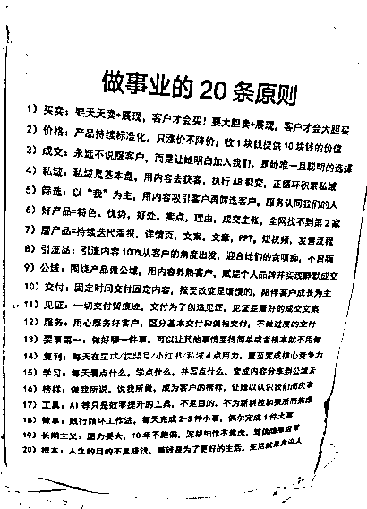

# (46 赞)我用了 2 年，总结 20 条「反常识」却最赚钱的一人公司成事原则

> 原文：[`www.yuque.com/for_lazy/zhoubao/befd7v1tmincr9uz`](https://www.yuque.com/for_lazy/zhoubao/befd7v1tmincr9uz)

## (46 赞)我用了 2 年，总结 20 条「反常识」却最赚钱的一人公司成事原则

作者： 东山老师

日期：2025-10-07

**慢一点，深一点，才能稳一点**

**  **

**我办公桌的右边，我扭头一看，就能看到墙上贴着一份不算精美，却被我仔细看过无数次的文档。**

**  **

**  **

**它是我做事的基本指导原则，也是我过去 20 多年创业路上，用真金白银、无数个不眠之夜和反复的自我怀疑，淬炼出的 20 条经营心得。**

**  **

**它们中的每一条，都看似简单，甚至有些“反直觉”。**

**  **

**但正是这些原则，指引着我这家“一人公司”爬出坑来，并穿越了周期，在喧嚣的市场里，找到了属于自己的节奏，活得更从容，也更赚钱。**

**  **

**今天，我不想藏私，将它们和盘托出，并为你拆解每一条背后的深度思考。这不仅仅是一份操作手册，更是一套关于如何做好一门“好生意”的哲学。**

**  **

**1）创业之根本**

**人生的目的不是赚钱，赚钱是为了更好的生活，生活就是身边人**

**  **

**2）长期主义**

**愿力要大，10 年不跑偏，深耕细作不焦虑，笃信隐形冠军**

**  **

**3）做事**

**践行循环工作法，每天完成 2-3 件小事，偶尔完成 1 件大事**

**  **

**4）好产品**

**好产品=特色、优势，好处，卖点，理由，成交主张，全网找不到第 2 家**

**  **

**5）磨产品**

**磨产品=持续迭代海报，详情页，文案，文章，PPT，短视频，发售流程**

**  **

**6）价格：**

**产品一定是超高价，而且只涨价不降价；但要给零风险承诺：收 1 块钱提供 10 块钱的价值**

**  **

**7）交付**

**固定时间交付固定内容，接受改变是缓慢的，陪伴客户成长为主**

**  **

**08）服务**

**用心服务好客户，区分基本交付和偏袒交付，不做过度的交付**

**  **

**9）见证**

**一切交付留痕迹，交付为了创造见证，见证是最好的成交文案**

**  **

**10）筛选：**

**以“我”为主，用内容吸引客户再筛选客户，服务认同我们的人**

**  **

**11）学习**

**每天看点什么，学点什么，并写点什么，变成内容分享到公域去**

**  **

**12）公域**

**围绕买卖做公域，直接投流，成交付费引流品**

**  **

**13）引流品**

**引流品要 100%从客户的角度出发，迎合她们的贪嗔痴，不自嗨，超高价值且超低单价**

**  **

**14）私域：**

**私域是基本盘，但只有付过费的才是私域客户，哪怕付过 1 毛钱。没付过一毛钱的，天天说爱你也不是。**

**  **

**15）买卖：**

**要天天卖+展现，客户才会买！要大胆卖+展现，客户才会大胆买**

**  **

**16）成交：**

**永远不说服客户，而是让她明白加入我们，是她唯一且聪明的选择**

**  **

**17）榜样**

**做我所说，说我所做，成为客户的榜样，让她以认识我们而庆幸**

**  **

**18）复利**

**每天在直播/视频号/公众号/私域 4 点，选 1 个点死磕，直至变成核心竞争力**

**  **

**19）工具**

**AI 等只是效率提升的工具，不是目的，不为新科技和狠活而焦虑**

**  **

**20）要事第一**

**做好哪一件事，可以让其他事情变得简单或者根本就不用做**

**  **

**我下面一条一条的简单解释一遍，希望对有所启发，一共分为 4 部分，共 20 条。**

**  **

**一、初心与根基：我们为何而战​****​**

**在谈论任何技巧之前，我们必须先锚定基石。第 1 条原则，是我创业的起点和终点。**

**  **

**第 1 条原则：「创业之根本：人生的目的不是赚钱，赚钱是为了更好的生活，生活就是身边人。」​​**

**  **

**我是一个低学历创业者，家里也很穷，说白了：我创业之初，就是为了赚钱，为了能够实现阶层跃迁。**

**  **

**我曾陷入疯狂的增长陷阱，以为营收数字的无限攀升就是成功的唯一标准，有那一天没有收入就焦虑的不得了。**

**  **

**直到有一段时间身体亮起红灯，经常半夜一个人胃溃疡在酒店里疼的死去活来，感觉要挂在哪里了。**

**  **

**直到看到孩子调皮无赖懒惰，压根就不像我想象的乖宝宝。**

**  **

**直到老婆跟我挥舞九阴白骨爪，闹得差点要分开。**

**  **

**我才发现：我早已迷失了自己，也忽视了身边人。**

**  **

**我顿悟了：创业是我追求更好生活的工具，而不是我生活的全部。**

**  **

**更好的生活，是身心的健康，是时间的自由，是能与所爱之人共度高质量时光。**

**  **

**正是这份顿悟，彻底改变了我做决策的方式和创业方式。所以现在：我不会接那种需要我透支健康、牺牲所有个人时间去服务的“大单”。我会思考每一个动作，是让我离“更好的生活”更近了，还是更远了？**

**  **

**我会每天锻炼，每天和家人一起，因为他们就是我最重要的“身边人”，他们的成长和满意，构成了我生活幸福感的重要部分。**

**  **

**这份“慢下来”的智慧，引申出了****第 2 条原则：「长期主义：愿力要大，10 年不跑偏，深耕细作不焦虑，笃信隐形冠军。」​​**

**  **

**因为我追求的是生活，而不是一时的暴富，所以我敢看十年。**

**  **

**从此，我不再追逐每一个风口，眼睁睁的看着一个又一个的风口从我眼前飘过，忽视一个又一个好朋友的建议：你应该这样这样而不为所动，甚至我都不会再为竞争对手的新动作而焦虑失眠。**

**  **

**我笃信，在我定义的这个无限细分的领域里，只要我做扎的足够深、做的足够好，我就能成为那个不可或缺的“隐形冠军”。**

**  **

**这份内心的笃定，是我内心最强的压舱石，不焦虑，动作才不会变形。**

**  **

**如何践行这份长期主义？**

**  **

**我靠的是****第 3 条原则：「践行循环工作法，每天完成 2-3 件小事，偶尔完成 1 件大事。」​**

**​**

**宏伟的愿景，需要被拆解成每一天微不足道的进步。**

**  **

**所谓的“循环工作法”，就是“年循环，月循环，周循环，日循环”**

**  **

**也就是每年搞定一个旅程碑的大事，每月完成一个固定的事情，每周做好 2 件事，每天做好 2-3 件小事情，我一直相信：事情是慢慢做出来的。**

**  **

**每天 2-3 件事：基本上，我们每天的工作都很固定，上午基本上就是做内容，下午是磨产品和做交付，晚上是我老婆做直播，卖一个体验营，我辅助她。每天我们完成这 2-3 件事，一天的核心价值就已完成了。**

**  **

**每周的 2 件事情：我每周会跟一些客户做一些复盘，这算是交付的一部分，家庭的一部分就是：每周都会去爬山或者逛公园一次。**

**  **

**每月的 2 件事情：我们基本上每个月都会做 2 次小训练营，通过这个训练营的动作进行低转高，每期都有会有几个客户加入进来。**

**  **

**每年的 1 件大事：就是双十一前后的重大发售，每年的双十一到感恩节这段时间，我都会去迭代一次产品升级，做一次大型的发售。这一次的大发售，够我吃 1 年；**

**  **

**循环工作法是我最核心的工作方法论，看似简单，但如果思考成闭环，真的十分有效，我也基本要求我所有的客户都这么做；循环工作法让我避免了“间歇性踌躇满志，持续性混吃等死”的循环。**

**  **

**生意，在每一天稳健的“小事”中，自然生长。**

**  **

**二、产品与交付：价值的超级锚点​​**

**  **

**根基稳固之后，我们要打磨的，是最锋利的武器——产品。**

**  **

**我的第 4 条原则是：「好产品=特色、优势，好处，卖点，购买理由，成交主张，全网找不到第 2 家」​**

**​**

**我一直认为：一人公司年赚百万，应该靠的是好产品，而不是 IP，IP 是年赚千万的大咖才需要做的事情。**

**  **

**请注意，这里的“好”，不是“我以为的好”，而是“客户无法拒绝的独特价值”。它不是一个简单的功能，它是一个完整的价值包：**

**  **

**​​特色：（是什么？）：产品的属性，有什么特性。**

**  **

**​​优势：（为什么厉害？）：相比竞品，我有什么优势，我为什么能够做出这些特殊的根源。**

**  **

**​​好处：（对我有什么用？）：能带给客户的情感或实际利益，分为看得见的好处和看不见的好处等。**

**  **

**​​核心卖点：（为什么选择你）：一句话跟客户说清楚找不到第二家的价值主张，​​**

**  **

**购买理由：（为什么买？）：支撑卖点的证据和信任状。**

**  **

**​​成交主张：（怎么买？）：无法拒绝的交易条款（含零风险承诺）。**

**  **

**当这一切组合起来，它必须在某个细分领域做到极致，让客户发出“哇，就在这里买，这就是我想要的”的感叹，从而实现“全网找不到第 2 家”的心智占领。**

**  **

**产品打磨和营销策划部分是我一直特别在意和花了很多时间去做的，这个远远比那些**

**  **

**好产品不是一蹴而就的，****它需要第 5 条原则：「磨产品=持续迭代海报，详情页，文案，文章，PPT，短视频，发售流程」​​**

**  **

**一个“磨”字，是精髓。很多客户都想不明白的，这个产品做好后就可以了呀？为什么要天天都琢磨优化一下？**

**  **

**我们的很多客户的产品基本上都是同质化的，都是 XXXX 元 XX 次课的卖时间思维。**

**  **

**而我要求他们改为：解决方案型的，围绕各种呈现去迭代：海报，视频，PPT，文案，文章，话术等等，其实这些都是产品的一部分，都在传递价值，都需要像工匠一样反复打磨。这是一个永无止境的过程。**

**  **

**产品本身是 1，营销是后面的 0。1 不行，0 再多也没用。**

**  **

**有了极致的产品，如何定价？**

**  **

**请看****第 6 条原则：「产品一定是超高价，而且只涨价不降价；但要给零风险承诺：收 1 块钱提供 10 块钱的价值。」****这可能是最“反常识”的一条。**

**  **

**为什么超高价？​​**

**  **

**因为价格本身就是价值的信号。**

**  **

**低价吸引来的是价格敏感者，她们追求的是“便宜”，而非“价值”，后续服务成本极高，且难以满意。**

**  **

**超高价筛选出的，是真正认同你价值、优质且同频的客户。服务好她们，你会轻松十倍，利润也更丰厚。**

**  **

**为什么只涨价？​**

**  **

**这是对老客户最大的尊重和馈赠，也是对品牌势能的坚定维护。降价是对之前信任你的客户的背叛，也会让品牌陷入万劫不复的性价比陷阱。**

**  **

**如何支撑超高价？​​**

**  **

**核心就是超值交付和零风险承诺。**

**  **

**你必须提供远超价格的价值，让客户觉得“物超所值”。**

**  **

**同时，一个强大的“零风险承诺”（例如：无效退款、不满意包退）是消除客户最后一丝疑虑的催化剂，它展现了你的绝对自信。**

**  **

**最后，说到交付，****我的第 7 条原则是：「固定时间交付固定内容，接受改变是缓慢的，陪伴客户成长为主」​​**

**交付不是即兴发挥。**

**  **

**它应该是标准化、流程化的，像一门课程一样有节奏。这能降低客户的焦虑，也极大减轻我们的服务负担。**

**  **

**同时，我们要心存敬畏：我们提供的是工具和方法，但改变的主体永远是客户自己。**

**  **

**我们不能替她走路，只能陪她一程，用第 8 条原则：****「用心服务好客户，区分基本交付和偏袒式交付，不做过度的交付」​​**

**  **

**基本交付：合同写明的，必须做到 100 分。这是本分。**

**  **

**偏袒式交付：这是创造惊喜和忠诚度的关键。**

**  **

**在基本交付之外，给一点额外的关心、一份意想不到的礼物、一次超时的深度咨询。让客户感觉被特殊对待。**

**  **

**不过度交付：不要因为客户的要求而无底线地付出，这会耗干你，也会养坏客户的胃口。清晰的边界，是对双方长期关系的保护。**

**  **

**而这一切交付的终点，是第 9 条原则：****「一切交付留痕迹，交付为了创造见证，见证是最好的成交文案。」​**

**​**

**你的辛苦付出，如果不能被看见，那就浪费了 80%。每一次交付，都要有意识地去收集反馈、截图、案例、感谢信。这些真实的“见证”，是下次成交时，最有力、最温柔的销售员。**

**  **

**因为客户不相信你，但相信和她一样的“她”。**

**  **

**三、流量与成交：与对的人，说对的话​​**

**  **

**有了好产品，我们需要找到对的人。这里的关键词是：筛选，而非讨好。**

**  **

**我的第 10 条原则是：****「以“我”为主，用内容吸引客户再筛选客户，服务认同我们的人」​​**

**  **

**传统销售是“推”，我们是“吸”。**

**  **

**我不是什么人的钱都赚，我只服务那些认同我的理念、欣赏我的产品、与我同频的“对的人”。**

**  **

**如何找到她们？**

**  **

**通过持续输出带有我强烈风格和价值观的内容（文章、视频、朋友圈等），吸引来的是“慕名而来”的粉丝，然后再通过我的原则和价格，进一步筛选出愿意付费的“客户”。**

**  **

**这天然要求我践行第 11 条原则：****「每天看点什么，学点什么，并写点什么，变成内容分享到公域去」​​**

**  **

**学习、思考、输出，必须成为肌肉记忆。这不仅是自我提升，更是最好的流量来源。**

**  **

**我们的见解和思考，就是我们的流量磁铁。**

**  **

**关于流量，我将其分为“公域”和“私域”，玩法截然不同。**

**  **

**第 12 条原则，关于公域：「围绕买卖做公域，直接投流，成交付费引流品」​​**

**  **

**在公域（直播间、小红书、视频号等），不要做无效的品宣。**

**  **

**一切动作都要指向“买卖”。最有效的方式，就是设计一个无法拒绝的引流品，然后直接付费投流，快速验证和成交。**

**  **

**说起这个，我们以前真的太作了，例如做直播，就真的只是纯纯的分享，挖空心思的分享，为爱发电。**

**  **

**但现在，我们改过来了，一半时间分享，一半时间卖，分享的目的就是为了卖引流品。**

**  **

**第 13 条原则定义了什么是好的引流品：****「引流品要 100%从客户的角度出发，迎合她们的贪嗔痴，不自嗨，超高价值且超低单价」​​**

**  **

**它必须：**

**  **

**超高价值：市场价看起来很高，解决一类人群的最大的具体痛点。**

**  **

**超低单价：几乎无决策成本，比如 9.9 元、19.9 元，甚至是我们现在卖的 5.2 元。**

**  **

**迎合客户的贪嗔痴人性需求：直击人性，例如“快速变现”、“七天瘦身”、“一招破解”等，没办法，不迎合就是很难成交。**

**  **

**引流品的目的：不是赚钱，是筛选用付费投票的意向客户，并顺利将其引入私域进行转化。**

**  **

**而一旦引入私域，****第 14 条原则就至关重要：「私域是基本盘，但只有付过费的才是私域客户，哪怕付过 1 毛钱。没付过一毛钱的，天天说爱你也不是。」**

**​​**

**这句话很残酷，但很真实。付费是最大的信任和认同。**

**  **

**我的核心精力必须服务好付过费的人（哪怕只是付过引流品费用）。那些从未付过费的人，无论嘴上多甜，说多认可我，都不是我的核心服务对象。这份清醒，能节省我巨大的精力。**

**  **

**在私域里，如何成交？**

**  **

**第 15 条原则是行动纲领：「要天天卖+展现，客户才会买！要大胆卖+展现，客户才会大胆买」​​**

**  **

**不要害羞，不要觉得“不好意思”。你的产品那么好，是在帮助别人，为什么不大胆地分享？**

**  **

**首先，我们会在训练营里正儿八经的卖一次，他们不买，我也不管，但是还会天天在朋友圈、社群里展现我们的产品信息、客户见证、专业思考，就是在持续教育市场，也是在提醒客户：我在这里，我能帮你解决问题。**

**  **

**但“卖”的方式有讲究****，请看第 16 条原则「永远不说服客户，而是让她明白加入我们，是她唯一且聪明的选择」**

**说服和逼单其实是低姿态的推销，试图改变别人的认知，能量场是弱的。**

**  **

**我让她明白，是高姿态的展示，通过价值呈现和见证，让她自己得出“这就是我最聪明的选择”的结论，能量场是强的。我们的所有内容，都应该是为了教育和启发，而不是说服和乞求。**

**  **

**其实，如果把成交的时间拉长，从 1 个星期，放到 1 年，你会发现：压根不用焦虑和逼单，给点时间她去思考和见证更多同时期的人逐渐的变好，她迟早会加入我们的，因为，本质上：她们也没有更好的选择。**

**  **

**四、个人与修行：成为一束光​**

**​**

**最后，所有生意的本质，都是“人”。你本人，才是最大的产品。**

**  **

**第 17 条原则要求我：「做我所说，说我所做，成为客户的榜样，让她以认识我们而庆幸」​​**

**  **

**我要求客户做到的，自己必须先做到。**

**  **

**我分享的，必须是我自己正在实践并相信的。**

**  **

**我必须活成我的客户向往的样子——更从容、更丰盛、更专业。**

**  **

**当客户不仅从我们这里获得了产品价值，更获得了一种人生可能性的启发时，她就会成为你的铁杆信徒。**

**  **

**这要求我持续第****18 条原则「每天在直播/视频号/公众号/私域 4 点，选 1 个点死磕，直至变成核心竞争力」**

**​​**

**不必贪多求全，选一个最适合自己的流量阵地，All In 进去，死磕到底，把它打到 90 分以上。这远比每个平台都 60 分要强大得多。**

**  **

**以前，我是好几个平台一起做的，现在只做微信生态的平台，尤其是视频号号和直播，其他的都慢慢的少了很多了。**

**  **

**在这个过程中，****第 19 条原则让我们保持清醒：「AI 等只是效率提升的工具，不是目的，不为新科技和狠活而焦虑」****用好 AI，让它帮你写初稿、做脑暴、处理重复工作。**

**  **

**但核心的思考、真诚的连接、独特的创意，必须来自你自己。**

**  **

**不要被工具奴役，也不要因为新的概念而焦虑。守住你的核心价值，工具只是帮你把它放得更大。**

**  **

**我自己用 Ai，目前更多的是用来做决策辅助，和做心力教练，我发现我更加喜欢和 Ai 进行深度的聊天。**

**  **

**而这一切，最终都要回到要事第一的原则****（第 20 条）：「做好哪一件事，可以让其他事情变得简单或者根本就不用做？」​​**

**  **

**这是我每天问自己最多的问题。它逼迫我进行终极思考，找到那个最重要的杠杆点。**

**  **

**也许是把产品打磨到极致，也许是服务好一个核心客户让她转介绍，也许是打造一篇爆款内容。找到了这件事，我就全力以赴。**

**  **

**关于这一点，我们算过：做好每天的直播就是哪一件重要的事，我们只要每天能够实现卖掉 30-50 个引流品，那么其他所有的事情都变得简单或者根本就不用做了。**

**  **

**所以，我们持续的迭代直播脚步，我已经迭代了第六个版本了，我每天去复盘去优化，每天都投流，不达目标不罢休。**

**  **

**总结，一场关于创业自由和人生自由的实践**

**  **

**回顾这 20 条原则，它们并非散落的珍珠，而是一套环环相扣的系统：**

**  **

**从******初心**（生活与长期主义）出发，打磨极致**产品**（好产品与超高价），通过内容去**筛选**（吸引与公域引流），在​​**私域**里用展现而非说服的方式去**成交**，并通过超值**交付**创造**见证**，最终这一切都要求我本人持续**修行**，成为榜样。**

**这套系统的目的，不仅仅是赚钱，更是为了构建一种可控的、健康的、有成长的事业状态，从而实现那份最初的向往——更好的生活。**

**  **

**这，就是我所理解的，“一人公司”的终极胜利。**

**  **

**希望这套 20 条原则，能给你带来不一样的启发。与所有追求“小而美”的一人公司朋友共勉。**

**  **

**这 20 条原则，那一条对你有启发呢？评论区聊一下？**

* * *

评论区：

骏马 : 东山出品，必属精品！

周彦充（同公众号） : 感觉不错，准备费曼学习一下[强]

安迪 : 强

风益 : 先收藏了，慢慢看

小漆 : 东山老师的这套方法论振聋发聩，其实细想和生财的理念也有许多相通之处

坤汀 : 东山老师，非常真诚