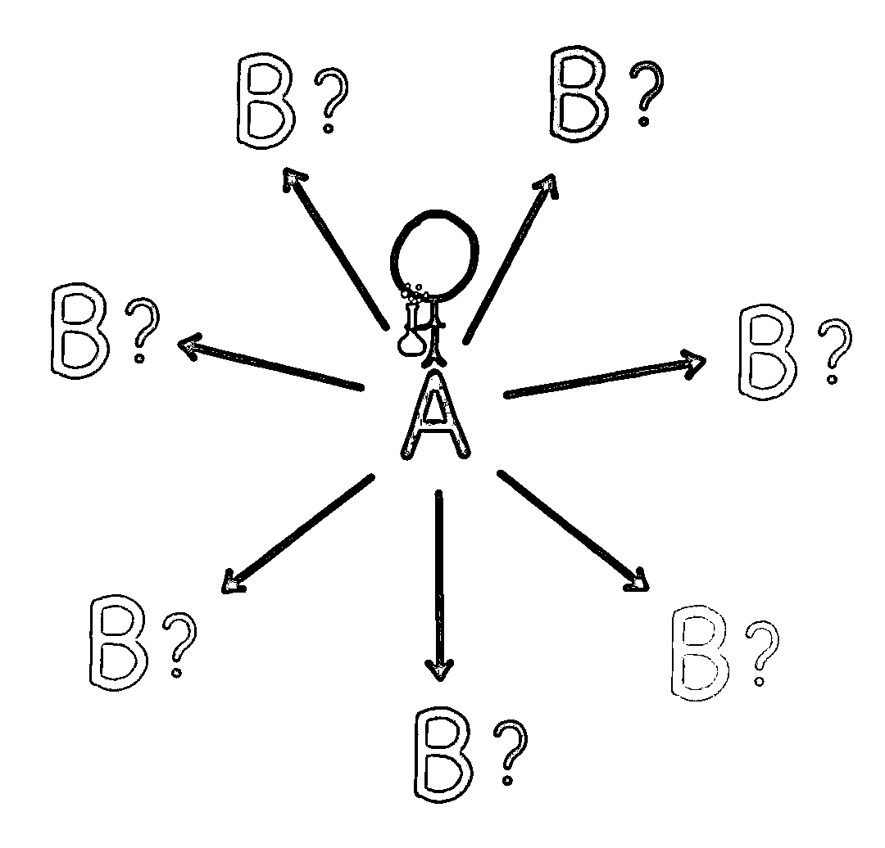
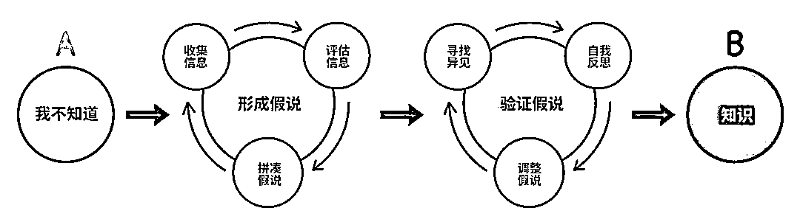
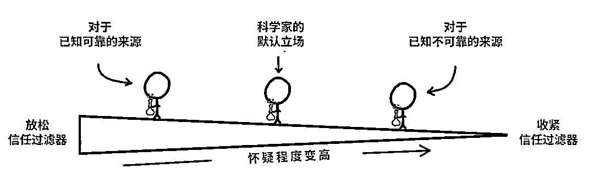
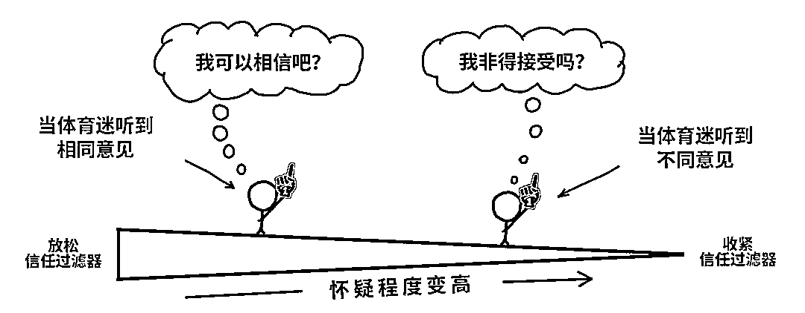
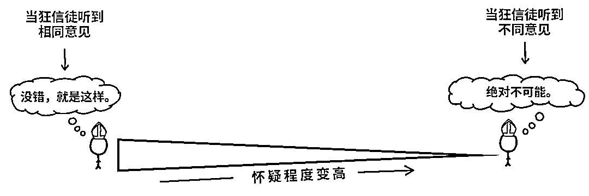

# (41 赞)读小排：《习惯，就是一个人的命运》复盘，像科学家一样思考

> 原文：[`www.yuque.com/for_lazy/zhoubao/xxqzgoruwahaglhe`](https://www.yuque.com/for_lazy/zhoubao/xxqzgoruwahaglhe)

## (41 赞)读小排：《习惯，就是一个人的命运》复盘，像科学家一样思考

作者： 彩笺

日期：2025-10-08

昨天小排老师发了一篇文章：[习惯，就是一个人的命运](https://articles.zsxq.com/id_j1e4kftz2tce.html)，推荐阅读

小排老师文末提到， 如果不介意的话，当他发现你的坏习惯的时候，会告诉你。

我觉得我上辈子应该是做了一些好事的，在这辈子我时常感觉到运气很好，昨天晚上，小排老师就分享了一个我的坏习惯，今天拿出来，加深一下我的印象，顺便引入一些我的思考分享给你们。

我的一个朋友六六(现在精华帖最上面的那位)，时常会羡慕我说，你怎么每天都能这么开心。几年前刚大学毕业的我，读过一本蒂姆·厄本(Tim
Urban)写的书，书中有个观点是：

**幸福等于现实状况减去期望值**

我觉得这句话很有道理，当时我甚至都不知道这个作家叫什么名字，我就这么去做了。这几年我一直告诉我自己，**我只是一个普通人**

我想这句话应该是起到了一定的作用的；回望过去的几年，我确实过的很幸福，我对自己， 对他人的期望也一直放得很低。

到这里看起来一切都挺好，不过你知道么？蒂姆·厄本(Tim Urban)这个人名，我是今天上午才知道的。

今天上午我偶遇了一本新书《What‘s Our Problem》，我惊奇的发现这本书的作者，正是写出上面那句使我变得更幸福的句子的作者，真是缘分。

书中前面的章节，提到了一种思维方式：**阶梯思维** 。

**小排老师，指出了我的坏习惯，告诉我哪里出了问题，这个思维方式，帮助我揭示了我为什么会这么想**

## 从这个坏习惯说起

最近在生财圈友佳境大哥的公众号中看到了他的一篇自述，他说从深圳 AI 大会回去之后，他发现自己突然不焦虑了，他仔细观察发现，在 AI 出海这个赛道拿到结果的人，
都有自己的系统体系，想拿到结果，终究要回归自己的节奏，而非追着别人的脚步跑。

我联想到我自己，从去年年末刚开始决定出海和哥飞学习 SEO，到今年来了杭州线下，收到过小排老师，亦仁，南哥，二哥他们的各种做产品的方法的指导。

**我觉得我听到了很多，学了很多，但是最近几个月处于一个混沌的状态，我认可了佳境提到的观点，我觉得我应该也需要有自己的体系。**

小排老师先是认可了“做自己”的内核。其后，他分享了一个他的书摘：

> 真实地活着的对立面,是抽象地活着。真实地活着,是拿自己的血肉之躯和其他真实的存在,特别是人,去碰撞,去接触,去感知,去爱恨;抽象地活着,是躲开了肉身,为了防止产生真实的疼痛,让自己躲在头脑的世界里。

他说：**你觉不觉得你有点抽象**

我并没有直接回答，我说：我看过之后想到了我的一个缺点：**想的太多做的太少**

他表示赞同。

这个问题困扰了我很久，我记得很清楚，8 月份亦仁在线下搞了个“问诊”，在那时我就有这个困扰了，但是我好像没什么想问的，我也不知道怎么去问（现在看来，问题症结在于，我不知道如何提出我的问题，困扰的表象之下，存在的其他的根因）当时我以为，问题肯定会有，但是“游戏需要自己去打，大方向是清晰明了的，我处于欠缺执行的阶段，但是我执行不足“

昨天晚上和小排老师聊天之前，我还和刀姐在聊，她之前有跟我提到她的一个问题：老是懒得还是逃避 不去做， 应该做的事情（大概这个意思）

我说我好像也有这个问题，想问问她如何解决的；她后面跟我说：**内阻力** ，我也大的很

**这时，我仍然觉得答案可能还不太准确，我没有获取到那种对自身某个问题有了清晰认知之后的通畅感。我仍然不知道如何解决我当下这种”混沌“
”不去做真正重要的事情“ ”想的太多“的现状**

我问小排老师：

> 答案是实践是么

小排老师说：

> 答案就是把每条路都走到底呗

我说：

> 道理是不是都懂？ 我最近在做 xxxx，做 xxx 是因为 xxx，
> 流量策略是 xxx，这是我所实践的，但是还是有困惑，中间执行还是不通畅，还是感觉在面对一个不清晰的东西

排说：

> 你这叫流量策略？ 你这个不叫流量策略。叫抽卡策略。
> 
> 确定性比较低
> 
> 流量策略应该是：我要每天稳定的 1 万用户，怎么办？ 数字可以改，1000 也行。
> 
> 我明白了，你缺**北极星指标** ！就是这个！！
> 
> 你错把手段当成目的了。刚才你说的旁例，还有你的”流量策略“，这都是手段而已啊。你的目的呢

到此刻我才有了那种清晰明悟的感觉，之所以我一直没有去做真正我应该做的，是因为**目标存在问题** ，把**执行手段和方法错误的当成了目标** ；最终带来了不清晰的终局，**我无法客观的去判断，目标是否达到，所以我迟缓不前**

做网站，产品定位，功能，成本，售价等一切都是清晰的，目的应该是获取流量，我的所谓的”流量策略“不过是众多策略中的一种罢了，并且他**无法为我带来具体数字的流量，中间存在黑盒** ，所以我最近的所有的执行，我都无法预估它能带来多少的流量，**既然无法预估，自然无法评价**

亦仁 3 月份就跟我说过，第一件事就是要考虑，你的流量怎么来，要先搞流量，再做产品，当时认知水平低下，没有听懂

到了最近几个月，开始听得懂这句话的具体含义了，开始放下键盘去看海外各种网站案例， 流量渠道了，但是看了很久，似乎没有一丁点用

**你知道么？下面两句话此刻在我眼中截然不同**

先搞流量

如何每天稳定获取 1000 用户，并且不亏本

当我看到第二句的时候，我清晰的知道，当下，我有哪些策略可以去执行，我都知道我要做什么了做到什么程度了，内阻力？拖延？ 不存在的

我的 steam 游戏时长，比小排老师还要长一些，我玩过这么多卡牌游戏，团队策略射击游戏，模拟游戏，我清楚的知道，我应该如何获胜，
做哪些确定的，不确定的事情，能增加获胜的概率，**某种程度上， 正是那种确定性，那种通过抉择，正确决策带来的目标达成，给我带来过数不清的快感。**

那么在做网站这个大型游戏上，明确目标之后，就是**start game** 了，开始游戏，这事我最擅长了哈哈

遗憾的是， 我确实曾经在做网站上拿到过这种目标清晰带来的正反馈，小排老师线下课前后， 我知道了：网站审美在线，让用户看到之后觉得**WOW** ，
这也是 MVP 的一部分，然后当时小排老师要求我说，一周内做出网站 MVP。我记得很清楚，在那之前做的所有网站都审美一般的我，花了 3 天就差不多搞定了一个功能，审美都在线的网站

**至于我为什么忘记了呢？ 这是个好问题，值得我去探究，在当下，我对它的解释是：**

> 幸福等于现实状况减去期望值 这句话，给我带来了耐心，带来了低预期做事情的优点，带来了幸福
> 
> 同时预期很低，很少有什么事情可以让我感到不同寻常， 导致这一次 因为目标清晰带来的丝滑无阻力执行和目标达成的结果，没有让我感到太爽，没有留下深刻印象
> 
> 当时只道是寻常。

因此我觉得我告诉我的那句话，可以改改了

由：**我只是一个普通人**

改：**你不是一个普通人，但也别太把自己当回事**

这句话有没有觉得，诶似曾相识？

小排老师旧文提到过一个类似观点：

> 一流创业者，脑子里要容得下两个相反的想法

话说回来，

**我为什么会错把策略，当成目的呢？**

因为我上一个网站，就是这么干的。然后黑盒运气比较好，流量策略成功带来了流量，产品有了稳定的收入=-=， 错误的路径带来了正确的结果，导致了路径依赖。

到这就完了嘛？ 怎么可能，路径依赖就是最底层了嘛？肯定不是，因为我直觉还看不透彻

**那如何解释路径依赖呢？我到底为什么会路径依赖， 内心深处具体怎么想的，我要如何做的更好呢？**

## 阶梯思维

说回到文章刚开始提到的，我今天上午在新书中看到的阶梯思维

作者是这么说的（我理解的）：

我们脑子中，时刻存在着一场拔河比赛

一方是：**原始心智**

原始心智让我们人类这种动物，可以尽可能的延续族群，某种程度上我会觉得他是自然选择的产物，

核心是：活下去，繁衍

我会觉得，明知体重超标，还是想喝奶茶、害怕走夜路、吃喝拉撒各种能产生多巴胺的事情，都是原始心智在占据主权。

另一方是：**高阶心智**

它是我能跳出自我思考、反省自己、随着经验变得更智慧的那个部分

我们舒舒服服的每一天，在我的大脑里可能是**高阶心智** 大权在握，掌控全局，而它的室友**原始心智** 就四处追着多巴胺跑，管管吃喝拉撒和自娱自乐。

可一旦原始心智想让你按不靠谱的方式思考或行动时，高阶心智会试图接管大闹，把你拉回“讲道理”范围内

虽然高阶心智可能很聪明，但管原始心智也不太彳亍。一旦原始心智获得过多控制权，你可能会发现自己的脑子到“没道理”范围去了

我们应该都发生过这事，比如**控制不住的买买买** 、**大晚上了还想下楼去吃个小烧烤**

**高阶心智** ：不允许你这样

**原始心智** ：能量，口腹欲，爽爽爽

这种内分歧出现在生活的方方面面，就像脑子里没完没了的拔河比赛——争夺我们的想法、情绪、价值观、道德、判断，和整体意识。

阶梯思维把他们两个分别占据不同程度决定权的情况，分为了四个阶梯

**看到这里的时候，我发现我们似乎都在别的地方看到过类似的东西，比如：**

社会心理学家丹尼尔·卡尼曼在《思考，快于慢》 中提到过“系统 1”和“系统 2”

脑科学中，区分了大脑不同分区的运作方式，前额叶皮层更理性，而边缘叶系统更原始。

弗洛伊德说过 “本我”“超我”和“自我”

**想搞清楚我上面的问题，得问自己，两种心智是如何塑造我自己的。**

高阶心智时长告诉我，要自我迭代，学习新东西，不断修正自己对世界的看法，尽量让自己变得不那么愚蠢、无知。

原始心智就不太同意了，原始心智会说，基因延续，如何生存下去才是重要的，要坚持对你生存最有力的信念。而当下你的信念在你人生早期就形成了，这往往和早期的周围环境有关，他们是存在关联的，确保了你可以人生早期的那个社区得以良好的存活，所以它希望你把你的信念奉若神明，并坚信不疑。

这两种截然不同的思维共存在我们的脑子里，这意味着我们驱动思维的动机——以及我们的思考过程——取决于那一刻我们在阶梯上处于什么位置。

因此，作者针对四种不同的位置，描述了四种不同的信念。

### 最高层第一级：像科学家一样思考

当我们在第一层的时候，我们基于客观事实和证据走，默认我不知道。

更具体的从 A 到 B 的应该是：

高阶思考是从底层往上构建假说，与其直接采纳传统智慧的信念和假设，你得从零开始拼凑自己的想法

**收集信息**

我们会被动或主动的收集各种信息，哪怕看起来他很可能就是错的

**评估信息**

收集信息看重数量，评估信息就全看质量。

知识分两种，我们自己实践，经历得来的**第一手知识** 和从外界得来的**间接知识**

聪明的利用信任，是一条高效的知识获取捷径。如果你可以信任一个说真话的人，就能把他辛苦得来的知识——无论是通过直接研究还是间接研究，直接“复印”到我的脑袋里，就像我无脑信任小排老师的大多数内容一样（小排老师公众号评论区还有人请求测评 glm4.6）

但信任用错地方，后果恰恰相反。

**拼凑假说验证假说**

随着收集和评估过程深入，科学家对自己的拼凑越来越有信心。最终，他们开始锁定思想光谱的某个部分，怀疑真相可能就在那里。拼图终于成形了——他们开始形成一个假说

然后科学家开始公开表达自己的想法，无论是当面还是在网上。是时候看看这个假说站不站得住脚了

### 第二层：像球迷一样思考

现实中大多数球迷希望他们看的比赛是公平的，他们特别重视比赛过程本身的诚信。只是.....他们真的，真的希望比赛结果就是“那个”结果。他们不光在观看比赛；他们还在呐喊助威。

**我仍然会觉得我基于客观事实触发，基于逻辑，但是我心中有个期望的答案，所以这时我其实不是很客观**

禅宗有个大师**僧璨** 说过一句话：

> 若欲真相显于前，切勿执着顺或逆。顺逆之争，乃心之大病。

我确实还是会像科学家那个途径一样走下去，但是可能会开始有偏颇，毕竟原始心智插手了，听到观点被认同这确实很爽，有人不认同，也确实会让人感到烦

球迷偏向于收集观点，最好是能证实他们的信念，偏见就随之而来。

这个时候，如果反对的声音足够大，比如我信服的小排老师说，你这样是错的， 我可能会痛苦的多想一想，如果一个不认识的网友站出来评价，我可能不当回事。

### 第三层：像律师一样思考

原始心智在拔河中占据优势。不管你承不承认（你才不会承认），**你只想让自己是对的， 对么？**

我现实生活不认识律师， 但是我从电视剧中学到了一个知识就是， 花钱请了律师，他只会尽可能的帮你说话，

**应该不存在这样一个情况吧：**

我花钱请了个律师帮我辩护，开庭的时候，对方律师说了一通之后，**我的律师沉思了一会说了一句，审判长，刚刚对方的观点确实很有道理，仔细一想，我的当事人确实有罪**

哈哈哈哈哈哈哈

肯定是不会的，律师是自己人，当你像律师一样思考时，你根本不会从 A 点开始。你直接从 B 点出发。客户无罪。然后我们再找为什么。

律师先坚信观点，再倒着退回去，找那些可以支撑的观念。

### 第四层：像狂信徒一样思考

网上冲浪这么久了，想必你肯定看到过，经常有人争论，豆腐脑要吃甜的还是咸的、西红柿炒鸡蛋吃甜口的还是咸口的

狂信徒的摇摆是一个极端，到另一个极端，没有中间地带，有网友戏称为：**二极管**

**他们还不知道，知道了或许也不理解** ，什么叫做：**食无定味，适口者珍**

* * *

我为什么要写上面这一段呢？因为我发现在上面这件事情上， 我像个律师一样，我天真的为我的懒惰， 不去深究底层原因的懒惰而辩护。

小排老师文章的标题为：**习惯，就是一个人的命运**

很遗憾我在很多事情上，都是大柱子，不过还好我们运气都很好，可以自底而上的通过朋友得知自己的坏习惯，从大柱子变成，二栓子

也可以自顶向下的通过阶梯思维模型，尽可能让我们在大部分时间，保球迷争科学家，从而指导每一件小事，做人生的二栓子。

这本书还有很多有意思的内容，篇幅原因实在聊不完，推荐阅读；但是没有中文版本。我觉得也挺好的，能想办法看到这本书的人，是真需要答案的人。而真正需要答案的人，也就总是能找到答案。

就像我的困惑，每每萦上心头，就会在记忆里加深一次，那就总有解决的一天，生命会自己找到出路。

对了，我也不知道大半夜小排老师为啥愿意告诉我这么多，可能我是深海圈第一期学员吧。

* * *

评论区：

暂无评论