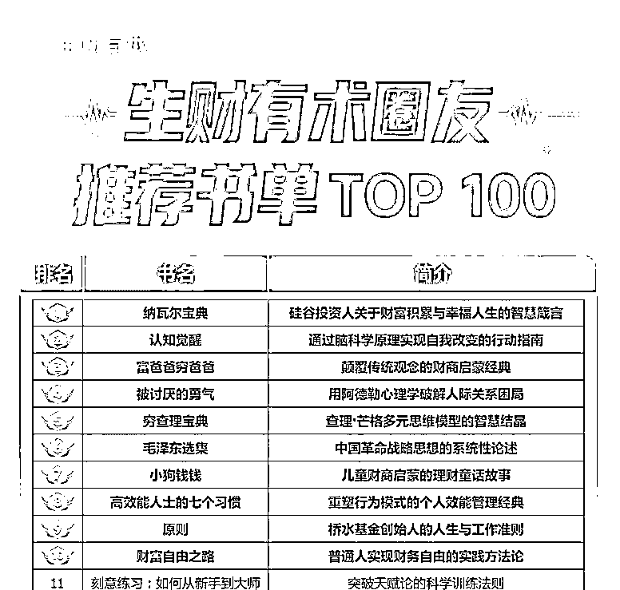
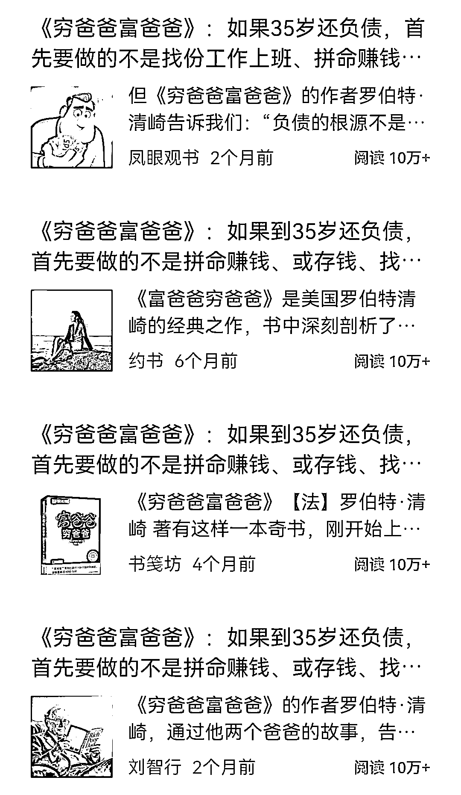
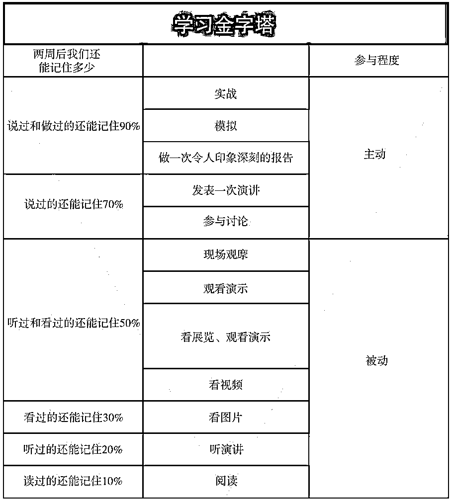
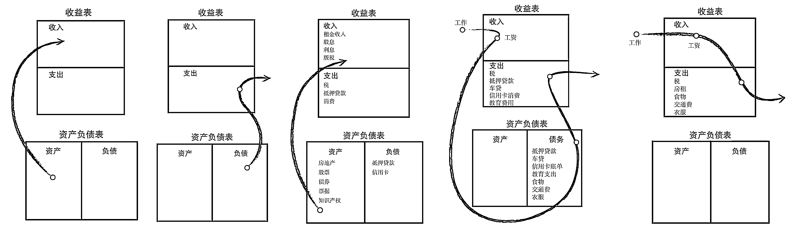
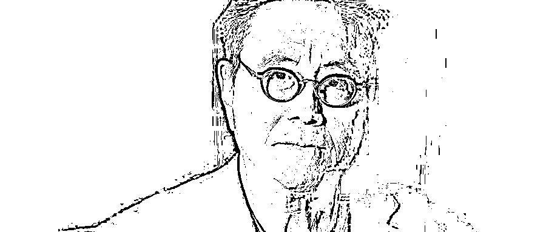
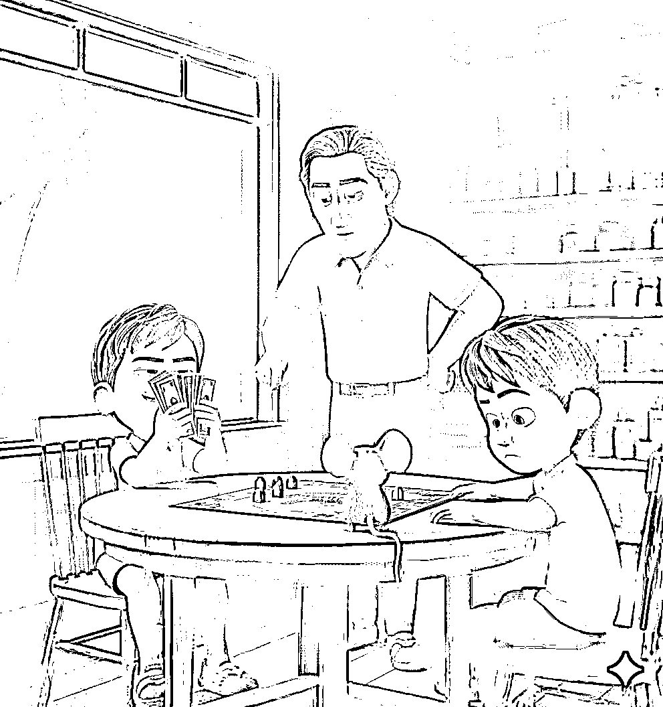
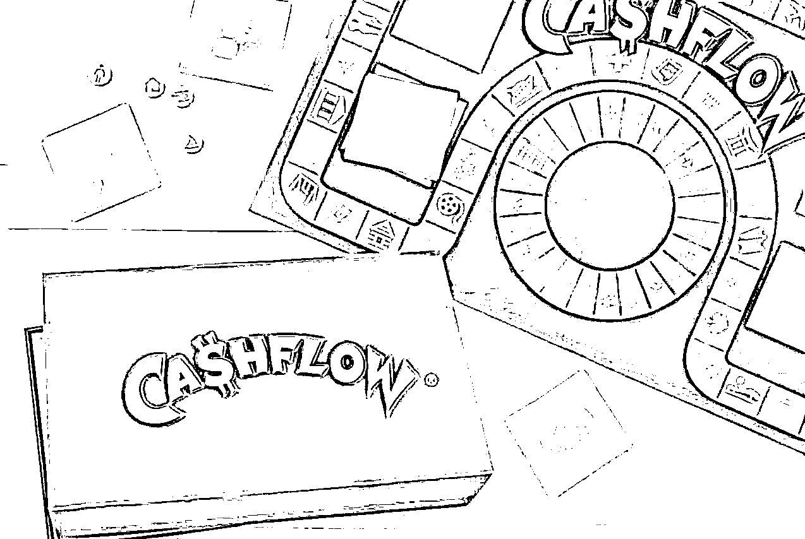
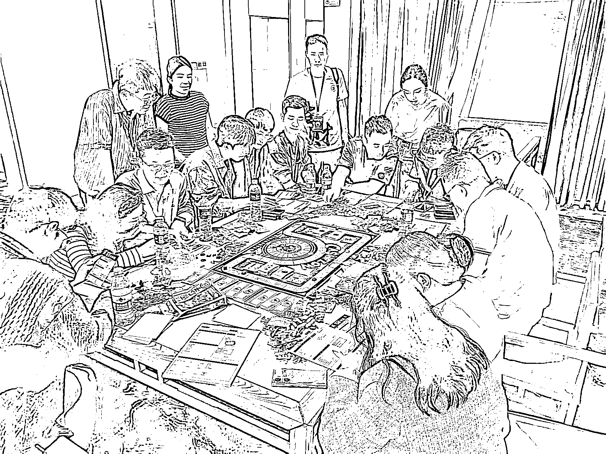

# (33 赞)我是真把《富爸爸穷爸爸》读明白了！

> 原文：[`www.yuque.com/for_lazy/zhoubao/fg1e22na6loax5lk`](https://www.yuque.com/for_lazy/zhoubao/fg1e22na6loax5lk)

## (33 赞)我是真把《富爸爸穷爸爸》读明白了！

作者： 小新

日期：2025-10-01

十一假期前，生财有术圈友推荐书单 TOP100 出炉。前三名《纳瓦尔宝典》《认知觉醒》《富爸爸穷爸爸》实至名归。

这三本书也确实是近几年，我自己读的最多、讲的最多、用的最多的宝藏书。生财圈友的认知果然同频，同意的点赞。

其中《富爸爸穷爸爸》读了超过 20 遍（组织 30 期读书营），《纳瓦尔宝典》读了 4 遍（组织 1 期读书营），《认知觉醒》读了 2 遍。

今天深入解析《富爸爸穷爸爸》，因为这本书，改变了我的人生。曾经还因为在航海家频繁推荐，惹的亦仁老大有点不高兴。

这是明白系列的第 4 篇，前 3 篇有 2 篇是精华。

明白 1：我是真把辞职整明白了！[`t.zsxq.com/0aiXlCOse`](https://t.zsxq.com/0aiXlCOse)

明白 2：我是真把生财用明白了！[`t.zsxq.com/0as1BFf0z`](https://t.zsxq.com/0as1BFf0z)

明白 3：我是真把财商看明白了！[`t.zsxq.com/0fTq9N5Hj`](https://t.zsxq.com/0fTq9N5Hj)

声明：

本文 1.3w 字，内容较多，仅代表个人观点。

如果你不是富爸爸粉丝，只是想简单了解，只看第一部分就行。

如果你是富爸爸粉丝，能坚持读完，一定会有很多共鸣和颠覆认知的地方。

目录

**一、想读懂《富爸爸穷爸爸》，必须要知道的**

**  **

**二、罗伯特·清崎财务自由的真正秘密？**

**  **

**三、现金流游戏到底在玩什么？**

第一次知道《富爸爸穷爸爸》是在上大学时，当时没在意。直到 2019 年，工作了好多年后才认真读。三年后我辞掉了月薪过万的央企工作。

目前读了 20 多遍，组织了 200 多场现金流游戏。对内容还算熟悉，也有一些买房和投资的实践经验，相信能够帮你更好读懂这本书。

1997 年 4 月 8 日，《富爸爸穷爸爸》由日裔美国人罗伯特·T·清崎，在美国自费出版。当时只印了 1000 册，因为没有出版商愿意出版。

2000 年由北京读书人文化引进中国，连续 18 个月蝉联全国图书销售排行榜第 1 名，长居投资理财类书籍排行榜榜首，是很多人的财富启蒙书。

富爸爸系列已有 30 多本，至今依然畅销且长销。《富爸爸穷爸爸》是系列的第一本，也是最值得反复阅读的一本。

**一、想读懂《富爸爸穷爸爸》，必须要知道的**

**1、本书的三个秘密**

1）《富爸爸穷爸爸》是游戏说明书

罗伯特·清崎真正发明的财商教育产品是游戏，叫富爸爸现金流游戏。写书是合伙人莎伦·莱希特的建议，目的是推广现金流游戏。

2）富爸爸是中国人

应该是早期移民到美国夏威夷的广东潮汕人。2012 年清崎在上海宣传新书时，在记者会上承认过，书中的富爸爸是中国人。最近一次提到，是 2025 年在新加坡演讲时。

3）富在前穷在后

很多人喜欢顺口说成“穷爸爸富爸爸”，包括某些知名博主和阅读量 10w+的爆文。语言是有能量的，所以富爸爸才禁止说：“我可付不起”，而要说：“我怎样才能付得起？”。

**2、读本书的三个建议**

有没有哪本书你读了超过 3 遍？虚构类的文学不算，主要是社科类书籍。

关于读书有个真相：人生能读多遍的书，其实屈指可数，能改变你的也就那么几本。

所以在遇到一本值得读的书时，一定要在不同时期反复多读几遍。《富爸爸穷爸爸》就是一本能让你改变的书，很多读者的人生都因这本书而改变，也包括我。

2019 年第一次读完后，发现自己一直在过“老鼠赛跑”的生活，也意识到人生不止有一种活法，知道了“想要”和“不想要”。

于是经过三年折腾，2022 年辞掉了月薪过万的央企稳定工作，老婆也辞掉了 10 年的电视台工作，一起开房车从沈阳到海南，开始了自由职业&候鸟的生活，走在追求财务自由的路上。

开始读《富爸爸穷爸爸》前有三个建议：

1）别期待一次读懂

有些书需要逐字阅读，但这本书建议用最快速度读完第一遍，不理解的直接略过。我读了 20 遍，每次再读依然有新的收获。

2）从改变认知开始

只要对你有触动的话就划出来，别纠结对与错，也别深入探究。第一次读重点是积累情绪，发现哪些是自己不知道的。

3）读完别着急行动

最后告诉你原因。

**3、本书的三个部分**

《富爸爸穷爸爸》不仅是一本关于金钱和财富的书，更是一本关于生活哲学的书。它教会我们如何以富人的思维去生活，如何通过财务自由来实现生活自由。

以下为本书的框架和内容梳理，篇幅较长。可以帮助想认真阅读的读者，快速锁定重点。也能让读过的朋友，重温书中的经典内容。

对书中的金句和理念感兴趣，可以关注公众号“觉醒新财商”，有我读了 20 遍整理出的 339 个金句。

我把《富爸爸穷爸爸》的内容分成三个部分：

第一部分：所有前言——介绍本书背景

第二部分：1-6 章——富爸爸的 6 门课程

第三部分：7-9 章、结语——财商如何落地

**第一部分：所有前言**

很多人不太重视前言，这本书却必须要认真读，里面包含了很多关键信息，甚至有些“预言”在今天来看，都真实发生了。

举个例子，开篇《致中国读者的一封信》作者写于 2007 年，富爸爸出版 20 周年之际。有段原文恰巧符合今天的经济情况。

*“对富爸爸广大的中国读者来说，除了受世界经济的影响，还要面对国内经济转型的阵痛，这个过程艰苦而漫长。”*

《出版人的话》中汤小明老师也有一段话， *“世界变了，金钱游戏的规则也变了。对于读者和创业者来说，也要应时而变，理解金钱的语言，学会金钱的游戏。只有这样，你才能玩转金钱游戏、实现财务自由* 。”

最近几年，从口罩到经济恢复期的调整，从一大波的降薪裁员到中产返贫和消费降级，再从 AI 技术发展到川普上台的一系列骚操作，甚至是从艮土运到离火运的转换。

世界的变化越来越大，也越来越快。

《后见之明 20 年后的今天》有几个颠覆性的观点，如果你都能理解，说明财商基础还不错。如果不理解或讲不出道理，恭喜你发现了自己盲点，是提升财富认知的好机会。

“富人不为钱而工作”：富人当然喜欢钱，但钱并不是真正的财富。（金钱和财富的概念）

“储蓄是失败者所为”：储蓄是非常有效的理财手段，也很重要，但无法让你致富。（富人都在借钱）

“你的房子并非资产”：你自己住的房子其实是负债，投资的房子也可能是负债。（现实例子太多）

《序言》的内容非常精彩，介绍了富爸爸和穷爸爸，以及富人思维和穷人思维的差异。比如一个爸爸总是习惯说“我可负不起”，另一个爸爸坚持让我说“我怎样才能付得起？”

另外，有首《未选之路》的诗也建议好好体味，我前 3 遍读都跳过了，直到辞职之后再读，最后两句深深触动了我。

“林中两路分，一路人迹稀。我独选此路，境遇乃相异。”

选择不同，命运也会不同。

**第二部分：富爸爸的 6 门课程（1-6 章）**

“这些课程不仅仅意味着答案，它们也是路标。无论这个充满不确定和飞速变化的世界会发生什么事情，这些路标都能帮助你和你的孩子、你的家人积累财富。”

*第一课 富人不为钱工作*

“穷人和中产阶级为钱工作，富人让钱为他工作。”

本章 44 页，主要讲了清崎从 9 岁开始和富爸爸学习的故事，易读性很强，用最快速度读完即可。

富爸爸不按照学校方式，而是让生活教。最终清崎没有被钱收买，在接受免费工作后，发现了阅览室的生意，有了人生第一笔“被动收入”。

另外有几个点值得关注（其实有很多）：

一是关于恐惧和贪婪

“正是出于恐惧的心理，人们才想找一份安稳的工作。这些恐惧有：害怕付不起账单，害怕被解雇，害怕没有足够的钱，害怕重新开始。”

二是戴尔学习金字塔

我做了 10 年培训工作，这个理论至今仍在被使用且有效。如果你希望通过持续学习改变自己，一定要了解。

三是经典的“老鼠赛跑”

“起床，上班，付账，再起床，再上班，再付账......”挣越多钱，就会花更多钱，重复这种循环。

*第二课 为什么要教授财务知识*

“你挣了多少钱不重要，重要 的是你留下了多少钱。（以及留住多久）”

本章 31 页，开始上强度了。用案例和现金流图告诉我们，为什么财务知识是财务自由的基础。

其中重要的是分清资产和负债，也解释了房子为何并非资产。印象最深的是一对小夫妻，如何一步步踏入“老鼠赛跑”的陷阱。

提示点：

一是 5 类现金流图

看不懂没关系，如果你能拿一张白纸自己画出来，感触会很深。（每期读书营都要求学员手绘）

二是财务报表的重要性

书中提到的财务知识并非多么复杂，也不是专业的会计学知识。仅仅是看懂财务报表的逻辑，3 分钟就能教会你。

稻盛和夫说：看不懂财务报表，就像飞机驾驶员看不懂仪表盘的数字。

你驾驶的这架飞机最后会怎么样？

*第三课 关注自己的事业*

“富人关心的焦点是资产，而其他人关心的是收入。”

本章 9 页，内容不复杂。通过麦当劳的故事，告诉我们事业和职业的区别。详细列出了资产的分类。

有段话很扎心。

“一个重要区别就是：富人最后才买奢侈品，而穷人和中产阶级会先买奢侈品。穷人和中产阶级用他们的血汗钱和本应该留给子孙的遗产来购买奢侈品。”（包括大房子和好车）

知道自己为什么穷了吧？

*第四课 税收的历史和公司的力量*

“富爸爸做得更聪明，他利用公司——富人的最大秘密——来达到他的目的。”

本章 13 页，又开始上强度了，而且把前面章节的知识穿插进来，读起来有点绕。税收是富人的一大秘密，有了公司才能操作。

感兴趣可以了解一下，个税税率（45%）和公司税率（25%），以及海南自贸港税率（双 15%）。如果你从来没关注过税，可能是因为挣的钱不够多。

有位认识的大佬说过，如果你没有公司，连剥削别人的工具都没有，只能被剥削。

提示点：

一是财商的 4 种能力：会计（财务）、投资（钱生钱）、市场、法律

二是个人和公司的现金流：

公司：挣钱—花钱—缴税

打工：挣钱—缴税—花钱

*第五课 富人的投资*

“在现实生活中，人们往往是依靠勇气而不是智慧去取得领先的位置的。”

本章 29 页，又开始绕了。其实重点是讲为何要提升财商，并用实际的投资案例，告诉我们投资重要性和投资者分类。

书中第一次提到了富爸爸现金流游戏。

提示点：

一书是现金流游戏的说明书：知道这个背景，读到游戏部分会更容易理解。

二房子只是资产的一种：很多人读完富爸爸，都开始投资房子，觉得清崎可以，自己也行，其实是一个误区。

清崎最终靠房地产实现财务自由，最根本的原因是他喜欢。

*第六课 学会不为钱工作*

“对于受过良好教育的爸爸来说，工作稳定就是一切；而对于富爸爸来说，不断学习才是一切。”

本章 19 页，接着绕，又绕回来了。开始引入女记者案例，其实是想告诉我们不要仅掌握一项技能，还强调销售技能的重要性。讲述了自己在施乐工作和第一次创业经历。

提示点：

一“世界上满是有才华的穷人”：所谓的改变，大多数不可避免的，最后还是要落到钱和财富上。别羞于谈钱，如果你不爱钱，钱就不会来找你。

别让自己成为懂的很多道理，却依然过不好一生的人。

二“付出是有效手段”：想要获得钱，先要付出钱。想要学的更多，就要教的更多。

**第三部分：财商如何落地**

“摆脱老鼠赛跑式的生活在技术上讲十分容易，不需要接受太多的教育，可那些疑虑却使大多数人寸步难行。”

*第七章 克服困难*

“富人和穷人之间的主要差别，在于他们处理恐惧心理的方式不同。”

本章 23 页，看起来像鸡汤，需要反复阅读，尤其是有了实践经验后，再来读感受会非常深刻。

“克服恐惧”：唯一没有出现过投资亏损的人，是那些未做过任何投资的人。

（我不会所以不敢）

“克服愤世嫉俗”（怀疑）：疑虑和愤世嫉俗的心态使大多数人安于贫困。

（从不相信自己能成为富人）

“克服懒惰”：懒惰最常见的形式之一是忙碌掩饰之下的懒惰。

（沉迷学习而不开始搞钱）

“克服不良习惯”：学会先支付自己，就会在财务上更“强壮”。

（支付指花钱在脖子以上——头脑）

“克服自负”：我知道的东西带给我金钱，我不知道的东西使我失去金钱。

（发现自己不知道的事并找到感兴趣的，是一件好事）

提示点：

一“如果我不再工作，我的生活会是什么样？”

这句话是我第一次读书时，感受最深的，后背发凉。如果你只有一份工资收入，当你不能再工作，会怎么样？

我马上做了一件事，去招聘网站上更新好多年前的简历，发现我的职位在本地没有跳槽机会，甚至同等待遇的公司都几乎没有。

二“摆脱老鼠赛跑式的生活在技术上讲十分容易。”

实现财务自由在步骤上非常简单，如果你不相信，玩一次富爸爸现金流游戏就知道了。但是现实中想要实践，却并没有那么容易。

这也是为什么罗伯特清崎建议读书后，要重复玩游戏，通过游戏的训练，让你在现实中更有把握。

*第八章 开始行动*

“金矿到处都是，但大部分人没有经过相应的培训，所以发现不了它们。”

本章 27 页，看起来继续鸡汤，但有了具体落地的步骤和方法，值得反复阅读。

“精神的力量”：没有强有力的理由和目标，任何事都会变得非常困难。

（创富动机很重要，你不相信自己能变富，就真的不能变富）

“选择的力量”：研讨班只花了我 385 美元，却帮助我挣回了至少 200 万美元。

（首先投资教育）

“关系的力量”：我会注意我有钱的朋友时如何谈论金钱的。

（据说你的收入是最常接触的 5 个人的平均收入）

“快速学习的力量”：如果你对自己所做的工作感到厌倦，或是你挣的钱不够多，那么很简单，改变你的挣钱模式吧。

（个人观点：不以挣钱为目的学习都是耍流氓）

“自律的力量”：能否自律是将富人、穷人和中产阶级区分开来的首要因素。

（要不要尝试每天 7 点起来共读富爸爸？）

“好建议的力量”：我付给经纪人的钱与我根据他们提供的信息而赚到的钱相比，只是一小部分。

（花钱买别人的信息/技能是效率最高的方式）

“无私的力量”：一位老练的投资者的首要问题是：“我多久才能收回投资”。

（关注回本周期）

“专注的力量”：轻松的道路往往会越走越艰难，而艰难的道路往往会越走越轻松。

（高手是走夜路、进窄门、耕瘦田，见微光）

“神话的力量”：当分析某种趋势时，我学着像沃伦巴菲特那样思考。

（查理芒格有 100 个思维模型）

“无私的力量”：先予后取，越真诚地教那些想学习的人，我就从中学到越多。

（金钱是流动的，先付出才能得到）

提示点：

何谓真正读懂？

以上的每一项，你都在现实生活找到了真实案例或对应的情景，才算理解。

当自己亲自开始实践后，才算读懂。

*第九章 还想要更多吗？这里有一些要做的事情*

本章 6 页，读到最后有点疲倦了，确是精华。

“停下你手头的活”：评估一下你的做法中哪些有效，哪些无效。

（思考很耗费能量，所以大多数人都不愿意做）

“寻找新的思想”：为了寻找投资的灵感，我经常到书店搜寻提供独特的、与众不同的主张的书。

（书中自有黄金屋，前提是有目的找）

“找一些做过你想做的事情的人”：请他们和你一起共进午餐，向他们请教一些诀窍和技巧。

（链接的最好方式就是付费）

“上辅导班、读书或参加研讨会”：就是因为学习了这些课程，我才会变得更富有，不用辛苦地工作。

（知识付费不能停，比如继续报鱼堂主和阿猫的课程）

“提出多份报价”：做买卖就是一场有趣的游戏。你提出报价之后，可能对方就会说：成交。

（敢于报价，别怕拒绝，你又没什么损失）

“每月在某一地区慢跑、散步或驾车 10 分钟左右”

（不是瞎逛，而是关注自己感兴趣的）

“购买特价商品”：为什么购买特价商品的总是穷人？而当楼市或股市出现下跌时，持有者却急于从中逃出。

（别人贪婪我恐惧，别人恐惧我贪婪。跟大多数人一样，永远成不了少数人）

“行动的人总会击败不行动的人”：最重要的是“做过”和“去做”。

（纸上得来终觉浅，必须亲自下场，把手弄脏）

提示点：

知道不做到，等于不知道。其实从知道到做到，中间还差很远，即执行力。

所以，适合我们普通人的路径应该是：

**先知道（认知）—再记住（背下来）—不断讲（改变语言）—开始行动**

*结语*

结束语居然还有非常重要的内容，也是醉了。讲了个清崎买房的案例，最关键的是告诉了你，读完书要怎么做。

“金钱是一种观念，如果你想要更多的钱，只需要改变你的思想。”

（富人和穷人到底差的是什么？）

“早点动手，买一本好书，参加一些有用的研讨班，然后付诸实践，从小笔金额做起。”

（我就是这么做的，亲身经历）

“在会计领域里，有三种不同的收入：1 劳动性收入，2 投资组合收入，3 被动收入。”

（不要一上来就关注被动收入，而是关注三种收入）

“实现财务自由的关键：取决于一个人将劳动性收入转化成被动收入或投资组合收入的能力。“

（看看，我上面是咋说的来着？）

“《富爸爸现金流》游戏可以教授玩家，将劳动性收入转化成被动收入和投资组合收入的基本投资技能。它还教授一些会计学原理和财商基本素养。”

（没上过驾校、不学习交规，就开车上路，你猜结果会是...游戏就是财务自由之路的“驾校”）

提示点：

有一种非常棒的读书方法：在书中找书。

如果遇到一本，你非常喜欢的书，或者确定这是一本你会读超过 3 遍以上的书，看看作者都推荐了哪些书。

别问我怎么知道的，因为我就是这么做的，结语中提到了 2 本书，读完《富爸爸穷爸爸》，我马上又读了这两本书，然后开启了人生的改变之路。

“金钱是一种观念，有一本很棒的书叫《思考致富》，而不是努力工作致富。”

“在我的第二本书《富爸爸财务自由之路》中，我阐释了组成商业领域的四种不同人群。他们分别是 E 类（雇员）、S 类（自由职业者）、B 类（企业主）和 I 类（投资人）。”

**总结**

很多人读完书，都关心财商如何落地？

如果你不确定要怎么做，可以继续读书（或再读一遍）。

直到你积累了足够的情绪，不再疑惑，清晰地知道自己该做什么。

其实，财商实践没有统一答案，因为每个人情况不同、财务目标也不同。

但有句话的说很好，可以作为心法：

**富人不折腾永远是富人，但穷人不折腾永远是穷人！**

有读者问罗伯特·清崎：我读完了你的书，告诉我如何开始致富？

清崎回答：“玩 10 次现金流游戏，再教给 10 个人。”

道理很简单，你看完说明书，第一件事是做什么？

**二、罗伯特·清崎财务自由的真正秘密？**

**  **

首先明确，财务自由（Financial Freedom）这个概念，并非罗伯特·清崎首次提出。具体的发展历程，有机会再与大家一起探讨。

罗伯特·清崎最早了解“财务自由”理念（并非概念），是 1985 年和女友金，以及好朋友拉里在加拿大雪山滑雪时。在此之前，富爸爸给他的教育，主要涉及财富、投资、退休等。

（注：拉里·克拉克是罗伯特在夏威夷施乐公司的同事和好友，一起创建 Rippers 尼龙钱包公司。1991 年罗伯特搬到凤凰城居住，与拉里做了邻居。）

**1、财务自由的起点**

1985 年新年，三人在温哥华雪山上的小木屋里，探讨新一年的目标。拉里提议制定一个详细的长期计划，来改变现实生活，提早退休。因为只有明确了长远目标和具体规划，才能倒推自己开始行动，明白必须去做什么。

罗伯特迟疑了，回想起尼龙钱包公司失败的痛苦经历，以及这次和金带着全部身家，离开夏威夷到旧金山创业，但并不顺利。

加上手里钱快用完了，他此刻被恐惧和懦弱主宰，只想着如何才能生存下去。嘴里嘟囔着：“可是没钱，我们怎么提早退休？”

当被情绪控制时，罗伯特·清崎和普通人一样，选择把短期的财务保障作为首要目标，而不愿考虑更远的未来。

拉里还在喋喋不休的讲，但罗伯特早已听不进去。突然间，某句话触动了他，猛然想起离开夏威夷前，富爸爸跟他说的话。

“除了你自己懒惰和自我怀疑之外，没有什么能阻挡你前进。保持现状很容易，不去改变很容易，大多数人就选择了一辈子不做任何改变。”

最终，罗伯特·清崎振作起来，战胜恐惧，决定开始行动，思考并制定“10 年退休”的目标和计划。

每当提起这个故事，马上就有读者问，“你是怎样做的？”。罗伯特回答：“那不是怎样做的问题，而是我和金为什么要做的问题。没有这个为什么，怎样就是不可能的。”

其实很多时候，想清楚“为什么”要比搞明白“怎么做”更重要。

这也是在《创富法则》一书中，汤小明老师提出的创富动机（M）的重要性。

所谓“有道无术术可求，有术无道止于术”，就是这个道理。

为什么重点分享这个故事？

很简单，这是罗伯特·清崎财务自由的起点。大多数人只知道 1994 年，他 47 岁时实现了财务自由，却忽略了他是如何开始，以及为什么开始？

我们都知道，没有过程就不会有结果。但没有开始，过程又从何谈起呢？

**2、遭遇人生至暗时刻**

雪山之后，罗伯特·清崎再次进入人生的至暗时刻。他自己说“1985 年，是我们最艰难的一年。”

钱用完了，信用卡也透支，他和金落魄到了无家可归的地步。只能住在借来的棕色旧丰田车里，拿后座椅当床。一个朋友发现后，马上把地下室腾出来给他们住。

当时不管是亲戚还是朋友，得知后都非常疑惑，“你们为什么不找一份工作？”罗伯特开始还想解释，后来发现很难跟他们讲清楚原因。

如果你参加过《富爸爸穷爸爸》共读营，听过罗伯特·清崎的完整人生经历，就会知道背后的故事。

我也经常开玩笑，这才是真正的“宁可睡地板，也要当老板”。

有个我自己的经历，讲出来你就会有共鸣了。

2022 年，当我放弃了月薪过万的央企稳定工作后，家人很担心。

跟我说不行就回老家，让你姐（堂姐）在本地帮你找个工作。每月几千工资，也算有稳定收入。

发现了吗？当人们不理解，为何有人喜欢爬山，却把目标定在攀登珠穆朗玛峰时，就会觉得他们坚持锻炼，比如每天晨跑 10 公里，没什么必要。

爬个山而已，难道不是应该看看风景，随便走走就行吗？

目标不同，行为自然不同。

富爸爸一直告诉清崎，“要想成为富人，就要做好攀登珠穆朗玛峰的心理准备，你必须有强烈的愿望。”

**3、找到财务自由之路**

之后罗伯特·清崎和金一边打零工维持生计，一边到处旅行，拜访名师，寻找方向。

最终，他还是决定专注自己的事业——教育。

读者都知道，罗伯特·清崎是靠房地产实现的财务自由，却不了解他真正的“资产”其实是教育。

他和金的创业计划，原本就是建立一家商业教育公司，只不过“出师未捷身先死”。

问个问题，如果你想通过创业赚钱，成立了自己的公司，首先要学习的应该是哪方面知识？

《富爸爸穷爸爸》中有句话：“大多数人在努力致富时，总是试图在 15 厘米厚的混凝土上建造帝国大厦。”

不打好基础就盖房子，结果可想而知。

这个基础就是财务知识。这也是为什么书中说财商的四个方面知识中，会计（财务）排在第一位。

之前举过稻盛和夫的比喻，财务报表相当于飞机的仪表盘，如果你是机长，却看不懂仪表盘上的数字，这架飞机最后会怎么样？

还有一个秘密，罗伯特·清崎的尼龙钱包公司之所以破产，让他负债百万，最重要的原因就是没重视财务报表，导致现金流混乱。

这是血淋淋的教训，所以他首先想到的就是用报表和游戏，教创业者财务知识。

他说用这种方法，一天就能教授一年的会计学课程。而游戏则是他从 9 岁起，在富爸爸的指导下，就和迈克开始玩的“大富翁”。

成年以后，他依然很喜欢玩这个游戏并从中学习，甚至在现实中玩“大富翁”的游戏。这也成为日后他发明“现金流游戏”的基础。

清崎最后确定，要创办自己的“创业者商学院”和“投资者商学院”。接下来就是研发新课程，找合作伙伴，招募学员。

当然也不是一帆风顺，甚至遭遇过飞去夏威夷开课，只有 2 个学员的尴尬场面。但他没有发放弃，始终坚持，慢慢赚到了钱。

到了 1990 年，每场课程都能坐满几百人。

**4、逐步实现财务自由**

1986 年，富爸爸给罗伯特·清崎打了个电话，得知他在建立自己的企业，感到很欣慰。

说新税法颁布，将有经济调整，会出现很多机会。于是清崎再次尝试投资房地产，开始积累自己的资产。

1989 年，金也开始投资房产，购置了自己的第一套房子。那一年，他们一共买下 5 处房子，都是正向现金流。再次成为百万富翁。

等等，你不会觉得，财务自由就这么容易吧？

**下面我要为你揭开，罗伯特·清崎财务自由之路的真正秘密！**

** *首先*** ，他之所以选择房子，除了资产本身的特点，更重要的原因是他自己喜欢房地产（包括土地）。

每种资产都有自己的优缺点，但收益性、风险性、流动性不可能同时满足，所以没有绝对的好或坏。

换句话说，清崎用房地产实现财务自由，起源是他有个富爸爸，从小培养了他对投资、房产和土地的兴趣。

如同比尔·盖茨有个在 IBM 当董事的妈，初中就让他管理家族基金会；巴菲特有个能带儿时对股票感兴趣的他，去见华尔街投资人的爸。

12 岁时，富爸爸就给清崎展示，在夏威夷海滩购买的一块 4 万平土地，震惊了他。后来他又见证了，富爸爸把土地连成一大片，以 8 亿美元卖给了凯悦酒店集团。

26 岁时，他在富爸爸的建议下学习房产投资。花 385 美元参加了 3 天的课程，用 3 个月认真完成实践作业，后来为他赚了几百万。

（注：1970 年代的 385 美元，粗略换算，相当于现在的几万人民币）

再到 39 岁时，富爸爸提醒，新政策引发经济变化，即将出现新机会，他开始专注投资房地产。

在《富爸爸穷爸爸》中，罗伯特·清崎说：

“我选择房地产是因为我喜欢建筑物和土地，我喜欢购买它们。我愿意整天看着它们，即使有问题出现，也不会糟到使我不再喜爱它们。但对于那些本来就憎恶房地产的人来说，投资房地产显然不是一个好主意。”

再举个我的例子，我家本地有 8 套房，7 套出租，主要是我老婆在管理。从房子装修、租客签约、收房租，到解决各种问题。

虽然之前在地产公司工作，但我对房子真的谈不上喜欢。所以我们规划的财务自由之路，也不是以房产为主。

** *其次*** ，作为专业房地产投资人，罗伯特·清崎执行 100:1 的逻辑。即看 100 套房子，最终购买 1 套。

1989 年，他和金住在波特兰，买了 5 套房子，意味着一年要看 500 套，这是普通人很难做到的。

更别提他还会跨城市（1991 年搬到凤凰城），并且全面评估，各地的政策导向、城市发展、人口环境、区域劳动力及出租率等因素。

如果你踩过盘，就会知道看房绝对是体力活。千万别期待运气好，只是随便看了几套，简单算算，就能持续选到优质资产。

那句话怎么说的？别拿你的爱好去和挑战别人的专业。很多时候，你知道的越多，才越发现自己无知，就会对市场有敬畏。

** *最后一点*** ，罗伯特·清崎是先通过做教育培训，积累了本金并有良好的现金流，才为投资房地产打下基础。

虽然在书中，他总会列举把一个低价小房子高价卖出后，换个更大房子的例子。让人觉得低买高卖好像很容易，但却忽略了，他是看准了周期才出手的。

另一方面，把房子打造成正向现金流的资产，在逻辑和操作上并不难。但难的是，他持续不断的购入新房产。

再加上不动产流动性较弱的属性，对个人的资金和现金流，都有非常高的要求。

综上，罗伯特·清崎的财务自由路径，是天时地利人和的多重因素，很难简单复制。

对于我们普通人，重点是投入到热爱的事业，持续学习并关注喜欢的资产，找到属于自己的路。

**5、财务自由并非终点**

**  **

“1994 年，我们财务自由了。金 37 岁，我 47 岁。我们的公式很简单：**每月投资收入大于生活支出。**

我们每月只有 1 万美元的现金流入，主要来自租赁房地产投资，每月生活支出只有 3000 美元。”

罗伯特·清崎和金宣布财务自由时，有 50 多间出租的公寓房。

其中 12 个单元的公寓楼，提供 1100 美元现金流；30 个单元的公寓楼，提供 5000 多美元现金流。再加上其他产权和投资，每月收入收入超过 1 万。

然后，他出售了公司（把股份卖给合伙人），准备休假一年。朋友推荐去斐济度假，结果天堂般的环境，却憋疯了清崎。他只呆了几天，就受不了无事可做，回到了美国。

为了适应不工作的新生活，他决定搬到深山里的小农场，开始回顾并思考人生。

他问自己：“我们真正想用自己的生命做什么？”

在退休后 18 个月，罗伯特·清崎走出山区。电脑中存着回顾富爸爸的手稿，公文包中放着“现金流游戏”的草图。他对自己说：

“我生活的另一段开始了，这一次才是真正属于我自己的生活。”

**三、现金流游戏到底在玩什么？**

**  **

富爸爸现金流游戏也叫老鼠赛跑游戏，是罗伯特·清崎于 1996 年发明的财商教具。当年正好是中国的鼠年，加上富爸爸是中国人，好像冥冥中自有天意。

虽然是游戏，但不同于桌游，在培训行业里叫“沙盘培训”，属于“体验式教学”。跟心理学摆的沙盘有点类似，通过游戏能反映出一个人的思维和行为模式。

我之前在公司负责领导力培训项目，中高层都只分管专业，缺少全局思维。所以我会邀请外部老师，来做经营模拟沙盘。价格不便宜，两天十万。

领导们都很忙，如果只是玩玩游戏，公司不可能批给我经费。所以重要的不是玩游戏，而是在游戏中的感受，以及带来的思考和背后的知识体系。

前面提到了“戴尔学习金字塔”，“模拟”是仅次于“实战”的高效学习方法。沙盘培训的本质就是在模拟，而现金流游戏是在模拟人生，推演实现财务自由的路径。

罗伯特·清崎说：“游戏的设计目的是想教会每位玩家去思考和创造新的、不同的财务选择。有些人做起来很简单，有些人做起来很纠结。那些有着创造性财务思维的人通常也是最先跳出老鼠赛跑圈的人。

游戏可以教授玩家将劳动性收入，转化成被动收入和投资组合收入的基本投资技能。它还教授一些会计学原理和财商基本素养。”

**1、应该怎么玩？**

去年杭州的航海家大会，组织很多圈友玩过现金流。说实话，对于没有投资经验和数字不敏感的新玩家，游戏有点难。

既要写报表，又要扔骰子、读卡片、做决策、更新报表，比较费脑子，容易搞的手忙脚乱。

截至目前带了 220 多场游戏（包括线上），有很多人玩过游戏，但能坚持玩的人很少。就像我们都喊着要搞钱，但真正想实现财务自由的却很少。

毕竟，财务自由是攀珠穆朗玛峰，而大多数人的财务目标，只是财务保障或财务安全，当然这没什么不好。没有说教的意思，世界上的富人永远是少数人，要尊重这个客观事实。

如果你对现金流游戏，或类似的沙盘游戏有兴趣，以下几个建议可能会帮助你。

1）感受人生

游戏是在推演人生，无论是模拟 30 年还是 40 年，你越沉浸就会感受越多、思考越多。玩 100 次，相当于带着 100 世的记忆，来玩人生这场游戏。

2）测试财商

游戏首先是测试财商，然后才是训练财商。所以比起学到什么，更重要的是通过游戏先搞清楚，哪些是自己知道的，哪些是不知道。

因为你知道的造就了现在的你，你不知道的决定了未来的你。从不知道的里面，挑感兴趣去深入学习。

3）积累情绪

每玩一次游戏，你都在积累情绪。换句话说是在给自己植入，财务自由的“思想钢印”。尤其是当你懈怠、迷茫、没有动力时，体验一次老鼠赛跑的生活，会让你清醒很多。

4）明确终点和起点

游戏中会设置人生梦想，不妨认真思考一下，如果有一天财务自由了，要过什么样的生活？这就是终点。

而起点就是你的现状，即个人的财务报表。用游戏的报表就行，把自己的财务情况梳理出来。这就是起点。

明确了起点和终点，你才能确定方向，寻找最高效的路径。方向不对，努力白费！

**2、游戏的进阶之路**

单纯从游戏角度，提供打怪升级路线，让游戏更有乐趣。

*1.0 版：原版游戏卡片*

罗伯特·清崎编写，卡片为美国国情，房地产卡片比重偏大。适合初级玩家全面了解游戏规则。

*2.0 版：国情卡游戏卡片*

富爸爸官方（北京读书人）编制，卡片贴近中国现实，金额变大，初期股票卡片比重偏大。适合对规则比较熟悉的玩家。

*3.0 版：三国杀玩法 &金钱奴隶玩法*

个人研发，适用以上两类卡片，增加博弈与合作。适合非常熟悉规则、财务报表熟练的玩家。

*4.0 版：银行家*

成为游戏组织者，以上帝视角，观察并引导所有玩家，以教促学。适合真正喜欢游戏，或想通过游戏引流的玩家。

**3、游戏真正的玩法**

玩游戏是“借假修真”，重点还是激发你的情绪，进而在现实中有所行动。通过学习和实践，持续提升财商，积累财富。

但现实更加复杂，游戏提供了一个零成本试错的场域。终极目标是：**亏钱都亏在游戏里，赚钱都赚在现实中。**

更进一步讲，如果在游戏这个有限的环境里，你都不愿意花时间，研究如何跳出老鼠圈，实现财务自由，清晰规划出自己的路径。

在现实中你又怎么可能去研究，这个不可能完成的任务？

*终极版：现实版卡片（集习卡）*

富爸爸官方出的空白游戏卡片。职业用自己真实的财务报表，梦想写自己真正想做的事，卡片自己写现实的房产、股票、基金、股权、创业项目......

在游戏中推演，到底要赚多少钱、投资什么样的资产、多少岁才能过上真正想要的生活。你觉得这还是在玩游戏吗？

期待遇到更多同频的圈友，有机会一起玩现实版的现金流游戏。

ps.现在线上也能玩，你不需要有棋盘，用腾讯会议和小程序记账，感兴趣可以联系我。

**写在最后**

啰里八嗦写了好多，如果你能坚持看到最后，说明是富爸爸的忠实粉丝。

过程中我也一直怀疑，花这么多时间值得吗，会有人和我一样感兴趣吗？

其实，完全没必要担心。因为做这件事，我自己是愉悦的。

祝大家国庆中秋双节快乐！

* * *

评论区：

礼新 : 认真的看完了，花了个 40 多分钟
。感谢分享，确实好书值得重复读，不同时期拿来读，都会有不同的感悟，自己高中的时候读过，后来就再没看过了，这次跟着文章，发现很多不懂的现在好像懂了但是还是没有解决为什么的问题，还是恐惧战胜，可能现在的我确实对财务自由也只是嘴上说说，真正去落到实处的做，太少了。

小新 : [强]真富爸爸粉丝。想登上山顶，得先迈出第一步，而不是一直看着。要不从再读一遍书，或者玩游戏开始呢？

Stella@多多 : 请问这个游戏怎么玩？可以线上吗

小新 : 可以线上玩