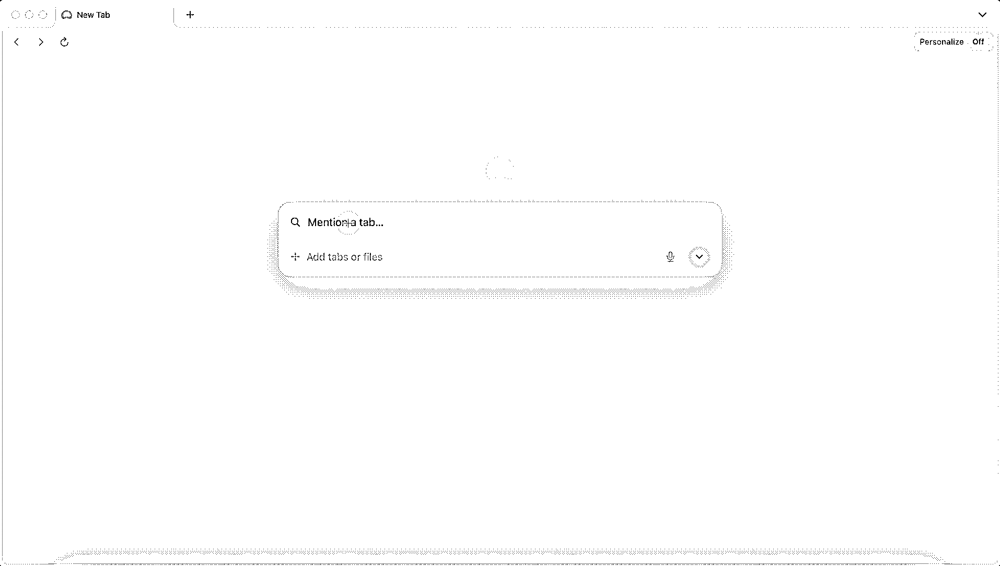
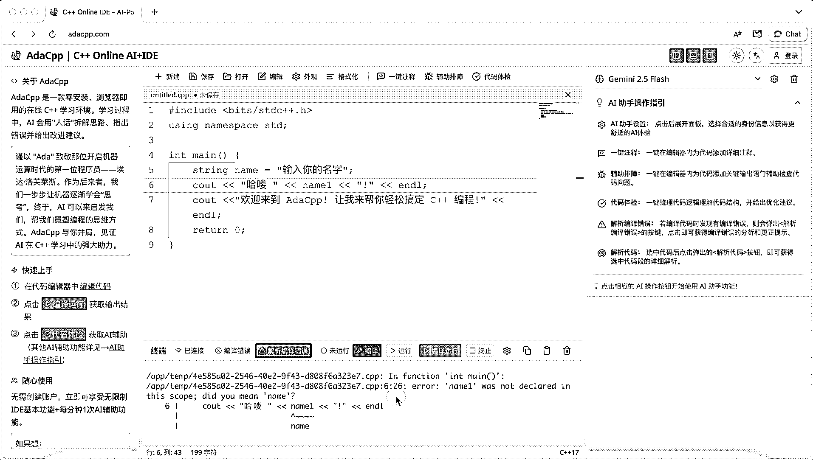
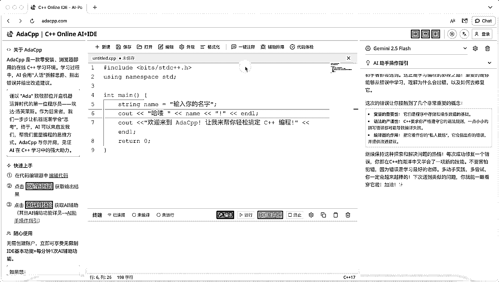
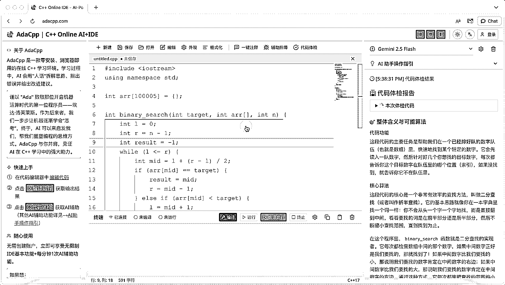
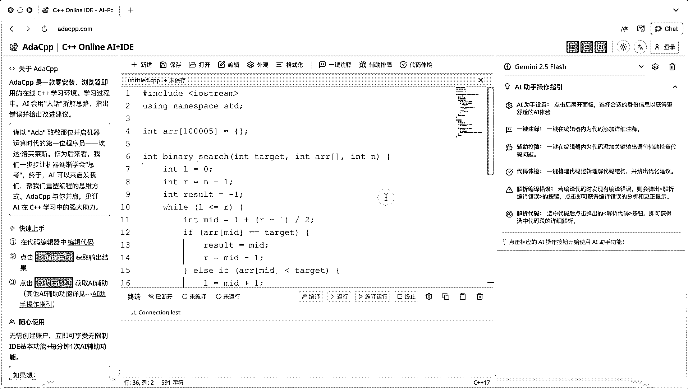

# (39 赞)为什么买了刘小排老师深海圈的课程之后产品起飞不了，但是去北京见了他之后产品马上就起飞了？

> 原文：[`www.yuque.com/for_lazy/zhoubao/ud0139q0zqpp6bk3`](https://www.yuque.com/for_lazy/zhoubao/ud0139q0zqpp6bk3)

## (39 赞)为什么买了刘小排老师深海圈的课程之后产品起飞不了，但是去北京见了他之后产品马上就起飞了？

作者： 西约

日期：2025-09-29

# **契子**

“你说，小排老师真的没有鼓动他的朋友买他们的产品吗？不然为什么六六去了北京马上起飞了，DHJ 去了北京也起飞了？”

这是生财一位小伙伴问我的问题。

然后，我：“你知道我的产品是在哪儿冷启动的不？”

# **前情提要**

嗨，大家好，我是北京 SCAI 实验室的西约（也可以叫我西西），刘小排老师《海外 AI 产品》第一期课程的学员。我在他的课程中做出了自己人生的第一款 AI 产品：adacpp.com。

为了后续方便大家理解文章内容，这里需要小小做个功能更展示。

**✨****Adacpp 是全球首款零安装、浏览器即用的 AI 驱动 C++学习平台。学习过程中，AI 会用"人话"拆解思路、指出错误并给出改进建议。**

**✨****开箱即用**

**✨****人话解析编译错误**

**✨****一键注释**

**✨****辅助排障**

**✨****代码体检**

**更详细的介绍欢迎来直接体验或查看这篇文章《**[分享在 SCAI 实验室的一个月，刘小排老师是如何引导我做出自己的人生产品的！](https://articles.zsxq.com/id_0i2zrlhkcfhp.html)**》**

# **到底该在哪里冷启动**

我：“你知道我的这款产品吧，它的使用门槛有点高。用户大部分是计算机行业从业者，或者是想成为计算机行业从业者的人。再不济的也是自己虽然不懂编程，但是知道编程的厉害，想让孩子学 C++参加竞赛拿到升学红利或者未来成为程序员的。所以我的这个产品去那种一般的地方，比如 Product
Hub 什么的，就是课程里介绍的几个网站发布做冷启动的地方发布肯定是没人看的。因为那些地方火起来的产品，用户必须是普罗大众，不能有什么大门槛，有门槛的东西得去专门的地方冷启动。”

我：“当时，小排老师给我推荐了一个地方：阮一峰的公众号。我虽然知道阮一峰，我虽然好像也知道阮一峰的公众号写着欢迎自荐，但是我真的没点开过那个自荐链接诶，小排老师说了之后，我才把所有东西都对上。”

我：“他让我去阮一峰的 github 项目上发布自己一篇自荐文章，说如果能被选中，那么就会出现在每周五的文章推荐里，这样我就可以获得一波流量。而且他说我的文章里必须写清楚痛点，加上录屏，让别人一看就知道我是做什么的。”

我：“然后！我被他选中了，当天就获得了几千的 uv 流量，后来阮一峰还把推荐同步发在 twitter 上，之后差不多就是每天 300 多的 uv，然后我就觉得我大概是冷启动成功了。”

我记得那天是周三，拼死拼活写了一篇文章发出去，然后过一会就刷一下阮一峰的 git 项目看看自己有没有被选中，发现被选中之后赶紧截图给小排老师。然后悬着的心放下去了一秒之后又提起来了，想着不知道阮一峰什么时候会发布文章，不知道我的 adacpp 到底能不能接住那么多流量。（文章现在还在阮一峰的 git 项目上，有兴趣大家可以自己去找找看）

我：“嗯，我就是这样冷启动的。”

我：“然后你看兔老师的《citely.ai》，小排老师可没推荐她去阮一峰的公众号发布，而是让她去参加一些比赛，因为她的产品很高大上，参加比赛更容易吸引大学生的目光。还推荐她去参加了大树的访谈，因为她做的东西很有话题性，所以一下就成了爆款，她那篇采访直接万赞万藏了。”

我：“你看，小排老师都会根据我们每个人的产品给我们推荐冷启动的地方。”

我：“包括你看六六，她的《我在》最开始是在小红书拿到了第一波内测用户，但是小排老师坚定地让她选择公众号，一个是因为小红书的天花板太低，还有一个原因是她做的是小程序，公众号文章和小程序天然就适合在一起，从文章可以直接打开小程序，丝滑转场。”

我："当然还有 DHJ，也是一样的，他们的产品《evolink.ai》是服务开发者的，所以小排老师就让他们去开发者最多的地方冷启动。”

我：“他真的会为每个人推荐成功的最短路径！虽然你看到的可能是他在秒回你，但只是因为他对这个事情太了解了而已，他的回答一定是经过深思熟虑的。他这个人，就喜欢默默为别人付出。”

我：“为啥他们去了北京就起飞了，因为他们没在微信上问他呀，见了面才问的，所以见了面才起飞。你要是在微信上问问他，你也能起飞！”

其实以前我一直不理解小排老师课程介绍里的这句话“实现最短路径”是什么意思，甚至偶有感觉这是一个病句。不过鉴于我有个基本的认知是他写不出病句，所以只能认定是他另有深意了。还好我一直觉得他另有深意，今天感觉自己也算揣摩明白了他这个深意。

不过我要特此说明一下：以上内容全都是我自己的揣摩，小排老师到底咋想的，我也不知道。

# **只靠冷启动是没用的**

以上，就是我给小伙伴的回答，如果你也有这个困惑，希望也能帮你解答。

但是如果你说，那我现在去问小排老师，我在哪里冷启动最好，是不是马上也能起飞？

我不置可否。

我觉得我们能以这样的方式冷启动，是因为我们选择了做这样的产品。而我们选择做这样的产品，是因为这样的产品有真的满足了用户的需求，是因为我们适合做这样的产品合适。

比如我，我以前一直参加编程竞赛，写题对我来说是件挺有吸引力的事情，而且我也做过编程辅导，深深地知道大家在学习编程的时候会遇到什么问题，所以我才很适合去做一款辅助编程学习的 IDE。而又因为我做了针对国内用户的一些特殊处理，所以在国内的科技大 V 阮一峰这里推广最合适。

兔老师本身是大学教授，在论文写作这一块上有着得天独厚的优势，她平时自己要写论文，还要搞定学生写论文的各种问题，她做的论文相关的产品就是在帮自己解决问题，在帮同时解决问题，在帮学生解决问题，所以她来做论文写作的提效产品一定是最合适的。因为兔老师的产品瞄准的是大学生和大学教授，所以去大学生聚堆的创业比赛展示产品就能收获用户。

六六本身学的就是心理学，特别懂用户需要什么，只有她能感知出市面上到底哪个产品是好的哪个产品是差的。而且她做的是语言类产品，需要对文字有着极深的理解，所以暂时是只做国内用户。她的目标用户使用产品的场景是在手机使用，所以最终才选定了小程序这样一个轻量级的手机产品应用。而正是因为她先选择了小程序，才有后续的公众号推广。

DHJ 也是，她做的是聚合类的产品，因为她之前就一直在做支付聚合，特别懂聚合这一套的逻辑，稍微迁移了一下子就找了最合适自己的最短经。

所以冷启动的最短路径一定是依托最初的产品选择。

而产品的选择一定是依托于你到底是谁，你能为用户提供什么样的服务。

我记得 19 年的时候在光华听过一节投资课程，是宁德时代的早期投资人讲当初为什么要投资宁德时代（顺带提一句，听课的时候宁德时代的股价只有 80 块，但是相较于他们的投资价格已经涨了好多了）。他的核心逻辑就是，他们投资的不是企业，而是曾毓群这个人，因为这个人太适合做宁德时代了，他来做一定能成。

我觉得这个逻辑和小排老师告诉我们该怎么选产品的逻辑是不谋而合的，一定要找到适合自己的赛道，找到真需求才能做得非常轻松。

# **怎么找到那个可以冷启动的项目**

最后的最后，我想分享一下我是怎么花了一年时间重新认识了自己，找到那个“冷启动有用”有用的项目的。

我认为大体上可以分三个步骤：

1. 找到你喜欢的事情

2. 找到你擅长的事情

3. 找到有价值的事情

## **找到你喜欢的事情**

**  **

我在开始做 AI Web 站之前陆陆续续做个几个有点成绩的小项目，但是每个项目做出成绩之后我都不太开心，用朋友的话形容我就是天天在搞新事情，也不知道图个啥。

我曾经一度在到底要“先赚钱再去做自己喜欢的事情”和“做自己喜欢的事情但是不赚钱”之间摇摆犹豫不知如何抉择，直到后来我开始意识到，如果做自己喜欢并且有价值的事情，那么就是可以得到别人金钱上的认可。当我发现我还有第三条路可以走的时候，我开始苦苦挖掘，我到底喜欢什么。

说来有点扯，那个时候我描述不出来我到底喜欢什么，甚至也不知道可以去哪儿找自己喜欢的，或者说痴迷的事情。我甚至非常羡慕我那个追星的大学室友，因为她非常明确地知道自己喜欢什么。

我不知道该怎么办，但我想也许书里有答案，我也不知道该看什么，但我打开了微信读书，我在畅销书里翻来翻去，然后被一本《数学的雨伞下》吸引走了目光，然后我就记下了这样一个词：数学。

但是我太菜了，我好像没能力拿数学赚钱，而且我发现我记下来的这个词数学，好像一点也没用，因为我在看了几本数学书之后，发现自己的兴趣又陆陆续续转移到了心理学、艺术、历史、地理、脑科学……

直到我读到了一本《贪婪的多巴胺》，我才发觉好像我喜欢的事情只是去接受新鲜的东西，什么都行，只要新鲜，来者不拒。

至此我觉得我完成了第一个小小的里程碑，明白了自己兴奋来源到底是什么。如果你也没有什么特别的兴趣点，我严重怀疑你和我一样，都是只喜欢新鲜。

## **找到你擅长的事情**

然后我又接着读书，读到了一本《如何找到想做的事》的时候，我直拍大腿就恨为什么现在才看到这本书。书里介绍说一个人想做的事=喜欢的事✖️擅长的事✖️重要的事。我这一章节的小标题就是引自这本书，只不过我把最后重要的事改成了有价值的事。

我为了明确自己到底擅长什么，就按照书里的指引不断剖析自己，详细列出了自己过往经历中取得的成绩，通过这些成绩再总结出自己比较得心应手的 100 件小事。

这个列举的过程有个小小的 tips，一定一定不能妄自菲薄。我给自己定了一个小小的标准，只要一件事我比身边的 10 个人做得好，那么我就把它当做我擅长的事情。

同时我要邀请了几个比较信任的朋友，让他们来评价我，虽然我觉得他们可能有点子彩虹屁。但是我本着宁可信其有的原则，也把这些特点列在了我的表格里。

完成初步列举之后还需要不断归类总结，把相似的东西融合在一起，就这样最终确定了一个我擅长的事情的列表。

特别巧的是，在我刚刚列举完的时候我发现生财的航海里竟然有一个盖洛普航海，于是我赶紧给自己做了一个盖洛普测试，发现测出来的内容，竟然和我自己归类总结出来的几大特质不谋而合，开心极了。

至此，我终于觉得对自己，我不再是一知半解了。

## **找到有价值的事情**

故事到这里还没有结束，我知道我只是了解了自己，但是我还并不知道我该做什么事情。因为要做的事情得是有价值的事情，而我认为有价值不应该只对自己有价值，还应该对别人，甚至对人类有价值。那到底怎么评价是不是有价值的，我选了一个简单粗暴的方法，就是看别人愿不愿意为你做的事付费。那怎么找到这些事呢？这不是巧了嘛，生财不就是个告诉大家赚钱的事都有什么的社群吗？

于是我打开生财，查找项目。

我本来的预期是希望看过所有的项目后能找一个适合我的，结果挺好玩儿的，AI 出海排在最前面，然后我一下子就选中了 AI 出海。

当时还怕自己太草率，又把其它的项目也好好过了一遍，结果发现还是 AI 航海最适合我这个 I 人。总能接触到新鲜的内容，还不大需要和人沟通！

怎么说呢，就是在没遇到对的之前我也不知道什么是对的，但是遇到了对的，瞬间就能知道它是对的。

当我确定了我要做 AI 出海的时候，又又又又又一次很幸运地遇到了北京 SCAI 招募+刘小排老师开课，然后就有了我的第一款产品 adacpp.com。

# **结语**

最后想说，很开心，很开心，很开心，很开心。

很开心遇到生财，很开心遇到小排老师，很开心在生财结识到大家，很开心终于可以和真实的自己结伴同行。

最后的最后，如果你也迷茫，希望这篇帖子能帮到你，快快找到那个超适合自己的项目~灵感急急如律令！

* * *

评论区：

暂无评论