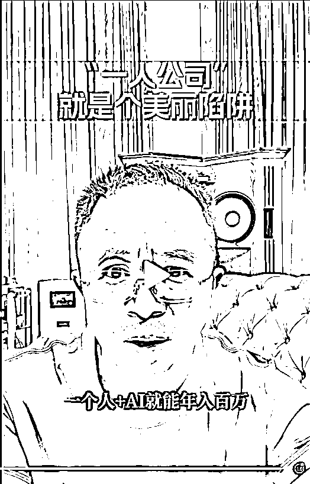

# (30 赞)周鸿祎：一人公司，年赚百万，真的是个美丽的陷阱吗？

> 原文：[`www.yuque.com/for_lazy/zhoubao/cdexks65vnpih8ai`](https://www.yuque.com/for_lazy/zhoubao/cdexks65vnpih8ai)

## (30 赞)周鸿祎：一人公司，年赚百万，真的是个美丽的陷阱吗？

作者： 东山老师

日期：2025-10-05

这年头，关于创业，关于赚钱，真的有太多太多的观点了，有些观点听一次是热闹，听三次才见真章—— 最近周鸿祎聊 “一人公司” 的视频，我连看 3
遍，越品越觉得戳中了实践者的痛与悟。

因为视频发不到这里，下面我先把视频核心内容整理成逐字稿（备注：关键信息我做了加粗，你要看原视频可以找我）

再用我个人的实战经历聊聊看法，补上大家最关心的“一人公司利弊”“常见问题”，最后咱们聊聊这事儿的终极意义。

**下面是视频逐字稿：**

**  **

“一个人加 ai 就能年入百万，醒醒吧

**90%鼓吹一人，公司的人自己都没干过。**

**  **

最近看到很多一人公司年入百万的毒鸡汤，什么一台电脑加 AI 工具就能财务自由。

我跟你说，这根本就是个精心包装的美丽陷阱，不是我危言耸听，而是见过**太多创业者抱着一人公司年入百万的幻想，最后不仅没赚到钱，还把自己熬的身心俱疲** ，大家身边有没有人踩过这个坑，先在评论区聊聊。

**90%鼓吹一人公司的人，要么自己从没真正运营过，要么背后早有隐形团队。**

**  **

**那些一人公司成功案例，要么创始人本身就是十年以上的全栈专家，要么背后有隐形合伙人是刻意隐瞒了团队支持。**

**  **

从技术角度看，ai 工具确实降低了某些环节的门槛，用纳米 ai 写文案。作图做视频，用 no code
工具搭网站，这些都没问题，但当你真正要把产品推向市场，你会发现技术层面一个简单的支付接口对接，就能让你卡壳三天。

商业层面获取第一批用户容易获取第 1000 个用户难如登天，用户层面，每个人的需求都不一样，你根本没时间和精力一一响应。

最致命的是认知负荷。

**心理学家早就证明，人类大脑同时处理的任务不能超过四个，而一人公司要求你同时扮演产品经理，设计师，程序员，运营销售客服，这不是能力问题，这是违反人类认知规律**

**  **

看看互联网发展史，没有一家伟大公司是靠一人模式成功的，为什么？

因为创新本质上是集体智慧的结晶。而不是单打独斗的英雄主义。

未来一人公司概念会像元宇宙一样泡沫破裂，但这不代表个体创业者没有机会。

恰恰相反，我看到三个明确趋势

**第一，微型协作网络将取代一人公司。**

**  **

不是一个人活成一支队伍？

而是一个人链接，多支专业小分队。

就像电影导演不需要自己会摄影，剪辑，配乐，但知道如何组织专业人才完成作品。

**第二。AI 将成为协作中枢，而非全能助手。**

**  **

聪明的创业者会用 AI 管理外包团队，协调专业服务自动化重复工作，而不是妄想用 AI 替代所有专业角色。

**第三，专业深度战胜全能幻觉**

**  **

与其勉强自己成为样样通样样松的全战选手，不如在一个领域做到极致。

其他环节通过合作网络解决这三个趋势里，大家觉得哪个对自己最有用？

光说趋势不够，我给大家五条务实建议，帮你避开陷阱。记得收藏。

**第一，用最小可行团队思维替代一人公司幻想，哪怕只有二到三人的核心协作。**

**  **

**第二，建立专业外包清单，把财务剪辑等非核心工作交给专业人士**

**  **

专业的人做专业的事才是最高效的选择。

**第三，每天划出三小时深度工作时间，专注你的核心竞争力，守住你的核心优势，才能立住脚。**

**  **

**第四，使用 AI 工具作为协作加速器，而非全站替代品，**

**  **

用类似纳米 AI 这样的智能体帮你省掉，重复劳动，把时间花在需要人类判断力，创造力的环节上。

**第五，加入高质量创业者社群补知识，找资源。**

**  **

避免当局者迷优质的圈子能帮你少走很多弯路。

**最后想说创业的本质是解决问题，是合作，不是表演全能单打独斗，真正的商业奇迹从来不是一个人的狂欢，而是一群人的合唱。**

**  **

现在你们准备好放下英雄主义，开始搭自己的协作网络了吗？

欢迎在评论区分享你的计划，也可以说说还有哪些创业困惑，咱们一起交流。”

OK，以上是他的逐字稿全文内容，我已经把其中比较关键和重要的部分用加粗字体标注出来了。

**周鸿祎这张嘴，我喜欢，有啥说啥，看起来就很真诚。**

**  **

**他戳破的不是个体创业的希望，而是不切实际的幻想——****清醒，才是创业的第一堂课。**

**  **

接下来，我会从以下几个方面来详细分析和讨论这个事情的来龙去脉。

**一、我对周鸿祎的“一人公司” 的视频：80% 认同，2 点想补。**

**  **

看周鸿祎的视频时，我总忍不住点头—— 很多话都像我自己踩过坑后悟出来的。

但作为一线实践者，我有两点想补充，也想说说我的真实经历。

毕竟观察是旁观者的清醒，实践是参与者的修行——只有两者结合，才能看清 “一人公司” 的真面目。

**（一）先澄清两个关键点**

**  **

周鸿祎他自己就是一个上市公司老大，他离真正的“一人公司”远了点，所以他的少了点 “一线痛感”：

我自己做 “一人公司” 时，带几十个人做陪跑，试过熬到凌晨三点还在改客户方案、有时候生病时连个替班的人都没有 —— 这些 “细碎的苦”，旁观者很难完全体会。

所以，周鸿祎的观点偏向行业观察，咱们听的时候，得结合自己的实际情况调整。

其次，他文稿有 AI 痕迹，缺了点 “人间烟火”：

我用 AI 写过文案，一眼就看出这份逐字稿的 “规整”—— 逻辑太顺、语言太 “标准”，却没提 “一人公司怎么控制成本”“没人商量的孤独感”。

而，这些都是我们做一人公司时每天要面对的问题，不能忽略。

另外，我得跟大家明确：周鸿祎说的“一人公司”，其实不是真正意义上的一人公司，更多的描述的是 “一个人闷头干”的 “超级个体” 模式。

**（二）我最认同的两个观点：戳破“神话”**

**  **

神话之所以是神话，就是因为它只活在故事里，不在现实的土壤里。

**1****.** **“一个人 + AI 年入百万”？别做梦，那是少数人的游戏**

**  **

周鸿祎说“醒醒吧”，我太懂了！

我做“一人公司” 这么久，清楚 “年入百万” 要是指净利润，有多难 —— 现在能做到的人，我估计不到 5%，哪怕有 AI 也一样。

因为现实世界就是这样，90%的人其实并不适合创业，只适合做牛马。不是因为他们不够努力，而是因为：他们缺乏基本的商业底层思维，缺乏专业的沉淀，大部分还有点懒，还既要又要还要更要也要，还盲目相信故事.....

真的，我很多时候都莫名的感叹：某些行当里，真的傻子多到，骗子都不够用的程度，尤其出一些新鲜的风口和商业概念时，有些人真的飞蛾扑火一般。

我认识的实现了一人公司年赚百万这个目标的人，没一个是“AI 速成” 的：有个做品牌咨询的，在行业干了 12 年，客户全是老客户转介绍；

有个做自媒体 IP 的大咖，自己吭哧吭哧的写了七八年的文章，积累了 10 来个手机的读者好友。

你看，他们的核心是“积累”，不是 “工具”——A**I 只是省了写方案的时间，真正让你赚钱的，是十年磨一剑的专业能力。**

**  **

我自己做一人公司，这 3 年半的时间能撑下来，其实也是靠之前的积累，要是让我一切从零开始，别说年入百万，能不能活过半年都难说。

**2）周鸿祎说：90%鼓吹一人公司模式的人，实际上自己都从未真正独立运营过这样的企业。仔细观察就会发现，这些大肆宣扬一人公司理念的所谓"成功者"，要么是缺乏实际创业经验的空谈家，要么就是刻意隐瞒了背后存在的隐形团队支持。**

**  **

**那些被包装成一人公司成功案例的创业者，要么本身就是拥有十年以上全栈经验的行业专家，要么就是通过精心设计的营销话术，刻意淡化了合伙人或团队的关键作用。**

**  **

以上这些观点我深表认同。

**我其实认识蛮多一人公司的从业者，鼓吹的人藏着私心，藏团队的人藏着真相** —— 剥开包装，才能看到一人公司的真实骨架。

我见过太多“伪一人公司”：有人开课程说 “自己一个人年入百万”，背后却有 15 人的团队做文案、私域；有人晒营收截图，其实把家人算 “兼职”，本质还是团队。

**他们把 “一人公司” 包装成 “躺赚神话”，无非是想卖课程、做陪跑，赚你的钱而已。**

而且，我也太知道一些所谓的躺赚案例是怎么来的，有一些人偶尔踩了狗屎运，某一个月忽然通过一个什么项目收到了七八万的收入。（记住，是收入，不是利润）

然后她的妄想症就来了：我艹，我要是每个月都这样，那岂不是年赚百万了？然后再收一帮弟子，各种商业模式合作.....想的就很美。

于是就去写文章，说自己一年可以赚几百万（不太好意思写真实的数据，要么乘以几倍，要么后面加个 0），具体是如何如何去做的？

事实上，这种项目就是在某一个月忽然间收到了几万块而已，硬生生的被包装成了一个年赚几百万甚至上千万的业务，牛逼吹爆了，就真的有傻瓜来咨询付费....

但，赚钱，哪有那么容易呀！

真正的“一人公司”，要赚到第 1 个 100 万，往往都是扎扎实实的干出来的。

而且也会付费去找一些帮手，所以他们都是经过 “取舍后的专注”：我不擅长设计，就找外包做海报；不擅长财务，就找代账公司；只专注 “教培咨询”——
这才是真实的状态，不装、不演。

更重要的是，所有真正能够持续运营的一人公司，都必须建立在某些关键资源或能力的基础上。

以我个人的经历为例，能够实现预期目标的核心原因在于：我拥有稳定的客户资源积累、成熟的行业人脉网络、经过验证的商业模式，以及多年积累的专业技能体系。

这些才是支撑"一人公司"能够实际运转的基础条件，而非简单的概念包装或营销话术。

**1）在过去的十年间，我以专业顾问的身份实地走访了近万家教育培训机构，其中深入调研并协助解决问题的机构超过 2000 家。**

**  **

这种密集的实地考察让我对这个行业形成了极其深刻的认知，从招生运营到教学管理，从团队建设到品牌推广，每个环节的痛点和解决方案我都了然于胸。

而且我还写了很多的专业书籍，开发了好几套系统的线上课程和线下课程，写了几百万字的行业经验笔记等。

得益于这种丰富的实战经验和我善于归纳总结的特质，往往只需要简单观察就能精准诊断出机构的问题所在，因此业内同仁都亲切地称我为"教培老中医"——这个称号既是对我专业能力的认可，也体现了我在解决行业疑难杂症方面的独特造诣。

**2）在这个过程中，我还逐步构建起了宝贵的私域流量池和忠实用户群体。**

**  **

即便是在业务转型后，我的私域用户仍然保持着 8000 多人的规模，虽然这些年经过多次筛选和精简，目前依然保持着 2500 多位高质量的联系人。

尤为珍贵的是，我培养出了一批铁杆支持者，这个核心群体约有 100 人左右，他们对我有着极高的信任度，无论我推出什么新产品或服务，他们都愿意积极参与和支持。

正是这些年来积累的深厚用户基础和信任关系，才让我有底气接受年赚百万的挑战。

试想如果没有这些资源积累，让我从零开始搭建基本盘，要在一年内实现百万营收，说实话我确实不敢轻易打这个赌。

就拿"一人公司陪跑"这个服务产品来说，基本上每天都有各种人让我去开课程，做付费社群，但是我一直都不为所动，因为我知道：我没有太多这方面的私域积累。仅靠冷启动的话，我确实会感到信心不足。

**二：关于一人公司，我个人的深入见解与经验分享**

**  **

作为一个多年来始终坚持一人公司模式的实践者，我不仅亲身践行这种工作方式，也时常在行业内分享自己的心得体会。

其实，因为我没有从“一人公司”的分享里赚到什么钱，我暂时也没有什么训练营，没什么陪跑营，没什么线下课，我仅有一个知识星球，也是准备停更了。

有时候，我真的不想讲太多，但看到很多人对于“一人公司”总有误解和踩坑，又忍不住要说几句。

通过长期的探索与积累，我对一人公司形成了较为系统且独到的认识。

**1）一人公司年赚百万，究竟是美丽的陷阱还是可行的目标？**

**  **

我的观点是：一人公司年赚百万确实是一个美好的愿景，但绝不能简单地将其定性为陷阱或现实。

对于某些特定群体而言，这个目标确实可能成为陷阱。比如：

1）缺乏行业基础知识和必要技能的新人

2）没有任何客户资源积累的创业者

3）不具备基本商业思维和创业意识的人

4）难以保持专注力、容易半途而废的个体

5）心态浮躁、急于求成的从业者

6） 面对困难时容易盲目尝试各种解决方案的人

7）不爱学习，不愿意去思考的人

等等，当然还有很多，又懒又笨，还不爱努力干，还听信各种神话故事的人，那更难了。

然而，对于具备以下条件的专业人士来说，这个目标完全是可以实现的：

1）拥有 10 年以上深耕某个垂直领域的经验，有自己的作品和体系

2）已经建立了稳定的客户资源，起码有 10000 个左右的私域吧。

3）能够精准定位并解决目标客户的核心痛点，能够接受几千元一小时的咨询。

所以，这种人，哪儿是年赚百万那么简单的呀，说句不怕打脸的话：以我目前的专业能力和资源积累，如果组建一个 20 人左右的团队，年收入完全可以突破几百万级别。

我之所以选择一人公司的模式，是因为我更看重工作与生活的平衡，追求更高效率的工作方式，而非单纯追求利润最大化。

因此，一人公司年赚百万的本质在于：**这实际上是具备更高创收能力的专业人士，为了实现时间自由、工作自主和生活平衡，而主动选择的一种精简商业模式。我们不是不能赚更多，而是选择了更适合自己的工作和生活方式。**

**  **

所以，当你选择了一人公司的创业模型：甜与苦，都得认。那些天天吹泡沫的，不一定是真的。

成本低是一人公司的“糖”，资源少是它的 “苦”，甜苦交织才是真实的创业滋味。

**（一）一人公司的“甜”**

**  **

1：时间相对自由

说是相对自由，只是说我的时间我能做主。

时间自由不是“想不做就不做”，而是 “想做什么就能专注做”—— 这是一人公司最诱人的光。

但，一人公司也是不太自由的，基本上也需要每天上班，每天做交付，每天踏踏实实的贡献内容.....

只是不用打卡、不用开无效会议，不用说要去接个孩子，打个球还要请假而已。

所以，我现在基本上是上午做内容、下午磨产品和交付、晚上做自己，节奏全由自己定。

去年我想陪孩子去旅行，提前把工作安排好，走了半个月也没耽误事 —— 这是打工或带团队很难做到的。

2：成本可控

一人公司不用租大办公室、不用发员工工资，我现在就租了个小办公室，每月房租 3000
块；加上水电什么的，一个月的成本不会超过 3500 块，这就是我们所有的创业成本。

我们没有助理，没有员工，不用发工资，我把成本控制到极低，就有很大的从容面对各种困难的空间。

3：决策高效

一人公司最大的核心是自己说了算，客户要改方案、想新增服务，我自己拍板就行，不用跟团队商量、不用走流程。

**二）一人公司的“苦”**

**  **

但一人公司并不是超级好的模式，里面有很多的坑和苦，只是有些人刻意不说而已。

**1：一切都是自作自受**

**  **

我尝试过接近半年，真的没有一毛钱收入，全靠啃老本的。

那段时间，一个人扛下所有的代价，是连崩溃都得挑时间—— 一人公司，一切都是自作自受，做过的人才懂。

**2：资源有限，想做大难**

**  **

一人公司的资源天花板很明显：我自己再能，也只能服务 100 个客户，天花板就在哪里，看得到的。

所以我们才要做高客单价，要做高客单价就要提升产品的价值，对于自己的专业能力需要提出非常大的挑战。

**3：孤独感强，没人商量，没人分担**

一人公司对我而言，最难受的不是累，是“没人说心里话”。

我们其实也遇到很多的苦的，有时候做的累死了，劳心劳力去支持一些客户，但他们还不满意，还各种吐槽你，明明是他们自己瞎，但她硬要说是你的缘故，这种情况也是心累。

心力调整是一人公司不得不面对的话题，所有我用 GPT 和元宝等都创建了心力教练，基本上每周我都会和这个教练聊聊天。

一人公司其实蛮孤独的，所以偶尔我才会在一些社群里做话痨，其实就是为自己的情感找一个出口而已。

所以，如果你确定了要做一人公司的模式，你一定要清晰的理解：什么是真正意义上的一人公司。

**一人公司经营的关键是"公司"行为，而非"一人"。**

**  **

要深入理解这个概念，我们需要明确区分"公司行为"和"个人行为"的本质差异。

所谓"公司行为"，其核心在于以企业化思维运作。

这首先要求经营者具备明确的公司主体意识，将事业视为一个完整的商业实体来经营。

这类经营通常具有以下特征：业务方向高度垂直聚焦，拥有完善的产品体系和服务矩阵，商业模式经过深思熟虑且逻辑严密。

更重要的是，这类经营往往能够保持 5 年以上的业务稳定性，展现出持续发展的韧性和长期价值。

经营者会系统性地考虑品牌建设、客户关系、供应链管理等企业运营的各个方面。

而"个人行为"则呈现出完全不同的特征。这类经营更多表现为副业性质、超级个体或项目导向的模式，往往以追逐短期风口为主要特点。

其典型表现包括：利用业余时间从事经营活动，主要目的是获取额外收入；

缺乏明确的产品定位和稳定的业务逻辑；

经营方向经常随市场热点变化而大幅调整，今年和明年从事的业务可能截然不同。

这种模式下，经营者更多是凭借个人技能或资源进行短期变现，而非建立可持续的商业体系。

在这种情况下，如果硬要将这种个人化的经营模式冠以"一人公司"的名号，显然是难以令人信服的。

因为真正的公司化经营必然是以商业逻辑为主导，注重建立稳定的商业合作关系，包括相互采购服务、建立合作关系等。这种经营方式更加理性和系统化。

**事实上，只要选择足够细分和深入的赛道，打造出高价值的产品或服务（定价在 2-5 万元区间），实现年收入百万的目标并非遥不可及。**

**  **

市场上已有大量成功案例证明，通过公司化运作的一人经营模式完全能够达到这样的商业成就。

关键在于坚持企业化思维，建立可持续的商业模型，而非停留在个人化、项目化的经营层面。

**3）AI 只是加速器，不是万能的**

**  **

如今这个时代，似乎做什么事情都要扯上 AI，否则就显得落伍了。

但我们必须清醒地认识到，AI 本质上只是一个工具，一个能够提升效率的加速器，而非无所不能的魔法棒。

事实上，在我接触到和认识到的一人公司里，至今仍存在着大量成功的一人创业公司，它们完全依靠创始人的专业能力和商业智慧运转，不太需要借助任何 AI 技术，照样能在各自的领域做得风生水起。

AI 就像西游记里的如来佛祖，也像武侠小说中的屠龙宝刀，它们本身都蕴含着巨大的力量。

但关键在于使用者的能力和智慧——许愿的人要明白自己真正想要什么，持刀的人要懂得如何发挥武器的威力。

AI 就静静地存在于那里，不会自动增加也不会无故减少，它的价值和作用完全取决于使用者的指令和定位。

你让它扮演什么角色，它就会成为什么角色；你让它完成什么任务，它就会执行什么任务。

然而，这一切的前提是使用者必须能够提出正确的问题。

我见过太多这样的案例：有些人即便每月花费 250 美元订阅最顶级的 AI 服务，最终也只能发挥出类似"豆包"这样的基础功能。

原因很简单——一个人永远无法提出超出自己认知范围的问题。

一个人能否把 Ai 用处效果，还是拒绝这个人，这个人的底蕴和认知，而不是 Ai 本身。

所有同样一个 Ai，在亦仁手里，在刘小排手里，他们就是屠龙刀，在一些普通人手里，就是一把切菜都还嫌笨重的菜刀。

如果你的知识储备有限，思维模式固化，再强大的 AI 也无法帮你突破这个认知边界。

这就像给一个小学生一台超级计算机，他最多也只能用来做做算术题而已。

**三：如何判断你适合做“一人公司”？5 个标准**

**  **

适合的路，走起来再累也有方向；不适合的路，再轻松也会绕远—— 判断自己能不能做一人公司，先问自己这 5 个问题。

**1：有没有“十年深耕” 的专业能力？**

我觉得至少要在一个领域做够 10 年 —— 不是 “混 10 年”，而是 “懂透 10 年”。

比如我做教培咨询，从招生到管理，每个环节的痛点都摸得透透的，客户才愿意信任我。

如果刚入行一两年，连行业规则都没搞懂，别轻易试，大概率会被坑。

**2：有没有“不用从零开始” 的资源？**

**  **

这里的资源主要是客户和人脉。我刚开始做“一人公司” 时，前 3 个月的客户都是老客户介绍的，根本不用找新客户。

如果你没任何客户，得先花半年甚至一年积累，别想着 “一开工就赚钱”—— 巧妇难为无米之炊。

**3：能不能“一个人扛事”？**

**  **

“一人公司” 没人帮你兜底：客户催单时，没人帮你写方案；外包出问题时，没人帮你沟通；生病时，都得爬起来回复消息。

我去年发烧到 39 度，还得给客户开线上会 —— 如果你扛不住这种压力，还是找个团队吧。

**4：你自律性够不够？**

**  **

一人公司看似不用打卡、不用汇报，够自由了吧？

但，正儿八经的创业，哪有那么好？

我每天固定 8 点起床，上午做内容、下午做交付，雷打不动。

如果你的自律性差，在家办公就刷手机、追剧，肯定做不好 —— 自由的前提是 “能管住自己”。

**5：有没有正确的的商业思维？**

**  **

一人公司不是“赚多少花多少”，得算清楚成本、利润、复购率。

你的对于一人公司的本质有非常清醒的认识，你知道你的客户是谁？你能解决什么问题？你收多少钱？要收多少人才完成目标？人从哪里来？如何低转高？如何策划能够源源不断转介绍和持续复购的产品.....

6：你有没有舍得和合作的思维

这也是很重要的，有些人天生就死抠死抠的，在一些群里有红包拼命抢，从来不发一个；有些人一加过来，发完简介后就发一大堆的问题，红包都不附带一个的.....

有些人嘴里天天谈各种合作，但从来不说怎么分钱的，天天说我们是好朋友，但从来不谈钱的.....

我觉得这样的人，想一人公司年赚百万，呵呵，有点难哦。

这些都是要命的，是需要不断的用双脚蹚出来的经验。如果你还想做一人公司，**我用真金白银换的 6 个避坑方法，**

这 6 个避坑方法，是我摔过跟头后总结的，亲测有效，也是周鸿祎视频里提出的一些建议。

**1：别迷信“全能”，该外包就外包**

**  **

我刚开始什么都想自己做，设计的海报丑得没人要，算的账还出错。

后来我把设计、剪视频，财务都外包了，只专注做陪跑和咨询—— 效率提高了 3 倍，客户满意度还更高。

**记住：我们的核心是 “赚专业的钱”，不是 “赚所有的钱”** 。

**2：先兼职试错，再全职投入**

**  **

别一听到别人讲个故事，你就冲动辞职，要做一人公司，如果真是这样，马上你哭都哭不出来。辞职容易且潇洒，再找个好工作就难咯。

我建议先兼职试 3 个月：比如你想做文案，先在下班时间接几单，看看能不能赚到钱、能不能坚持下去。

我有个朋友，没验证就辞职做 “一人公司”，3 个月没接到单，最后只能回去上班 —— 太可惜了。

**3：控制成本，别乱花钱**

**  **

一人公司的优势是成本低，别把优势丢了。

我刚开始租办公室，电脑用的旧的，桌子等都是在写字楼跑上跑下捡别人不要的，连白板都是捡的，一开始连办公室的绿植都是从小区里拔的一些小小的，自己养大的。

我们是等营收稳定了，再慢慢升级。别一开始就追求 “高大上”，很容易现金流断裂。

**4：加入高质量社群，别闷头干**

**  **

“一人公司” 最可怕的是 “信息差”。

我加入了一个创业者社群，遇到问题就在群里问，经常参加一些线下聚会和课程，不一定要学到什么，关键是能够看看别人是怎么做的？

**一人公司不是 “单打独斗”，而是 “一个人链接一群人”。**

**  **

**5：别贪多求快，专注“小而美”**

我见过有人刚做“一人公司”，就想接 10 个客户、做 5 种业务，结果每个客户都服务不好。

我一直只接 “每月不超过 10 个客户”，每个客户都花足够时间服务 —— 复购率能到 60%，反而比接 10 个客户赚得多。

记住：“小而美” 比 “大而杂” 更长久。

6：付费就是占便宜，舍得为价值埋单

我现在选择 APP，基本上有会员的，都买会员，我大概算了一下，我一年大概有 3000-5000 元是买各种各样的会员的，百度网盘，QQ 音乐，微信读书这些都是常年续费的了。

其次，碰到牛逼的课程，好的书籍，闭眼入。

最后，碰到牛逼的人，要么付费，要么卖命，总之能认识就认识一下。

另外，关于一人公司常见问题，我也讲一下

创业者的疑问，从来不是“能不能做”，而是 “具体该怎么做”—— 这 5 个常见问题，是我被问得最多的，结合我的经验给大家答案。

**1****.** **一人公司需要注册公司吗？还是个体户就行？**

**  **

看你的业务方向：如果只是接小单子（比如偶尔写文案、做设计），个体户就行，手续简单、税也低；

但如果想做长期业务（比如咨询、服务），建议注册公司—— 客户会更信任，也方便开发票、签大合同。

我刚开始是个体户，后来客户都要求开公司发票，我才注册了小规模公司，现在业务比以前稳多了。

但无论如何，都建议搞个小办公室，办个营业执照，而不是待在家里，弄台电脑自己干，或者天天捧着个电脑去星巴克，我是不相信这样的公司是一人公司的。

**2****.** **AI 在一人公司里到底该怎么用？真能替代人吗？**

**  **

AI 是 “加速器”，不是 “替代品”—— 这是我最想强调的。

我用 AI 写初稿（比如咨询方案的框架）、做初步筛选（比如客户需求分类），但最终的方案优化、客户沟通，还是得我自己来。

我见过有人用 AI 写的方案直接发给客户，结果客户觉得 “没灵魂”，再也不合作了 ——AI 能省时间，但不能替你思考、替你建立信任。

**3****.** **一人公司怎么解决客户信任问题？没团队没人信怎么办？**

**  **

信任靠的是“专业” 和 “积累”，不是 “团队人数”。

我刚开始做时，客户也问 “你就一个人？”，我会把之前服务过的案例、客户评价给他们看，再跟他们聊行业痛点 —— 聊得越深，客户越信任。

现在我的老客户转介绍占比 60%，靠的就是 “专业口碑”。

记住：客户信的是 “你能解决他的问题”，不是 “你有多少人”。

**4****.** **一人公司能长期做吗？会不会做着做着就没增长了？**

**  **

能长期做，但要避免“原地踏步”。

关键是两点：

一是 “深耕垂直领域”，别跟风换赛道 —— 我做教培招生和咨询快 10 年了，越做越专业，客户也越来越精准；

二是 “慢慢搭建协作网络”，比如固定合作几个靠谱的外包、加入行业社群找资源，哪怕你还是 “一个人”，也能撬动更多资源。

另外，不要盲目的相信什么风口和赛道，我们只是要一年赚一百万的目标而已，又不是要搞几个亿的大生意，我个人认为，只要扎的足够深，什么赛道都有机会。

我经常被问到：什么赛道是好的赛道.....

其实，他们问出这个问题的本质上是：有没有什么赛道和项目是我可以很懒，不用动手，很简单的就能年赚百万的。

哪有那么好的赛道呀？真的有，别人愿意免费告诉你吗？你谁呀？

**5****.** **一人公司遇到瓶颈了怎么办？比如没新客户、没新业务方向。**

**  **

别自己扛，找“外部借力”。

我去年遇到瓶颈时，业务也没增长，我就做了两件事：

一是花了 39800 元，正儿八经的去学如何做发售，后来靠私域新增了 20% 的客户，而且还把学到的技能，重新整理成适合客户用的，去赋能客户。

二是找了个行业前辈做顾问，他帮我梳理了业务方向，让我聚焦 “教培机构精细化运营”，反而比以前更精准了。

记住：瓶颈不是 “死路”，是提醒你 “该找新方法了”。

**结尾：一人公司的终极，是“一个人链接无限可能”**

**  **

一人公司的终极不是“一个人”，而是 “一个人能链接出的无限可能”。

我做“一人公司” 这么久，最深的感受是：它不是 “拒绝合作”，而是 “更懂怎么合作”——
我们不用组固定团队，但可以链接专业外包；不用每天开会，但可以加入社群交流；不用追求 “大而全”，但可以做到 “小而美”。

周鸿祎说“真正的商业奇迹是一群人的合唱”，我特别认同 —— 只是这份 “合唱”，不一定是 “固定团队”，也可以是 “一个人牵头，一群专业的人配合”。

就像电影导演，不用会摄影、剪辑，但能组织专业人才拍出好电影；

我们做一人公司，不用会设计、财务，但能链接这些专业力量，做出有价值的服务。

创业不是比谁更孤独，而是比谁更会整合—— 当一个人能精准链接专业力量，再小的个体也能活成 “微型军团”。

如果你想做一人公司，别被“年入百万” 的神话迷惑，也别怕 “一个人” 的辛苦 —— 先问自己有没有 “专业积累”，能不能 “扛住压力”，会不会
“整合资源”。

如果答案是 “是”，那就大胆试；

如果不是，那就先积累 —— 创业不是短跑，是马拉松，慢慢来，反而能走得更远。

愿我们都能在“一人公司” 的路上，既守住自己的专业，也链接到更多可能 —— 毕竟，最好的创业，是 “做自己喜欢的事，还能赚到钱，更能活成自己想要的样子”。

* * *

评论区：

骏马 : 东山出品，必属精品！

嗯 : 东山出品，必属精品！

追梦 : 所谓“一人公司”基本都是卖课镰刀们打出的噱头

彼岸 : 东山出品，比属精品[强]