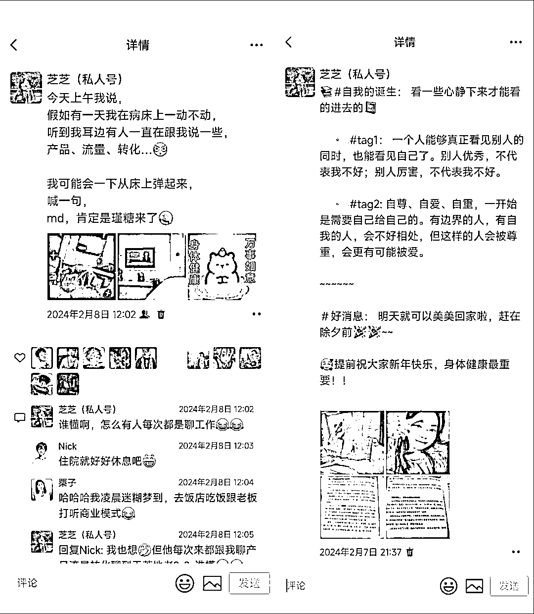
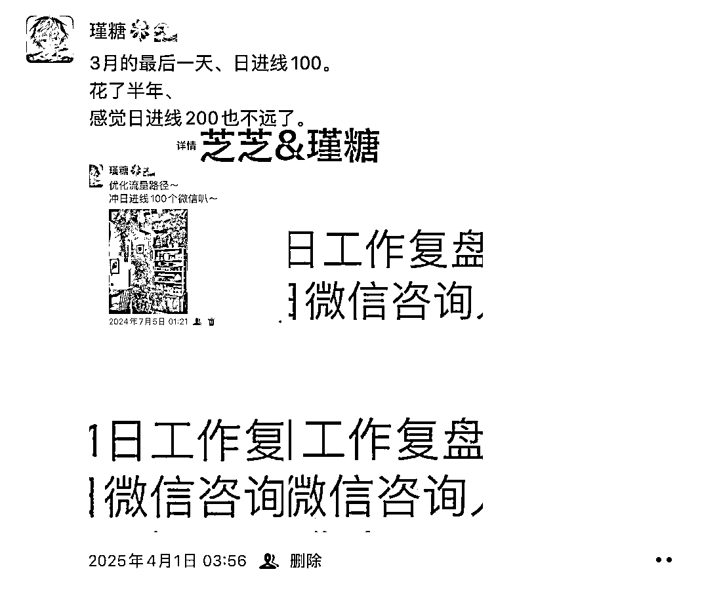
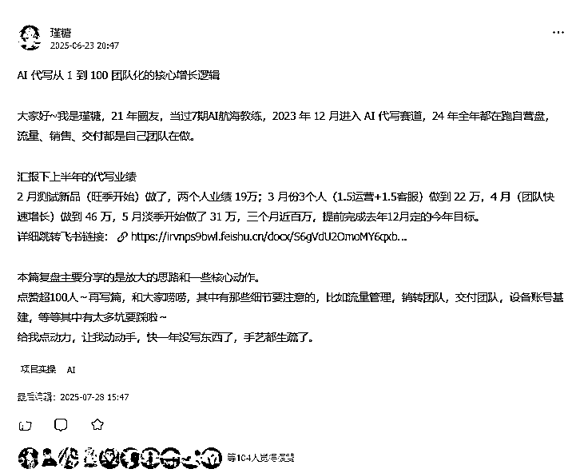
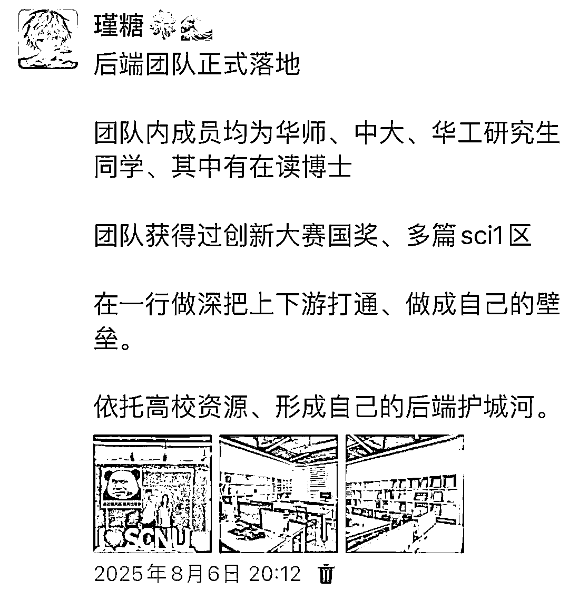
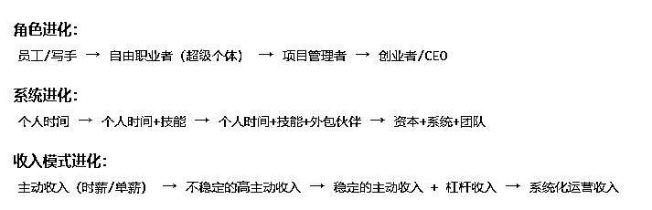

# (25 赞)副业做到什么程度才可以辞职？普通人如何把副业做成真正的主业？

> 原文：[`www.yuque.com/for_lazy/zhoubao/rse2s9cwz7hm3ky9`](https://www.yuque.com/for_lazy/zhoubao/rse2s9cwz7hm3ky9)

## (25 赞)副业做到什么程度才可以辞职？普通人如何把副业做成真正的主业？

作者： 瑾糖

日期：2025-09-29

# **一，副业做到什么程度才可以辞职？**

**打工是人类有史以来最简单的赚钱模式。**

**做副业比打工难得多，创业比做副业更难**

昨晚和一位朋友复盘，她聊到了这件事 。

她说，**我想辞职，究竟要达到什么状态才可以辞职啊？！**

**如何平衡好主业和副业？**

我觉得这是个值得好好聊聊的话题。

毕竟，我们不可能一下子就达到 all in 创业的状态，

大多人本来就是在公司上班，或是在事业单位任职。

我见过很多觉得上班辛苦、不自由、被老板 PUA 就辞职创业的，基本都赔得一塌糊涂。

那么，**如何在不与主业冲突的前提下，把副业做好呢？**

其实在主业和副业之间，我们首先要**想清楚优先级，**

结合自身现状，才能决定如何做好平衡。

**如果现在正急缺现金流，** 处于资金紧缺的状态，而副业又不能立马带来收入，

那这种情况下，就得拼命做好主业。

先让主业每个月带来稳定的生活保障，在此基础上，再通过主业积累一定的现金储备。

**但如果本身在事业单位，工作比较清闲，能把分内事做好，**

同时还兼顾着一份小副业，那这种情况就可以多花些心思在副业上。

前提是先守好主业的基本职责，把该做的工作完成，再专心投入副业。

其实无论主业还是副业，最终都有可能变成我们的事业 。

可能是副业取代主业，也可能是主业延续为事业，**二者并不冲突。**

如果还没开始副业，且主业能为副业赋能，那完全可以在主业工作之外，着手开展副业。

我之前在外打工时**，曾在一家化妆品公司做新媒体媒介。**

**离职后我才知道** ，公司里三位电商运营同事，**都有自己的店铺。**

他们在公司上班时，会借助公司的资源和平台，摸索平台的规则和玩法，等**测出有效方法后，直接用到自己的店里。**

这样一来，不仅节省了自己的投入成本，**连试错风险都由公司承担了。**

**  **

我们在公司里学经验、练技能，**老板帮我们扛下损失风险，**

其实都是在为后续的副业或事业做准备。

**普通人，还是不要轻易辞职创业。** 先做个副业，试试自己能不能赚到钱。

**比较稳妥的做法是：** 副业收入达到月薪俩倍，而且长期稳定，再考虑辞职也不迟。

如果你做副业也没赚到钱，那就安心打工好了。

一个副业项目，**至少每天投入两个小时，至少坚持三个月。**

上面这一条，**已经把 80％的人给筛掉了。**

**大部分人，如果没被管理和监督，是无法主动、长期做任何事的，所以你能坚持三个月，就已经超过了 80％的人。**

**昨晚聊的那位朋友，** 上大学时就接触了 AI 写作项目，深耕两年赚了 10 万块。

对于学生来说，这已经是相当不错的成绩了。

现在她在公司上班，不想放弃这份副业，刚好又和领导有矛盾，就动了辞职的念头。

我赶紧劝她别轻易辞职，**毕竟现在就业环境太差。**

她在这家公司，业绩拉满、拿全提成的话每月能赚一万多，

就算只做好分内事，一个月也有七八千。

我建议他**先把本职工作做好，和领导缓和关系 。**

**他们产生矛盾的原因** ，就是他想法太多，涉及决策花钱的地方总按自己的想法来，没和领导做好沟通。

其实，在公司里，不必过多坚持自己的额外想法，**做好本职范围内的事就够了。**

公司每年有既定目标，会分解到各个部门，部门领导再把任务落实到每位员工，

我们只要做好手上的事，公司的目标自然能达成。

所以，**有想法可以放在副业上，**

**主业只要保持正常状态、做好员工的基本职责就行，**

这样就能把时间精力投入到副业里。

**这位朋友的副业刚上手三四天，每天就能有一两千的业绩，刚起步就出单，这个数据非常不错。**

他现在只要稳住副业营收和主业基本盘，**等副业慢慢积累放大。**

按现在一天 1500 的业绩算，一个月能做到 45000，他能拿到的纯利大概有 2 万左右。

**积累个一年半载，手上至少能有十万、二十万的现金** 。

而且**这还只是副业当前的业绩** ，等他把副业做得更稳，

**再做放大动作，** 一年半载后，或许除了稳定的主业，副业还能组建两三人的小团队，**每月带来四五万、五六万的纯利。**

到那时，就算在公司待得不舒服、和领导意见不合，**也能丝滑地衔接 ，提出离职**

而不是像现在这样，副业刚起步，刚毕业没多久，行业里没积累，手上也没积蓄，**贸然辞职太冒险。**

这种时候，我们一定需要一份稳定的工作保障生活，

再把副业做稳，在稳定中逐步增长、积累。

等手里有了几十万现金，**副业也实现系统化运营了，**

再考虑离职，**把副业变成主业、变成事业。**

另外**，职场也是拓展人脉的地方。**

在这里认识的朋友，和创业圈里认识的朋友，维度是不同的，

能帮我们构建**更立体的社交圈** ，这也是难得的机会。

我身边大部分在上班的朋友们都处在想离职但是因为：**没有 offer or 懒得找新工作 or 裸辞后不知道该干嘛，从而不敢离职的状态。**

我觉得**判断自己是否需要拜拜可以从下面几个维度** 看下：

**1️⃣** **还有没有成长空间**

先看看手头这份工，是不是还能让你学到新东西？有没有你感兴趣但还没掌握的技能？

或者团队里、领导中，有没有你真心佩服、想成为的人？

只要还能找到一点正反馈，还能有点期待，那这份工作就还不算彻底没价值。

**2️⃣** **身体和情绪顶不顶得住**

健康永远是第一位的。

年纪越大越明白，没有什么值得拿身心健康去换。

如果一份工已经让你长期陷入焦虑、抑郁，或者身体开始报警，长期疲惫、体检一堆异常、结节囊肿纷纷上线……

是我的话，会毫不犹豫撤了，先养好自己再说。

**3️⃣** **认清自己真正要什么**

人和人真的不一样，有的人就是需要上班的节奏和安全感。

你得想清楚，你追求的是自我实现，还是只要一份稳定收入？

收益永远和风险成正比。

“我到底要什么样的人生”这种问题虽然难，但多追问自己几步，最后总会回到这个根本命题上。

**4️⃣** **有没有 Plan B 垫底**

你手上有没有后路？比如一份副业、一点被动收入？

如果最坏情况发生，你还能不能活？如果没有，现在开始准备也不迟。

所以，平衡主业与副业的核心，是基于现状判断优先级，

如果主业不稳定、副业不挣钱，就优先稳住主业；

如果主业稳定、副业能赚钱，就可以多投入精力把副业做得更好。

我们**不会鼓吹** 大家一定要创业、一定要辞职、一定要 体验不一样的人生。

毕竟我们都是普通人

**如何优雅地过好自己的生活，或许才是最大的自由。**

**  **

* * *

**  **

# **

**

# **二，普通人如何把副业做成真正的主业?**

**  **或许你现在正在上班，或许已是超级个体，正想转型自由职业者。

这个状态的你，**如何把副业一步步打造成事业？**

以我的亲身经历，**告诉你会经历哪几个阶段。**

不管是接触到某个新项目，还是在公司上班时刚好有个小机会，我们总会想 先试试水。

比如做公众号、虚拟资料或者其他项目，**或是像我们一样做 AI 写作项目。**

以 AI 写作为例，**常见的起步路径是这样的：**

上班摸鱼时、下班后接二手单，在淘宝、拼多多、闲鱼上找流量渠道，或是在 BOSS 直聘上应聘当写手。

做了一段时间写手后，**大多会遇到同样的困境。**

客户难沟通，上游流量端层层压榨，一千块的单子到手里只剩两百，还得熬夜改稿，要求多到让人崩溃。

**这时候往往会想** ，不如自己做流量，直接接一手单

于是你开始泡各大平台、社群，看相关帖子，参加 航海计划 这类实操活动，拼命学做流量。

接着就进入**边上班、边做流量、边谈客户、边自己写稿交付** 的状态。

这时候你会真切感受到，比起当被压榨的写手，**自己做流量太舒服了 。**

哪怕一天只接一单，也能有几百块利润，完全不用太复杂的技巧。

只要保证每天引流几个微信、获取几个客户资源，转化率维持在 20%-30% 以上，

成交一单只需 3-5 个客户，**每天的收入就很稳定。**

这种 上班 + 副业 的状态确实惬意，**但意外总会突然到来。**

某天一篇帖子、一个链接爆了，一天涌来 10-20 个客户，能接三四单 。

**我嘞个豆，根本接不住** ，写不过来，上班时回复客户都来不及。

这时候难免会动心思，上班一天才挣一两百，累得要死还挨骂，摸鱼都提心吊胆，**不如辞职全职干！**

**但我建议，先别急着这么做。**

现在找份工作不容易，想 苟住 工作的话，就得**理清优先级：**

流量是钱的来源，必须抓在自己手里；

转化也得亲力亲为，毕竟客户沟通的技巧不好教

请客服成本太高，不如把后端交付外包出去。

哪怕赚得少点，至少能接住订单 。

一天 10-20 个客资，能转化四五单，就算分一半利润给外包，

也比自己又做流量又写稿赚得多，还省去了沟通和写稿的时间，

**能专注在流量和转化上。**

可新的问题又来了，爆款断流了，从一天 10-20 个客资跌到只剩 1-3 个。

**普通人可能会退回去 自己接单做交付** 。

自己做流量、自己写稿，副业一个月能挣五六千，加上工资月入过万，看着很香。

**但熬夜、兼顾工作和副业，很容易心力交瘁，甚至病倒。**

一旦倒下，副业停摆，还得请病假，得不偿失。

所以，想把副业做成事业，从一开始就必须有 **做事业 的想法和规划。**

如果只把它当副业，**你永远在 用时间换钱；**

但如果以事业的视角去规划，**路径会清晰得多。**

首先要倒推，你想要的是什么？

**是有一份自己小事业？还是赚点小钱就行？**

**以 靠事业实现被动收入 为目标举例 。**

不用亲力亲为也能有收入，甚至只需抓核心环节，就能支撑买车、买房、旅行等物质需求。

要实现这点，核心是 **有人为你做事，**

而关键在于**什么时候招人、招人为你做什么。**

当你有了三到六个月的副业经验，再以目标为导向梳理路径，

就会明白，当爆款断流、客资锐减时，核心不是 守着一天 200 块利润，

而是**如何稳定获得一天 10-20 个客资。**

**副业思维是，** 关注“我今天完成了多少字”、“接了几个单”（任务）。

**事业思维是，** 关注“我如何稳定获得每天 10 个客资？”“我的转化率如何从 20%提升到 30%？”（目标）。

所有行动都围绕**关键指标** 展开。

这时候要做的，**是把 一天 3-5 个客资 的方法放大 。**

之前一天发 5 个帖子，现在发 25 个；

之前运营 2 个账号，现在扩到 10 个；

之前投 100 块成本，现在投 500 块。

当然，放大过程中会遇到卡点，10 个账号管不过来、500 块投流 hold 不住……

**这时候不用一步到位放大 5 倍，可以先试 1.5 倍、再试 2 倍。**

如果 2 倍体量能跑通，理论上 5 倍也可行，**过程中遇到的问题，都会随着收益增长迎刃而解。**

比如一倍体量时，一天挣 300，分出去 150，净赚 150；

两倍体量时，一天挣 600，分出去 300，净赚 300；

五倍体量时，一天就能净赚 750。

管不过来 5 个账号？花 50 块请人帮忙就行 。

**学会 花钱买别人的时间，自己聚焦解决放大过程中的核心问题，才是关键。**

当你在 1 倍到 2 倍的放大中找到规律，再冲击 5 倍体量时，会发现时间不够用。

**资金杠杆。** 花钱投流、买软件、雇人。

**技术杠杆。** 建立 SOP，让工作可复制、可交接。

**人力杠杆。** 雇人处理非核心环节，解放自己。

**副业思维。** 最大化利用自己的时间和体力。

**这时候你会沉淀出一套解决共性问题的方法，把它流程化、SOP 化 。**

**这时候就该招人了。**

先找个小助理，让他搞定 80% 的重复性工作，比如写文案、发帖子，你自己抓核心，流量优化、转化率提升。

毕竟转化率决定着前端流量的利用率，若涉及投流，更直接影响投入回报率。

此时你仍在上班，但小助理的产出和你相差不大，交付也外包了，

流量、转化、交付都稳定后，**就可以对比副业和主业的收益了。**

如果副业月收入是主业的 10 倍，且主业对未来事业毫无助力，

就可以辞职把副业转为主业，继续朝着 10 倍增长 冲刺 。

**不断放大流量、提升转化率、降低交付退款率、提高交付稳定性，形成闭环。**

当流量断崖式下跌时，普通人的反应是退回舒适区。

但是如果你心里想的是，**这是我这个阶段必须攻克的核心问题！**

这个思维的转变，**是业余副业做项目与专业系统做项目的分水岭。**

随着闭环不断跑通，身边会聚集越来越多人才，团队逐渐壮大，副业也就成了事业。

**这其实是我们亲身走过的路。**

**【具体全流程的细节可以看这篇文章，里面说的很详细。这里不再二次赘述】**

[`t.zsxq.com/eNPRr`](https://t.zsxq.com/eNPRr)

我们一开始就是自由职业者，从淘宝接写手单起步，只接了 5-10 单就尝试自己做闲鱼流量 。

**没想到特别顺，** 一天能有 1000 块左右的 GMV，自己做流量、转化、交付，利润全归自己，一个月能挣 3 万，比上班强太多。

**后来我对象也加入进来** ，同样自己做全链路，

忙不过来就叫上爸妈、弟弟帮忙做闲鱼运营，自己管转化和交付。

**但很快就出了问题，** 2023 年末临近过年时，

我对象因为做流量、写稿子**累到住院，住了四五天，**

**除夕前一天才出院，****所有工作全断了。**

**这次教训后，** 我们把写作交付分给兼职写手，自己专注做流量和销售转化；

后来流量稳定了，又找兼职做运营、客服，**把全链路拆解开。**

**慢慢地，不用亲力亲为也能有稳定收入，一个月能做 10 万左右的业绩，**

只需要 1 个运营、2 个兼职客服（一天 50 块）就能支撑。

**再到后来，我们组建了线下团队，最后建起 10 多人的全职写手团队。**

所以，从副业到事业的所有路径，

都源于**【目标倒推 + 拆解】。**

**不要迷恋于超级个体的状态，那只是一个起点。**

**真正的自由来自于你构建的系统，而非你个人的超能力。**

当你能清晰地回答**【如果我现在生病休息一个月，我的事业收入会受到多大影响？】**

**你就知道自己走到了哪个阶段。**

只要你的问题拆解得足够细、足够精准，

其实当你清晰提出问题时，答案已经呼之欲出了 。

**你只需要找到解决问题的【术】就够了。**

**顺势而为，更要顺【道】而为。**

**  **

**-****-------------**

**  ****我是瑾糖，2023 年 12 月进入 AI 写作赛道，**

**24 年全年都在跑自营盘，流量、销售、交付都是自己团队在做。**

**AI 写作单月营收近 50 万，3 个月做到 100 万，**

**目前在深耕写作板块，从流量，销售，**

**现在已经在广州大学城搭建了个全职的写手团队，目前持续深耕上下游。**

**往期优质内容：**

[为什么你的团队做不大：AI
代写十倍增长中的九大误区》](https://irvnps9bwl.feishu.cn/docx/WUV4dJlm3oxcyKxMlwIcxTycnOh)

[AI 代写从 1 到 100
团队化的核心增长逻辑](https://irvnps9bwl.feishu.cn/docx/S6gVdU2OmoMY6qxbDFpcbZ8QnYe)

----------------------

**  **

**  **

* * *

评论区：

along---- : 杨涛大师兄回答过这个问题。 1.副业收入超过主业 2 倍，2.稳定 6 个月以上，3.副业收入增长主要受限于时间投入 。