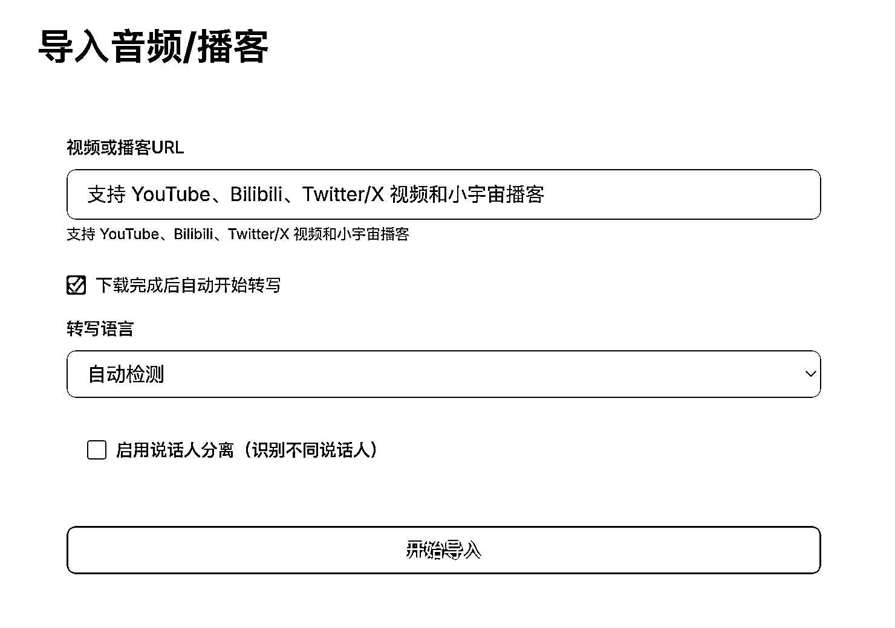
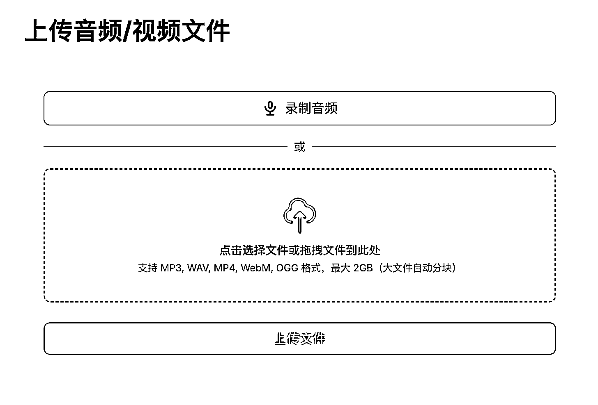
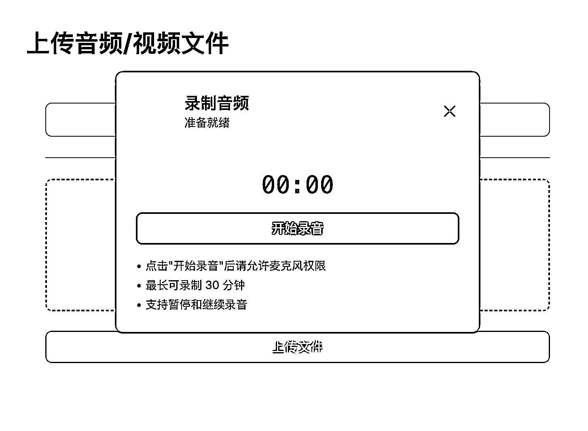
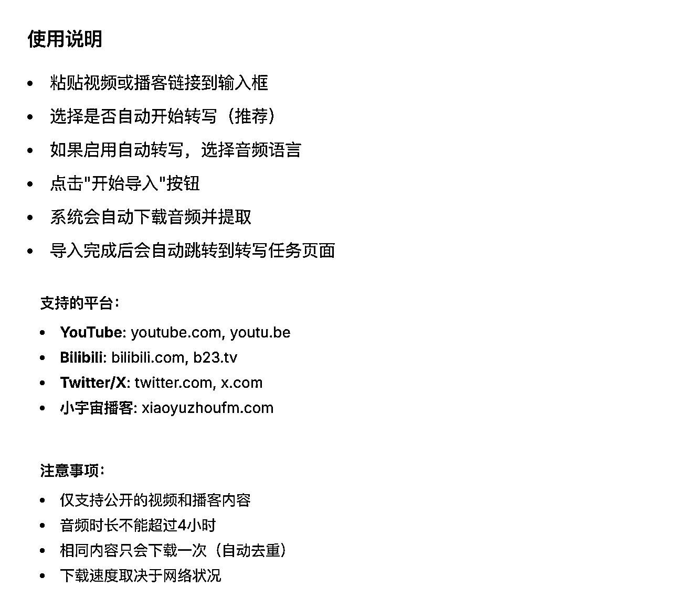
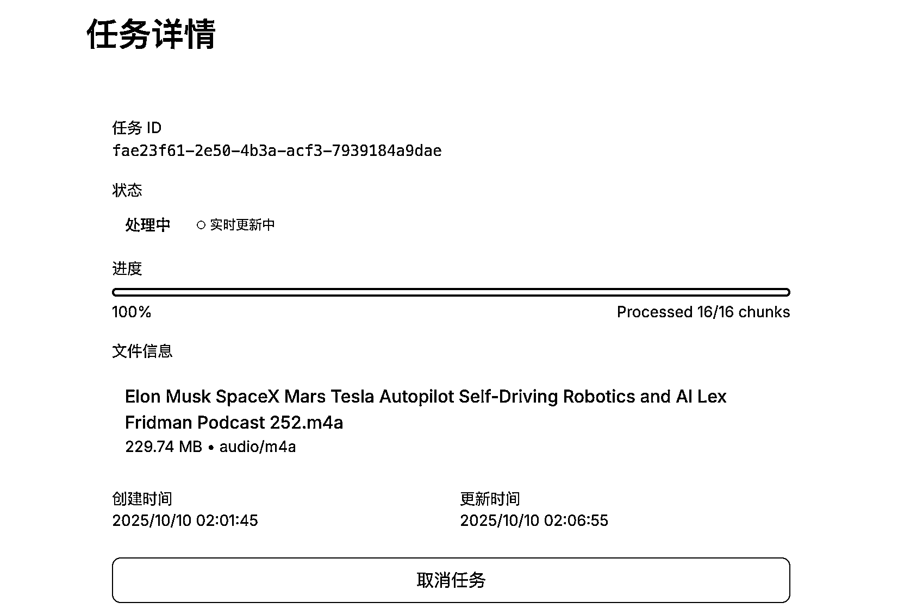
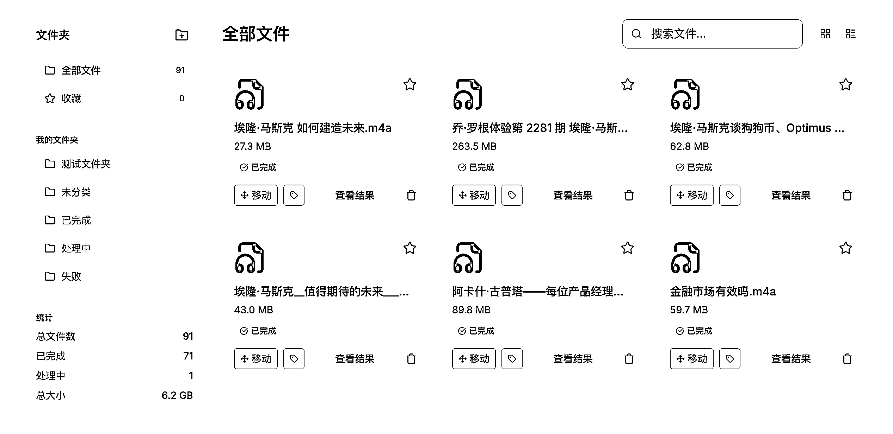
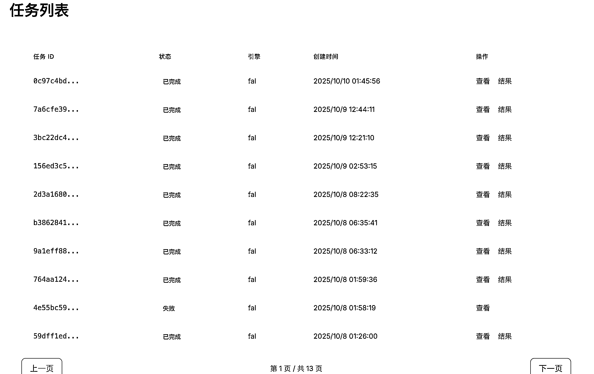
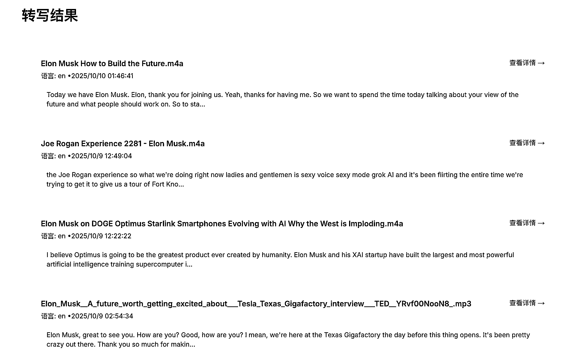
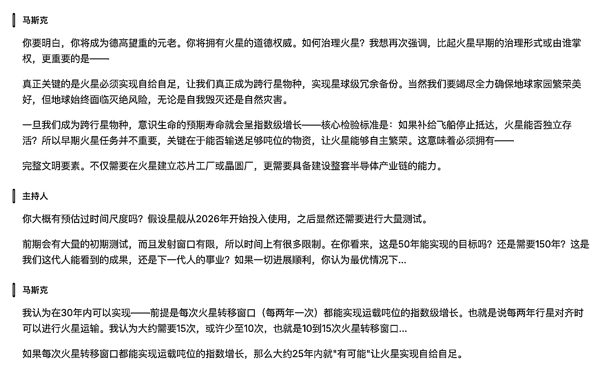

# (158 赞)国庆期间自制 AI 代码工具：使用体验分享

> 原文：[`www.yuque.com/for_lazy/zhoubao/llmygodpg85pgqdm`](https://www.yuque.com/for_lazy/zhoubao/llmygodpg85pgqdm)

## (158 赞)国庆期间自制 AI 代码工具：使用体验分享

作者： 亦仁

日期：2025-10-10

国庆期间，我用 claude code 给自己做了一个工具，现在用的挺爽的。
我希望能够看一些马斯克以及其他大佬访谈的深度内容，特别是那种三四个小时的英文深度访谈视频，从中可以看到非常多他们深入的思考和细节，但一直没找到一个好的产品来做视频转录和文本处理，于是就干脆自己动手做了一个，中间调整以及修
bug 弄了好几天，最好出来的效果还不错，图 9 这样的。 当然，这个目前也只能算 0.1 的版本，等我把我的想法都加上去后，也许可以开放给圈友来用。 我的
AI
编程基础应该仅限于上过小排的课程吧，比大多数圈友会好一点点，之前做过一些简单页面和原型级产品，这次算是第一个相对有点复杂度的产品，能靠自己在国庆期间两三天的时间独立开发实现，我还是非常有成绩感的，对自己未来能够实现想法的自信都增强了非常多，我觉得未来大概率能靠自己或者加两三个小伙伴就做出一个赚到千万美金的产品。
现在能够随时看各种英文访谈视频和播客的原文逐字稿，也感觉很幸福。

* * *

评论区：

bravo : 厉害了

漠北 : 老板自己也这么懂技术吗[强]

亦仁 : 都是现学的，全程我没写一行代码，全靠指挥 AI 干活。

馆主 : 太厉害了，亦仁老大[强]

小吉玛丽亚 : 违规了违规了，老板怎么能自己干活呢！放着让我来！

林 : 太厉害了[强][强][强]

丁火 : 那我就要打击一下大佬了，bibigpt.co
是我目前用的最好用的视频转文本工具了，他们并不擅长推广，知名度还不如部分付费播客转文本工具。但是全能型选手。他的确是自己做的，估计就两个人。😁

沐沐 : 牛批，愿意付费