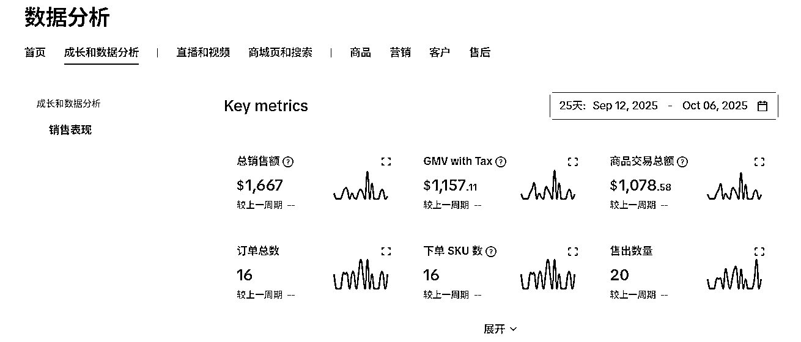
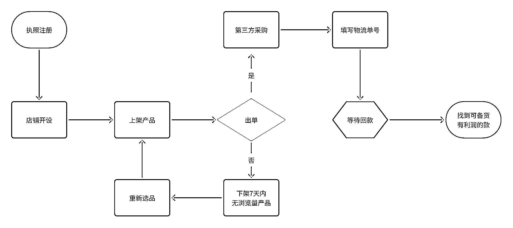

# (精华帖)(54 赞)新手做 TIKTOKSHOP 跨境电商 30 天赚 500 美金教程

> 原文：[`www.yuque.com/for_lazy/zhoubao/fpa1yqour4q4uq61`](https://www.yuque.com/for_lazy/zhoubao/fpa1yqour4q4uq61)

## (精华帖)(54 赞)新手做 TIKTOKSHOP 跨境电商 30 天赚 500 美金教程

作者： 西沙

日期：2025-10-10

我的思考：美国站是小白跨境的最优解？
小红书，抖店等国内无货源本质都是同一种逻辑——从 B 平台选品上架到 A 平台，客户在 A 平台下单后，我们从 B 平台采购发货，用单号同步完成 A 平台履约，最终赚差价。而今天我们要聚焦的“TikTok 美区无货源”，就是把这个逻辑搬到了更大的跨境赛道上。
先把核心玩法说透：这里的“A 平台”就是我们的 TikTok 美区店铺，“B 平台”则是所有能满足 TikTok 发货时效、单号可识别的美国本土第三方平台——比如亚马逊美国站、希音（shein）美国站，速卖通美国站，只要能做到“客户下单后，单号能同步到 TikTok 后台、时效符合平台要求”，都能成为我们的货源池。
关于利润，我给大家一个在用公式：按 B 平台原价 2.5 倍上架，再统一设置 40%优惠，最终以 1.5 倍原价成交。
为什么偏偏选美区，而不是大家常听说的东南亚、欧洲、日本、墨西哥？这里给大家拆解 3 个核心原因： 第一，成本最低，利润高；
开始我也试过东南亚五国的店铺，客单价低，利润低，不出单，空跑消耗心气；
中间封店后，我和朋友 AA2800 块买英国个人本土店铺，还没上架，4 天秒没（截止目前不知道原因）
最后依旧自己注册执照做美区——美区出单后对“风险”的包容度，是所有跨境站点里最高的。 第二，商家数量少，竞争低。 TikTok
美区最大的优势是东南亚卷烂了，新站点开店成本与准入门槛都高。 第三，赛道天花板高，现在入局不晚。
国内电商早已进入红海，而全球跨境电商的增量，tiktok 是一个巨大的趋势——这里不仅有庞大的用户基数，还有“从短视频种草到直播带货”的完整闭环，甚至能结合独立站做私域沉淀。对比国内平台“流量越来越贵、规则越来越严”，美区现在还是“增量市场”：你不用和千万商家抢流量，只要会用数据选品、懂基础履约，就能赚到第一波红利。
接下来的教程里，我会带着大家从 0 到 1 搭建 TikTok 美区无货源店铺：从 B 平台选品逻辑，到 TikTok 上架技巧，再到履约避坑、利润优化，每一步都是经过实测的可落地方法。而今天这部分，既是给大家讲透“我的雷与成绩”，也是帮大家建立信心——这个赛道不需要你有百万资金，也不需要你有多年跨境经验，只要跟着这套逻辑走，就能在全球最大的跨境赛道里分到一杯羹。
TIKTOK 跨境电商 TIKTOKSHOP
大家移步飞书观看：[`vqjz0ej9x2.feishu.cn/wiki/R1S8wfVAhiiSYlkJ3Nvcn15Onpe?from=from_copylink`](https://vqjz0ej9x2.feishu.cn/wiki/R1S8wfVAhiiSYlkJ3Nvcn15Onpe?from=from_copylink)

* * *

评论区：

青枝 : 感谢西沙真诚分享

悟空悟空空 : 很详细

沐飞 : 如果只是做 tk 短视频博主，里面提到的网址工具是不是同样适用

西沙 : 一部分，回款工具和数据分析是我做视频会用的

未央 : 老师，请问是选中国大陆还是美国？

西沙 : 中国大陆

98.  : tk 跨境店能本土发货吗？

西沙 : 要求本地发货；不然不会衍生出虚拟仓玩法