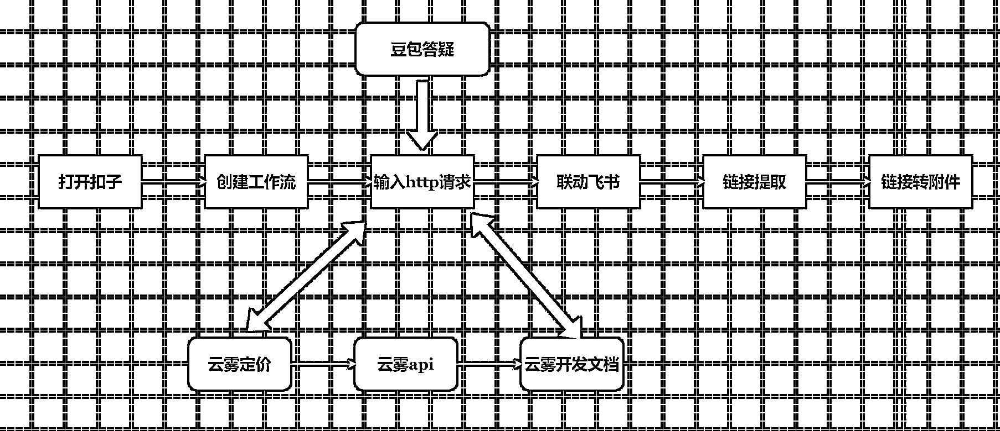

# (40 赞)10 分钟学会使用 coze 把 sora 接入飞书多维表格

> 原文：[`www.yuque.com/for_lazy/zhoubao/ge6gbsk9v06e644n`](https://www.yuque.com/for_lazy/zhoubao/ge6gbsk9v06e644n)

## (40 赞)10 分钟学会使用 coze 把 sora 接入飞书多维表格

作者： 刘同学

日期：2025-10-05

谁说安卓不能用 sora，国内用户不能用 sora，这些问题通通解决 使用 coze 制作工作流，联动飞书实现，齐头并进，万马奔腾
热气腾腾的 coze 加多维表格，实现 sora 批量生成视频方法来了！！ 全文阅读大约 20 分钟，视频，图文，配套齐全！ 飞书链接🔗  [`parwc0x6nb.feishu.cn/wiki/HkLDwtTSOirMu4kaYbNcfcWDnRf`](https://parwc0x6nb.feishu.cn/wiki/HkLDwtTSOirMu4kaYbNcfcWDnRf)

* * *

评论区：

吴泽承 : 这个国庆，卷起来了[呲牙]

晨 : 太感谢你啦，我根据你的教程成功搭建出工作流，运行顺畅，谢谢

晨 : 但是我发现还是需要在云雾里面有充值才可以，免得可能试运行时，是因为不够钱而导致失败，不是因为其他任何原因[呲牙]

刘同学 : 是的

小宋 : 太棒了

李朵拉 dollna : 多谢，一直没有勇气研究扣子和多维表格，从这篇我要开始了