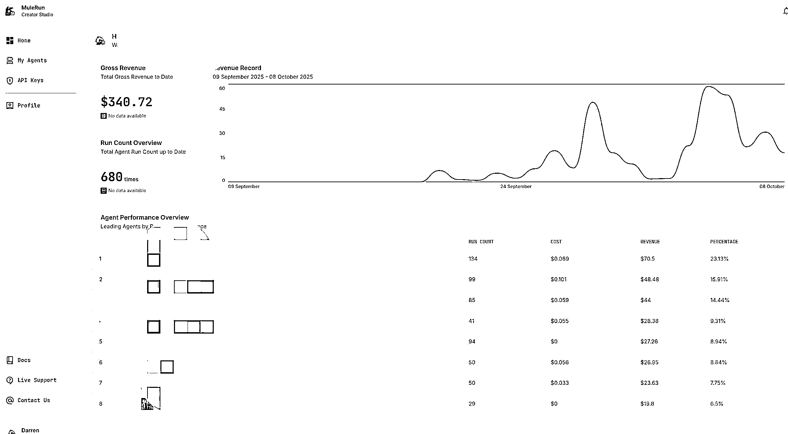
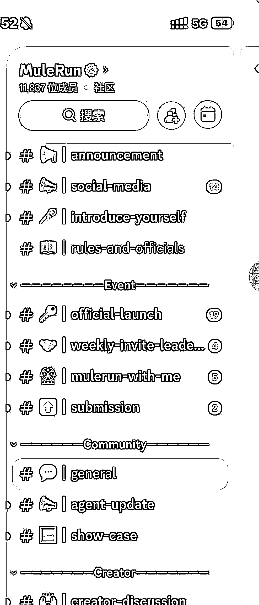

# (23 赞)MuleRun 中标之后关注的小机会，二周躺赚 340 美金

> 原文：[`www.yuque.com/for_lazy/zhoubao/nce5x4awiucu1g3k`](https://www.yuque.com/for_lazy/zhoubao/nce5x4awiucu1g3k)

## (23 赞)MuleRun 中标之后关注的小机会，二周躺赚 340 美金

作者： 达轮

日期：2025-10-08

MuleRun 中标之后关注的小机会，二周躺赚 340 美金(有图有真相)
大家好，我是达轮，今年 418 加入生财，有幸被邀成为 n8n 的航海教练。程序猿,金融背景，之前有出海相关的创业经历，未来也想在出海这条赛道匍匐前行。
很感谢生财提供的机遇，一次线下 n8n 组局，认识了小查圈友，就给我推荐了 MuleRun 平台，我回去立即查看了 X 平台和 Discord，活跃用户还不错，平台还处于早期，阿里投资的。他们要做「AI 界淘宝」MuleRun，上线 10 天涌入 21 万用户。用投资的思维说，趁着这只股票没有 price
in , 赶紧布局！ 听了一节他们的基础课程，上架需要的注意点和 SOP，立马注册成为 Creator。
随即就在咱们圈内的发了一个风向标。很感谢亦仁老大，风向标中标了。 感谢 圈友的指点和帮助。 本篇文章大纲： 1. 小成绩 2. 背景 3. 过程
4. 思考 5. 资料 上车，移步到飞书 希望对大家有帮助
[抱拳][抱拳][抱拳][`scys.com/articleDetail/xq_topic/2854581854555841`](https://scys.com/articleDetail/xq_topic/2854581854555841)[`eafz7mo3of.feishu.cn/docx/JduadxkoEo9aYixoAo2cpLTPnOf?from=from_copylink`](https://eafz7mo3of.feishu.cn/docx/JduadxkoEo9aYixoAo2cpLTPnOf?from=from_copylink)

* * *

评论区：

小宋 : 厉害了

风益 : 牛

劳模姐|零碳园区 : 很多人（比如我）看到了风向标，也看到中标了，也有跑通的工作流，但只有“把手弄脏”的人赚到了钱~

达轮 : 我当初是第一时间告诉你的[旺柴]

达轮 : [抱拳]

达轮 : [抱拳] 是的，信息差在缩小，执行差才是关键。风口再好，不动手也只是风景。

小宋 : 对的，厉害了