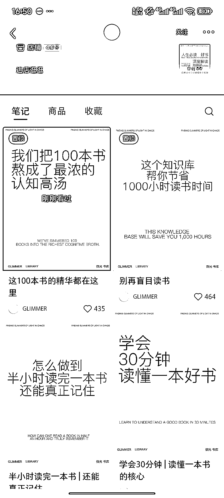
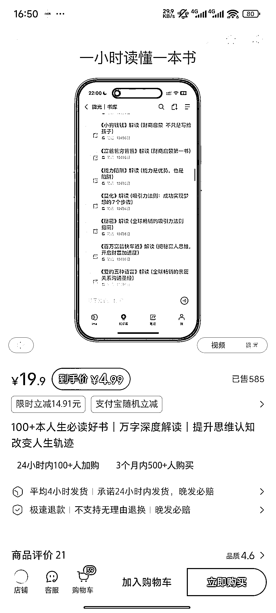
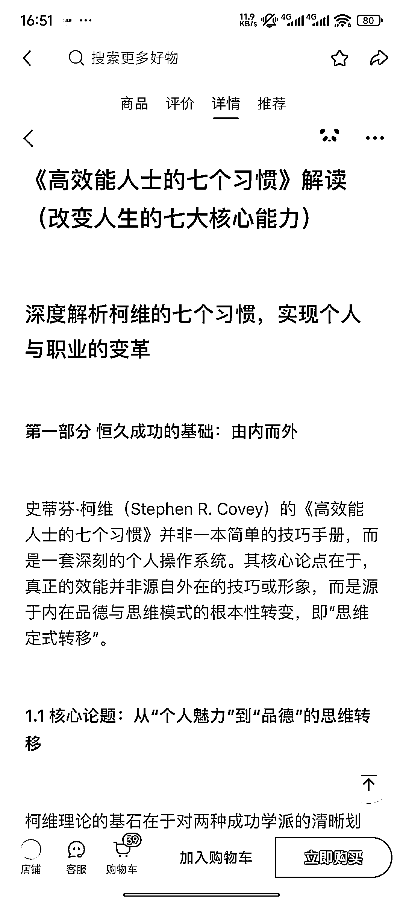
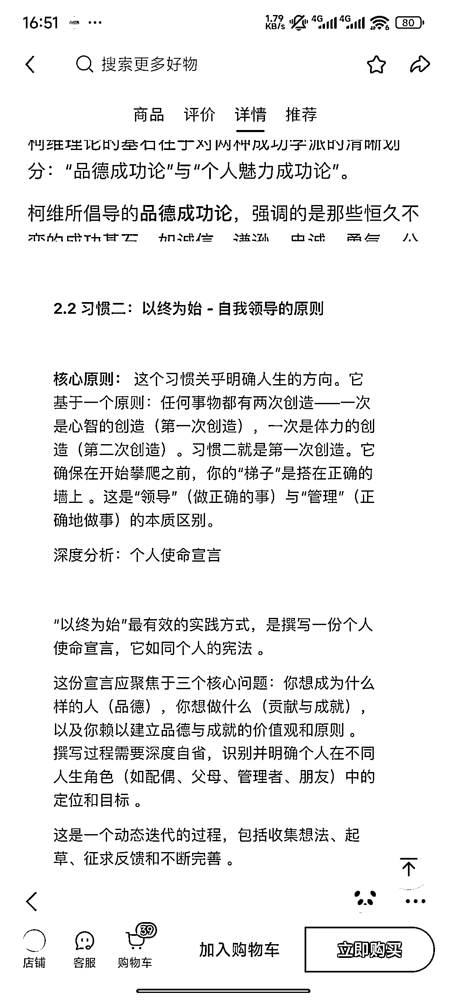
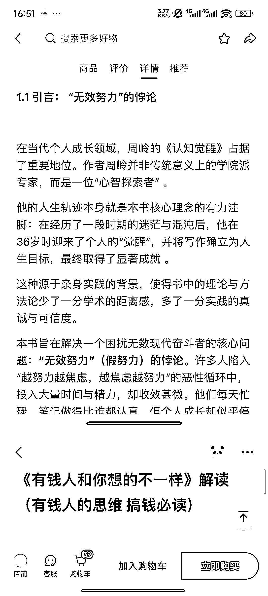
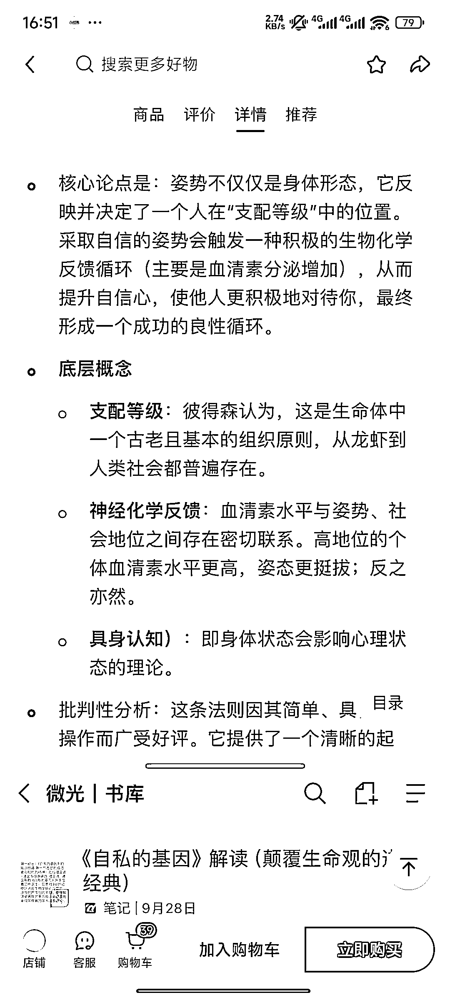
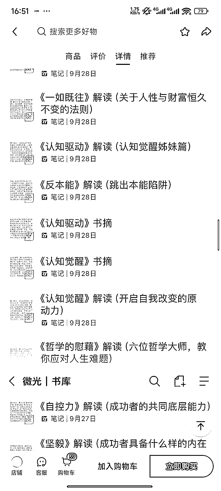

# (52 赞)小红书卖读书笔记出了 600 单

> 原文：[`www.yuque.com/for_lazy/zhoubao/ypktqnd300fy4m19`](https://www.yuque.com/for_lazy/zhoubao/ypktqnd300fy4m19)

## (52 赞)小红书卖读书笔记出了 600 单

作者： 枫晓陌 AI 十倍提质*

日期：2025-11-09

小红书卖读书笔记出了 600 单 大家看到交付的笔记内容是不是很有熟悉感？ 没错，用 AI 写出来的，然后整理，排版，上架，发内容去卖。
更快的生产笔记方法：1.用 coze 一次开十个分叉支线，输入十本书，根据内设的大模型提示词，生成读书笔记初稿，然后根据你的想法优化。
2.用飞书多维表格，一次粘贴 100 本书，调动 AI，一次生成 100 个读书笔记初稿。

* * *

评论区：

佛渡自渡者 : 我也刷到这个账号了，起号很快

亦仁 : 感谢分享，已中标

枫晓陌 AI 十倍提质* : 11 月 9 号 16:56，卖了 585 单 11 月 11 号 17:57，卖了 793 单。

礼新 : 感谢分享，

尺子白 : 中国太大了，还是傻子多呀。。