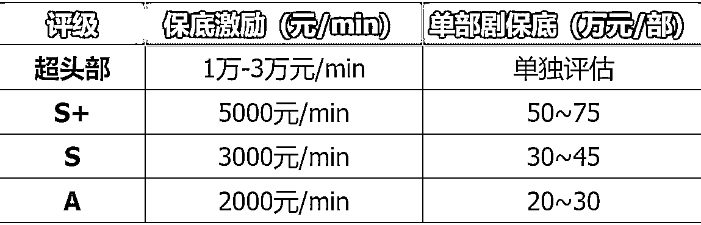

# (45 赞)抖音漫剧激励政策更新！竖屏漫剧的春天来了！

> 原文：[`www.yuque.com/for_lazy/zhoubao/uswnbxq6ui9n1wxw`](https://www.yuque.com/for_lazy/zhoubao/uswnbxq6ui9n1wxw)

## (45 赞)抖音漫剧激励政策更新！竖屏漫剧的春天来了！

作者： Miles

日期：2025-11-11

抖音漫剧激励政策更新！竖屏漫剧的春天来了！单部最高 75 万保底，有机会 0 成本改编！
抖音短剧版权中心进一步发布头部精品漫剧激励政策（针对竖屏漫剧，不支持沙雕动画）！
激励政策：针对番茄原创 IP 合作分超头部、S+、S、A 四个评级,给出不同的保底激励和单部剧保底，且番茄小说原创头部 IP 版权中心补贴 100%漫剧改编权费用。

* * *

评论区：

亦仁 : 感谢分享，已中标

神风 : 这一个怎么申请？