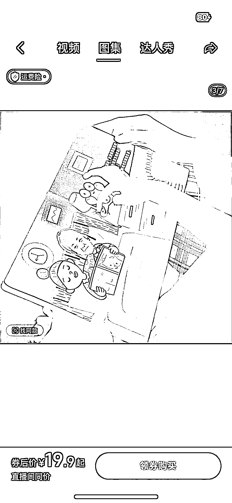
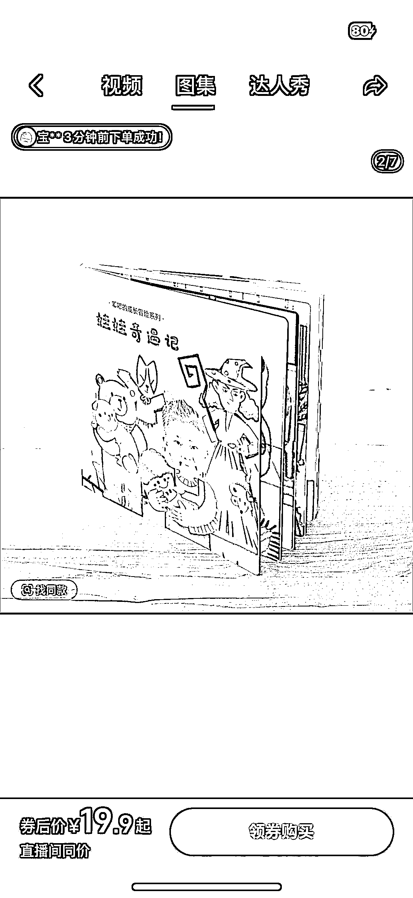
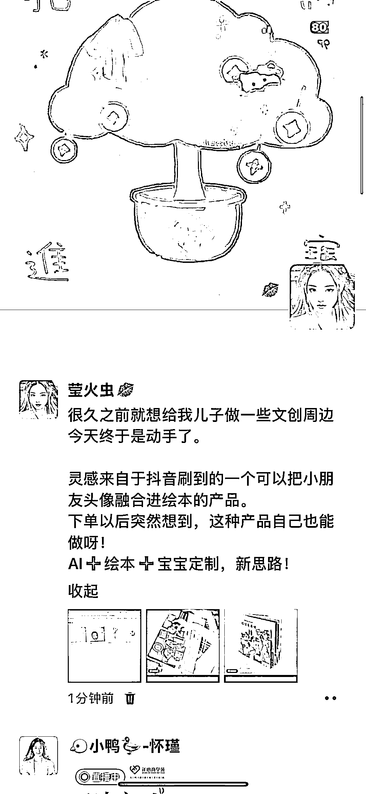

# (37 赞)抖音刷到的宝宝定制绘本很火，用 AI 做类似项目能变现

> 原文：[`www.yuque.com/for_lazy/zhoubao/tg5v5x712o9ee74c`](https://www.yuque.com/for_lazy/zhoubao/tg5v5x712o9ee74c)

## (37 赞)抖音刷到的宝宝定制绘本很火，用 AI 做类似项目能变现

作者： 莹火虫💋

日期：2025-11-10

在抖音刷到一个产品 绘本融合自己宝宝的头像做定制 每本 19.9 这样，已售 3.2 万 果断用自己宝宝头像定制了一本
购买以后他会跳出一个小程序，上传一张宝宝照片头像它会自动扣出宝宝的大头，然后出先宝宝大头照在绘本每页的展示效果。 想到可以用 AI 做绘本模板嫁接这种抠图小程序
也是 AI 落地变现的一种方式 AI 绘本的模板化➕上定制的个性化 很多宝妈会为此买单的！

* * *

评论区：

飞翔 : 19.9，定制的价格这么便宜吗？

莹火虫💋 : 绘本内容是固定的，定制只是换成自己孩子的照片

飞翔 : 即使这样，加上油费，也算很便宜了。

张姝 : 那更加说明成本很低，至于成本为什么能压缩到这么低我也不知道，可能只是引流品？

亦仁 : 感谢分享，已中标

莹火虫💋 : 感谢老大！