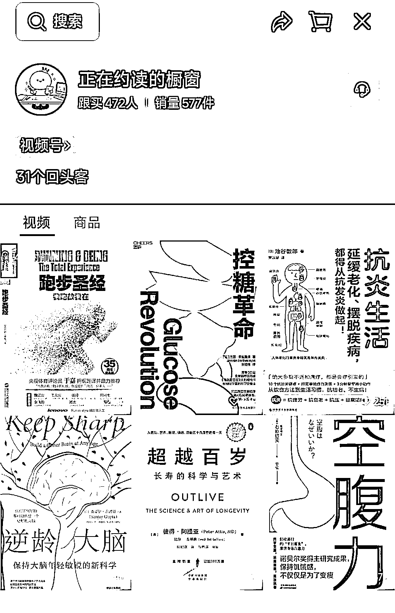
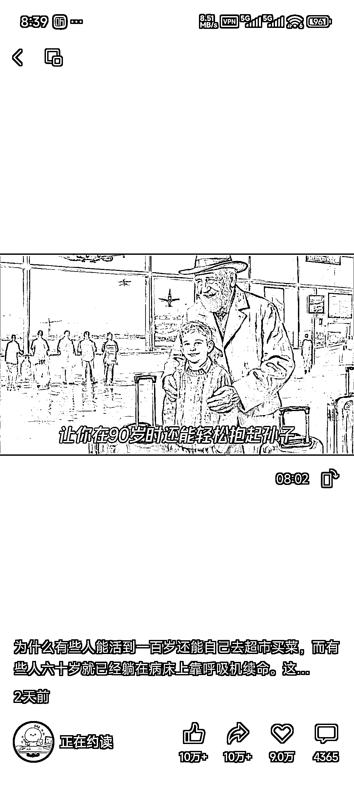

# (33 赞)视频号刷到 AI 做的带货视频，6 条出爆款，工作流可复制

> 原文：[`www.yuque.com/for_lazy/zhoubao/zo4p44mb9apaxhe9`](https://www.yuque.com/for_lazy/zhoubao/zo4p44mb9apaxhe9)

## (33 赞)视频号刷到 AI 做的带货视频，6 条出爆款，工作流可复制

作者： 白杨

日期：2025-11-08

视频号｜带货｜AI 工作流
视频号刷到一条用 AI 做的带货视频，数据非常好，起号时间还是这两天卖了 500 多单，才发了 6 条视频直接出爆款了，有一条已经 10w+点赞，每条视频的模板非常相似，用轮播图片+书籍分析配音，用工作流完全可以做出来，感兴趣的可以研究研究。

* * *

评论区：

亦仁 : 感谢分享，已中标

天使陷落 : 他这个码图片都得半天，况且每张图还要用 ai 生成，还有文案要弄，花时间应该不少

白杨 : 可以工作流大模型生成文案，拆分用文生图的形式生成图片，再拼接剪辑成视频，感觉一套都可以用工作流做出来，看他更新还挺频繁的 一天两三条

天使陷落 : 他这个一条视频 10 几分钟，我做一条 5 分钟这样的视频，得花 1 个小时以上，写文案不算