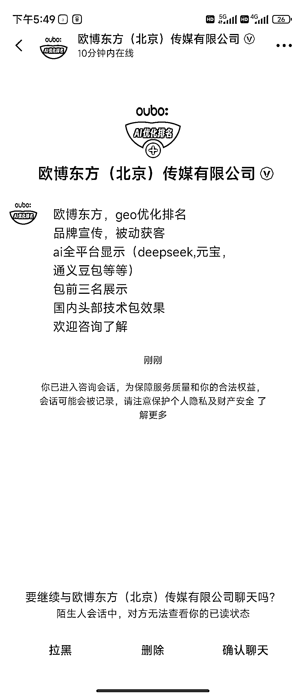

# (24 赞)GEO 会是线下实体教培等行业新的流量入口和红利窗口吗？

> 原文：[`www.yuque.com/for_lazy/zhoubao/oif43o7685v6gbrk`](https://www.yuque.com/for_lazy/zhoubao/oif43o7685v6gbrk)

## (24 赞)GEO 会是线下实体教培等行业新的流量入口和红利窗口吗？

作者： 范雨林

日期：2025-11-13

今天打开我们成人技能类实体培训业务的抖音后台，收到了「GEO 优化排名」的广告（服务商叫欧博东方），核心是 GEO 优化排名，帮企业在 DeepSeek、豆包等 AI 平台包前三名展示。
结合以往的运营看，我们这个业务在 10 年前是靠百度 SEO 获客，5 年前开始做抖音、快手矩阵号拿精准线索。
现在又有了 GEO，这可能是我们这种线下实体教培行业的又一个流量红利窗口，或者说是，对于所有需要「线索型获客」的行业都是一个新的流量入口。
AI 搜索在逐渐分流传统流量，先入场就能吃到认知差。 现在人们越来越多的使用 AI 提问、搜索，但可能 90%的教培机构还没布局 GEO，或者根本就不知道不懂
如果我们现在做，是不是就相当于把之前在百度上、抖音快手上展现过的，转化好的内容换一种方式，在 AI 推荐答案里直接展现 甚至不用做新内容，直接内容复用
GEO 是被动获客，用户主动搜索=高意向，转化成本可能也相对会低。

* * *

评论区：

花岗岩 : 这种变现模式，主要是做培训吗，还是做搜索排名靠前的服务

范雨林 : 做服务，比如我们这种实体培训需要线索的业务，就很需要

亦仁 : 感谢分享，已中标