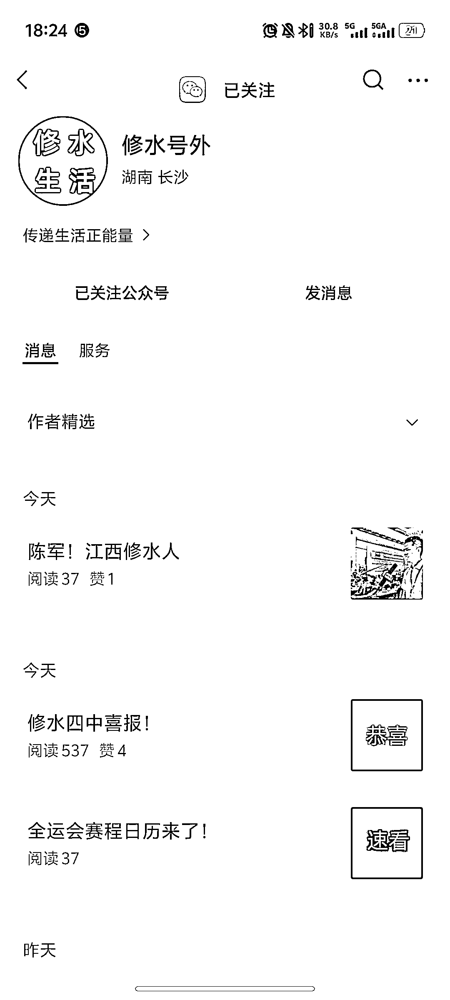
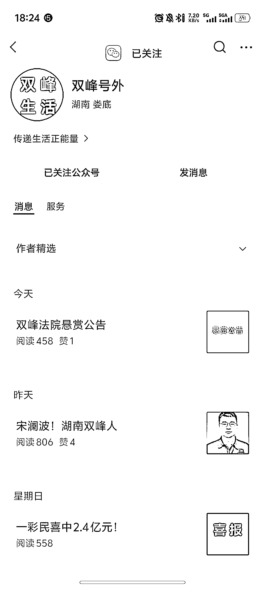
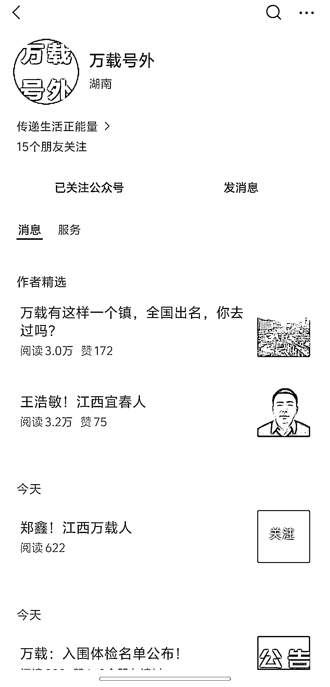

# (23 赞)地方公众号矩阵化实操分享：起号、变现全流程来了！

> 原文：[`www.yuque.com/for_lazy/zhoubao/ye5cyvyirv92ryih`](https://www.yuque.com/for_lazy/zhoubao/ye5cyvyirv92ryih)

## (23 赞)地方公众号矩阵化实操分享：起号、变现全流程来了！

作者： 好运.

日期：2025-11-11

部分地方公众号流量很好，且为矩阵化实操。特意过来发个风向标给生财圈友分享。
这几天关注了一批公众号，起号方式为注册“地方城市名字”➕“发布地名人事迹”起号，目前看 iP 地址基本为湖南方向。
很多人会以为这是官方号。比如杭州本地的人，若看到一个名字叫做“杭州号外的号在分享当地信息”，就会觉得这样的号发布信息是一件很权威的事情，如果自己又喜欢关注本地生活，自然会点击关注。
实操点: 1.地名尽量用“小城市”，因为大城市可能申请不通过，比如杭州号外就可能大概率不通过，但是“万载号外”就大概率能行
2.发布内容，可以直接去百度百科搜索对应城市名人事迹，吸引同乡归属感；
3.矩阵实操，这种号肯定看爆率，做一两个很难起来，还是要批量搞，然后形成垄断势能，这时候可以用质问浏览器多开操作。 变现: 1.流量主 2.同城付费项目

* * *

评论区：

好运. : 信息主要是百度百科，政府公示，地方官媒整理汇合，甚至会发好几年前的信息。

亦仁 : 感谢分享，已中标

才 : 官媒最好是不要去转载他们的信息，新闻信息管理办法里有规定的

好运. : 不能转发官媒的信息吗？正确的信息为什么不能转载呢

才 : 不是正确的信息就能转，比如你们地区那边不管，你可以发，但是要追究起来是有风险的， 《互联网新闻信息服务管理规定》 第五条
通过互联网站、应用程序、论坛、博客、微博客、公众账号、即时通信工具、网络直播等形式向社会公众提供互联网新闻信息服务，应当取得互联网新闻信息服务许可，禁止未经许可或超越许可范围开展互联网新闻信息服务活动。
第二十二条
违反本规定第五条规定，未经许可或超越许可范围开展互联网新闻信息服务活动的，由国家和省、自治区、直辖市互联网信息办公室依据职责责令停止相关服务活动，处 1 万元以上 3 万元以下罚款。