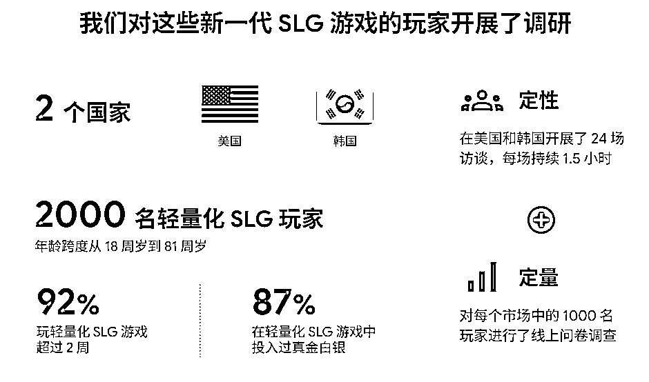
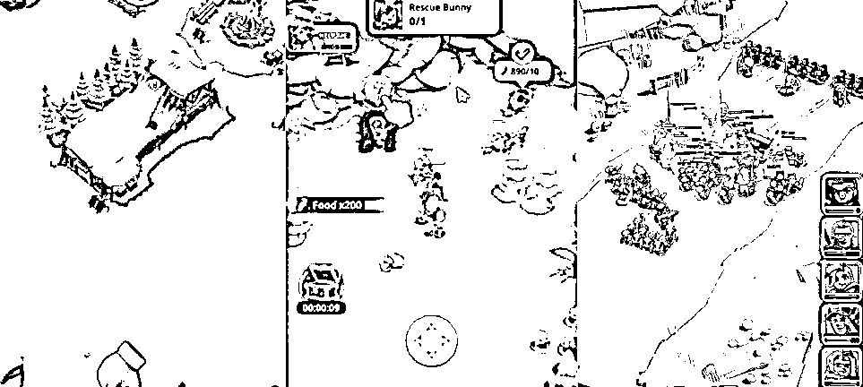

# (14 赞)轻量化 SLG 重塑出海格局，中小开发者凭创意突围成潜力盈利赛道

> 原文：[`www.yuque.com/for_lazy/zhoubao/fb7eg1wdlrt9p70h`](https://www.yuque.com/for_lazy/zhoubao/fb7eg1wdlrt9p70h)

## (14 赞)轻量化 SLG 重塑出海格局，中小开发者凭创意突围成潜力盈利赛道

作者： Miles

日期：2025-11-12

轻量化 SLG 重塑出海格局，打破传统 SLG 红海困境，中小开发者可凭创意突围，成中国游戏出海最具潜力的盈利赛道
覆盖美国，韩国资深 SLG 玩家与拓圈玩家，两者均有付费意愿（美韩市场 92%玩家玩超 2 周，87%有付费行为）。
视觉设计要兼顾亲切度与新鲜感，简化操作降低学习成本，联盟玩法需平衡单人体验与社交需求，兑现广告宣传避免玩家流失。拓圈玩家可通过可控体验、丰富玩法转化为高价值用户，资深玩家需保留策略核心，补充个性化定制满足未被满足的诉求，社交与创新体验驱动付费。

* * *

评论区：

亦仁 : 感谢分享，已中标