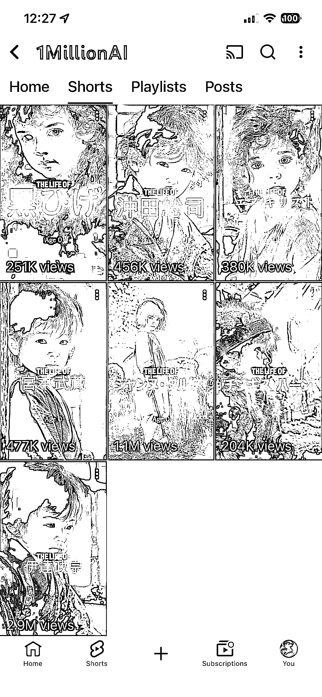
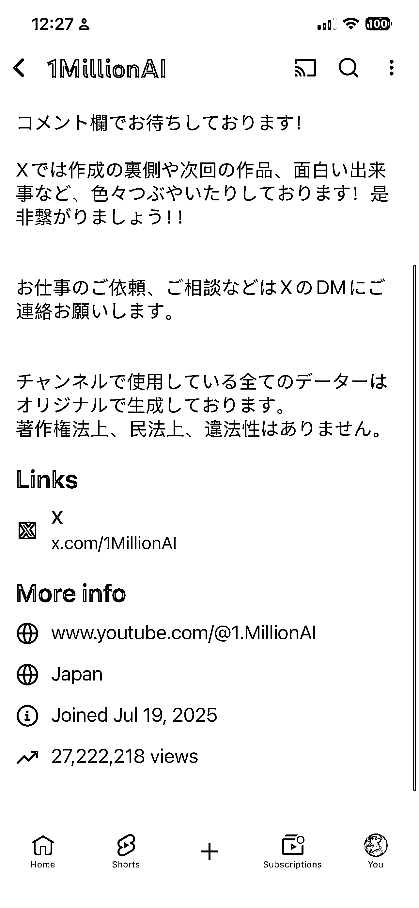
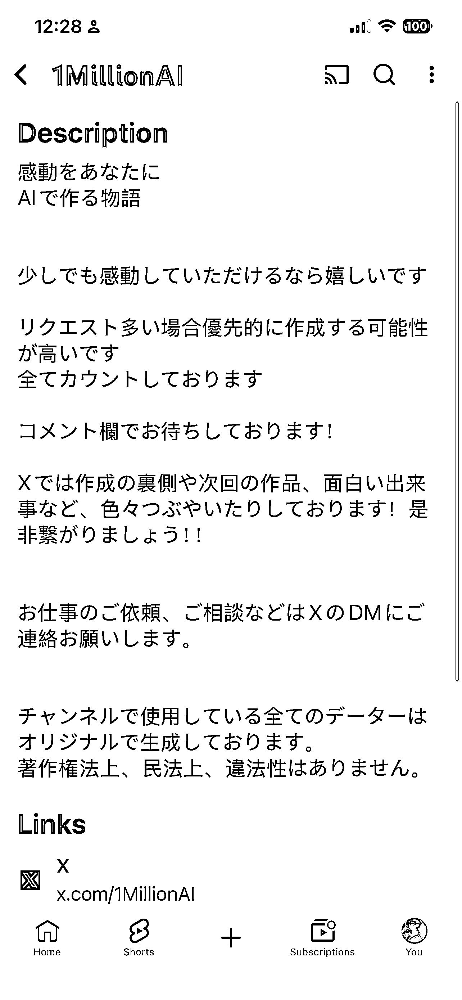

# (41 赞)猛！7 月 19 日注册的 YouTube AI 账号，2700 万播放量的玩法能复制吗？

> 原文：[`www.yuque.com/for_lazy/zhoubao/wsson09p05lcwa0v`](https://www.yuque.com/for_lazy/zhoubao/wsson09p05lcwa0v)

## (41 赞)猛！7 月 19 日注册的 YouTube AI 账号，2700 万播放量的玩法能复制吗？

作者： 浅笑

日期：2025-11-14

发现一个挺猛的 YouTubeAI 视频账号，注册于七月 19 日，播放量是 2700 万，视频数量是 37 个。
目标是日本用户，创造内容是记录日本重要人物的一生，以 AI 的形式记录从小到大的历史事件。
发散思路，可以制作美国的重要人物从小到大的历史事件，或者印度，加拿大，德国，以国家为分类。 还可以以科学家分类，比如牛顿，爱因斯坦，图灵等等。
还可以以艺术家分类，比如达芬奇，梵高，总之就是家喻户晓的人物，刷到了总忍不住看一眼。

* * *

评论区：

亦仁 : 感谢分享，已中标