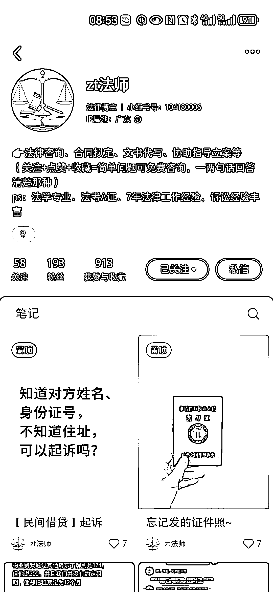
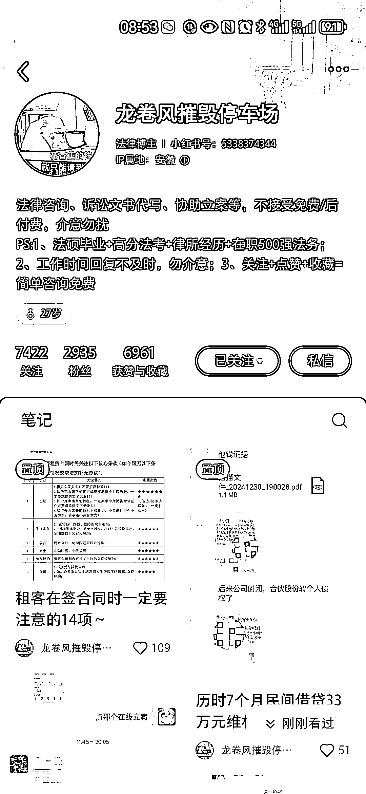
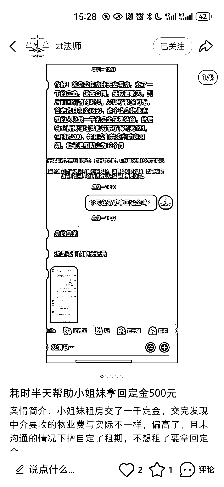
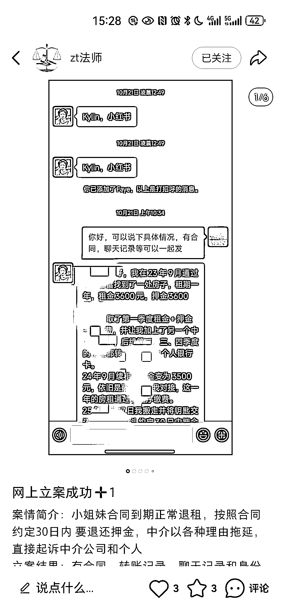
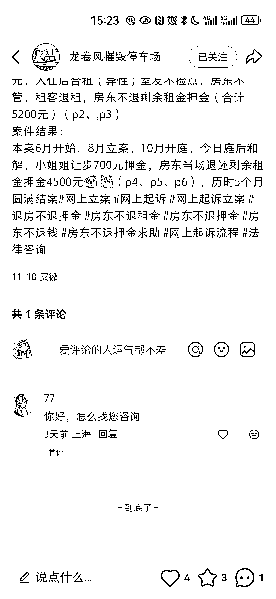
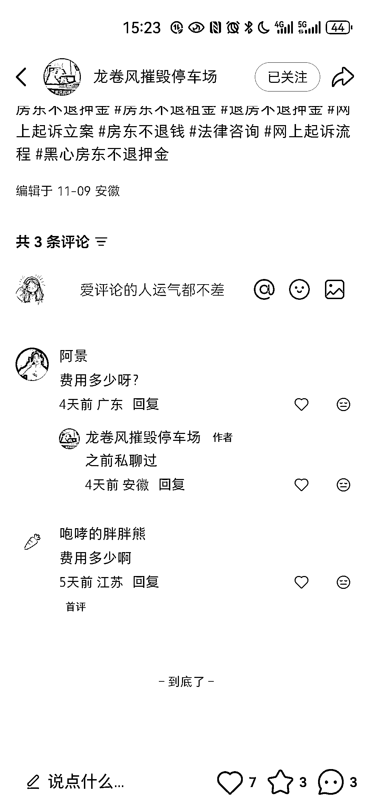

# (12 赞)帮写起诉状和立案，小红书法律小号靠这业务月接 5 单以上

> 原文：[`www.yuque.com/for_lazy/zhoubao/vpafsdi3gwil5gvo`](https://www.yuque.com/for_lazy/zhoubao/vpafsdi3gwil5gvo)

## (12 赞)帮写起诉状和立案，小红书法律小号靠这业务月接 5 单以上

作者： 希平

日期：2025-11-14

帮写起诉状和协助立案 最近发现这种小红书有法律垂直小号（图（图 2），发的内容很简单，就是成功案例（图 3 图 4），然后就有不少人在评论区问费用（图 5 图 6）
分析：这些目标人群是房东不退房租、朋友借钱不还等，请律师太贵，又不会写起诉状，这些账号就服务这些人群，客单价在 500-3000 不等，这两个账号，近 3 个月，每个月起码能接 5 单以上

* * *

评论区：

亦仁 : 感谢分享，已中标