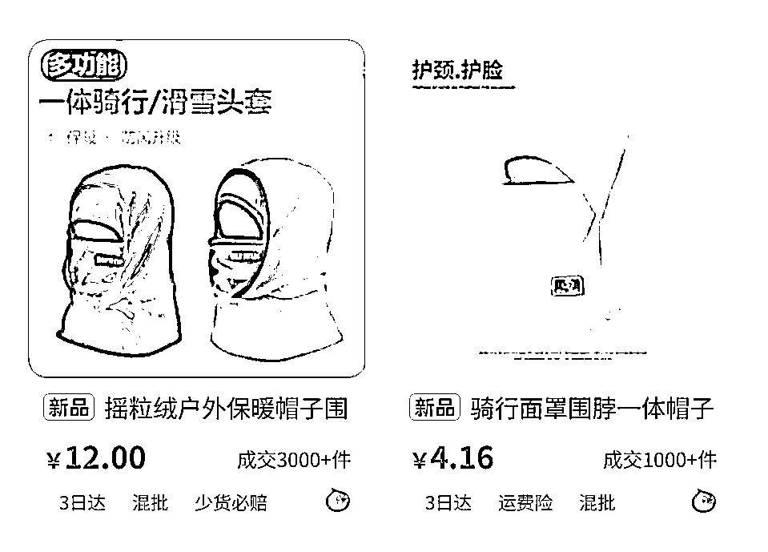
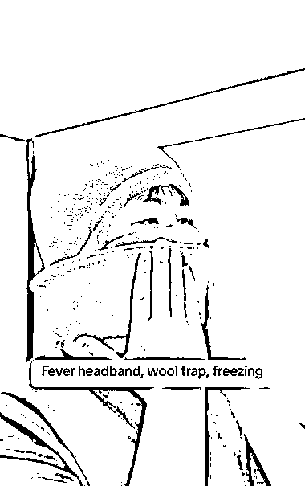

# (30 赞)TikTok 卖家引燃的寒冬经济，席卷北美的寒潮正催生巨大的“寒冬商机”

> 原文：[`www.yuque.com/for_lazy/zhoubao/gbu1u927cfyggekk`](https://www.yuque.com/for_lazy/zhoubao/gbu1u927cfyggekk)

## (30 赞)TikTok 卖家引燃的寒冬经济，席卷北美的寒潮正催生巨大的“寒冬商机”

作者： Miles

日期：2025-11-14

TikTok 卖家引燃的寒冬经济，席卷北美的寒潮正催生巨大的“寒冬商机”。 据报道近期，
4 元成本卖 11 美元！国内又一保暖神器在 TikTok 爆单，一款冲破运动与户外大类“垄断”的滑雪面罩，正在以惊人的销量，为这场可能是历史级寒冷的冬天播下爆单的火种。
在近一周 TikTok 美区带货视频榜，又一款冬日抗冻神器闯入大众视野，并以单条视频拉动周销 7300+件的黑马之姿，将 TikTok·2025 年度版“温暖保卫战”的实感拉满。
数据显示，近日冲上 TikTok 美区视频带货销量榜 TOP6 位置的，是一款上架不到半个月滑雪面罩。10 月 29 日上架至今，产品已经卖出 1.77 万件，达成 GMV19.45 万美元（约合人民币 138.5 万元）。
有专家预测，今年冬天，美国中西部和太平洋西北部地区可能会出现比平均温度更低的气温。席卷北美的寒潮正催生巨大的“寒冬商机”。

* * *

评论区：

亦仁 : 感谢分享，已中标