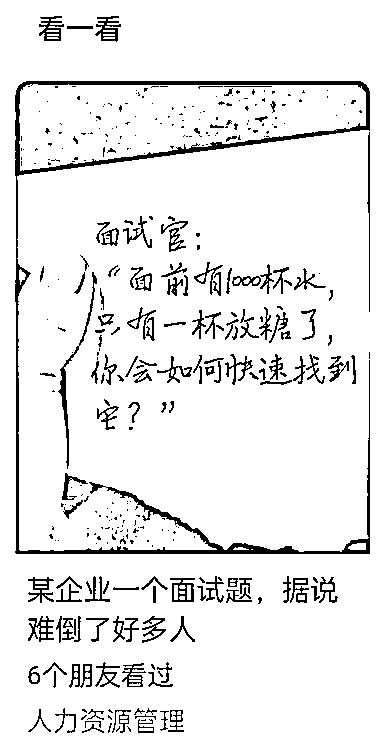
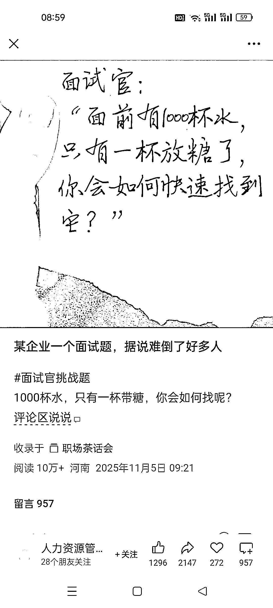
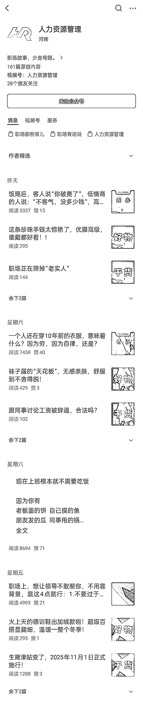

# (24 赞)职场垂直小号广告多但讨论火，做号圈友可以研究研究

> 原文：[`www.yuque.com/for_lazy/zhoubao/kylwb36pz9sizt36`](https://www.yuque.com/for_lazy/zhoubao/kylwb36pz9sizt36)

## (24 赞)职场垂直小号广告多但讨论火，做号圈友可以研究研究

作者： 文少

日期：2025-11-10

刚刷到一个职场类的垂直小号，被封面吸引进去了，评论区讨论的人非常多，但我没看到广告，结果一看这个号主页，好家伙，广告这么多，几乎每天都在次条带一个，头条和第三条发正常的干货内容，做垂直小号的圈友可以研究研究

* * *

评论区：

枫晓陌 AI 十倍提质* : 解这道题得用点帝王之术啊：1、自己给一杯水里放糖，其他的倒掉；2、端起一杯喝完，说就是这杯。3、直接问，有时候努力再多，不如张口一次

亦仁 : 感谢分享，已中标

好运. : [捂脸]干货和带货两不误