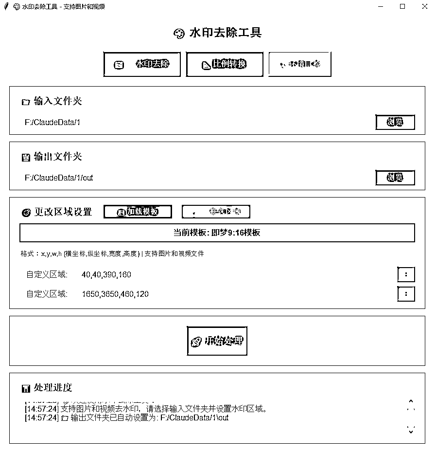
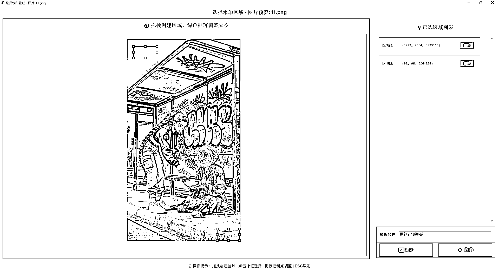
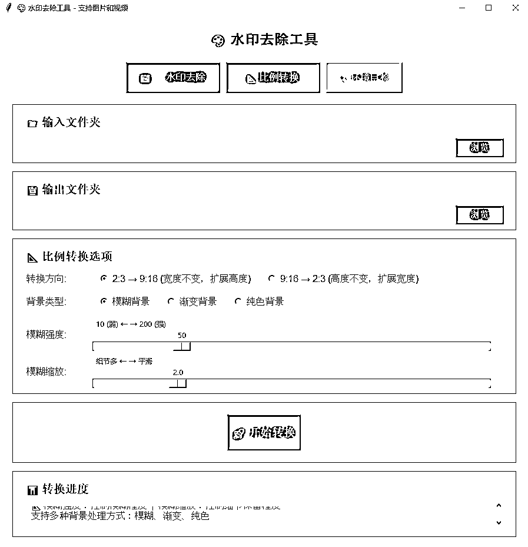

# (52 赞)用 claude code 写的去水印小工具，分享给有需要的圈友

> 原文：[`www.yuque.com/for_lazy/zhoubao/dip0nn0s4csappqf`](https://www.yuque.com/for_lazy/zhoubao/dip0nn0s4csappqf)

## (52 赞)用 claude code 写的去水印小工具，分享给有需要的圈友

作者： 晓风

日期：2025-11-07

最近做 youtube，即梦豆包等出图出视频都有水印，找了些小工具要么不好用要么收费还不好用，刚好买了个 GLM Coding 还不知道写啥，遂用 claude
code 写了个，感觉用着还可以，分享给需要的圈友。 功能：
1、去水印：批量给文件夹下图片和视频去水印，鼠标框选标注多个水印区域，可保存模板。注：指定文件夹下同时有图片和视频时，只给视频去水印。
2、图片比例转换：sora 批量出图工具出的图是 2:3，可批量扩展 9:16（上下两端加模糊背景） 双击 start.bat 启动程序，需安装依赖项 pip
install -r requirements.txt，我的是 windows 系统，不知道 mac 系统是不是具备同样效果。

* * *

评论区：

尤鑫玉 : 正在安装，感谢圈友

尤鑫玉 : 您好，我比例转换没问题，去水印一直不成功，也不能框选区域

晓风 : requirements.txt 里环境都安装了，运行 start.bat 后，点界面上环境自检确认下，指定输入文件夹，框选区域就能加载图片或视频，然后鼠标直接框选水印区域，处理即可，我在 win10，win11 上试了都没问题

尤鑫玉 : 好哒，感谢

亦仁 : 感谢分享，已中标