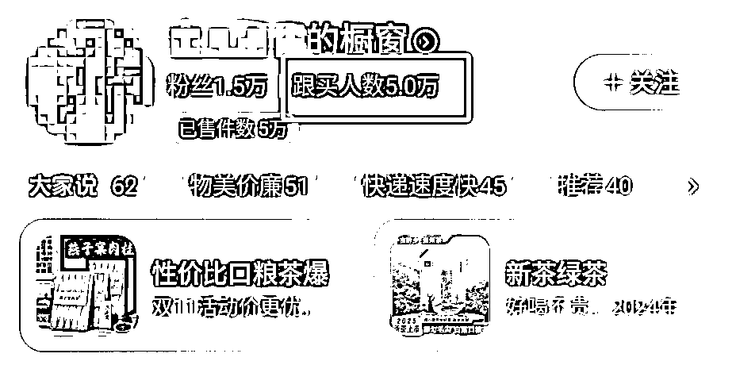
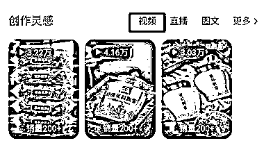
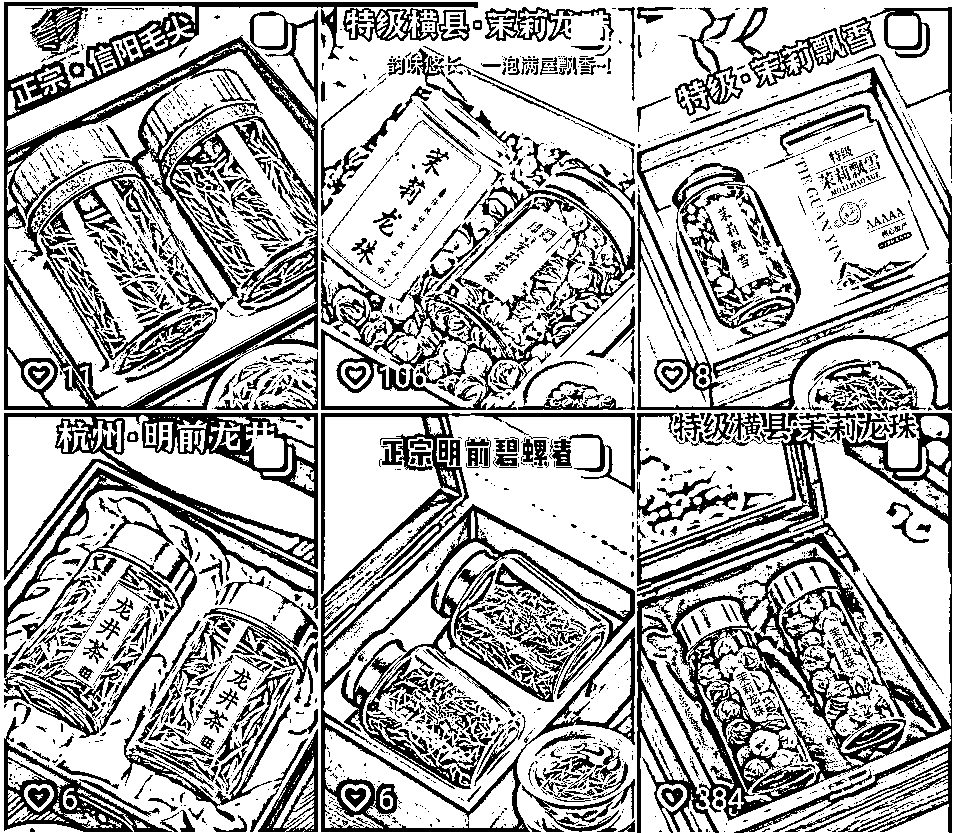

# (30 赞)现在几乎每个赛道的商家榜的视频、图文均被 AI 攻占了！

> 原文：[`www.yuque.com/for_lazy/zhoubao/pv2cx9wrndlu4kzt`](https://www.yuque.com/for_lazy/zhoubao/pv2cx9wrndlu4kzt)

## (30 赞)现在几乎每个赛道的商家榜的视频、图文均被 AI 攻占了！

作者： Miles

日期：2025-11-13

现在几乎每个赛道的商家榜的视频、图文均被 AI 攻占了！
刷到文章，以前做抖音带货，得拍摄、剪辑、出镜、投流。现在，一个人、一部手机、几个 AI 工具，就能批量产内容、挂车带货。“AI 图文带货”对于普通人来说，就是“内容红利期”。
用 AI 做电商，仅靠卖茶叶这一个类目，6 个月发了 2071 条内容，赚了不少钱。AI 图文带货，这类目堪称“黄金赛道”：内容可视化强，易于生成，且无需露脸。底层逻辑是“高频内容输出

*   稳定标签积累”。只要你能持续发布，就有流量试探的机会。
    目前在抖音平台上，AI 做带货内容主要有三种形态。第一种：AI 纯图文。第二种：AI 实况图文。第三种：5 秒 AI 短频。

* * *

评论区：

LJL : 我去翻了下 这个账号从 23 年 8 月就开始发挂车了 五万单的销量是两年的总销量 2071 条内容也是两年的总计（另外：隐藏的还没算）

亦仁 : 感谢分享，已中标