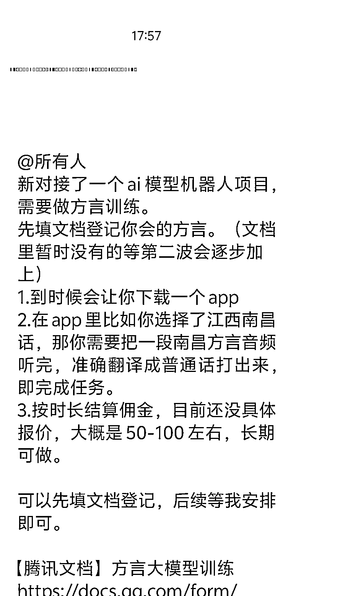

# (25 赞)收方言做 AI 训练有佣金，能否借方言开发下沉市场兼顾赚钱与社会价值？

> 原文：[`www.yuque.com/for_lazy/zhoubao/ieq7elgykp9ixs9a`](https://www.yuque.com/for_lazy/zhoubao/ieq7elgykp9ixs9a)

## (25 赞)收方言做 AI 训练有佣金，能否借方言开发下沉市场兼顾赚钱与社会价值？

作者： 好运.

日期：2025-11-10

看到外面有人在花钱收这个方言进行 AI 的训练，并且还给到了不错的佣金。但是具体的我其实不知道他用来干嘛。 让我想到：
很多农村的老年人很多都是只会讲方言的，是不是可以尝试做下沉市场，帮助老年人的同时，顺带赚一些钱。但是这个项目可能不适合直接奔着赚钱的方式去做，我觉得更多的还是奔着“实现更多社会价值意义”去做会更好些。

* * *

评论区：

寻芳不觉醉流霞 : 是哪个公司在做呀？

厦门凝聚 MCN 阿星 : 同问，是哪一家公司在做呢！

亦仁 : 感谢分享，已中标

Junen : 现在很多城里出生的孩子已经不会讲父辈的方言了，有可能是在做一个方言教育的 APP，让孩子找回乡音~！

西西 : 怎么样参加呀？想推给亲戚