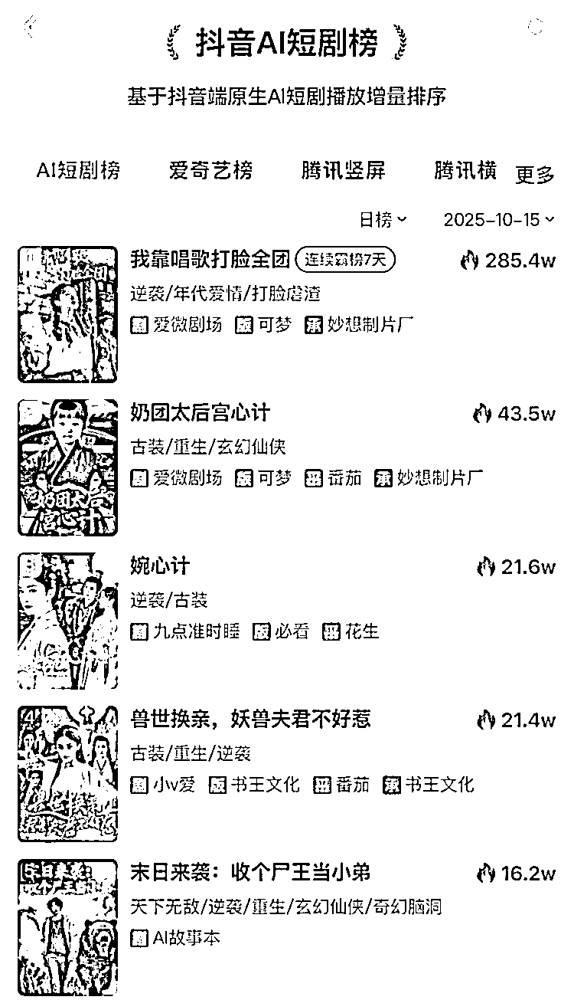

# (21 赞)AI 短剧制作成本大幅降低，市场空间将扩大且三类题材易出圈

> 原文：[`www.yuque.com/for_lazy/zhoubao/yt507gvkan1trvup`](https://www.yuque.com/for_lazy/zhoubao/yt507gvkan1trvup)

## (21 赞)AI 短剧制作成本大幅降低，市场空间将扩大且三类题材易出圈

作者： Miles

日期：2025-11-10

AI 真人短剧每分钟制作成本较传统真人短剧大幅降低，降幅超六成；AI 漫剧每分钟制作成本仅为传统动画短剧的 1/5。
得益于制作成本下降催生的供给增长、受众群体的持续拓宽，以及变现模式的多元化，AI 短剧的市场空间将伴随技术迭代与内容升级不断扩大。对于 2027 年 AI 短剧在千亿级微短剧市场的渗透率，其预测将达到 30%-35%。
三类题材最容易出圈：一是“强情绪价值+高爽感”的逆袭题材，二是“年代情怀+细节还原”的年代剧，三是“轻科幻+贴近生活”的科幻题材。

* * *

评论区：

亦仁 : 感谢分享，已中标

心怡啊🎈 : 这要怎么变现呢