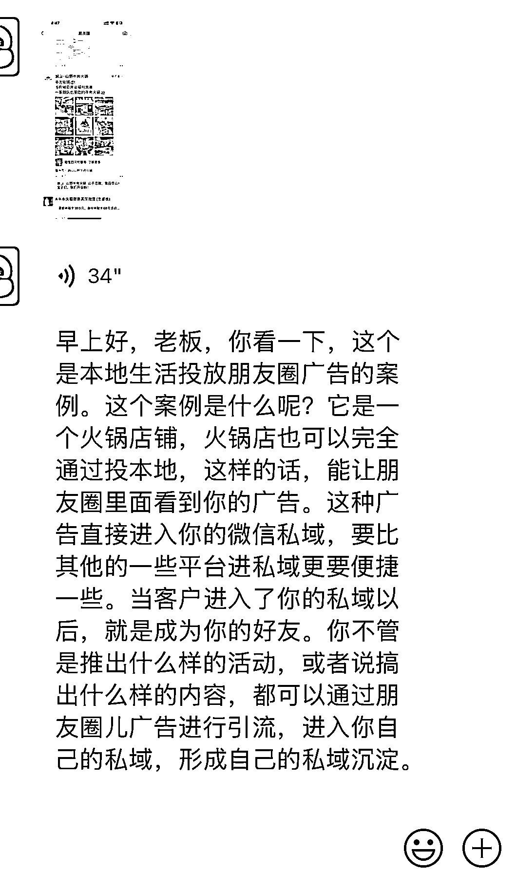
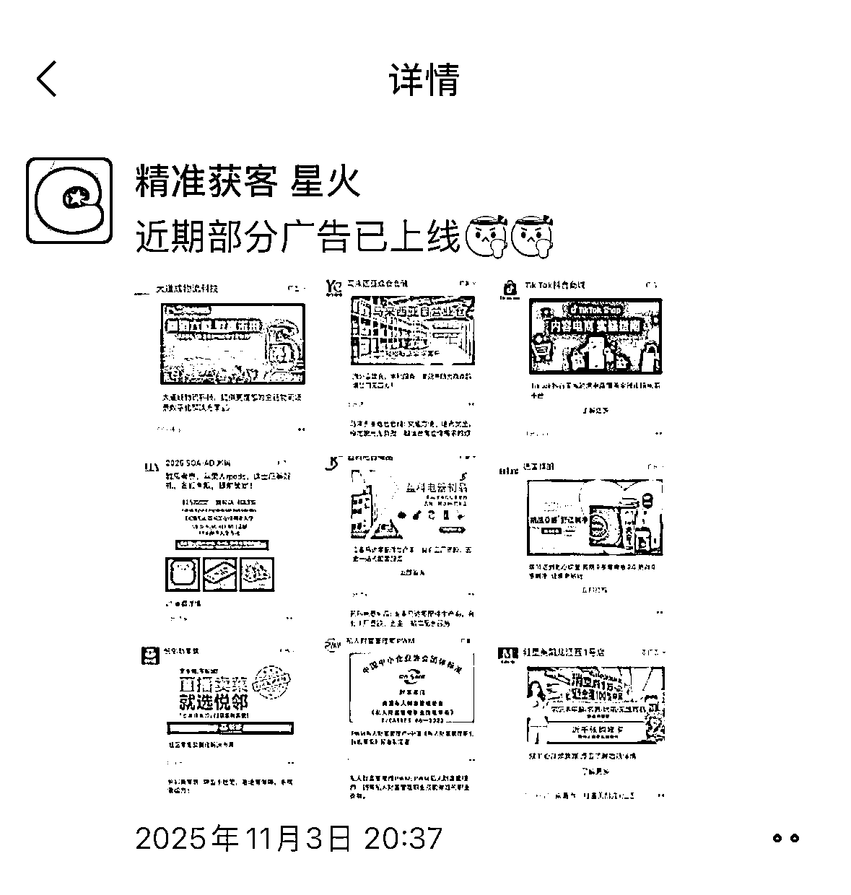
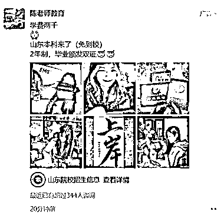
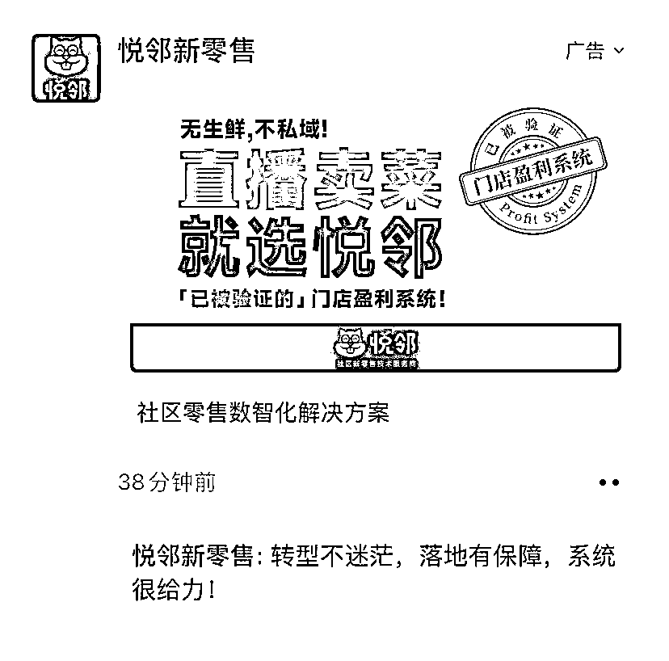
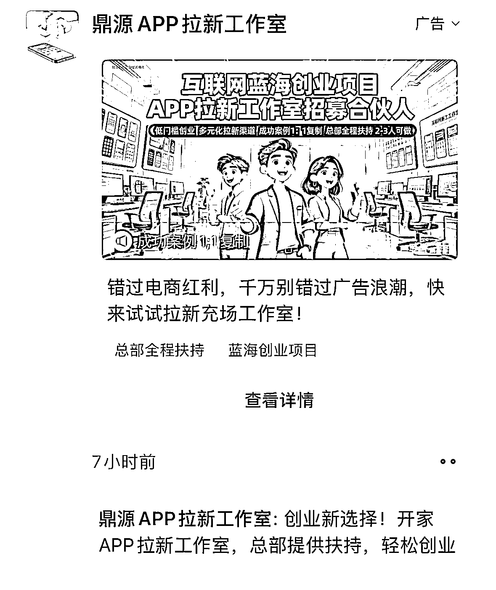
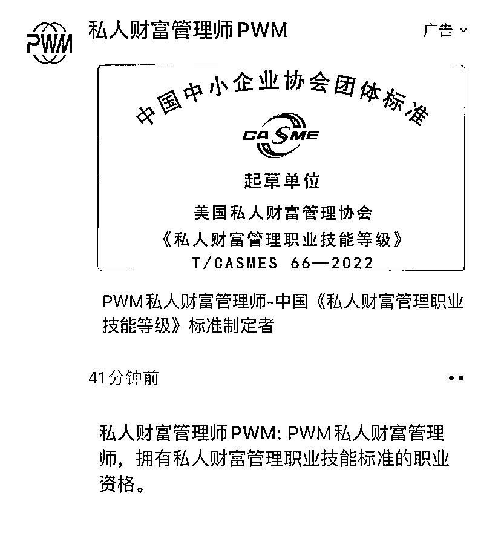
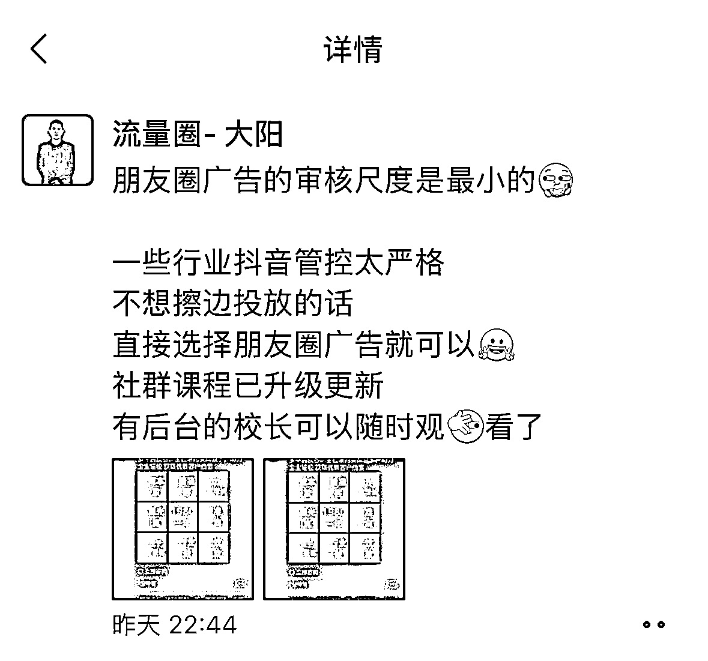
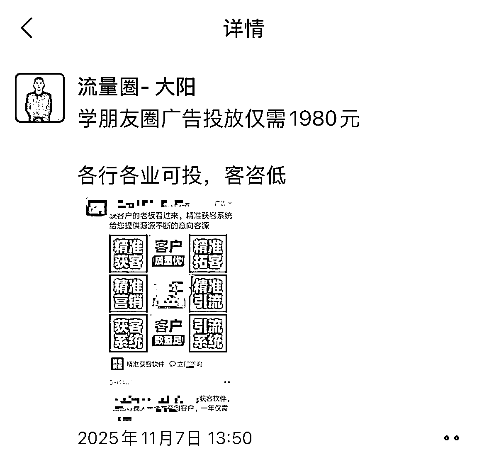

# (18 赞)新趋势-私域获客：朋友圈获客成大趋势，比抖音更便宜精准

> 原文：[`www.yuque.com/for_lazy/zhoubao/evryy54xhg83kwiz`](https://www.yuque.com/for_lazy/zhoubao/evryy54xhg83kwiz)

## (18 赞)新趋势-私域获客：朋友圈获客成大趋势，比抖音更便宜精准

作者： 馆主

日期：2025-11-10

新趋势-私域获客 通过一个星期的观察发现：朋友圈获客，是个大趋势，我这段时间一直在研究这个方向
我加了很多做这方面的商家，通过他们的回答可以看出他们都放弃抖音获客了 朋友圈获客比在抖音获客成本更便宜客户更精准 主要是广告是以朋友圈的形式呈现，软广告类型
客户刷朋友圈的时候，会不经意间点击咨询 引流完整路径： 朋友圈广告—-对接客服—-私域微信

* * *

评论区：

烽火 : 朋友圈获客不就是腾讯广点通嘛

亦仁 : 感谢分享，已中标