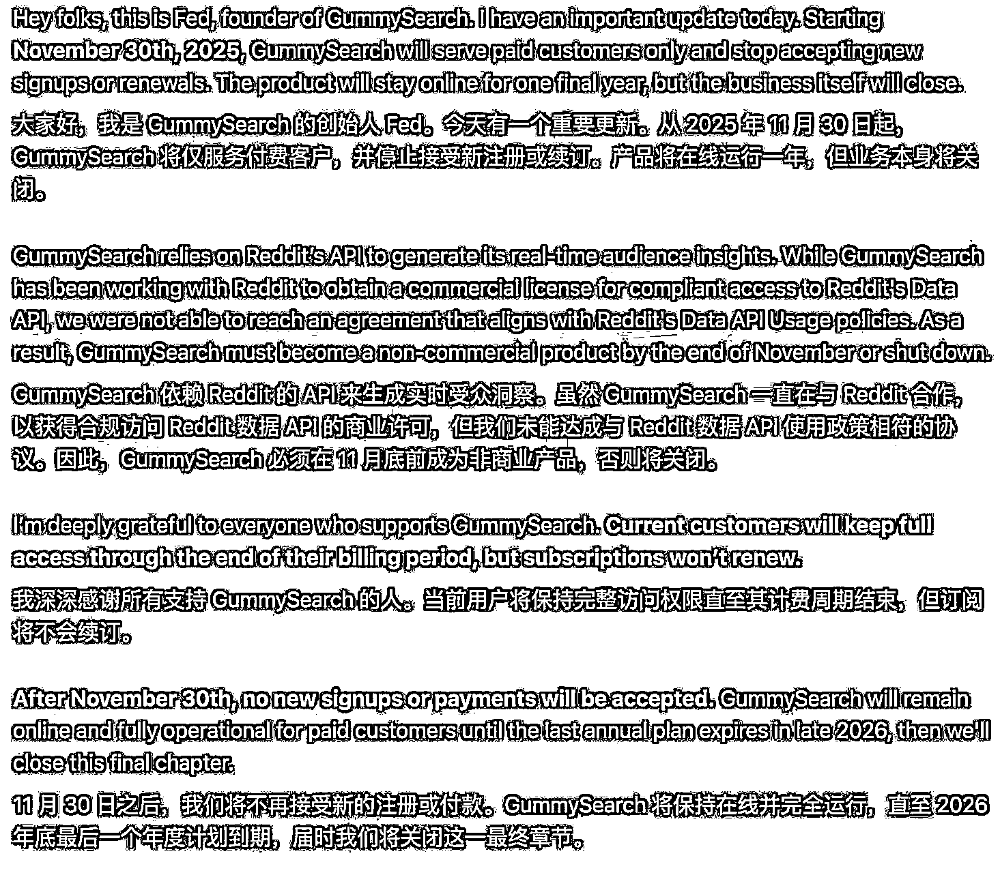

# (19 赞)海外最大 Reddit 研究工具 GummySearch 关停，留下的空白谁来填补？

> 原文：[`www.yuque.com/for_lazy/zhoubao/veyxhiegkd782kpl`](https://www.yuque.com/for_lazy/zhoubao/veyxhiegkd782kpl)

## (19 赞)海外最大 Reddit 研究工具 GummySearch 关停，留下的空白谁来填补？

作者： 星吟 Singing

日期：2025-11-07

海外最大的 Reddit 研究工具 GummySearch 要关停了，应该是受到 Reddit 官方的施压，无法与官方达成 API 使用的协议。GummySearch 解决的是“寻找 Reddit 上的痛点和商机”的需求。它的关停，直接在市场上留下了一个空白，感兴趣的开发者可以思考怎么填补这块拼图。
但是 GummySearch 的关停也是个警示，一旦核心功能高度依赖大型平台的 API，你就得完全受制于该平台的商业策略和定价。当平台突然提高门槛（例如，要求高额商业许可费），你的整个商业模式可能瞬间瓦解。

* * *

评论区：

亦仁 : 感谢分享，已中标

星吟 Singing : 使用折扣码 XYCODE，购买可享受 9 折优惠