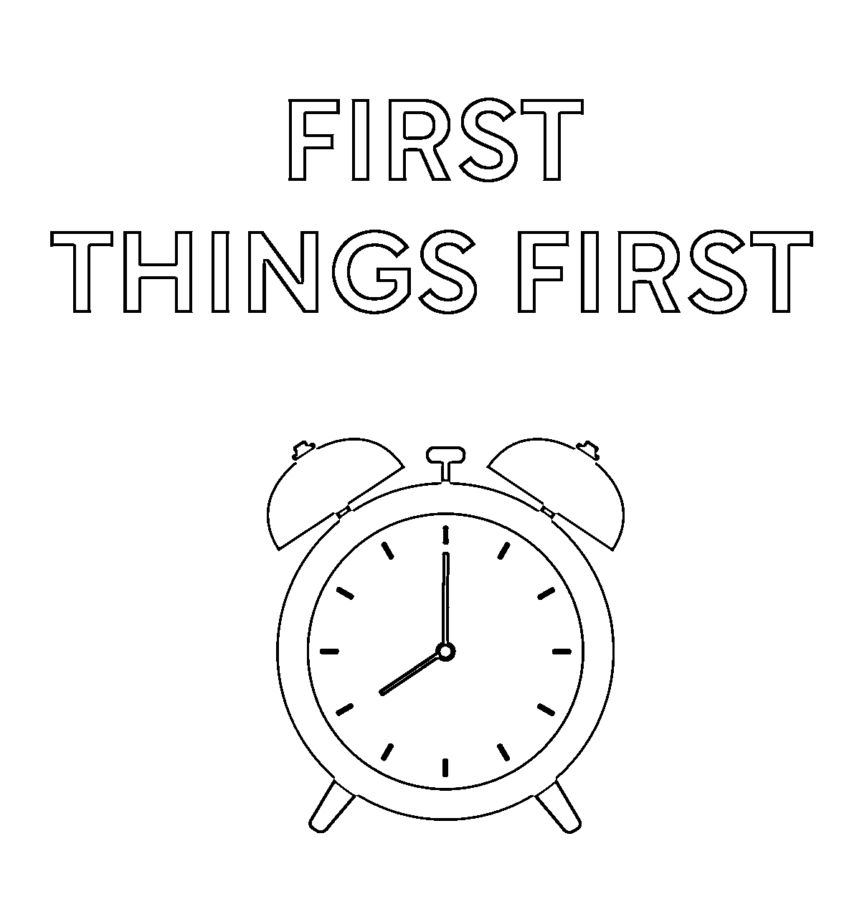

# (精华帖)(572 赞)20 步：从 0 到 1 做项目的笨办法

> 原文：[`www.yuque.com/for_lazy/zhoubao/efbmmpawomdt6e6n`](https://www.yuque.com/for_lazy/zhoubao/efbmmpawomdt6e6n)

## (精华帖)(572 赞)20 步：从 0 到 1 做项目的笨办法

作者： V 先生

日期：2025-11-07

⭕ 20 步：从 0 到 1 做项目的笨办法 --- 以下 20 条，是我从过去及最近做项目过程中，总结的一套笨办法，虽然笨，但挺管用。 01. 问自己：目前的主要矛盾是什么，我到底想要什么，可以为此舍弃什么，遇到多个选择时怎么做价值排序？这个答案在自己内心，别人无法告诉你。 02. 找一批“直觉上能做”的项目，列在一张多维表中，分字段，一边读项目相关信息，一边填写在多维表中。 >
注：直觉是藏在神经网络中的“大模型”，里面有关于自身过往经历最多的“上下文”。 03. 结合“人群需求×平台红利×内心热爱×所需能力”来筛选，选定一个项目。需求先行，需求催生供给。 >
注：犹豫不决，无法确定，怎么办？挑一个你最有感觉的，先试起来，试中选，干中学。如果都没有感觉，也不知道该试什么，怎么办？可以报名参加生财有术的大航海、mini
航海，可以关注亦仁发布的超级标，可以看生财的精华帖，可以参加线下组局和圈友交流，这些项目信息，都是经过生财团队和生财圈友筛选过的，确定性更高。如果有空，可以把浏览生财
风向标 作为碎片时间的习惯，说不定可以触发你找到适合自己的商机。 04. 盘点自己现阶段有哪些技能与资源，被什么卡住，最缺什么。卡点就像一个阴魂不散的幽灵，不解决它，兜兜转转还会遇到它。 > 注：关于卡点，可以和 AI
深度聊聊，参考提示词【你是在 xx 领域有多年实战经验和深度思考的前辈，擅长帮该领域年轻人遇到的问题精准把脉，给出切实可行的方案。我是 xx 身份，做 xx 事情，遇到一个卡点“详细描述卡点 xxxx”，想和你把这个卡点聊透，但不知道该问哪些问题。请你结合我的背景，列一份问题清单，关于澄清、分析、解决这个卡点最小必要的
20 个问题，涵盖全面，每个问题要精准，附深入本质谈该问题的必要性，20 个问题按梳理的先后顺序排序】。然后和 AI 一个个聊这些问题。聊完后，再让
AI【回顾以上所有对话，生成一份行动方案，包含上中下三策，附详细理由】。最后自己通读所有对话，拿一页纸，根据自己的思考，写一份适合的解决方案，要简单易行。
05. 由近及远，缺什么补什么。先学明天就要用的，而不是囤积几年后才“可能”用上的。 06. 找一批有结果的人。从中挑一个最适合你当前阶段的，跳一跳够得着，学了立马能用的。 > 注：生财里就有一大批人，在某个细分领域有大量经验和深度思考。 07. 把她/他发在各处的内容都找出来，书、文章、播客、视频、课程、群消息。找一段不受打扰的时间，集中看完。“左图右史”，有不懂的，发给 AI 解读一下。 >
注：什么是“左图右史”？古人读书时，左边放地图，右边放史书，把线性的知识点，放到网状的知识图中理解，图文互参。我这里用“左图右史”是比喻，帖子是“史”，AI
是“图”，一个是个体经验的容器，一个是随时答疑的万事通。 08. 看的时候记录启发。不要摘抄金句，要记自己“原来这样也行”的启发。金句是“我看了”，启发是“我悟了”。 09. 汇总启发，只留下 10
条你立马能干的，像素级模仿其做法。不用多，多了反而是拖累，容易“学习成瘾”。 > 注：模仿做法，非抄袭内容。抄袭会给未来留下隐患。 10. 把以上想明白的重要信息，写在《一页纸战略》上，打印出来贴在墙上，并做成手机锁屏壁纸，时常提醒自己。不要长篇大论，Only-One-
Page，突出要点，以简驭繁。 >
注：《一页纸战略》上面写什么？没有标准答案，你觉得什么最重要就写什么。比如：客群、需求、项目、定位、对标、身份标签、网名/公司名/社群名、主攻平台、内容栏目、选题来源、所需硬件与软件、创作工作流、销转路径、引流品与利润品、定价策略、成本预算、做什么与不做什么的原则，等等。
11. 开始干，大量干，先有数量，再有质量。为了让过程不那么枯燥，可以设置挑战计划，比如：“日更 100 天”、“直播 100 场”、“72
小时建站”、“30 天做课”，等等。 12. 每天记录《运营日记》，记录任务、过程、数据、心得与问题点。记要点，不记琐碎。关键在于持续记，如果记录成本太高，容易半途而废。《运营日记》是自己做周总结，或者和团队开周会的真实依据，不至于“现想”、“凭记忆”、“拍脑袋”。
13. 定期复盘，最近做得怎么样。一人单干，就写周总结，有助理或团队，就开周会。每次开会，不要漫无边际地瞎聊，而要带着问题清单，针对具体问题一个个聊，聊完正事再闲谈。就单个问题而言，设几个选项做选择题，比空白的问答题更有成效。
14. 怎么解决每天遇到的问题点？问 AI，问网络，问人，并把问答做成一本《项目问答手册》，搞定事情，顺便也沉淀了经验。 15. 所有碎片经验与思考，All-in-One
到这本《项目问答手册》里，不要散乱放在各处，需要用时无法快速调取。后续在做的过程中，还要根据获取的实际经验，持续更新这本《项目问答手册》，这是一种非常宝贵的知识资产。
16. 快速迭代，跑通一个“最小成果”的闭环。没跑通，不用过度优化，容易卡在一个次要的细节上，“屎上雕花”。 17. Building-with-
AI，整个过程中，让 AI 深度参与，借助 AI 提效。Building-in-
Public，把做项目过程分享到社媒，或者建围观群，给自己打气，以及快速获取反馈以纠偏。 18. 画一张《最小阻力流程图》，梳理整个项目的工作流。去掉无效的动作，去掉不必要的工具。目的＞功能＞形式。越简单，越稳定；越复杂，越脆弱。 19. 用一个个成果物，衡量做得怎么样。没有成果，没有正反馈，容易懈怠。有了成果，就记录到《成就事件》中，作为宣传的素材。成就即资格，资格即品牌。做品牌实际上就是在做资格，同样一句话，不同资格的人说出来，影响力不一样。
20. 文件驱动项目。整个过程中，用《一页纸战略》、《最小阻力流程图》、《运营日记》、《成就事件》、《项目问答手册》来驱动自己做这个项目。这五份文件，可以把学习、笔记、思考、计划、流程、行动、问题、复盘、经验、成果，都聚焦到一个项目上，不然注意力容易涣散，一眨眼一天就过去了。 --- 原创作者：V 先生 内容标签： 发布时间：20251107 最近修改：20251111

* * *

评论区：

亦仁 : 这个太好了，很具像化的呈现了如何做一个项目的过程，我差不多也是类似做法

荒漠紫兰 : 写得很实在，受益了[强]

bravo : 感谢分享[强]

V 先生 : 哈哈，谢谢

V 先生 : 谢谢你

V 先生 : 谢谢亦仁老大的肯定！

Su 敏 : 感谢清单化行动实操计划表

看好你 : 简单来说就是：人事网书 人：朋友，网友，知己