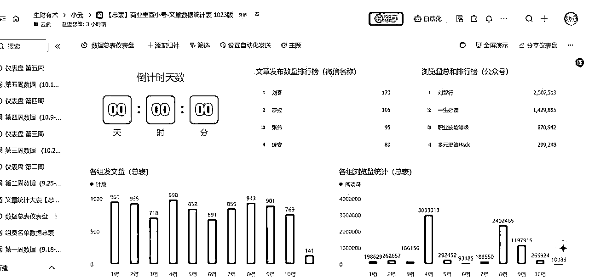
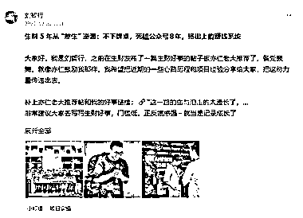
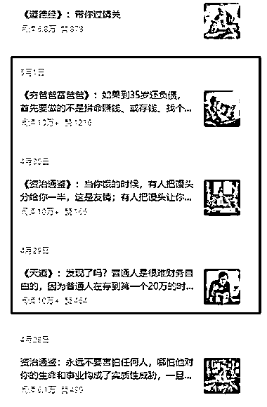

# (精华帖)(343 赞)AI+公众号垂直小号+内容自动化批量生产：打造属于自己的内容王国

> 原文：[`www.yuque.com/for_lazy/zhoubao/mmceumnochfc5qs9`](https://www.yuque.com/for_lazy/zhoubao/mmceumnochfc5qs9)

## (精华帖)(343 赞)AI+公众号垂直小号+内容自动化批量生产：打造属于自己的内容王国

作者： 刘智行

日期：2025-11-07

大家好，我是刘智行，前几天在生财发布了一篇小灯塔的帖子被评为精华了，备受鼓舞，也受到了圈友的点赞和鼓励。所以我就酝酿着我是怎么具体实操拿到成果的，然后真诚、利他，把构建这套微信公众号垂直小号“内容王国”的打法传出去，帮助更多圈友拿到结果。
补上我的精华帖小灯塔链接： 非常建议大家常写帖子总结反馈，能够给自己很大的成长，也能无形中帮助非常多的圈友。
生财五年级学生，前四年毫无作为默默在生财潜水，第五年开始爆发，找到自己的人生之路。 今年是我下班后沉迷副业的第 1 年，也是和公众号垂直小号死磕的 8 年。
从一个月薪 3600、毫无商业认知的三线小城普通职员，成长为单月副业收入破 10 万+、手握 20 个垂直小号矩阵、实现“用副业重构人生”构建自己稳定的睡后收入的斜杠青年/创业者。
1/ 公众号和垂直小号的底层逻辑 2/ “内容王国”和“流量王国”实操方法论 3/ 矩阵扩大收益的方法论等等
如果你也在做同类型的项目，或者不知道如何下手，迷茫，希望我的经历和经验能给你带去一些启发和帮助，那我们就开始吧～ 全文万字有点长，请大家移动飞书阅读全文吧！ [`t.zsxq.com/8odKn`](https://t.zsxq.com/8odKn)[`xc8pgi2dy9.feishu.cn/wiki/VC9vwJeFOiKN5vkl9uicBPB3nsb?from=from_copylink`](https://xc8pgi2dy9.feishu.cn/wiki/VC9vwJeFOiKN5vkl9uicBPB3nsb?from=from_copylink)

* * *

评论区：

路遥 : 刚看完，真的每一句都是干货，看完后就能上手去做的程度，[强][强][强]。我也是在写垂直小号，刚起步。每天选题，写文 排版 发布 都要两个小时起步
，流量起伏不定。还在思考怎么变现 如何引流，看完之后收获很大。这篇文章来的太及时了。

万能的星星 i : 还没看完，但是这个效率太高了，太强了👍

刘智行 : 写了我一个星期，昨晚熬夜写，希望会对大家有点帮助。文字比较多，可以分几次看，如果觉得对你有帮助的话。[玫瑰][玫瑰][爱心][爱心]

石榴爸爸 : 先赞后看👀👀👀

刘智行 : 好的哈。一时间没看完也没关系，有一点对你有帮助给你带来启发就很棒啦。[玫瑰]

萧然自得 : 优秀，值得我们好好学习

蓝狐 : 太强了，值得好好学习，受益匪浅。

刘智行 : 谢谢。一同进步。[爱心][爱心][爱心]

刘智行 : 谢谢☺️一起努力。[咖啡][咖啡]