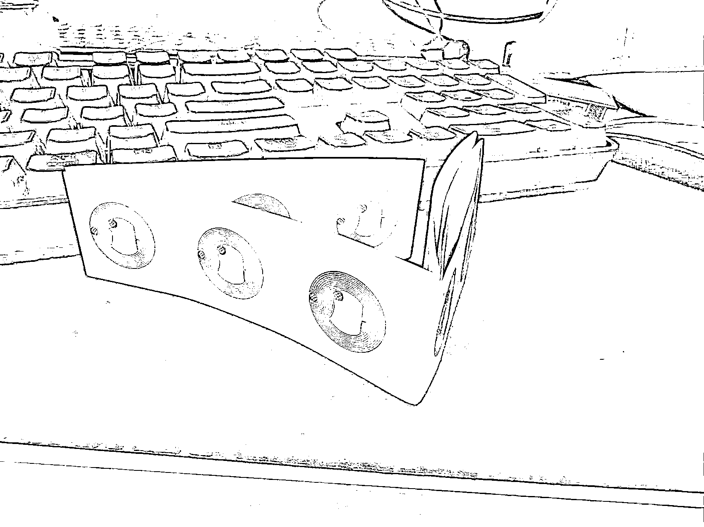
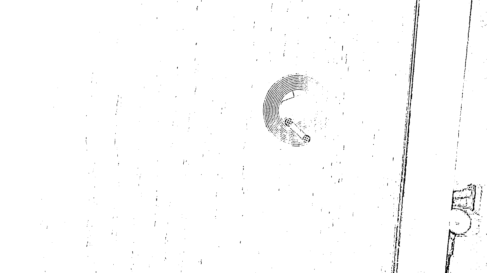

# (精华帖)(149 赞)分享目前未火但潜力大的赚钱引流工具——NFC 的应用

> 原文：[`www.yuque.com/for_lazy/zhoubao/ddmux70f4g97q2lz`](https://www.yuque.com/for_lazy/zhoubao/ddmux70f4g97q2lz)

## (精华帖)(149 赞)分享目前未火但潜力大的赚钱引流工具——NFC 的应用

作者： 刘大猫

日期：2025-11-04

好久没发生财有术发帖，看了一下我过往在生财有术几次发言，还算对得起发言。很多赚钱思路的想法我在这里的发言是非常早的。包括视频号、AI、快团团等。我看我 2022 年就在这儿发过 ai 的应用尝试和一些展望，那时候 99%的朋友还不知道 Aigc
今天再和大家分享一个目前还没有那么火，但是接下来一定会被广泛应用的赚钱和引流工具，当然我分享的都是大势，大家可以根据大势去研究具体的操作方法。今天的分享是关于 NFC 的应用。
前两天买了几个 NFC 芯片贴纸,我认为这里面有巨大的商业价值,而且是很实用,很落地的商业应用.
NFC 在生活中很常见,我们去住宾馆,宾馆前台人员要给你做一张房卡,那个房卡里就有 NFC 的芯片,前台人员把房卡在写入器里写入你的房号,你就可以用房卡开门.
它在应用上,和蓝牙、二维码都有点类似性,可以用来记录和读取数据.这么说来,这个东西并不少见,为什么现在说它有很大商业价值呢?
大家最近肯定在线下商店都会看到支付宝到处在推所谓的“碰一碰”,你用手机碰一下支付宝的设备,而无需扫二维码,就可以完成支付.所谓碰一碰支付,其实也就 NFC 技术.
支付宝早不推这个,晚不推这个,为什么现在推呢?
这是因为苹果 iphone 手机现在已经全面支持了 NFC 技术,以前苹果手机出于安全原因对 NFC 的开放力度很小,现在开放很多了(安卓早就开放了).
现在苹果手机用户不仅可以使用手机进行 NFC 数据读取,也能够写入数据.
也就是说,你可以把你想要完成很多的动作,链接,数据,通过手机写入到一个 NFC 芯片中,然后你手机一碰,就可以完成相应的操作.
再直白的举例,如果把 NFC 比做一个二维码,你不仅可以识别二维码,你还能自己生成二维码.
二维码已经在线上线下商业的各种商业形态中有非常成熟的应用,而 NFC 技术显然还没有普及.
我也往 NFC 芯片里写了几个最简单的应用,比如我在我们家客厅里贴了一个 NFC,把我们家的 wifi 信息写进去了.这样有客人来家里做客,或者自己需要连 wifi,只需要手机碰一碰,不需要很麻烦的告诉它密码啥的.
这里面还有很多普通人可以去尝试的商业机会,首先帮别人生成 NFC 就是一个好生意:
之前二维码刚刚普及的时候,有一个网站叫“草料二维码”,这家公司就是做了一个网站,帮助用户生成自己的二维码,这个公司业绩还挺好的.其实 NFC 时代,完全可以做一个 NFC 版的“草料二维码”,帮助小白用户生成自己的 NFC.
此外帮助企业去基于 NFC 技术做各种业务流程管控、营销策划,都是很好的.
再者,我们自己做营销链路、引流链路、私域转化,都可以用 NFC 技术,包括我们很多商品的包装盒上后续都应该加上 NFC 芯片贴,引导用户完成一些动作的时候,用这个非常合适.
这是一个机会,和大家分享一下,有兴趣的朋友可以去研究研究 nfc

* * *

评论区：

亦仁 : 我还以为你这号注销了[偷笑]

修补匠 : 大猫好久不见

胖大魔 AI 出海版 : 猫哥回归[呲牙]

小吉玛丽亚 : 现在还是早期，支付宝也在教育用户阶段。目前 NFC 在我的生活当中的应用是:搭地铁，刷门禁～支付宝都用的少了～因为支付宝也是去用餐购物才用上 NFC 碰一碰点餐和付费～

蓝子鱼 : 上次遇到一个圈友，用 NFC 来发小红书笔记，手机靠近这张卡，自动读取到里面存的信息，直接在手机上点一下就可以发笔记，第一次感觉太神奇了。

bravo : 确实是一个未来的商机[强]

刘大猫 : 是的

比浪 : 我这还一堆测试用剩的 nfc 贴纸[呲牙]，之前是想给老外用的