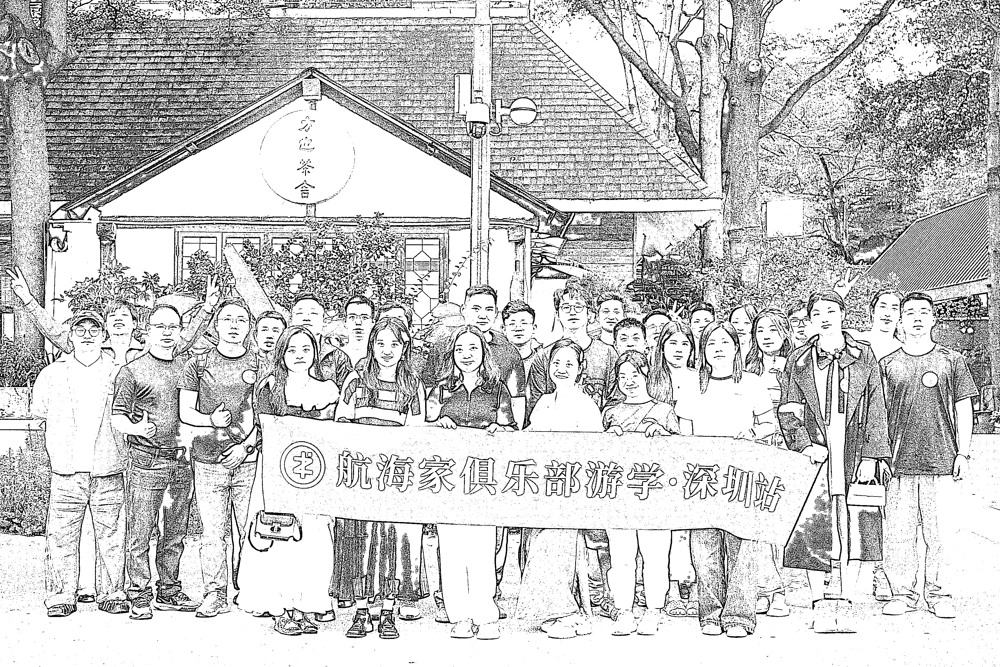

# (47 赞)《航海家深圳游学-紫菜的年终碎碎念复盘》-打牌哲学 x 自由职业 x 人生管理：这是我听过最值得收藏的一场年终复盘

> 原文：[`www.yuque.com/for_lazy/zhoubao/dqqr9kmyhwr917lx`](https://www.yuque.com/for_lazy/zhoubao/dqqr9kmyhwr917lx)

## (47 赞)《航海家深圳游学-紫菜的年终碎碎念复盘》-打牌哲学 x 自由职业 x 人生管理：这是我听过最值得收藏的一场年终复盘

作者： 咕咕

日期：2025-11-02

周五下午，我去参加了深圳航海家的游学活动，其实就是紫菜的 2025 年年终总结会。

紫菜算是我的偶像 —— 我特别羡慕他的生活： 做 Web3 能赚钱，领导力还强，团队里人多，自身能力也够，能调动不少人和资源；
还喜欢打德州扑克，甚至是职业选手； 对生活的态度也特别洒脱，这种状态真的让我们很羡慕。​

很早之前就在看他的公众号，后面一直期待能听他分享，这次活动就 25 个名额，大家都是靠抢的。 幸亏我手速快，大概 30 秒时间，25
个名额就没了，我刚好赶上，算是幸运的。

今天就来聊聊听他年终分享时，那些让我特别有感触的内容。​ **开场推书：《最优解的人生》，教你把有限生命用在刀刃上​**

**  **

**  **分享一开始，紫菜先推荐了一本书，叫《最优解的人生》。

书里核心讲的是：人这一辈子，怎么在有限的生命里体现最大价值？怎么才能更开心？​

这本书的作者喜欢投资，也喜欢打德州扑克，个人经历很精彩。 书里还提到「追求目标和享受过程」的关系 ——
不是说要全为了目标奔忙，更要学会享受过程；面对不同情况时，要找到「自由解」或者「当前最优解」，活得潇洒一点。​

最核心的是，书里提倡「**在有限生命里发挥最大价值，追求幸福、减少浪费** 」。

比如要高效利用资金，把钱花在重要的事上：花在健康上、花在体验上，实现生活的平衡。

这和我们平时的常规思路不太一样，紫菜说这本书值得大家看看，说不定能有不一样的启发。​

感谢紫菜最后还给参与的小伙伴每个人都送了一本《最优解人生》  Q_b52UrnuW6H-KdGvoOGwM)**自由职业者必看：为什么一定要请个助理？** 接着紫菜提到，对自由职业者来说，特别有必要配一个助理。

原因很实在： 自己总有处理不过来的事，尤其是那些繁琐的活儿，特别耗精力。 这时候花钱请助理，让助理帮着处理琐事，能有效节省自己的精力，避免精力被分散。​

而且这样做还能提高生活质量 ——
没那么多琐事缠身，就能更专注，不管是做事效率还是生活体验，都会变好。另外，管理助理的过程，其实也是在锻炼管理团队的能力，思路会不一样。​

这时候我忍不住问了个问题：「像您这样的大佬，对助理的要求是什么？招聘时看重哪些核心品质？比如性格、特点之类的」。​

紫菜的回答很通透： 首先别把自己局限在「助理」这个身份里。 一个合格的助理，首先得是「**无条件可信赖的人** 」，要靠谱；
其次得有高度责任心和专业素养，还得能在没基础的情况下获得别人的信任。​

本质上，这是一个人的综合素养体现，不只是「助理」的活儿。

他说：「**你愿意和什么样的人交朋友，就按这个标准筛选助理** 」，这句话一下子点醒我了。​

**每个人都要做个人 IP：日更、拍视频… 本质是「信任复利」​**

**  **

**  **紫菜还强调：「**每个人都需要做个人 IP** 」。因为个人 IP 能塑造「活人感」，还能带来影响力。

我们常说「复利」，其实个人 IP 就是一种复利 —— 比如通过日更、拍视频、公开表达，慢慢形成自己的 IP，再靠 IP
获得别人的信任和回报，拓展自己的事业，增加和其他人的链接。​

这点我特别有共鸣，因为我现在每天都在写公众号，就是跟着紫菜学的。

我也想通过公开表达，让更多人了解我、信任我，知道我是个靠谱的朋友，以后能产生更多链接 —— 这也是我日更写公众号的初衷。​

**别再沉迷消耗型爱好！要培养「能留成果」的输出型爱好​**

**  **

**  **分享里最戳我的一点，是紫菜说「**要多培养输出型爱好，别搞输入型爱好** 」。​

先明确一下： 什么是输出型爱好？ 就是能培养自己，还能产生「积累」的爱好。比如写作、摄影、播客、视频制作 ——
这些都是往外输出、表达的窗口；再比如整理读书笔记、写思考总结、做社群分享、公开演讲、写教程；还有编程、设计、建模、产品开发、数据分析，这些也算。​

这些爱好有两个核心特点：**创造性和积累性** 。随着时间推移，能留下成果和经验，还能让别人长期看到，产生长期复利，慢慢就成了「杠杆」。比如你写的东西、做的内容，不只是一个人暂时看到，很多人能同时看，甚至几年后别人还能回溯、查阅你之前输出的内容，特别有意义。​

那什么是消耗型爱好？ 比如刷短视频、追剧、漫无目的地刷社交媒体；还有那种「**只学不做** 」的 ——
不停学课程、看讲座、记笔记，但没输出、没实践，只停留在「学」和「想」的阶段，学完想完之后啥也没做。​

这种消耗型爱好，只能带来短暂的满足感，体验结束后啥也留不下，没有积累，也没有杠杆，其实是在浪费时间。紫菜建议大家少碰消耗型爱好，多专注输出型的。​

#### **低谷时刻：直播带货翻车、团队解散，靠「持续做事」走出来​**

我还问了紫菜一个问题：「**这几年你有没有经历过低谷？是怎么熬过来的？** 」​

他说近几年最低谷是 2021 年：当时做直播卖货，没做起来；团队里的小伙伴还闹矛盾，每天都有人离开，最后团队直接解散了。那段时间他自己也生气、恼火，但没办法
—— 每个人都有自己的选择，只能无奈接受小伙伴离开，接受团队解散的事实。

​

至于怎么走出低谷，他的方法很简单：「**持续做事** 」。

哪怕情绪不好，生气、愤怒，但该做的事还是要做。

「**不管你高兴还是不高兴，要做的事不会变** 」，就一直盯着当前的事情做，一直持续不断的做事，慢慢就熬过来了，慢慢也会遇到更多的机会。​

他还补充了一点：「**做好当下，别想太多，专注做眼前该做的事就行** 」。

不要被情绪影响，要学会「课题分离」—— 情绪是情绪，做事是做事，这俩不是一回事，别因为情绪不好耽误手头上做事。​

**从德州扑克看人生：4 个核心心得，适用于搞钱和生活​**

**  **

**  **最后，紫菜分享了自己打德州扑克的总结和思考，这四点其实不管是搞钱还是生活，都能用得上：​

**1、90% 的手牌不值得玩，尤其位置不好的时候：**

如果不遵守纪律，慢慢就会放宽手牌范围，输得越来越多；入池率越高，输得越惨，尤其是注意力分散的时候，越不专注越容易亏钱，拿不到结果。​

当时分享的时候，下午 5
点钟，正好是有一个项目可以参加，但是要投入不少的成本。他提到，自己本来是要准备投入不少的资金和调用一些资源去参加的，凑巧的是，PPT 刚好分享到这里，
他说，自己突然打算不参加了，因为为了这个活动一点的收益，要投入大量的资金、精力、人力，扣除掉资金成本，回报率不足 1%，这种项目就属于那种
90%不值得玩的手牌。

市场上 90% 的机会都是垃圾机会，是符合正常的规律的。大部分人筹码输太多的原因就是入池率太高了，什么手牌都想玩，只要我们对自己规范一些，不用做到
90%，只要能做到 70%、80%，就已经能胜过很多人了。

**2、别设错目标：**

他分享到以前打德州扑克线下比赛，总给自己设「**进前十** 」「**拿第一** 」的目标，后来发现不现实，因为很难把控和做的到，这是一个最终的结果，会有很多的因素影响。

不如先打好当下的每一手牌，做好当下的每一个决定。 毕竟「能拿多少名」是不确定的，没法保证，但能保证的是「**打好当下这手牌，做好手头这件事** 」。
只要每一手牌不犯错，好的结果自然会来。​

**3、别对别人心生恐惧，该勇敢就勇敢：**

他分享到，自己打比赛的时候，遇到了很多次，自己应该加注 3B 打别人的时候，总是感觉自己的手牌不够大，会去纠结于你前面是一个比较厉害的选手，你不敢去 3B 他。后面发现你所有 3B 数据的牌，全是 AAKK,如果当时果断出手，别人就很容易弃牌了。但是很多人是不管去做这种动作的。

很多时候需要遇到这种该出手的情况，是应该要出手的，别不敢做，要果断一点。​

**4、控制好情绪：**

**  **

他举了个例子 —— 有一次打牌，一把就输掉一天的的盈利。当时输完那一手牌之后，自己并没有太大的情绪波动，就是正常的去处理，最后当天以一个非常健康的筹码晋级。
如果是按照之前自己的性格的话，自己辛辛苦苦积攒一天的筹码，被别人一把给清掉，自己的情绪就会有很大的波动，可能会胡乱打牌，影响后续状态；但那次他稳住了，没被这一把牌的情绪所影响，还是认真对待每一手牌，最后当天整体结果还不错。​
这次的航海家游学对我来说启发真的很大。

其实多听别人的经验、分享，特别有意思 —— 这不是单纯的「听课」，更像是在「经历别人的经历」， 能让自己少走弯路，更好地成长。

感谢紫菜真诚的分享

* * *

评论区：

游阿贝 : 感谢分享，没加入航海家，都不知道深圳有这些活动