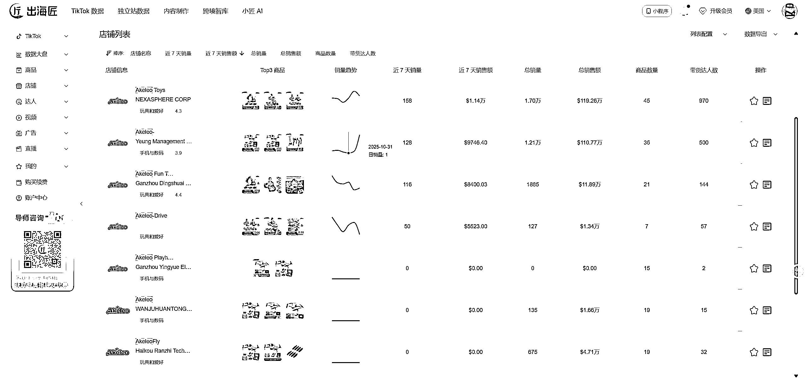
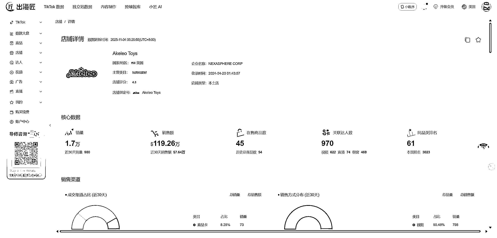
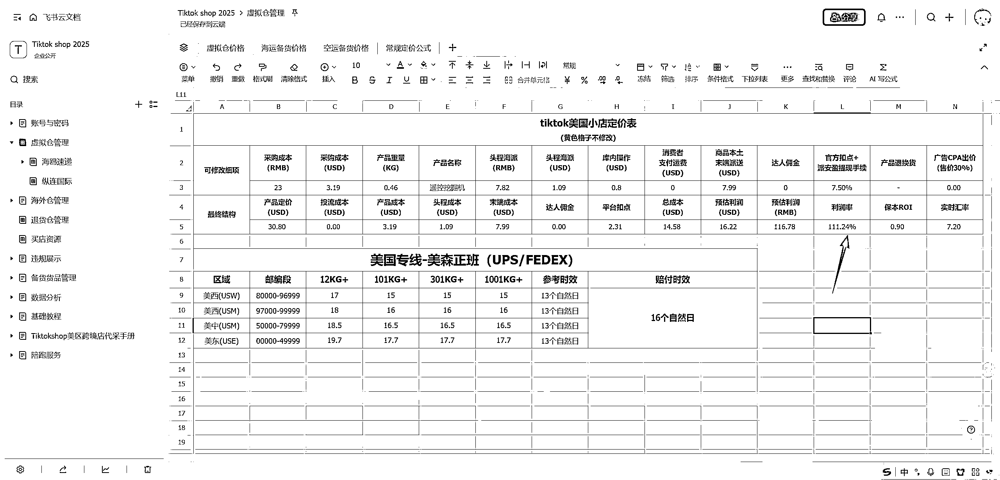
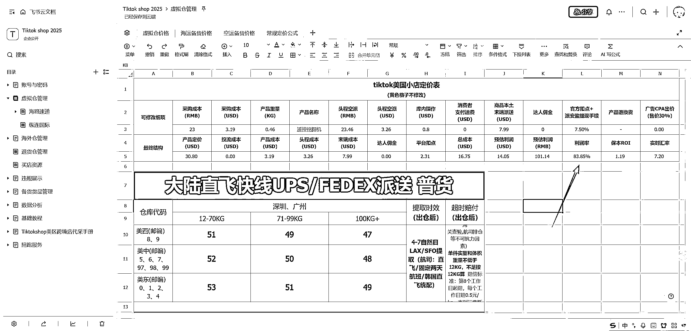

# (精华帖)(41 赞)月赚 500 美金；TIKTOK 无货源虚拟仓进阶版教程 02

> 原文：[`www.yuque.com/for_lazy/zhoubao/ge7ls75ffkpa32ie`](https://www.yuque.com/for_lazy/zhoubao/ge7ls75ffkpa32ie)

## (精华帖)(41 赞)月赚 500 美金；TIKTOK 无货源虚拟仓进阶版教程 02

作者： 西沙

日期：2025-11-05

虚拟仓赛道跟代采一样，依旧处于货架电商的模式；所以一个月也就赚 500 美金。

我开始更新一些 TikTok Shop 玩法和基础搭建分享；希望能做到多写多输出，本文是该系列的第二篇内容。

本文围绕“美区无货源电商进阶”展开，共分为 4 大核心板块，覆盖从玩法到资源获取的全流程：

1. 无货源玩法解析：讲解无货源模式的核心逻辑与操作要点；

2. 虚拟仓流程讲解：拆解虚拟仓的搭建、运营及订单处理流程；

3. 选品与商品计价：需重点学习；是影响收益的关键环节；

4. 资源与获取方式：提供实操所需的资源渠道及获取方法。

同时我在找品过程中发现了一部分国内公司做 tiktok 美区店铺+短视频带货的商家，数据非常好；

举例：

akeleo 品牌系列账号卖的玩具是遥控挖掘机和飞机；

批量制作混剪素材去重发布，小额投放做商品卡做排名+同步达人带货；

做到了同款大店几十万美金的营收，小店十几万美金的营收；按照表格利润率算一下；想象空间非常大。

内嵌视频教程，预估阅读时间 35 分钟。

[`vqjz0ej9x2.feishu.cn/wiki/Vd1EwJ3iLiM8yBktcJTcevSMndg?from=from_copylink`](https://vqjz0ej9x2.feishu.cn/wiki/Vd1EwJ3iLiM8yBktcJTcevSMndg?from=from_copylink)

* * *

评论区：

羽晗 : 飞书链接我这边点不进去呀老师

西沙 : 可以罗，把链接放在下面就可以了