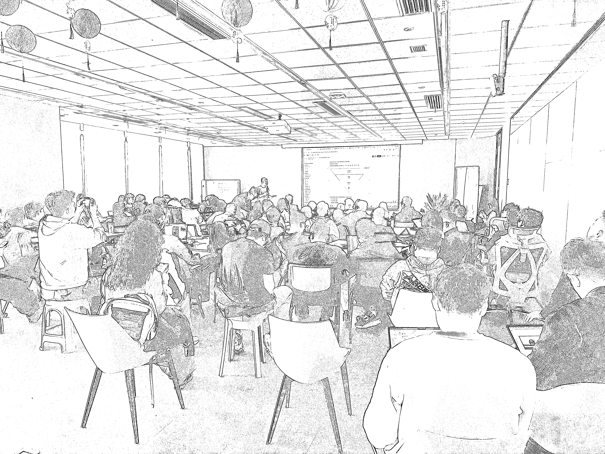
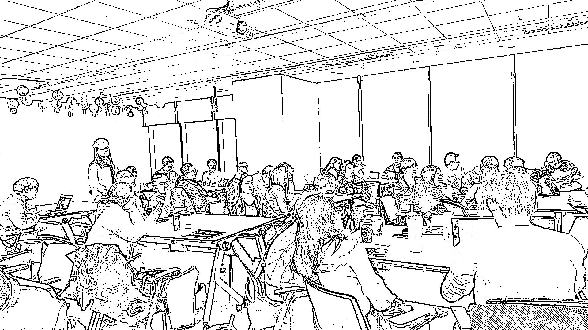
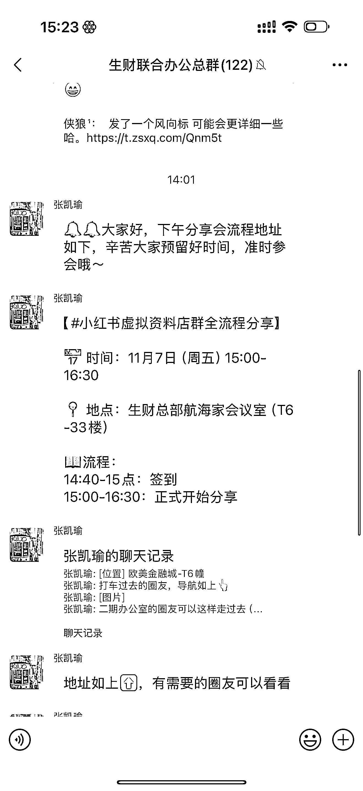
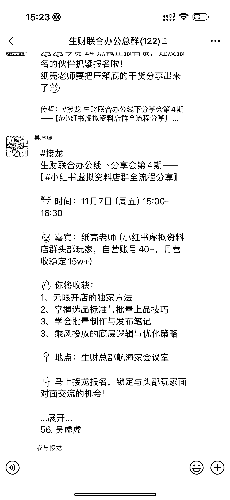

# (102 赞)从线上到线下，生财圈友正在一起拼出自己的未来

> 原文：[`www.yuque.com/for_lazy/zhoubao/bczvss3316cq575l`](https://www.yuque.com/for_lazy/zhoubao/bczvss3316cq575l)

## (102 赞)从线上到线下，生财圈友正在一起拼出自己的未来

作者： 亦仁

日期：2025-11-07

刚去倒水，发现大会议室有动静，原来是杭州生财联合办公空间组织的日常互相分享。
好家伙，从后面看黑压压一片，好多人，我才发现原来已经这么多圈友在线下聚在一起了，真不错，这么多人在一起各自为自己的前途拼搏奋斗，上一次大家这样，也许是高考的时候？
下一站，深圳。 下一站，广州。 定个目标：2026 年 生财联合办公空间聚集 1000 位圈友在线下一起办公。

* * *

评论区：

流月与六分钱 : 来这边也催一下超级标[阴险][阴险]

亦仁 : 正在写 这边不要着急

渊杰 : 上海现在啥进度呀

包酱 : 真好啊

小小刨冰 : 有时候感觉大佬也是人

亦仁 : 去掉“有时候”，去掉“感觉”，谢谢。

白也 : 北京有吗？

亦仁 : 北京有 scai，还没有联合办公空间。